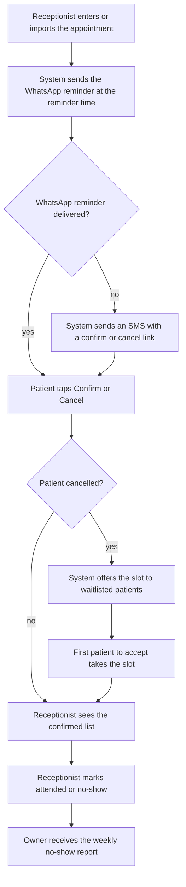

<!--
CHUNK: 05
TITLE: User Journeys & Use Cases - Overview
PROJECT: Clinic Reminders
VERSION: 1.1
DEPENDS_ON: 04
PART OF: BRD - Clinic Reminders
LANGUAGE: Business language only. No technology names, protocols, or implementation terminology - the how is owned by the SDD.
-->

# User Journeys & Use Cases

## User Journeys

### Clinic Owner Journey

The owner wants a full schedule without paying staff to make reminder calls. During onboarding the owner sets up the clinic, its doctors, and their fees, and adds the receptionist's login (UC-01, UC-02). After that the owner signs in only now and then: to change the clinic setup or staff logins (UC-01, UC-02), to export the consent and opt-out log (UC-19), or to end the service (UC-17). In a clinic with no receptionist, the owner also does the receptionist's work (chunk 07, footnote ³). Each week a no-show report arrives on WhatsApp with the no-shows, cancellations, refilled slots, and the fees lost and recovered (UC-03). From the paid launch the owner can change the reminder timing, review what staff did, and pay the subscription in EGP (UC-04 to UC-06). The owner leaves with one weekly number that shows whether the clinic is improving.

### Receptionist Journey

The receptionist wants to finish the day without chasing patients. When a patient books, the receptionist enters the appointment, or imports many at once, and records the patient's consent (UC-07 to UC-09). A patient who wants an earlier slot goes on the waitlist (UC-11). Calls to change or cancel are recorded in the system (UC-10). When a patient's details change, or a patient asks to see, correct, or delete their data, the receptionist updates or removes them (UC-18). Each morning the day's list shows who confirmed, who cancelled, and who did not reply, so the receptionist calls only the short no-reply list. After each visit the receptionist marks the patient attended or no-show (UC-12).

### Patient Journey

The patient wants to keep the appointment or free it without an awkward call. A day before the visit, a reminder arrives on WhatsApp in the patient's language. One tap confirms or cancels (UC-13). A patient whom WhatsApp does not reach gets an SMS with a link to do the same (UC-14). A patient on the waitlist can receive an offer for a freed slot and take it with one tap (UC-15). A patient who no longer wants messages replies to stop them (UC-16).

## Summarized Workflow

**Figure 2 - Summarized workflow: from booking to the weekly report**

**Summary:** The receptionist books the appointment, the system reminds the patient on WhatsApp or by SMS, and the patient confirms or cancels. A cancelled slot goes to the waitlist, attendance is marked after the visit, and the owner sees the result in the weekly report.

## Use Case Summary

| UC ID | Use Case | Primary Actor | Description |
|-------|----------|---------------|-------------|
| **Clinic Owner** | | | |
| UC-01 | Set up the clinic | Clinic Owner | MVP. The owner enters the clinic profile, doctors and their fees, the WhatsApp sender, and the weekly report number, so reminders can start. |
| UC-02 | Manage receptionist logins | Clinic Owner | MVP. The owner adds or removes receptionist logins as staff join or leave. |
| UC-03 | Read the weekly no-show report | Clinic Owner | MVP. The owner receives the weekly report on WhatsApp and sees no-shows, cancellations, and refilled slots. |
| UC-04 | Change reminder timing | Clinic Owner | Paid launch. The owner sets how long before the visit the reminder goes, and turns the visit-day reminder on or off. |
| UC-05 | Review staff actions | Clinic Owner | Paid launch. The owner sees who changed what in the clinic account and when. |
| UC-06 | Pay the subscription | Clinic Owner | Paid launch. The owner pays the monthly or yearly subscription in EGP through the payment gateway. |
| UC-17 | End the clinic's service | Clinic Owner | MVP. The owner ends the clinic's service on a set date. Messages and logins stop, and the owner can first download the clinic's records. |
| UC-19 | Export the consent and opt-out log | Clinic Owner | MVP. The owner opens and exports the clinic's consent and opt-out records as evidence that the clinic messages lawfully. |
| **Receptionist** | | | |
| UC-07 | Enter an appointment | Receptionist | MVP. The receptionist books a patient with a doctor at a date and time, so the reminder is scheduled. |
| UC-08 | Import appointments from a file | Receptionist | MVP. The receptionist imports many appointments from a CSV file and fixes the rows the system rejects. |
| UC-09 | Record a patient's messaging consent | Receptionist | MVP. The receptionist records that the patient, or the guardian of a child, agreed to receive messages. |
| UC-10 | Change or cancel an appointment | Receptionist | MVP. The receptionist moves or cancels an appointment when a patient calls or the clinic must change it; the reminder follows the change. |
| UC-11 | Add a patient to the waitlist | Receptionist | MVP. The receptionist puts a patient who wants an earlier slot on the clinic waitlist. |
| UC-12 | Follow the day's list and mark attendance | Receptionist | MVP. The receptionist sees who confirmed, cancelled, or did not reply, and marks each visit attended or no-show. |
| UC-18 | Update or remove a patient's details | Receptionist | MVP. The receptionist corrects a patient's details, or acts on a patient's request to see, correct, or delete their data. |
| **Patient** | | | |
| UC-13 | Confirm or cancel from the WhatsApp reminder | Patient | MVP. The patient taps Confirm or Cancel in the WhatsApp reminder and the appointment status updates. |
| UC-14 | Confirm or cancel from the SMS link | Patient | MVP. A patient whom WhatsApp did not reach opens the SMS link and confirms or cancels. |
| UC-15 | Accept a slot offer | Patient | MVP. A waitlisted patient accepts an offered slot; the first to accept gets it. |
| UC-16 | Stop all messages | Patient | MVP. The patient replies to stop messages, and the system confirms once and then sends nothing more. |

<!-- MASTER: clinic-reminders-brd-master.md | PREV: 04-scope-and-personas.md | NEXT: 06a-use-cases-clinic-owner.md -->
