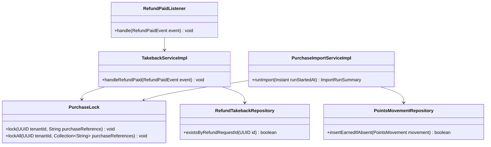
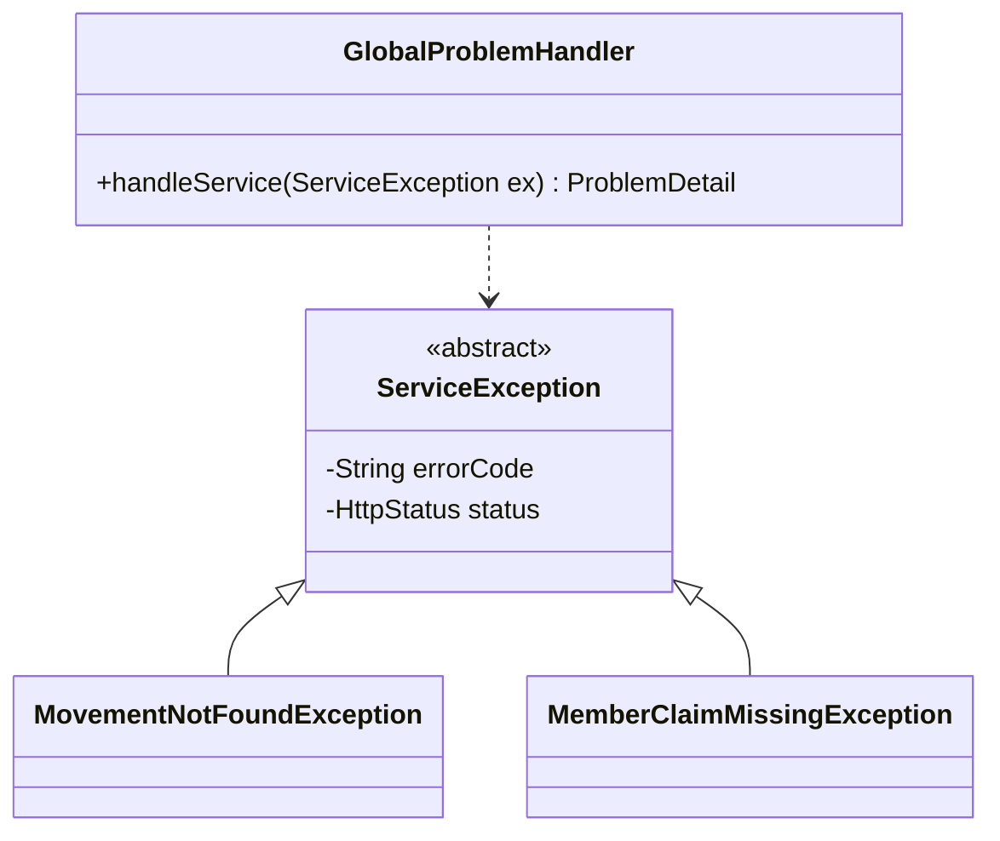
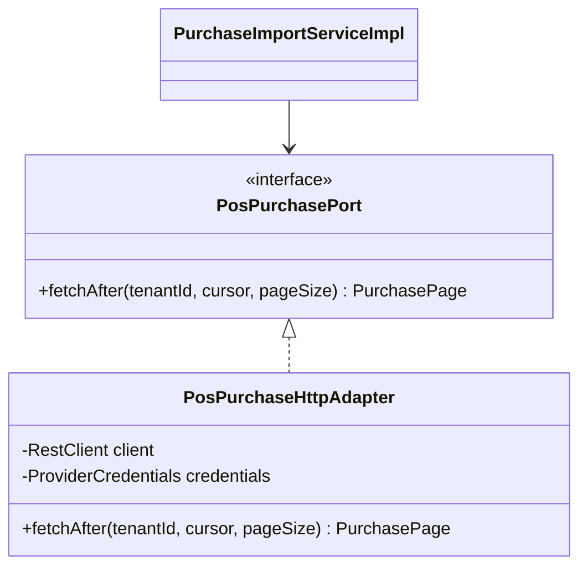
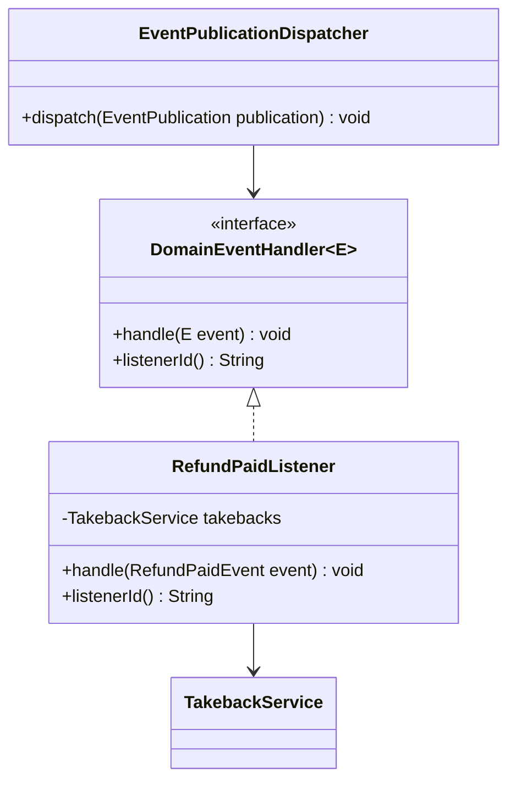
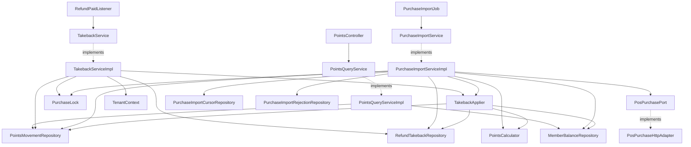
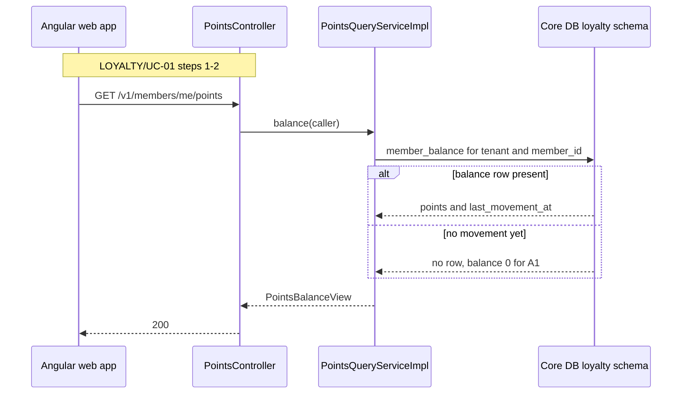
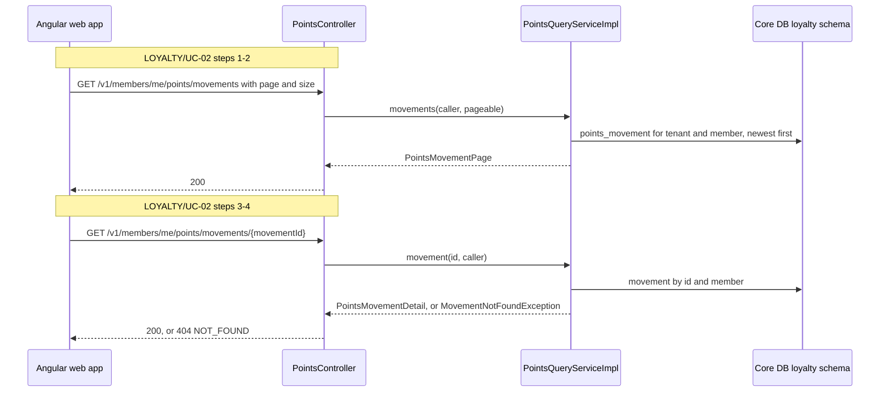
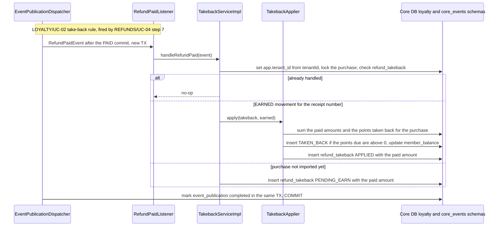
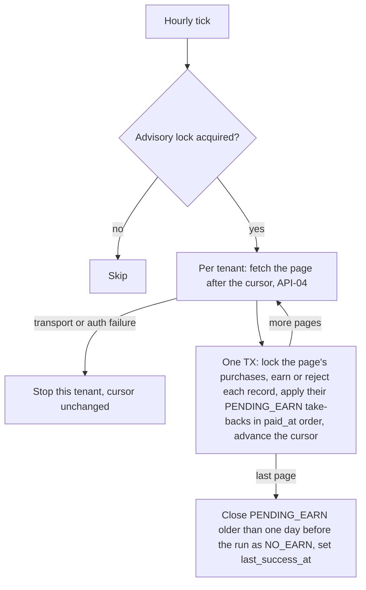

<!--
CHUNK: 04
TITLE: Per-Service Implementation - loyalty-service
PROJECT: Refunds Platform
VERSION: 1.1
DEPENDS_ON: 03, 09
PART OF: LLD - Refunds Platform
-->

# 7. Per-Service Implementation - loyalty-service

> **Bounded context:** loyalty points ([SDD §13](../../sdd-refunds-platform/09-services-summary.md#13-services-decomposition-summary) row loyalty-service; [SDD §17.4 Boundaries](../../sdd-refunds-platform/13d-service-loyalty.md#boundaries))
>
> **Type:** module (SDD §13 Type; a module is one part of a modular monolith's single deployable) of `refunds-platform-core`
>
> **Source code:** `refunds-platform-core/core-loyalty` (build module per 03 § 6.1; not created yet)
>
> **Owns use cases (SDD 09):** [LOYALTY/UC-01](../../brd-loyalty-points/06a-use-cases-member.md#uc-01-view-points-balance), [LOYALTY/UC-02](../../brd-loyalty-points/06a-use-cases-member.md#uc-02-view-points-history)
>
> **Participates in:** REFUNDS/UC-04 (owner: refund-service)

---

## 7.1 Responsibility

loyalty-service owns each member's points ledger in schema `loyalty` of the core database: immutable `PointsMovement` rows (`EARNED`, `TAKEN_BACK`), the `MemberBalance` kept equal to the sum of the movements in the same transaction, the purchase import cursor and its rejections, and the record of handled refunds with their paid amounts (`refund_takeback`) ([SDD §17.4](../../sdd-refunds-platform/13d-service-loyalty.md#174-loyalty-service)). It earns points from member purchases pulled hourly from POS Records (API-04), takes back the points of the amount paid back on a purchase, never more than the purchase earned, when the in-process `RefundPaid` event arrives from refund-service (or later, when the import brings the refunded purchase), and serves the member's balance, history, and movement detail to the web app. It publishes and consumes no integration event and never reads the `refund` schema; refunds reach it only as `RefundPaid` (07 § 10.6).

---

## 7.2 Class & Interface Map

> **Convention:** list the load-bearing classes only - controllers, services, service implementations, repositories, mappers, key domain types. Skip DTOs that are obvious from controller signatures.

> Confirm: class names follow CLAUDE.md conventions plus the SDD §17.4 Developer Notes port names (`PosPurchasePort`, `RefundPaidListener`); verify with the team.

### Controllers

| Class | Endpoints | Notes |
|-------|-----------|-------|
| `PointsController` | `GET /v1/members/me/points`, `GET /v1/members/me/points/movements`, `GET /v1/members/me/points/movements/{movementId}` | `loyalty.points.read-own`; `@UseCase("LOYALTY/UC-01")` on the balance, `@UseCase("LOYALTY/UC-02")` on both movement endpoints; the path never carries a member number |
| `RefundPaidListener` (inbound in-process adapter) | Handles `RefundPaid` (07 § 10.6), implements `DomainEventHandler<RefundPaidEvent>` | Invoked by `EventPublicationDispatcher` after the PAID commit; no `@UseCase` (09 § 12.8) |
| `PurchaseImportJob` (inbound scheduling adapter) | `@Scheduled` job `loyalty-purchase-import`, hourly (SDD §17.4 Input) | Advisory lock `loyalty-purchase-import`; worker role |

> **Convention:** every entry point a § 7.8 traceability line names (REST method, event listener, scheduled job) carries `@UseCase("[KEY]/UC-NN")` with that use case's keyed ID (`09-cross-cutting.md` § 12.8). Platform endpoints carry none.

### Services (interfaces)

| Interface | Purpose | Implementations |
|-----------|---------|-----------------|
| `PointsQueryService` | Balance, movement page, movement detail for the caller's `member_id` | `PointsQueryServiceImpl` |
| `TakebackService` | Take back the points due for a paid refund, or record a pending take-back | `TakebackServiceImpl` |
| `PurchaseImportService` | Pull member purchases after the cursor, earn points, apply pending take-backs, close expired ones | `PurchaseImportServiceImpl` |
| `PosPurchasePort` (outbound port) | Fetch member purchases after a cursor (API-04) | `PosPurchaseHttpAdapter` |

### Service Implementations

| Class | Implements | Key methods |
|-------|------------|-------------|
| `PointsQueryServiceImpl` | `PointsQueryService` | `balance(caller)`, `movements(caller, pageable)`, `movement(movementId, caller)` |
| `TakebackServiceImpl` | `TakebackService` | `handleRefundPaid(RefundPaidEvent)` |
| `PurchaseImportServiceImpl` | `PurchaseImportService` | `runImport(Instant runStartedAt)`, `importPage(tenantId, page)`, `closeExpiredPending(tenantId, runStartedAt)` |
| `PointsCalculator` | domain service | `earn(MemberPurchase purchase, TenantSettings settings)` returns `EarnResult` (points or a rejection reason); `takebackDue(earnedPoints, paidBackSoFar, alreadyTakenBack, settings)` returns the points due of a take-back (§ 7.3) |
| `TakebackApplier` | domain service | `apply(RefundTakeback takeback, PointsMovement earned, TenantSettings settings)`: the points due, a `TAKEN_BACK` movement and the balance update when they are above 0, then `APPLIED`; the one rule of the listener and the import (SDD §17.4) |
| `PurchaseLock` | domain service over the core `JdbcTemplate` | `lock(tenantId, purchaseReference)`, `lockAll(tenantId, purchaseReferences)`: transaction-scoped lock per purchase (§ 7.3) |
| `PosPurchaseHttpAdapter` | `PosPurchasePort` | `fetchAfter(tenantId, cursor, pageSize)` with Resilience4j `posPurchases` instances |

### Repositories

| Class | Entity | Notes |
|-------|--------|-------|
| `PointsMovementRepository` | `PointsMovement` | `findPageByMemberId(memberId, pageable)` newest first, `findByIdAndMemberId`, `findEarnedByPurchaseReference(ref)`, `insertEarnedIfAbsent(movement)` (`ON CONFLICT DO NOTHING` on the earned-purchase unique index), `sumTakenBackPoints(ref)` (points already taken back from the purchase, as a positive number) |
| `MemberBalanceRepository` | `MemberBalance` | `findForUpdate(memberId)` (`SELECT ... FOR UPDATE`), `upsertAdd(memberId, points, at)` |
| `RefundTakebackRepository` | `RefundTakeback` | `existsByRefundRequestId`, `findPendingByPurchaseReferenceOrderByPaidAt(ref)` (a list), `sumPaidAmountHandled(ref)` (paid amounts of the purchase's `APPLIED` and `NO_EARN` rows), `closePendingOlderThan(cutoff)` |
| `PurchaseImportCursorRepository` | `PurchaseImportCursor` | `findForUpdate(tenantId)` |
| `PurchaseImportRejectionRepository` | `PurchaseImportRejection` | Insert only |

### Domain Types (records)

| Type | Kind | Purpose |
|------|------|---------|
| `PointsMovement` | entity (immutable after insert) | `EARNED` (> 0, purchase data) or `TAKEN_BACK` (< 0, refund reference) |
| `MovementType` | enum | `EARNED`, `TAKEN_BACK` |
| `MemberBalance` | entity | `points`, `lastMovementAt`, `@Version` |
| `RefundTakeback` | entity | Status `APPLIED`, `PENDING_EARN`, `NO_EARN` (08 § 11.1); `paidAmount` (`Money`, the event's `paidAmount`) |
| `PurchaseImportCursor`, `PurchaseImportRejection` | entity | Import position and rejected records |
| `MemberPurchase` | record | API-04 anti-corruption model: member number, purchase reference, `Money` amount, purchase time |
| `EarnResult` | sealed interface | `Earned(int points)` or `Rejected(RejectionReason reason)` |
| `PointsBalanceView`, `PointsMovementPage`, `PointsMovementDetail` | record | The SDD §17.4 List of APIs types; fields in 06 § 9.2 |
| `RefundPaidEvent` | record (in `core-contracts`) | The SDD §14.10 DTO |

### Method Signatures (key methods only)

```java
public interface PointsQueryService {
  PointsBalanceView balance(CallerContext caller);
  PointsMovementPage movements(CallerContext caller, Pageable pageable);
  PointsMovementDetail movement(UUID movementId, CallerContext caller);
}

public interface TakebackService {
  void handleRefundPaid(RefundPaidEvent event);
}

public interface PurchaseImportService {
  ImportRunSummary runImport(Instant runStartedAt);
}

public interface PosPurchasePort {
  PurchasePage fetchAfter(UUID tenantId, String cursor, int pageSize);
}

// PointsCalculator (stateless domain service)
EarnResult earn(MemberPurchase purchase, TenantSettings settings);
int takebackDue(int earnedPoints, BigDecimal paidBackSoFar, int alreadyTakenBack, TenantSettings settings);

// TakebackApplier (MANDATORY transaction; the caller holds the purchase lock)
void apply(RefundTakeback takeback, PointsMovement earned, TenantSettings settings);

// PurchaseLock (pg_advisory_xact_lock, released at commit or rollback)
void lock(UUID tenantId, String purchaseReference);
void lockAll(UUID tenantId, Collection<String> purchaseReferences);
```

> **Convention:** records are used for all DTOs (CLAUDE.md default). Constructor injection only - no `@Autowired` on fields.

### Ports and Adapters (in-process contracts)

Not applicable - no in-process contracts: [SDD §15](../../sdd-refunds-platform/11-api-contracts.md#15-service-integration-api-contracts) defines no `Internal (in-process)` contract. The module's only module-to-module interaction is the in-process `RefundPaid` event it listens to through `RefundPaidListener` (07 § 10.6). `PosPurchasePort` is a hexagonal outbound port to an external system, not a §15 in-process contract.

### Authorization

| Entry point | Kind | Permission token (SDD §16, verbatim) | Enforcement point |
|-------------|------|--------------------------------------|-------------------|
| `GET /v1/members/me/points` | REST | `loyalty.points.read-own` | `@PreAuthorize("hasAuthority('loyalty.points.read-own')")` on `PointsController.balance`; `member_id` claim required (403 without it) |
| `GET /v1/members/me/points/movements` | REST | `loyalty.points.read-own` | `@PreAuthorize` on `PointsController.movements`; query filtered by the `member_id` claim |
| `GET /v1/members/me/points/movements/{movementId}` | REST | `loyalty.points.read-own` | `@PreAuthorize` on `PointsController.movement`; another member's id answers 404 `NOT_FOUND` |
| `RefundPaidListener.handle` | Listener | None - system consumer (in-process; SDD §15 has no port contract, so no token is checked) | `EventPublicationDispatcher` invokes it only for `RefundPaid` from `core-eventing` |
| `PurchaseImportJob.run` | Job | None - system job | Worker database role |

> **Convention:** one row per entry point of this service (REST method, event listener, scheduled job, in-process port). Tokens are the SDD §16 permission tokens, verbatim; the role catalogue stays in the SDD (`sdd-to-lld.md` § One fact, one home). On an internal HTTP entry point the provider's filter or sidecar checks the caller's client-credentials token against the token (SDD §15.1). From code with no SDD: the scopes the code checks.

---

## 7.3 Method-Level Pseudocode (non-trivial logic only)

> **Convention:** include pseudocode only for methods where the algorithm is non-obvious. Skip for plain CRUD.

### `TakebackServiceImpl.handleRefundPaid`

```text
Invoked by EventPublicationDispatcher in a new TX that also marks the event_publication row completed.
1. tenantContext.set(event.tenantId())                        (before any query; sets app.tenant_id for RLS)
2. purchaseLock.lock(tenant, event.receiptNumber())            (first lock of the TX; serialises the take-backs and the earn of this purchase)
3. refundTakebacks.existsByRefundRequestId(event.refundRequestId()) -> return   (replay no-op)
4. event.paidAmount().currency() != settings(tenant).currency -> throw TakebackCurrencyMismatchException   (see TODO below)
5. t = RefundTakeback.of(tenant, event.refundRequestId(), refundReference = event.referenceNumber(),
                         purchaseReference = event.receiptNumber(), paidAmount = event.paidAmount(),
                         paidAt = event.paidAt(), handledAt = clock.instant())
6. earned = movements.findEarnedByPurchaseReference(t.purchaseReference)
7. earned present -> takebackApplier.apply(t, earned, settings(tenant))      (APPLIED, with or without a movement)
   earned absent  -> t.status = PENDING_EARN; refundTakebacks.insert(t)     (the import applies it later, runImport below)
8. commit (with the publication completion); any exception rolls back both and the replay job redelivers
```

> **Confidence:** High for the flow (SDD §17.4 Take points back, Figure 25).

> TODO: best guess that the LOYALTY purchase reference equals the REFUNDS receipt number (the match in step 6 and the key of the purchase lock); it is NEEDS CLARIFICATION in [SDD §17.4 Business Logic](../../sdd-refunds-platform/13d-service-loyalty.md#business-logic) (R-03) - verify with the REFUNDS and LOYALTY owners before build.

> TODO: best guess that a `paidAmount` not in the tenant currency is a data error: the listener throws `TakebackCurrencyMismatchException`, the publication stays incomplete, and `EventPublicationStuck` pages (RB-04); SDD §17.4 keeps the currency on `refund_takeback` but does not say what a mismatch does - verify with the LOYALTY owner.

> Confirm: `PurchaseLock` takes `pg_advisory_xact_lock(ns, key)`, the PostgreSQL two-key form, whose key space is separate from the single-key job locks of A-04 (01 § 3): `ns` is one fixed constant for loyalty purchases and `key` the 32-bit hash of `tenant_id:purchase_reference`, so a hash collision only serialises two unrelated purchases. The lock is released at commit or rollback, so nothing stays on a pooled connection, and it relies on READ_COMMITTED (§ 7.6): every statement after the lock sees what the other side committed. Lock order: the listener takes its one purchase lock first; an import page takes the locks of all its purchases, sorted, before any balance lock, so a take-back and the import never deadlock on a member's balance row. This is this LLD's realisation of the SDD §17.4 "transaction-scoped database lock on (`tenant_id`, `purchase_reference`)" - verify with the team.

### `TakebackApplier.apply` (one rule for the listener and the import)

```text
MANDATORY: runs in the listener's TX or the import page's TX; the caller holds the purchase lock.
1. paidBackSoFar = refundTakebacks.sumPaidAmountHandled(t.purchaseReference) + t.paidAmount.amount
                   (every refund already handled for the purchase, APPLIED or NO_EARN, plus this one)
2. alreadyTaken  = movements.sumTakenBackPoints(t.purchaseReference)
3. due = pointsCalculator.takebackDue(earned.points, paidBackSoFar, alreadyTaken, settings)
4. due > 0 -> m = PointsMovement.takenBack(idGen.next(), tenant, earned.memberId, points = -due,
                                           purchaseReference = t.purchaseReference, refundReference = t.refundReference,
                                           refundRequestId = t.refundRequestId, occurredAt = clock.instant())
              movements.insert(m); balances.findForUpdate(earned.memberId).add(-due, m.occurredAt)
              t.movementId = m.id; loyalty_points_movements_total{TAKEN_BACK}++
   due = 0 -> no movement (a refund under 1 EUR, or a purchase already taken back in full)
5. t.status = APPLIED; save and flush t                       (insert from the listener, update from the import; the next
                                                              pending take-back of the purchase in this TX sums it)
6. loyalty_takeback_lag_seconds.observe(clock.instant() - t.paidAt)   (both paths; SDD §17.4 Metrics)
```

> **Confidence:** High for the rule (SDD §17.4 Take points back: the same rule on the direct path and the pending path).

> Confirm: the paid amounts counted are every refund already handled for the purchase, `APPLIED` or `NO_EARN`, plus this one; SDD §17.4 counts "everything paid back on it so far" but does not cover a purchase imported after its refund closed as `NO_EARN`, which LOYALTY 02 assumption 1 (purchases known the same day) rules out. Every paid refund counts by its `paidAmount`, never by the REFUNDS `partial` field, which is how SDD §5 reads LOYALTY/UC-02 BR-3 while the two meanings of "partial refund" are open with both BRD owners - verify with the LOYALTY owner.

### `PointsCalculator.takebackDue`

```text
1. paidPoints = floor(paidBackSoFar * settings.earnRate)      (rounded down: 1 point for each full 1 EUR at today's rate)
2. owed       = min(paidPoints, earnedPoints)                 (never more than the purchase earned)
3. return max(0, owed - alreadyTaken)                         (minus what earlier refunds of the purchase took back)
```

Worked cases: a purchase of 80.00 EUR that earned 80 points and a refund of 30.50 EUR give `floor(30.50) = 30`, so -30 ([LOYALTY/UC-02](../../brd-loyalty-points/06a-use-cases-member.md#uc-02-view-points-history) AC-2: -30 for a 30.50 EUR partial refund); a second refund of 49.50 EUR gives `floor(80.00) = 80`, minus the 30 already taken, so -50, and no point is lost to rounding; a 50-point purchase refunded in full gives -50 (AC-1: -50 with the refund reference); a refund of 0.80 EUR gives 0 and no movement.

> **Confidence:** High: SDD §17.4 Take points back dictates the rule, and LOYALTY/UC-02 AC-1 and AC-2 fix the examples.

### `PurchaseImportServiceImpl.runImport`

```text
1. PurchaseImportJob holds advisory lock "loyalty-purchase-import"; not acquired -> return
2. for tenant in tenantSettingsRegistry.tenants():
   a. loop:
      cursor = cursors.findForUpdate(tenant)   (in the page TX below)
      page = posPurchasePort.fetchAfter(tenant, cursor.position, PAGE_SIZE)   (outside the TX; API-04)
        - transport or authentication failure -> stop this tenant's run (cursor unchanged), metric, next tenant
      TX (tenant set):
        purchaseLock.lockAll(tenant, page.purchases.purchaseReference)   (sorted, before any balance lock)
        for p in page.purchases:
          r = pointsCalculator.earn(p, settings(tenant))
          Rejected -> rejections.insert(tenant, p.purchaseReference, r.reason, now); records_total{rejected}++; continue
          Earned   -> m = PointsMovement.earned(idGen.next(), tenant, p.memberId, r.points, p.purchaseReference, p.amount, p.purchasedAt)
                      !movements.insertEarnedIfAbsent(m) -> records_total{duplicate}++; continue
                      balances.upsertAdd(p.memberId, r.points, p.purchasedAt); records_total{imported}++
                      for t in refundTakebacks.findPendingByPurchaseReferenceOrderByPaidAt(p.purchaseReference):
                        takebackApplier.apply(t, m, settings(tenant))   (same rule as the listener, in paid_at order; APPLIED)
        cursor.position = page.nextCursor
      COMMIT
      until page.isLast
   b. on success: closeExpiredPending(tenant, runStartedAt): PENDING_EARN with paid_at < runStartedAt - 1 day -> NO_EARN
                  cursor.last_success_at = now; gauge loyalty_purchase_import_last_success_timestamp
3. any rejection in the run -> the alert on loyalty_purchase_import_records_total{outcome="rejected"} fires (10 § 13.7)
```

> **Confidence:** High for the earn, rejection, cursor, and pending take-back rules (SDD §17.4 Earn points, Take points back). Medium for the page-per-transaction split.

> Confirm: one transaction per API-04 page (the purchase locks of the page, all its records, the pending take-backs they apply in `paid_at` order, and the cursor advance) is this LLD's reading of "the cursor advances in the same transaction"; the TAKEN_BACK movement written by the import carries the refund reference and refund request id stored on the pending `refund_takeback` row, which therefore also stores `refund_reference` (05 § 8.2).

### `PointsCalculator.earn`

```text
1. p.amount.currency != settings.currency           -> Rejected(CURRENCY_MISMATCH)
2. p.amount.amount <= 0                             -> Rejected(NON_POSITIVE_AMOUNT)
3. missing member number, reference, or time        -> Rejected(INVALID_RECORD)
4. points = roundToWholePoints(p.amount.amount * settings.earnRate)
5. points <= 0                                      -> Rejected(NO_POSITIVE_POINTS)
6. return Earned(points)
```

> TODO: step 4 rounds down (floor) as a best guess; the rounding mode is NEEDS CLARIFICATION in [SDD §17.4 Business Logic](../../sdd-refunds-platform/13d-service-loyalty.md#business-logic). Rounding down is also the only mode under which a full refund of a purchase with cents takes back every point it earned, because `takebackDue` counts full EUR only (LOYALTY/UC-02 AC-1) - verify with the LOYALTY owner. The rejection reason codes are this LLD's names for the SDD's four conditions.

---

## 7.4 Design Patterns Applied

> **Convention:** every applied pattern carries name, triggering CLAUDE.md rule, roles, rationale specific to this service, Mermaid class diagram, and pseudocode skeleton. Patterns inferred from code (from-code) include `> Confirm:` unless a test exercises the pattern (`confidence-rules.md`); patterns proposed (from-sdd) carry the rule attribution explicitly.

**Not applied:** Outbox (loyalty-service publishes no integration event, SDD §14.4, so there is no state change that must reach the broker); Idempotency-Key on write endpoints (the module exposes only GET endpoints); Saga (the take-back is an in-process reaction inside one deployable, not a cross-service transaction).

### Pattern: Idempotent consumer and idempotent import

> **Applied:** Idempotency (CLAUDE.md: "Idempotency on every consumer and every write endpoint. Assume at-least-once delivery everywhere.")
>
> **Rationale (this service):** `RefundPaid` is replayed by the publication log until the listener commits, and the import re-reads a page after any failure, so both must be safe to repeat: a second take-back or a second earn would break LOYALTY/NFR-01 (the balance is always right). The unique keys of SDD §17.4 make each repeat a no-op. Because the points due count every refund of a purchase, the per-purchase lock of SDD §17.4 also keeps two take-backs of one purchase, or a take-back and its earn, from reading each other's uncommitted state.

**Roles:**

| Role | Class / Component | Notes |
|------|-------------------|-------|
| Dedup store (take-back) | `loyalty.refund_takeback`, PK `(tenant_id, refund_request_id)` | Written in the listener's transaction |
| Dedup store (earn) | `ux_points_movement_earned_purchase` on `(tenant_id, purchase_reference)` where `EARNED` | `insertEarnedIfAbsent` |
| Serialisation per purchase | `PurchaseLock` (`pg_advisory_xact_lock` on (`tenant_id`, `purchase_reference`)) | Taken before the check in the listener, and for the whole page in the import (§ 7.3) |
| Check | `TakebackServiceImpl.handleRefundPaid` step 3; `PurchaseImportServiceImpl` insert result | |

**Class diagram:**



**Pseudocode skeleton:**

```text
handleRefundPaid(e): purchaseLock.lock(e.tenantId, e.receiptNumber)
                     if refundTakebacks.existsByRefundRequestId(e.refundRequestId): return
                     ...record the paid amount, apply or leave PENDING_EARN...
importPage(page):    purchaseLock.lockAll(tenant, references(page))
                     for p: if !movements.insertEarnedIfAbsent(earned(p)): count duplicate; continue
                            ...earn, apply the purchase's PENDING_EARN take-backs...
```

### Pattern: RFC 9457 error model

> **Applied:** RFC 9457 ProblemDetails (CLAUDE.md: "Global @RestControllerAdvice, Problem Details (RFC 9457). Business exceptions extend a base ServiceException with error code.")
>
> **Rationale (this service):** the three member endpoints share the core's `GlobalProblemHandler`, so a foreign movement id answers 404 `NOT_FOUND` (never 403, LOYALTY/UC-02 BR-2: own points only) in the same envelope as the refund endpoints.

**Roles:**

| Role | Class / Component |
|------|-------------------|
| Base exception | `ServiceException` (commons) |
| Domain subclasses | `MovementNotFoundException`, `MemberClaimMissingException` (§ 7.7) |
| Translator | `GlobalProblemHandler` (commons, shared with refund-service in the core) |

**Class diagram:**



**Pseudocode skeleton:**

```text
movement(id, caller): m = movements.findByIdAndMemberId(id, caller.memberId)
                      orElseThrow(() -> new MovementNotFoundException(id))     -> 404 NOT_FOUND via GlobalProblemHandler
```

### Pattern: Resilience4j on API-04 (POS Records member purchases)

> **Applied:** Resilience defaults (CLAUDE.md: "Resilience defaults: timeouts, retries with exponential backoff and jitter, circuit breakers (Resilience4j), bulkheads for downstream provider calls (e.g., eSIM, payment, SMS).")
>
> **Rationale (this service):** the hourly import calls POS Records in a background job; a timeout and a circuit breaker stop a hanging POS Records from holding the job, a small retry with jitter absorbs blips, and a bulkhead of 2 keeps the import from competing with API-01 lookups for connections. On failure the run stops and the next run resumes from the cursor ([SDD §12 INT-03](../../sdd-refunds-platform/08-integrations.md#12-integrations)).

**Roles:**

| Role | Class / Component |
|------|-------------------|
| Port | `PosPurchasePort` |
| Adapter | `PosPurchaseHttpAdapter` (Spring `RestClient`, per-tenant credentials) |
| Policies | Resilience4j instances `posPurchases`, values in 09 § 12.3 |

**Class diagram:**



**Pseudocode skeleton:**

```text
@Bulkhead(name = "posPurchases") @CircuitBreaker(name = "posPurchases") @Retry(name = "posPurchases")
PurchasePage fetchAfter(tenantId, cursor, pageSize):
  response = client.get(API-04 URI TBD, credentials.forTenant(tenantId), cursor, pageSize)
  return PurchasePageMapper.from(response)       (maps to MemberPurchase records; provider fields TBD - external)
```

> TODO: API-04 is `TBD - external` in [SDD §15.3](../../sdd-refunds-platform/11-api-contracts.md#api-04-fetch-member-purchases-after-a-cursor-loyalty-service---pos-records), including whether POS Records serves a cursor or only pushes (R-05); `PosPurchaseHttpAdapter` stays a stub behind `PosPurchasePort` - verify when the documentation arrives.

### Pattern: In-process domain event listener (durable publication log)

> **Applied:** Event-driven by default (CLAUDE.md: "Event-driven by default for cross-service flows"), in process per [SDD ADR-05](../../sdd-refunds-platform/06-principles-and-decisions.md#10-architectural-decisions).
>
> **Rationale (this service):** the listener runs after the refund's PAID commit in its own transaction, so a loyalty failure never rolls back a refund, and the publication row stays incomplete until this transaction commits, so a crash or an exception leads to a replay within the one-hour LOYALTY/NFR-02 budget.

**Roles:**

| Role | Class / Component |
|------|-------------------|
| Handler contract | `DomainEventHandler<E>` (`core-eventing`) |
| Listener adapter | `RefundPaidListener` |
| Application service | `TakebackServiceImpl` |
| Dispatcher and replay | `EventPublicationDispatcher`, `EventPublicationReplayJob` (07 § 10.6) |

**Class diagram:**



**Pseudocode skeleton:**

```text
RefundPaidListener.listenerId() = "loyalty.refund-paid-takeback"
RefundPaidListener.handle(e)   = takebacks.handleRefundPaid(e)      (dispatcher owns the TX and the completion mark)
```

---

## 7.5 Dependency Injection Graph

> **Convention:** constructor injection only. Document the wiring graph for non-trivial cases (3+ collaborators, or any factory/strategy/mediator wiring).



Every implementation also takes `Clock`, `IdGenerator`, `TenantSettingsRegistry`, and `MeterRegistry` by constructor; `PurchaseLock` takes the core `JdbcTemplate`.

---

## 7.6 Transaction Boundaries

| Method | Propagation | Isolation | Rollback rules |
|--------|-------------|-----------|----------------|
| `PointsQueryServiceImpl.*` | `REQUIRED`, `readOnly = true` | `READ_COMMITTED` | - |
| `TakebackServiceImpl.handleRefundPaid` | `MANDATORY` (inside the dispatcher's `REQUIRES_NEW` transaction, which also marks the publication completed) | `READ_COMMITTED` | Rollback on any exception; the publication stays incomplete and is replayed |
| `TakebackApplier.apply` | `MANDATORY` (the listener's or the import page's transaction, after the purchase lock) | `READ_COMMITTED` | Rolls back with the caller |
| `PurchaseImportServiceImpl.importPage` | `REQUIRES_NEW`, one per API-04 page | `READ_COMMITTED` | Rollback on any exception except a record rejection (rejections are rows, not exceptions) |
| `PurchaseImportServiceImpl.closeExpiredPending` | `REQUIRES_NEW` per tenant | `READ_COMMITTED` | Rollback on any exception |

> **Convention:** outbox row insert lives inside the same transaction as the aggregate write. No `@Transactional(propagation = REQUIRES_NEW)` for outbox writes - the whole point of the pattern is one-tx commit.

> Confirm: transaction propagation default applied; verify per method. READ_COMMITTED is required here, not only a default: after the purchase lock, each statement must see what the import or an earlier take-back of the purchase committed, which a REPEATABLE_READ snapshot taken before the lock would hide. The purchase lock serialises the take-backs and the earn of one purchase (§ 7.3), and the balance row, locked with `SELECT ... FOR UPDATE` in every movement insert, serialises movement writes on one member.

---

## 7.7 Error Handling

| Exception | RFC 9457 type | `errorCode` (SDD §15.1) | HTTP Status | When thrown | Caller action |
|-----------|---------------|-------------------------|-------------|-------------|---------------|
| `RequestValidationException` | `{TYPE_BASE}/loyalty/validation-failed` | `VALIDATION_FAILED` | 400 | Bad `page` or `size` | Fix the parameter |
| `MovementNotFoundException` | `{TYPE_BASE}/loyalty/not-found` | `NOT_FOUND` | 404 | Unknown movement id or another member's (LOYALTY/UC-02 BR-2: own points only) | None |
| `MemberClaimMissingException` | `{TYPE_BASE}/loyalty/forbidden` | `FORBIDDEN` | 403 | Token has no `member_id` claim | Complete loyalty enrolment |
| Spring Security denial | `{TYPE_BASE}/auth/forbidden`, `{TYPE_BASE}/auth/unauthenticated` | `FORBIDDEN`, `UNAUTHENTICATED` | 403, 401 | No `MEMBER` role, invalid token | Sign in again / none |
| Any other exception | `{TYPE_BASE}/internal-error` | `INTERNAL_ERROR` | 500 | Unexpected | Retry later |
| Listener exception (`RefundPaid`) | - | - | - | Database or data error in the take-back | Publication replayed; alert on age (10 § 13.7) |
| `TakebackCurrencyMismatchException` (listener) | - | - | - | `paidAmount` not in the tenant currency (§ 7.3 TODO) | Publication stays incomplete; `EventPublicationStuck` pages; RB-04 data cause |
| `PosPurchaseUnavailableException` (import) | - | - | - | API-04 transport or authentication failure | Run stops; next run resumes from the cursor |

> **Convention:** all exceptions extend `ServiceException` (CLAUDE.md base class). Global `@RestControllerAdvice` translates to `ProblemDetails` (RFC 9457). Error envelope schema in `09-cross-cutting.md` § Error Model.

---

## 7.8 Use-Case Workflows

> **Convention:** one subsection per active use case this service owns (SDD §7.3 Owner), headed with the SDD's BRD key and the BRD's ID and title exactly. A merged or removed use case gets no block. Cross-service sagas live in the orchestrator service's file. Each workflow has: the traceability line, control flow, sequence diagram (Mermaid), idempotency points, outbox emission points, retry/timeout choices.

### LOYALTY/UC-01: View Points Balance

> **Traceability:** BRD [LOYALTY/UC-01](../../brd-loyalty-points/06a-use-cases-member.md#uc-01-view-points-balance) · SDD [§7.3](../../sdd-refunds-platform/03-users-and-use-cases.md#73-use-case-traceability-brd--sdd) · Owner: loyalty-service · Entry points: `GET /v1/members/me/points` · UAT/BAT: Pending (BRD 16 not written) · Screens: [LOYALTY/LP-01](../../brd-loyalty-points/06a-use-cases-member.md#uiux) via `/points`

**Trigger:** `PointsController.balance` with `@UseCase("LOYALTY/UC-01")`.

**Pre-conditions:** signed in with `MEMBER` (`loyalty.points.read-own`) and a `member_id` claim (LOYALTY/UC-01 precondition).

**Post-conditions:** none (read-only).

**Control flow:**

```text
1. Member opens their points (LOYALTY/UC-01 step 1)
2. Read member_balance for (tenant, member_id claim) (LOYALTY/UC-01 step 2; BR-1: own points only)
3. Row present -> PointsBalanceView(points, lastMovementAt)      (AC-1: 120 points and the date of the last movement)
4. No row -> PointsBalanceView(0, null); the web app explains how points are earned (LOYALTY/UC-01 A1)
```

**Sequence diagram:**



**Idempotency points:** none (safe read). **Outbox emission points:** none. **Retry / timeout policy:** none server-side.

**Error handling:** no `member_id` claim -> 403 `FORBIDDEN`; no `MEMBER` role -> 403 `FORBIDDEN`.

### LOYALTY/UC-02: View Points History

> **Traceability:** BRD [LOYALTY/UC-02](../../brd-loyalty-points/06a-use-cases-member.md#uc-02-view-points-history) · SDD [§7.3](../../sdd-refunds-platform/03-users-and-use-cases.md#73-use-case-traceability-brd--sdd) · Owner: loyalty-service · Entry points: `GET /v1/members/me/points/movements`, `GET /v1/members/me/points/movements/{movementId}` · UAT/BAT: Pending (BRD 16 not written) · Screens: [LOYALTY/LP-02](../../brd-loyalty-points/06a-use-cases-member.md#uiux-1) via `/points/history`, `/points/history/:movementId`

**Trigger:** `PointsController.movements` and `PointsController.movement`, both with `@UseCase("LOYALTY/UC-02")`; the take-back part (LOYALTY/UC-02 BR-1: points taken back after a refund; BR-3: a partial refund takes back only the refunded amount's points; A1) is realised by `RefundPaidListener` and the import, which carry no `@UseCase` (09 § 12.8).

**Pre-conditions:** as LOYALTY/UC-01.

**Post-conditions:** reads have none. The take-back records the refund with its paid amount and either writes one `TAKEN_BACK` movement for the points due (the full EUR paid back on the purchase so far, at most what it earned, minus earlier take-backs; `PointsCalculator.takebackDue`, § 7.3) with the refund reference and lowers the balance by the same points, or writes no movement when the points due are 0, or leaves a `PENDING_EARN` record.

**Control flow:**

```text
Read (LOYALTY/UC-02 steps 1-4):
1. Movements of (tenant, member_id claim), newest first (occurred_at desc, id desc), page and size (step 2)
2. Each row: date, purchase reference or refund reference, signed whole points (LOYALTY 11: minus sign on negatives)
3. Detail by movement id and member_id -> the purchase (reference, amount, time) or the refund (reference) (steps 3-4)
4. Another member's id -> 404 NOT_FOUND (BR-2: own points only)
Take-back (LOYALTY/UC-02 BR-1: points taken back after a refund; BR-3: a partial refund takes back only the refunded amount's points;
           A1; AC-1: -50 with the refund reference; AC-2: -30 for a 30.50 EUR partial refund of an 80.00 EUR purchase):
5. RefundPaid dispatched after the PAID commit; handleRefundPaid (§ 7.3): purchase lock, replay no-op, record the paid amount,
   then a TAKEN_BACK for the points due (none when they are 0) or PENDING_EARN
6. The import later applies each PENDING_EARN of the purchase in paid_at order with the same rule, or closes it as NO_EARN
   (Workflow: Purchase import)
```

**Sequence diagram (history read):**



**Sequence diagram (take-back, LOYALTY/UC-02 BR-1: points taken back after a refund; BR-3: a partial refund takes back only the refunded amount's points):**



**Idempotency points:** reads are safe; the take-back is idempotent on `refund_takeback (tenant_id, refund_request_id)`, checked under the purchase lock.

**Outbox emission points:** none (no integration event).

**Retry / timeout policy:** the publication-log replay (07 § 10.6) retries an incomplete `RefundPaid` until the listener commits; the one-hour LOYALTY/NFR-02 budget is watched by `loyalty_takeback_lag_seconds` and the publication-age alert (10 § 13.7).

**Error handling:** another member's movement -> 404 `NOT_FOUND`; listener failure -> rollback and replay; a `paidAmount` in another currency -> `TakebackCurrencyMismatchException` (§ 7.7); a publication still incomplete after 30 minutes pages (10 § 13.7).

### Participates in REFUNDS/UC-04: Approve / Reject Refund

> **Owner's block:** [refund-service § REFUNDS/UC-04](./refund-service.md#refundsuc-04-approve--reject-refund) · Part realised here: REFUNDS/UC-04 step 7 (the consequence of a paid refund on the member's points, through `RefundPaid`) · Entry points here: None (SDD §7.3 lists `RefundPaid` under Events for REFUNDS/UC-04, not as an entry point)

**Control flow:** the take-back steps 5-6 of [LOYALTY/UC-02](#loyaltyuc-02-view-points-history) above; this module adds no other step to REFUNDS/UC-04.

### Workflow: Purchase import (earn points)

> **Traceability:** Serves [LOYALTY/UC-01](../../brd-loyalty-points/06a-use-cases-member.md#uc-01-view-points-balance) and [LOYALTY/UC-02](../../brd-loyalty-points/06a-use-cases-member.md#uc-02-view-points-history) (SDD §7.3 lists API-04 on both rows) · Entry points: `Schedule: loyalty-purchase-import` (not listed in SDD §7.3 Entry points)

**Trigger:** `PurchaseImportJob.run`, hourly, advisory lock `loyalty-purchase-import`.

**Pre-conditions:** tenant credentials for API-04 in the secrets manager. **Post-conditions:** one `EARNED` movement per new valid purchase, balances updated, pending take-backs applied, cursor advanced, rejections recorded.

**Control flow:** `PurchaseImportServiceImpl.runImport` (§ 7.3).



**Idempotency points:** earned-purchase unique index; cursor advance in the page transaction; the page's purchase locks serialise it with the take-backs (§ 7.3). **Outbox emission points:** none. **Retry / timeout policy:** `posPurchases` (09 § 12.3); the next hourly run resumes from the cursor; an alert fires when no run succeeded for a day (SDD §17.4 Integrations). **Error handling:** invalid records go to `purchase_import_rejection`; only transport or authentication failures stop a run.

<!-- MASTER: refunds-platform-lld-master.md | PREV: 03-architecture.md | NEXT: 04-implementation/notification-service.md -->
