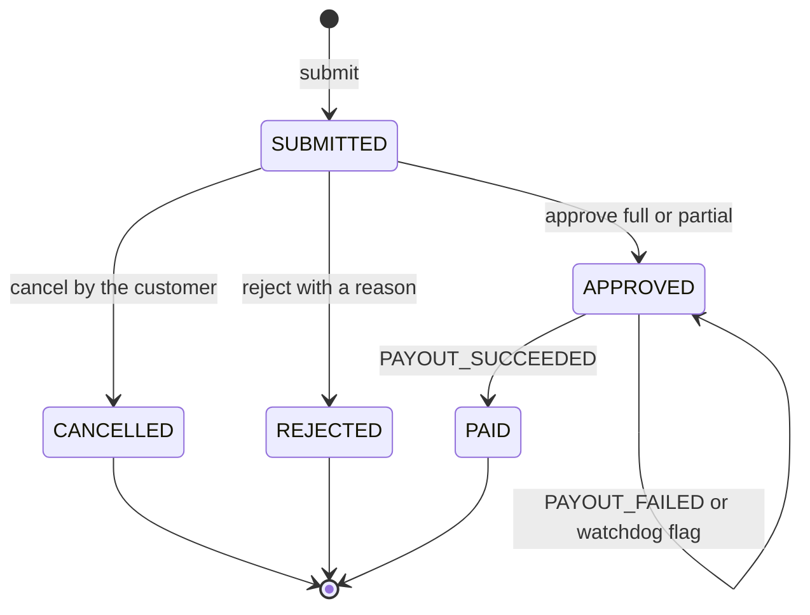
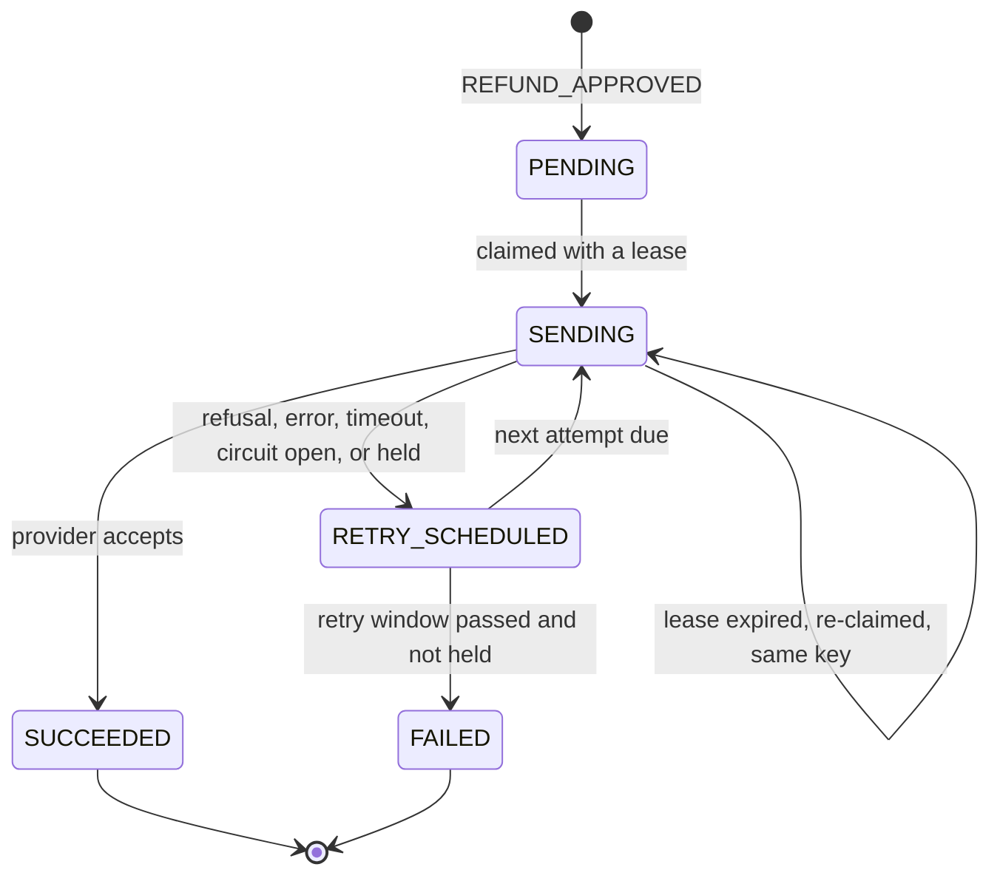
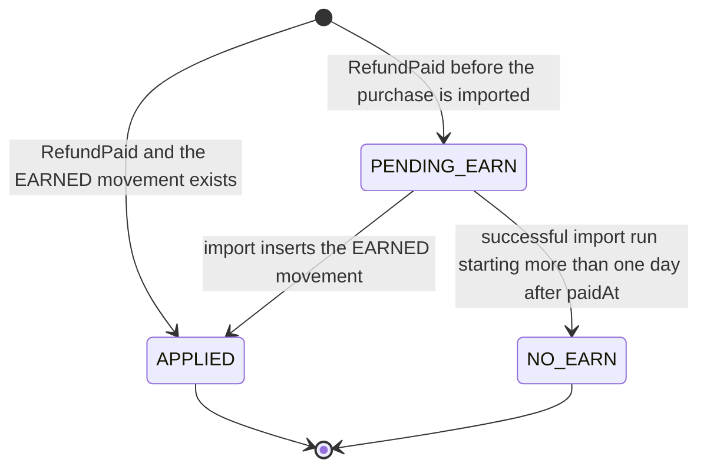

<!--
CHUNK: 08
TITLE: State Machines & Business Rules
PROJECT: Refunds Platform
VERSION: 1.1
DEPENDS_ON: 04
PART OF: LLD - Refunds Platform
-->

# 11. State Machines & Business Rules

> **Convention:** include a state machine only for entities that are genuinely stateful with named states. Stateless services have no state machine here. Per-service rules that are mostly local stay in `04-implementation/<service>.md`; rules that span services live here.

## 11.1 Aggregate State Machines

### `RefundRequest` aggregate (in `refund-service`)

**States:** `SUBMITTED`, `APPROVED`, `REJECTED`, `CANCELLED`, `PAID` ([SDD §17.1](../sdd-refunds-platform/13a-service-refund.md#business-logic), Figure 14). `payout_failing_since` and `payout_outcome_overdue_since` are flags on `APPROVED`, not states.



**Transition rules:**

| From | Event | To | Guard | Side effect |
|------|-------|----|-------|-------------|
| - | `submit` | `SUBMITTED` | Window, card payment, lines refundable, amount equals `expectedAmount` | History row; outbox `REFUND_SUBMITTED` |
| `SUBMITTED` | `cancel` | `CANCELLED` | Caller is the customer | Items inactive; history; outbox `REFUND_CANCELLED` |
| `SUBMITTED` | `reject` | `REJECTED` | Own branch, not own request, reason present | Items inactive; history; outbox `REFUND_REJECTED` |
| `SUBMITTED` | `approve` | `APPROVED` | Own branch, not own request; partial: 0 < amount < requested and a reason | `decided_at`; history; outbox `REFUND_APPROVED` |
| `APPROVED` | `PAYOUT_SUCCEEDED` | `PAID` | `paidAmount` equals `approved_amount` | History; outbox `REFUND_PAID`; publication `RefundPaid` |
| `APPROVED` | `PAYOUT_FAILED` | `APPROVED` | `payout_failing_since` is null | Sets `payout_failing_since` from `firstAttemptAt` |
| `APPROVED` | watchdog | `APPROVED` | No outcome after the retry window plus one hour | Sets `payout_outcome_overdue_since` |

**Summary:** only the customer cancels, only a manager of the request's branch decides, and only payout events move an approved request; everything else answers 409 `REFUND_ALREADY_DECIDED` or is ignored by the consumer.

> **Invariants enforced at every transition:**
> - Optimistic lock version must match.
> - Tenant ID immutable.
> - Created-at immutable.
> - `approved_amount` never exceeds `requested_amount`; an item line is active on at most one request.

### `Payout` aggregate (in `payout-service`)

**States:** `PENDING`, `SENDING`, `RETRY_SCHEDULED`, `SUCCEEDED`, `FAILED` ([SDD §17.2](../sdd-refunds-platform/13b-service-payout.md#business-logic), Figure 18).



| From | Event | To | Guard | Side effect |
|------|-------|----|-------|-------------|
| - | `REFUND_APPROVED` | `PENDING` | No payout for the refund yet | Inbox row |
| `PENDING`, `RETRY_SCHEDULED`, `SENDING` (lease expired) | claim | `SENDING` | Due; row not locked by another worker | `lease_until`, `first_attempt_at` if null, `version` + 1 |
| `SENDING` | `Accepted` | `SUCCEEDED` | Version unchanged since the claim | Attempt row; outbox `PAYOUT_SUCCEEDED` |
| `SENDING` | failure or `Hold` | `RETRY_SCHEDULED` | Version unchanged; window open, or held | Attempt row (not for `NotSent`); `next_attempt_at` from `BackoffPolicy` |
| `SENDING` | failure | `FAILED` | Version unchanged; window passed; not held | Attempt row; outbox `PAYOUT_FAILED` |

**Summary:** a payout is created once per approved refund, sent only under a lease, and ends `SUCCEEDED` or `FAILED`; a held payout (status unreadable) never fails automatically.

### `RefundTakeback` record (in `loyalty-service`)



**Summary:** each paid refund is handled once, under a lock on its purchase, and keeps its paid amount; it takes back the points due at once (a `TAKEN_BACK` movement when they are above 0, none when they are 0, both `APPLIED`), waits for the import, which applies it with the same rule, or closes with nothing to take back ([SDD §17.4](../sdd-refunds-platform/13d-service-loyalty.md#business-logic)).

### `NotificationMessage` (in `notification-service`)

`PENDING` -> `SENT` | `FAILED` | `SKIPPED` (inserted directly when the channel has no address). The lifecycle has no branching beyond this, so no diagram is drawn (SDD §17.3); the claim lease moves only `next_attempt_at` and `version`.

## 11.2 Cross-Service Business Rules

> **Rules that one service depends on another to enforce.** When you change a rule here, check downstream consumers.

### Rule: One payout per approved refund

**Statement:** an approved refund is paid at most once, for exactly its approved amount (REFUNDS/NFR-01, [SDD §14.6](../sdd-refunds-platform/10-events-hub.md#146-cross-cutting-event-guarantees) item 7).

**Source of truth:** payout-service (`ux_payout_refund`, provider idempotency key); refund-service guards the Paid side.

**Enforcement points:** refund-service emits `REFUND_APPROVED` once per approval (idempotent decision); payout-service inbox and unique payout; the payout id on every API-02 attempt; refund-service applies `PAYOUT_SUCCEEDED` only from `APPROVED` and only for the approved amount.

**Validation matrix:**

| Input condition | Expected outcome |
|-----------------|------------------|
| `REFUND_APPROVED` delivered twice | One payout; the second is an inbox no-op |
| Two `REFUND_APPROVED` with different `event_id` for one refund (should not happen) | One payout (unique index); the second insert is a no-op |
| Lease expires during an API-02 call | Re-sent with the same payout id; status queried first when keys are not honoured |
| `PAYOUT_SUCCEEDED` with an amount other than `approved_amount` | Dead-lettered; request stays APPROVED; alarm |

### Rule: Points are taken back when a refund is paid

**Statement:** once a refund of a purchase is Paid, the points of the amount paid back on it are taken back within one hour, never more than the purchase earned ([LOYALTY/UC-02](../brd-loyalty-points/06a-use-cases-member.md#uc-02-view-points-history) BR-1: points taken back after a refund; BR-3: a partial refund takes back only the refunded amount's points; LOYALTY/NFR-02). The points due are counted as [SDD §17.4 Business Logic](../sdd-refunds-platform/13d-service-loyalty.md#business-logic) states, by `PointsCalculator.takebackDue` ([loyalty-service § 7.3](./04-implementation/loyalty-service.md#pointscalculatortakebackdue)).

**Source of truth:** loyalty-service (`refund_takeback`); refund-service owns the Paid fact and the paid amount.

**Enforcement points:** refund-service records `RefundPaid` with its `paidAmount` in the PAID transaction; `core-eventing` delivers it after commit until it completes; loyalty-service, under a lock on the purchase, applies it idempotently or leaves a `PENDING_EARN` for the import, which applies it with the same rule.

**Validation matrix:**

| Input condition | Expected outcome |
|-----------------|------------------|
| Purchase earned 50 points, refunded in full | `TAKEN_BACK` -50 with the refund reference; balance lowered by 50 (LOYALTY/UC-02 AC-1: -50 with the refund reference) |
| Purchase of 80.00 EUR earned 80 points, refund of 30.50 EUR paid | `TAKEN_BACK` -30 with the refund reference (LOYALTY/UC-02 AC-2: -30 for a 30.50 EUR partial refund) |
| A second refund of 49.50 EUR paid on the same purchase | `TAKEN_BACK` -50: 80 points owed in all, minus the 30 already taken back, so no point is lost to rounding |
| Refund of 0.80 EUR paid | `APPLIED`, no movement (points due 0) |
| Refund paid before the purchase is imported | `PENDING_EARN` with its paid amount; the import applies every pending refund of the purchase, in `paid_at` order, in the same transaction as the `EARNED` insert |
| No purchase by the first successful import that starts more than one day after `paidAt` | `NO_EARN`, no movement |
| Two refunds of one purchase paid at the same moment | Serialised by the purchase lock; the second counts the first |
| `RefundPaid` replayed | No-op |

### Rule: The payout retry window is shared configuration

**Statement:** the watchdog threshold in refund-service is the payout retry window of [SDD §17.2 Constraints](../sdd-refunds-platform/13b-service-payout.md#constraints) plus one hour.

**Source of truth:** SDD §17.2 Constraints (the value's home); both deployables read it from the same Helm value, `PAYOUT_RETRY_WINDOW` (10 § 13.1).

**Enforcement points:** payout-service `settle` (fail after the window); refund-service `flagOverduePayouts` (flag after the window plus one hour).

**Validation matrix:**

| Input condition | Expected outcome |
|-----------------|------------------|
| Payout still retrying at window minus 1 minute | No `PAYOUT_FAILED`, no watchdog flag |
| Payout `FAILED` at the window | `PAYOUT_FAILED`; `payout_failing_since` set; no watchdog flag |
| `REFUND_APPROVED` dead-lettered in payout-service | No payout; watchdog flags the request at window plus one hour |

### Rule: Customer contact data is read only by notification-service

**Statement:** `customerContact` travels in the five refund events (ADR-10), but only notification-service binds it; payout-service deserializes only `REFUND_APPROVED` into a record without contact fields and stores none.

**Source of truth:** ADR-10; refund-service owns the contact data.

**Enforcement points:** the `event_type` header filter and `RefundApprovedForPayout` in payout-service; encrypted `delivery_payload` and masking in notification-service; no contact data in any log line or DLQ exception header.

**Validation matrix:**

| Input condition | Expected outcome |
|-----------------|------------------|
| `REFUND_SUBMITTED` reaches payout-service | Dropped by the header filter before deserialization |
| `REFUND_APPROVED` reaches payout-service | Mapped without contact fields |

## 11.3 Algorithm Pseudocode (non-trivial only)

> **Convention:** include only algorithms whose correctness isn't obvious from the code structure. Skip plain loops, plain CRUD, plain validation.

### Algorithm: Reference number issue

**Input:** tenant id. **Output:** `RF-` followed by 10 digits, unique per tenant.

```text
next = UPDATE refund.reference_counter SET next_value = next_value + 1 WHERE tenant_id = :t RETURNING next_value - 1
no row -> INSERT (tenant_id, next_value) VALUES (:t, 1) ON CONFLICT DO NOTHING, then repeat the UPDATE (returns 1)
return "RF-" + leftPad(next, 10, '0')
```

**Edge cases:** first request of a tenant (insert then update); counter above 9,999,999,999 (fails the CHECK; decades away at the SDD §18.1 volume). **Complexity:** O(1); the row lock serialises submissions of one tenant, which is harmless at about 120 a day at peak.

### Algorithm: Payout retry schedule (exponential backoff with jitter)

**Input:** attempt count `n` (after the failed attempt), now. **Output:** next attempt time.

```text
delay = min(PAYOUT_RETRY_MAX_DELAY, PAYOUT_RETRY_FIRST_DELAY * 2^(n - 1))
return now + delay * uniformRandom(0.5, 1.0)
```

**Edge cases:** overflow of `2^(n-1)` for large `n` (cap `n` at 30 before shifting); a retry scheduled after the window end is still attempted once and then fails. **Complexity:** O(1).

> TODO: `PAYOUT_RETRY_FIRST_DELAY` = 1 minute and `PAYOUT_RETRY_MAX_DELAY` = 1 hour are best guesses; the first and maximum retry delay are NEEDS CLARIFICATION in [SDD §12 INT-01](../sdd-refunds-platform/08-integrations.md#12-integrations) - verify with CardPay's rate limits.

### Algorithm: Daily branch report

**Input:** tenant, branch, day. **Output:** `BranchRefundReport`.

```text
[start, end) = day in the tenant time zone, converted to UTC
requestsPerStatus  = count of history rows with changed_at in [start, end), grouped by to_status,
                     joined to refund_request on branch_id = :branch
amountPaid         = sum(paid_amount) of requests with paid_at in [start, end) and branch_id = :branch
averageTimeToDecision = avg(decided_at - created_at) of requests with decided_at in [start, end) and branch_id = :branch
```

**Edge cases:** a day with no activity returns zeros and a null average; a daylight-saving day has 23 or 25 hours, which the zone conversion handles. **Complexity:** index range scans on `ix_refund_status_history_day` and `ix_refund_request_branch_queue`.

> Confirm: "requests per status" is read as the status changes recorded that day (not the current status of the requests submitted that day); [REFUNDS 09 § Reporting / Analytics](../brd-refunds-portal/09-reporting-and-analytics.md#reporting--analytics) and SDD §17.1 do not say which - verify with the REFUNDS owner.

<!-- MASTER: refunds-platform-lld-master.md | PREV: 07-event-contracts.md | NEXT: 09-cross-cutting.md -->
