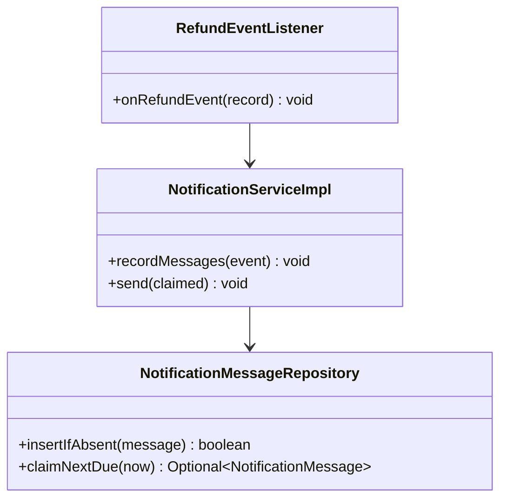
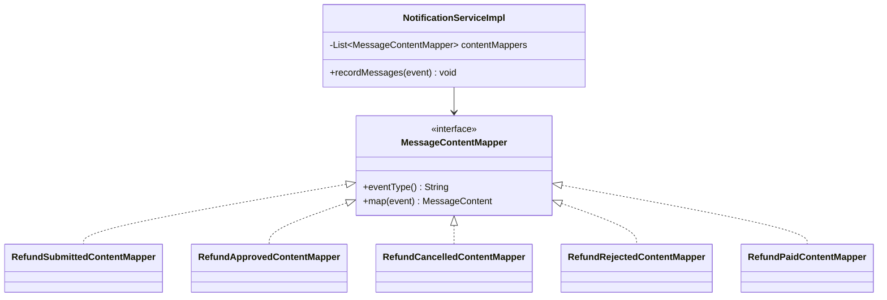
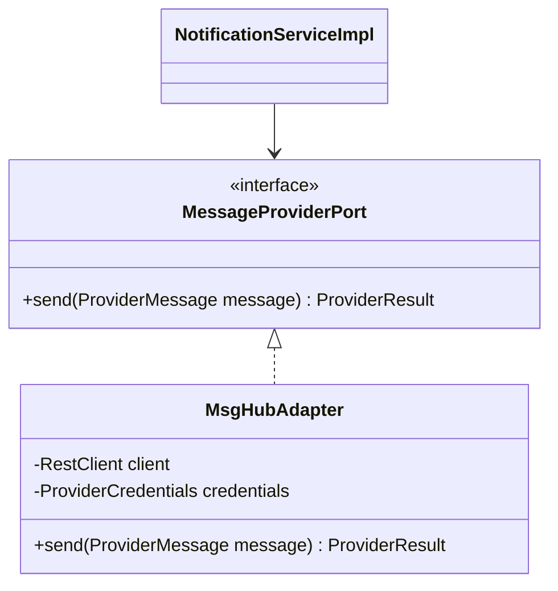
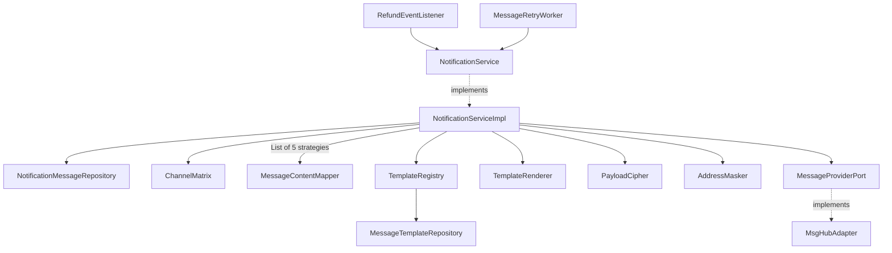
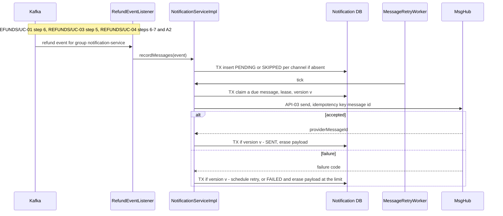

<!--
CHUNK: 04
TITLE: Per-Service Implementation - notification-service
PROJECT: Refunds Platform
VERSION: 1.1
DEPENDS_ON: 03, 09
PART OF: LLD - Refunds Platform
-->

# 7. Per-Service Implementation - notification-service

> **Bounded context:** customer messaging ([SDD §13](../../sdd-refunds-platform/09-services-summary.md#13-services-decomposition-summary) row notification-service; [SDD §17.3 Boundaries](../../sdd-refunds-platform/13c-service-notification.md#boundaries))
>
> **Type:** service (SDD §13 Type; its own deployable and database)
>
> **Source code:** `notification-service/` (not created yet)
>
> **Owns use cases (SDD 09):** None - sends the customer email and SMS messages
>
> **Participates in:** REFUNDS/UC-01, REFUNDS/UC-03, REFUNDS/UC-04 (owner: refund-service)

---

## 7.1 Responsibility

notification-service owns the message templates (per tenant, event type, channel, locale, and version) and the delivery log (`notification_message`, one row per source event and channel) in its own database (schema `notification`) ([SDD §17.3](../../sdd-refunds-platform/13c-service-notification.md#173-notification-service)). It consumes the five refund events (`REFUND_SUBMITTED`, `REFUND_APPROVED`, `REFUND_CANCELLED`, `REFUND_REJECTED`, `REFUND_PAID`) from `refunds-platform-refund-events` as group `notification-service`, turns each into one message per channel of the SDD §17.3 channel matrix, keeps the address and template variables encrypted until the message is final, and sends through MsgHub (API-03) from a retry worker with the message id as the provider idempotency key. It publishes no event, owns no refund state, never calls refund-service, and a failed message never affects a refund.

---

## 7.2 Class & Interface Map

> **Convention:** list the load-bearing classes only - controllers, services, service implementations, repositories, mappers, key domain types. Skip DTOs that are obvious from controller signatures.

> Confirm: class names follow CLAUDE.md conventions plus the SDD §17.3 Developer Notes port name (`MessageProviderPort`); verify with the team.

### Controllers

| Class | Endpoints | Notes |
|-------|-----------|-------|
| None (no business REST API) | `/actuator/health/liveness`, `/actuator/health/readiness`, `/actuator/prometheus` only | Platform endpoints; SDD §17.3 List of APIs has no row |
| `RefundEventListener` (inbound messaging adapter) | `@KafkaListener` on `refunds-platform-refund-events`, group `notification-service` | Accepts the five refund event types by `event_type` header; no `@UseCase` (09 § 12.8) |
| `MessageRetryWorker` (inbound scheduling adapter) | `@Scheduled` worker `message-retry` | Claims due messages with `FOR UPDATE SKIP LOCKED` and a lease |

> **Convention:** every entry point a § 7.8 traceability line names (REST method, event listener, scheduled job) carries `@UseCase("[KEY]/UC-NN")` with that use case's keyed ID (`09-cross-cutting.md` § 12.8). Platform endpoints carry none.

### Services (interfaces)

| Interface | Purpose | Implementations |
|-----------|---------|-----------------|
| `NotificationService` | Record the messages for one refund event; send due messages | `NotificationServiceImpl` |
| `MessageContentMapper` (strategy) | Turn one event type's payload into the recipient and template variables | `RefundSubmittedContentMapper`, `RefundApprovedContentMapper`, `RefundCancelledContentMapper`, `RefundRejectedContentMapper`, `RefundPaidContentMapper` |
| `MessageProviderPort` (outbound port) | API-03: send one email or SMS | `MsgHubAdapter` |

### Service Implementations

| Class | Implements | Key methods |
|-------|------------|-------------|
| `NotificationServiceImpl` | `NotificationService` | `recordMessages(EventEnvelope<JsonNode>)`, `claimNextDue(now)`, `send(ClaimedMessage)` |
| `ChannelMatrix` | component | `channelsFor(eventType)`: the SDD §17.3 channel matrix as a map |
| `TemplateRegistry` | component | `latest(tenantId, eventType, channel, locale)` |
| `TemplateRenderer` | component | `render(MessageTemplate, Map<String, String> variables, Locale)` |
| `PayloadCipher` | component | `encrypt(DeliveryPayload)`, `decrypt(bytes, keyId)`: AES-GCM with a key from the secrets manager |
| `AddressMasker` | component | `mask(channel, address)` (for example `j***@example.com`, `+33*******89`) |
| `MsgHubAdapter` | `MessageProviderPort` | `send(ProviderMessage)` with Resilience4j `msgHub` instances |

### Repositories

| Class | Entity | Notes |
|-------|--------|-------|
| `NotificationMessageRepository` | `NotificationMessage` | `insertIfAbsent(...)` (`ON CONFLICT (tenant_id, source_event_id, channel) DO NOTHING`), `claimNextDue(now)` native `FOR UPDATE SKIP LOCKED LIMIT 1` (worker role) |
| `MessageTemplateRepository` | `MessageTemplate` | Read; highest `template_version` per key |

### Domain Types (records)

| Type | Kind | Purpose |
|------|------|---------|
| `NotificationMessage` | entity | One message per source event and channel; `@Version`; `@TenantId` |
| `MessageStatus` | enum | `PENDING`, `SENT`, `FAILED`, `SKIPPED` |
| `Channel` | enum | `EMAIL`, `SMS` |
| `MessageTemplate` | entity | Versioned template body per tenant, event type, channel, locale |
| `DeliveryPayload` | record | Address plus template variables (reference number, amounts with currency, reasons); only ever stored encrypted |
| `MessageContent` | record | `Map<Channel, String> addresses`, `Map<String, String> variables` |
| `ProviderMessage` | record | Message id (idempotency key), channel, address, rendered subject and body |

### Method Signatures (key methods only)

```java
public interface NotificationService {
  void recordMessages(EventEnvelope<JsonNode> event);
  Optional<ClaimedMessage> claimNextDue(Instant now);
  void send(ClaimedMessage claimed);
}

public interface MessageContentMapper {
  String eventType();
  MessageContent map(EventEnvelope<JsonNode> event);
}

public interface MessageProviderPort {
  ProviderResult send(ProviderMessage message);
}
```

> **Convention:** records are used for all DTOs (CLAUDE.md default). Constructor injection only - no `@Autowired` on fields.

### Ports and Adapters (in-process contracts)

Not applicable - no in-process contracts: notification-service is a separate deployable, not a core module; SDD §15 gives it only the External outbound contract API-03.

### Authorization

| Entry point | Kind | Permission token (SDD §16, verbatim) | Enforcement point |
|-------------|------|--------------------------------------|-------------------|
| `RefundEventListener.onRefundEvent` | Listener | None - system consumer | Kafka ACL: only group `notification-service` reads the refund events it consumes ([SDD §17.3 Constraints](../../sdd-refunds-platform/13c-service-notification.md#constraints)) |
| `MessageRetryWorker.tick` | Job | None - system job | Worker database role |
| `/actuator/health/*`, `/actuator/prometheus` | REST (platform) | None | Management port reachable only inside the cluster (network policy) |

> **Convention:** one row per entry point of this service (REST method, event listener, scheduled job, in-process port). Tokens are the SDD §16 permission tokens, verbatim; the role catalogue stays in the SDD (`sdd-to-lld.md` § One fact, one home). On an internal HTTP entry point the provider's filter or sidecar checks the caller's client-credentials token against the token (SDD §15.1). From code with no SDD: the scopes the code checks.

---

## 7.3 Method-Level Pseudocode (non-trivial logic only)

> **Convention:** include pseudocode only for methods where the algorithm is non-obvious. Skip for plain CRUD.

### `NotificationServiceImpl.recordMessages`

```text
TX (REQUIRED, listener-started):
1. tenantContext.set(event.tenantId)
2. mapper = contentMappers.get(event.eventType)          (unknown type -> ignore; the header filter normally drops it)
3. content = mapper.map(event)                          (recipient addresses and template variables)
4. for channel in channelMatrix.channelsFor(event.eventType):
     address = content.addresses.get(channel)
     address absent -> messages.insertIfAbsent(SKIPPED, recipientMasked = "-", payload = null)
     else           -> messages.insertIfAbsent(PENDING, recipientMasked = masker.mask(channel, address),
                          deliveryPayload = cipher.encrypt(DeliveryPayload(address, content.variables)),
                          keyId, nextAttemptAt = now, attemptCount = 0)
   conflict on (tenant_id, source_event_id, channel) -> no-op (redelivery)
COMMIT                     (no MsgHub call in the consumer transaction, SDD §17.3 Developer Notes)
```

> **Confidence:** High - SDD §17.3 Business Logic (channel matrix, idempotency, missing address, recipient data).

### `NotificationServiceImpl.claimNextDue` and `send`

```text
claimNextDue(now):   TX (worker role)
  m = messages.claimNextDue(now): status = PENDING and next_attempt_at <= now, FOR UPDATE SKIP LOCKED, LIMIT 1
  none -> empty
  tenantContext.set(m.tenantId)
  m.claim(leaseUntil = now + msgHubTimeout + 1 min)     -> next_attempt_at = leaseUntil, attempt_count + 1, version + 1
  COMMIT; return ClaimedMessage(m.id, m.tenantId, m.version)

send(c):   (no TX during the provider call)
  m = messages.findById(c.id); payload = cipher.decrypt(m.deliveryPayload, m.keyId)
  template = templates.latest(m.tenantId, m.eventType, m.channel, tenantSettings.locale(m.tenantId))
  template absent -> settle(c, Failed("TEMPLATE_MISSING"))
  result = provider.send(ProviderMessage(m.id, m.channel, payload.address, renderer.render(template, payload.variables)))
  settle(c, result)

settle(c, result):   TX
  tenantContext.set(c.tenantId); m = messages.findById(c.id)
  m.version != c.version or m.status != PENDING -> return        (another worker owns it)
  Accepted(providerMessageId) -> m.sent(providerMessageId, templateId, now); m.deliveryPayload = null
  failure and m.attemptCount >= MESSAGE_MAX_ATTEMPTS -> m.failed(code, now); m.deliveryPayload = null
  failure                        -> m.nextAttemptAt = backoff.nextAttemptAt(m.attemptCount, now)
  COMMIT; metrics notifications_sent_total{channel, event_type, outcome}, notification_send_latency_seconds
```

> **Confidence:** High for states, retries, and payload erasure (SDD §17.3). Medium for the lease without a new state.

> Confirm: the worker claims a message by moving its `next_attempt_at` forward by a lease (MsgHub timeout plus one minute) and bumping `version`, instead of adding a `SENDING` state, so the four SDD §17.3 states stay unchanged and no transaction spans the API-03 call; a crash re-sends after the lease with the same message id as the MsgHub idempotency key.

> TODO: a missing template for the tenant's locale marks the message `FAILED` with `TEMPLATE_MISSING` and pages (best guess; SDD §17.3 does not say) - verify with the product team, which owns the template set per locale.

---

## 7.4 Design Patterns Applied

> **Convention:** every applied pattern carries name, triggering CLAUDE.md rule, roles, rationale specific to this service, Mermaid class diagram, and pseudocode skeleton. Patterns inferred from code (from-code) include `> Confirm:` unless a test exercises the pattern (`confidence-rules.md`); patterns proposed (from-sdd) carry the rule attribution explicitly.

**Not applied:** Outbox (the service publishes no event, SDD §14.4, and its only side effect is the MsgHub call driven from its own delivery log); RFC 9457 error model (no business REST API); Saga (a pure consumer whose outcome no other service depends on).

### Pattern: Idempotency (delivery log and provider idempotency key)

> **Applied:** Idempotency (CLAUDE.md: "Idempotency keys on all write endpoints touching money/wallet/notifications or external providers." and "Idempotency on every consumer and every write endpoint. Assume at-least-once delivery everywhere.")
>
> **Rationale (this service):** refund events arrive at least once (outbox re-sends, consumer retries, DLQ replay), and a customer must never get the same SMS twice; the unique delivery log `(tenant_id, source_event_id, channel)` is the inbox (SDD §17.3), and the message id sent as MsgHub's idempotency key covers a re-send after a lease expiry.

**Roles:**

| Role | Class / Component |
|------|-------------------|
| Dedup store | `notification.notification_message` unique `(tenant_id, source_event_id, channel)` |
| Check | `NotificationMessageRepository.insertIfAbsent` |
| Provider idempotency key | `NotificationMessage.id` in `ProviderMessage` |

**Class diagram:**



**Pseudocode skeleton:**

```text
recordMessages(e): for channel: messages.insertIfAbsent(tenant, e.eventId, channel, ...)   (conflict -> no-op)
send(c):           provider.send(ProviderMessage(idempotencyKey = message.id, ...))
```

### Pattern: Strategy (message content per event type)

> **Applied:** Strategy (CLAUDE.md: "Strategy for runtime variants")
>
> **Rationale (this service):** each of the five refund events carries different fields for the message (`requestedAmount`, `approvedAmount` with `decisionReason` when `partial`, `rejectionReason`, `paidAmount`), selected at runtime by `event_type`; one mapper per event type keeps adding a sixth event (for example a branch manager message, SDD §17.1 clarification) to one new class instead of a growing switch.

**Roles:**

| Role | Class / Component |
|------|-------------------|
| Strategy interface | `MessageContentMapper` |
| Concrete strategies | `RefundSubmittedContentMapper`, `RefundApprovedContentMapper`, `RefundCancelledContentMapper`, `RefundRejectedContentMapper`, `RefundPaidContentMapper` |
| Context | `NotificationServiceImpl` with `Map<String, MessageContentMapper>` built from the injected list by `eventType()` |

**Class diagram:**



**Pseudocode skeleton:**

```text
RefundApprovedContentMapper.map(e):
  p = read(e.payload, RefundApprovedPayload)
  vars = { referenceNumber, approvedAmount (formatted in the tenant locale with its currency),
           decisionReason if p.partial }
  return MessageContent({EMAIL: p.customerContact.email, SMS: p.customerContact.mobileNumber}, vars)
```

> Confirm: Strategy is a CLAUDE.md guideline pattern applied because the per-event content varies at runtime; a single mapper with a switch would also work at five event types.

### Pattern: Resilience4j on API-03 (MsgHub)

> **Applied:** Resilience defaults (CLAUDE.md: "Resilience defaults: timeouts, retries with exponential backoff and jitter, circuit breakers (Resilience4j), bulkheads for downstream provider calls (e.g., eSIM, payment, SMS).")
>
> **Rationale (this service):** MsgHub outages must never block refunds (REFUNDS/NFR-02) or stall the consumer; the per-call timeout, circuit breaker, and bulkhead of 10 protect the worker threads, and the retry with exponential backoff and jitter is the persisted `next_attempt_at` schedule up to the attempt limit of [SDD §12 INT-02](../../sdd-refunds-platform/08-integrations.md#12-integrations).

**Roles:**

| Role | Class / Component |
|------|-------------------|
| Port | `MessageProviderPort` |
| Adapter | `MsgHubAdapter` (Spring `RestClient`, per-tenant credentials) |
| Policies | Resilience4j `msgHub` (TimeLimiter, CircuitBreaker, Bulkhead); retry schedule and attempt limit in 09 § 12.3 |

**Class diagram:**



**Pseudocode skeleton:**

```text
@Bulkhead(name = "msgHub") @CircuitBreaker(name = "msgHub", fallbackMethod = "notSent")
ProviderResult send(m): response = client.post(API-03 URI TBD, credentials.forTenant(tenant), idempotency key = m.id, body TBD)
                        map: accepted -> Accepted(providerMessageId); rejected or 5xx or timeout -> Failed(code)
notSent(m, CallNotPermittedException e) -> Failed("CIRCUIT_OPEN")
```

> TODO: API-03 is `TBD - external` in [SDD §15.3](../../sdd-refunds-platform/11-api-contracts.md#api-03-send-a-customer-email-or-sms-notification-service---notification-partner) (URI, auth, body, errors, idempotency support); `MsgHubAdapter` stays a stub behind `MessageProviderPort` - verify when MsgHub's documentation arrives.

---

## 7.5 Dependency Injection Graph

> **Convention:** constructor injection only. Document the wiring graph for non-trivial cases (3+ collaborators, or any factory/strategy/mediator wiring).



`NotificationServiceImpl` also takes `Clock`, `IdGenerator`, `TenantContext`, `TenantSettingsRegistry`, `NotificationProperties` (attempt limit, backoff, lease), and `MeterRegistry`.

---

## 7.6 Transaction Boundaries

| Method | Propagation | Isolation | Rollback rules |
|--------|-------------|-----------|----------------|
| `NotificationServiceImpl.recordMessages` | `REQUIRED` (listener-started) | `READ_COMMITTED` | Rollback on any exception; Kafka error handler retries, then dead-letters |
| `NotificationServiceImpl.claimNextDue` | `REQUIRES_NEW`, one message per transaction | `READ_COMMITTED` | Rollback on any exception |
| `NotificationServiceImpl.send` | none (`NOT_SUPPORTED`) | - | - |
| `NotificationServiceImpl.settle` | `REQUIRES_NEW` | `READ_COMMITTED` | Rollback on any exception; the lease expires and the message is retried with the same id |

> **Convention:** outbox row insert lives inside the same transaction as the aggregate write. No `@Transactional(propagation = REQUIRES_NEW)` for outbox writes - the whole point of the pattern is one-tx commit.

> Confirm: transaction propagation default applied; verify per method.

---

## 7.7 Error Handling

| Exception | RFC 9457 type | `errorCode` (SDD §15.1) | HTTP Status | When thrown | Caller action |
|-----------|---------------|-------------------------|-------------|-------------|---------------|
| `EventDeserializationException` | - (no HTTP surface) | - | - | A refund event fails its schema | Non-retryable: DLQ `refunds-platform-refund-events.notification-service.dlq` + alarm |
| `ProviderRejectedException` (mapped to `Failed`) | - | Mapped provider code, `TBD - external` | - | MsgHub rejects the message | Retried until the attempt limit, then `FAILED` |
| `ProviderUnavailableException`, timeout | - | `UNAVAILABLE`, `UPSTREAM_TIMEOUT` | - | MsgHub 5xx, connection failure, or timeout | Retried with backoff and jitter |
| `ProviderAuthenticationException` | - | `UNAUTHENTICATED` | - | Credentials rejected | Circuit opens, alert; messages wait |
| `TemplateMissingException` | - | - | - | No template for tenant, event type, channel, locale | Message `FAILED` with `TEMPLATE_MISSING`, alert |
| `PayloadDecryptionException` | - | - | - | Key rotated away or payload corrupt | Message `FAILED`, alert (never logs the payload) |

> **Convention:** all exceptions extend `ServiceException` (CLAUDE.md base class). Global `@RestControllerAdvice` translates to `ProblemDetails` (RFC 9457). Error envelope schema in `09-cross-cutting.md` § Error Model.

---

## 7.8 Use-Case Workflows

> **Convention:** one subsection per active use case this service owns (SDD §7.3 Owner), headed with the SDD's BRD key and the BRD's ID and title exactly. A merged or removed use case gets no block. Cross-service sagas live in the orchestrator service's file. Each workflow has: the traceability line, control flow, sequence diagram (Mermaid), idempotency points, outbox emission points, retry/timeout choices.

notification-service owns no use case (SDD 09), so it has no `KEY/UC-NN` block. The three participation blocks below share the event-to-message workflow at the end of this section.

### Participates in REFUNDS/UC-01: Request a Refund

> **Owner's block:** [refund-service § REFUNDS/UC-01](./refund-service.md#refundsuc-01-request-a-refund) · Part realised here: REFUNDS/UC-01 step 6 (the customer is told by email and SMS) · Entry points here: None (SDD §7.3 lists `REFUND_SUBMITTED` under Events, not as an entry point)

**Control flow:** `REFUND_SUBMITTED` -> email and SMS with `referenceNumber` and `requestedAmount` (SDD §17.3 channel matrix) -> Workflow: Event to message.

### Participates in REFUNDS/UC-03: Cancel a Refund Request

> **Owner's block:** [refund-service § REFUNDS/UC-03](./refund-service.md#refundsuc-03-cancel-a-refund-request) · Part realised here: REFUNDS/UC-03 step 5 (the customer is told by email) · Entry points here: None (SDD §7.3 lists `REFUND_CANCELLED` under Events, not as an entry point)

**Control flow:** `REFUND_CANCELLED` -> email only with `referenceNumber` -> Workflow: Event to message.

### Participates in REFUNDS/UC-04: Approve / Reject Refund

> **Owner's block:** [refund-service § REFUNDS/UC-04](./refund-service.md#refundsuc-04-approve--reject-refund) · Part realised here: REFUNDS/UC-04 step 6 and A1 (approved amount and, when partial, the reason), A2 (the rejection reason), step 7 (paid) · Entry points here: None (SDD §7.3 lists `REFUND_APPROVED`, `REFUND_REJECTED`, `REFUND_PAID` under Events, not as entry points)

**Control flow:** `REFUND_APPROVED` -> email and SMS with `approvedAmount` and `decisionReason` when `partial`; `REFUND_REJECTED` -> email and SMS with `rejectionReason`; `REFUND_PAID` -> email and SMS with `paidAmount` -> Workflow: Event to message.

### Workflow: Event to message

> **Traceability:** No BRD use case - realises [SDD Business Logic](../../sdd-refunds-platform/13c-service-notification.md#business-logic) · Entry points: `RefundEventListener`

**Trigger:** `RefundEventListener.onRefundEvent`, then `MessageRetryWorker.tick`.

**Pre-conditions:** a committed refund event on `refunds-platform-refund-events`; a template per tenant, event type, channel, and locale.

**Post-conditions:** one row per channel of the event: `SENT` (payload erased, masked address kept), `FAILED` (payload erased), or `SKIPPED` (no address).

**Control flow:**

```text
1. Header filter on the five event types; deserialize the envelope
2. TX: per channel of the SDD §17.3 matrix, insert PENDING (encrypted payload) or SKIPPED; conflicts are no-ops
3. Worker claims a due PENDING message with a lease
4. Decrypt, pick the latest template for the tenant locale, render with amounts and currency (REFUNDS 11)
5. API-03 with the message id as idempotency key, outside any TX
6. Accepted -> SENT, payload erased; failure -> next_attempt_at with backoff; attempt limit -> FAILED, payload erased
```

**Sequence diagram:**



**Idempotency points:** unique `(tenant_id, source_event_id, channel)`; message id as MsgHub's idempotency key; version check on settle.

**Outbox emission points:** none (the service publishes no event).

**Retry / timeout policy:** `msgHub` timeout, circuit breaker, bulkhead; persisted backoff with jitter up to `MESSAGE_MAX_ATTEMPTS` (09 § 12.3); consumer retries then DLQ for unreadable events.

**Error handling:** § 7.7; no failure reaches refund-service.

<!-- MASTER: refunds-platform-lld-master.md | PREV: 04-implementation/loyalty-service.md | NEXT: 04-implementation/payout-service.md -->
