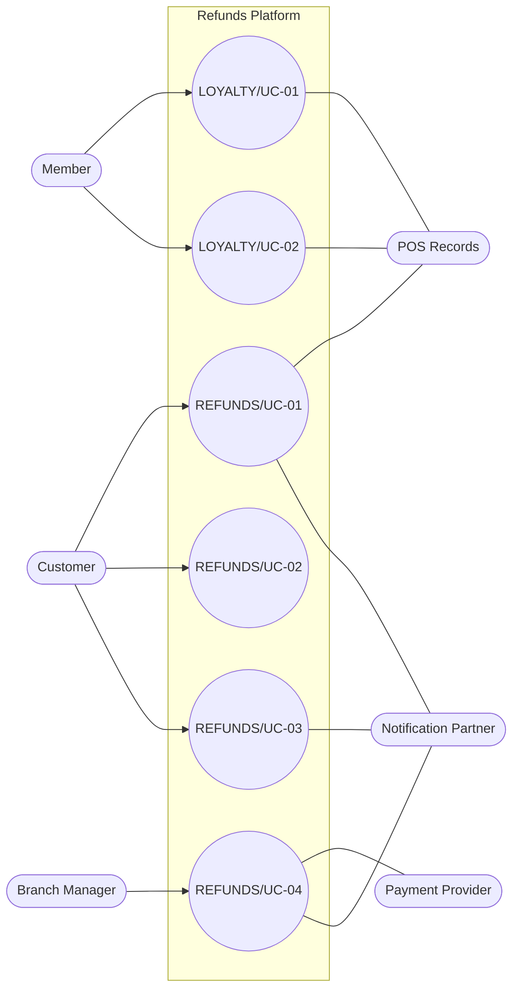

<!--
CHUNK: 03
TITLE: System Users & Use Cases
PROJECT: Refunds Platform
VERSION: 1.0
DEPENDS_ON: 01 (§7.3 also reads 05, 09, 10, 11, and 13x)
PART OF: SDD - Refunds Platform
-->

# 7. System Users & Use Cases

## 7.1 Actors

| Actor | Type (Human / System) | Description | Primary Interface |
|-------|-----------------------|-------------|-------------------|
| Customer | Human | The REFUNDS Customer persona: a buyer who wants money back and sees only their own requests ([REFUNDS 04 § Personas / Actors](../brd-refunds-portal/04-scope-and-personas.md#personas--actors)). | Angular web app, customer area, on phones and computers |
| Branch Manager | Human | The REFUNDS Branch Manager persona: runs one branch and decides on its refunds only ([REFUNDS 04 § Personas / Actors](../brd-refunds-portal/04-scope-and-personas.md#personas--actors)). | Angular web app, branch manager area |
| Member | Human | The LOYALTY Member persona: a customer who joined the loyalty program and sees only their own points ([LOYALTY 04 § Personas / Actors](../brd-loyalty-points/04-scope-and-personas.md#personas--actors)). A different role from the REFUNDS Customer; one person may hold both roles (§16.3). | Angular web app, member area |
| Payment Provider (CardPay Ltd) | System | Pays approved refunds back to the original card ([REFUNDS 08 § Integrations](../brd-refunds-portal/08-integrations.md#integrations)). | API-02 (§15) |
| Notification Partner (MsgHub) | System | Sends customer email and SMS messages ([REFUNDS 08 § Integrations](../brd-refunds-portal/08-integrations.md#integrations)). | API-03 (§15) |
| POS Records (Retail IT team) | System | Holds receipts and member purchases ([REFUNDS 08 § Integrations](../brd-refunds-portal/08-integrations.md#integrations), [LOYALTY 08 § Integrations](../brd-loyalty-points/08-integrations.md#integrations)). | API-01, API-04 (§15) |

## 7.2 Use Case Diagram

**Figure 1: Use Case Diagram**

**Summary:** Customers drive the three REFUNDS customer use cases and branch managers the decision use case, which uses the payment provider; members drive the two LOYALTY use cases, whose points come from POS Records. [REFUNDS/UC-05](../brd-refunds-portal/05-user-journeys-overview.md#use-case-summary) is merged into [REFUNDS/UC-04](../brd-refunds-portal/06b-use-cases-branch-manager.md#uc-04-approve--reject-refund) in its BRD, so it has no node.

## 7.3 Use Case Traceability (BRD → SDD)

| Use case (BRD) | Title | Owner (§17.X) | Entry points | Flows (§8.4 / §8.5) | APIs (§15) | Events (§14) | Status |
|----------------|-------|---------------|--------------|---------------------|------------|--------------|--------|
| **[Refunds Portal v1.0](../brd-refunds-portal/refunds-portal-brd-master.md) (REFUNDS)** | | | | | | | |
| [REFUNDS/UC-01](../brd-refunds-portal/06a-use-cases-customer.md#uc-01-request-a-refund) | Request a Refund | [refund-service](./13a-service-refund.md) | `GET /v1/receipts/{receiptNumber}/refundable-items`, `POST /v1/refund-requests` | [§8.4.1](./05-workflows-and-sequences.md#841-workflow-refund-lifecycle), [§8.5.1](./05-workflows-and-sequences.md#851-sequence-submit-a-refund-request) | API-01, API-03 | `REFUND_SUBMITTED` | Active |
| [REFUNDS/UC-02](../brd-refunds-portal/06a-use-cases-customer.md#uc-02-track-refund-status-web-and-mobile) | Track Refund Status (Web and Mobile) | [refund-service](./13a-service-refund.md) | `GET /v1/refund-requests`, `GET /v1/refund-requests/{refundRequestId}` | [§8.4.1](./05-workflows-and-sequences.md#841-workflow-refund-lifecycle) | - | - | Active |
| [REFUNDS/UC-03](../brd-refunds-portal/06a-use-cases-customer.md#uc-03-cancel-a-refund-request) | Cancel a Refund Request | [refund-service](./13a-service-refund.md) | `POST /v1/refund-requests/{refundRequestId}/cancellation` | [§8.4.1](./05-workflows-and-sequences.md#841-workflow-refund-lifecycle) | API-03 | `REFUND_CANCELLED` | Active |
| [REFUNDS/UC-04](../brd-refunds-portal/06b-use-cases-branch-manager.md#uc-04-approve--reject-refund) | Approve / Reject Refund | [refund-service](./13a-service-refund.md) | `GET /v1/branches/{branchId}/refund-requests`, `GET /v1/branches/{branchId}/refund-requests/{refundRequestId}`, `POST /v1/branches/{branchId}/refund-requests/{refundRequestId}/decision` | [§8.4.1](./05-workflows-and-sequences.md#841-workflow-refund-lifecycle), [§8.4.2](./05-workflows-and-sequences.md#842-workflow-points-balance-history-and-takeback), [§8.5.2](./05-workflows-and-sequences.md#852-sequence-refund-decision-and-payout), [§8.5.3](./05-workflows-and-sequences.md#853-sequence-points-taken-back-after-a-refund-is-paid) | API-02, API-03 | `REFUND_APPROVED`, `REFUND_REJECTED`, `REFUND_PAID`, `PAYOUT_SUCCEEDED`, `PAYOUT_FAILED`, `RefundPaid` | Active |
| [REFUNDS/UC-05](../brd-refunds-portal/05-user-journeys-overview.md#use-case-summary) | Issue Partial Refund | - | - | - | - | - | Merged into REFUNDS/UC-04 |
| **[Loyalty Points v1.1](../brd-loyalty-points/loyalty-points-brd-master.md) (LOYALTY)** | | | | | | | |
| [LOYALTY/UC-01](../brd-loyalty-points/06a-use-cases-member.md#uc-01-view-points-balance) | View Points Balance | [loyalty-service](./13d-service-loyalty.md) | `GET /v1/members/me/points` | [§8.4.2](./05-workflows-and-sequences.md#842-workflow-points-balance-history-and-takeback) | API-04 | - | Active |
| [LOYALTY/UC-02](../brd-loyalty-points/06a-use-cases-member.md#uc-02-view-points-history) | View Points History | [loyalty-service](./13d-service-loyalty.md) | `GET /v1/members/me/points/movements`, `GET /v1/members/me/points/movements/{movementId}` | [§8.4.2](./05-workflows-and-sequences.md#842-workflow-points-balance-history-and-takeback), [§8.5.3](./05-workflows-and-sequences.md#853-sequence-points-taken-back-after-a-refund-is-paid) | API-04 | `RefundPaid` | Active |

<!-- MASTER: refunds-platform-sdd-master.md | PREV: 02-ecosystem-overview.md | NEXT: 04-architecture-style-and-diagrams.md -->
