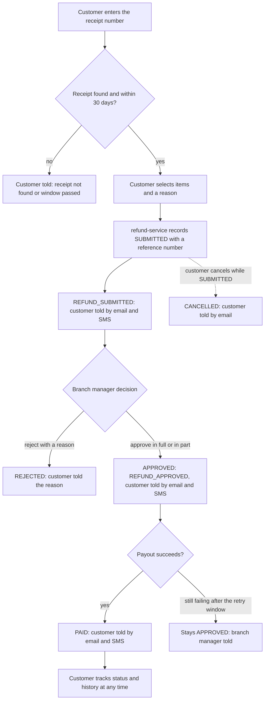
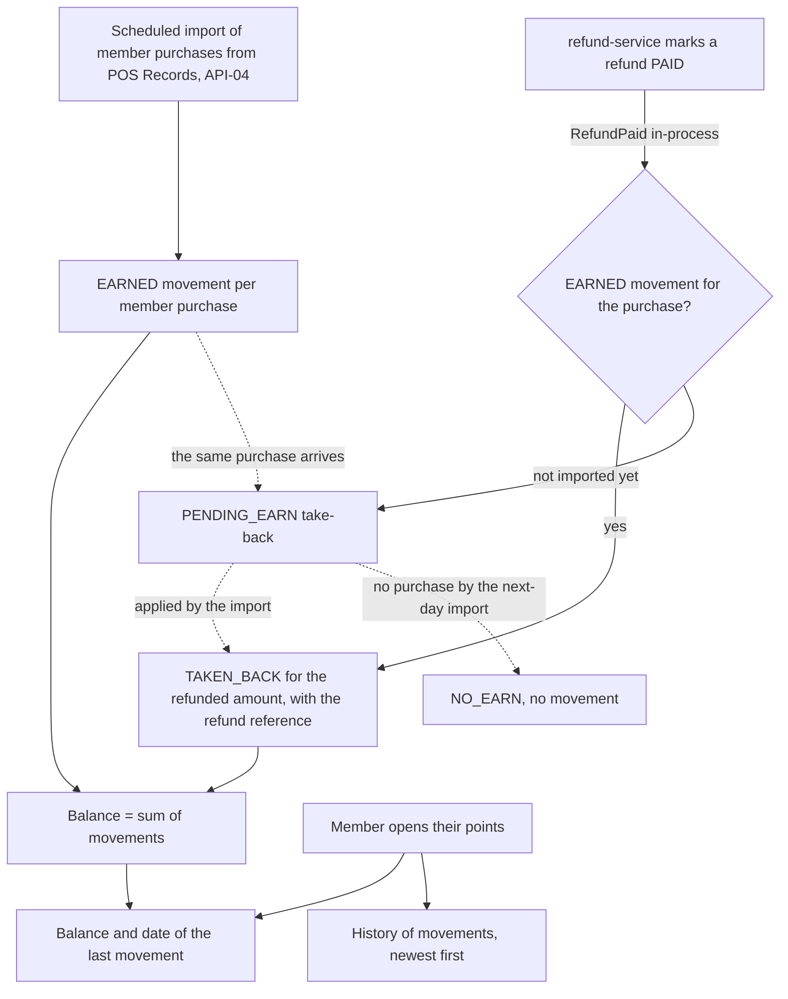
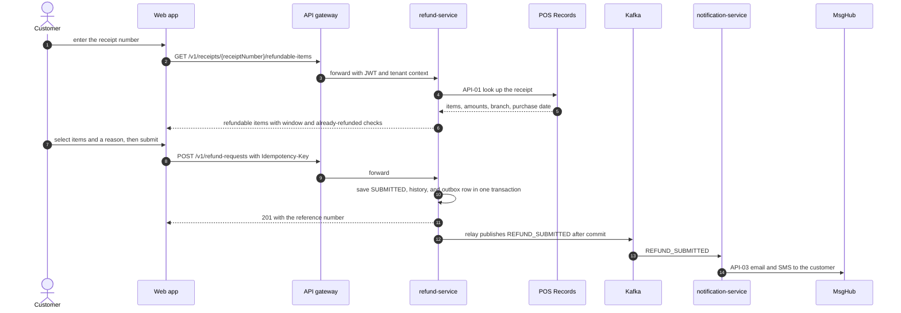
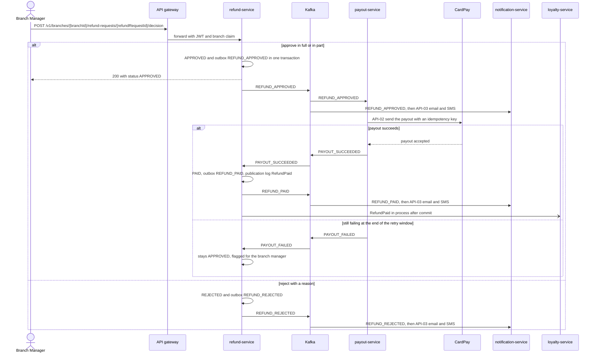
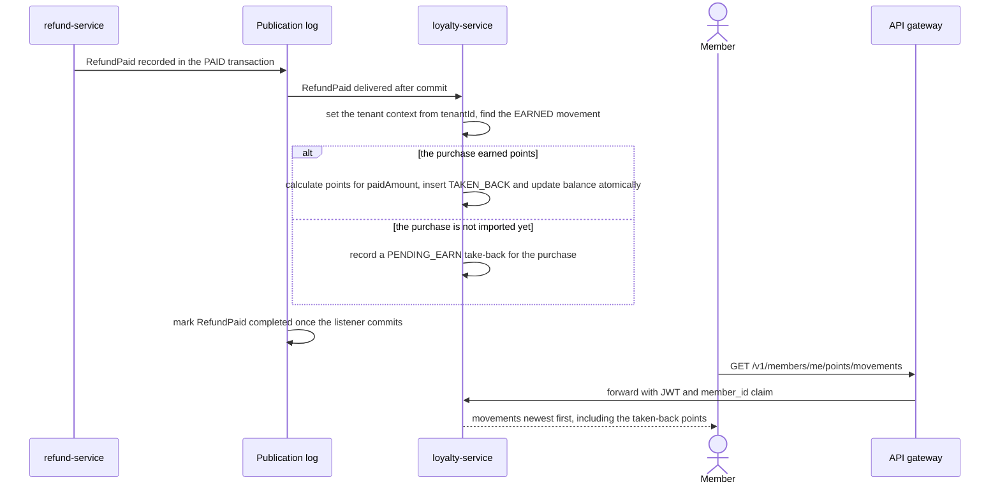

<!--
CHUNK: 05
TITLE: System Design - Workflow & Sequence Diagrams
PROJECT: Refunds Platform
VERSION: 1.1
DEPENDS_ON: 04
PART OF: SDD - Refunds Platform
-->

## 8.4 Workflow Diagrams

<!-- This chunk continues the System Design section from chunk 04 (Architecture Style & Diagrams). -->

### 8.4.1 Workflow: Refund lifecycle

**Use cases:** [REFUNDS/UC-01](../brd-refunds-portal/06a-use-cases-customer.md#uc-01-request-a-refund), [REFUNDS/UC-02](../brd-refunds-portal/06a-use-cases-customer.md#uc-02-track-refund-status-web-and-mobile), [REFUNDS/UC-03](../brd-refunds-portal/06a-use-cases-customer.md#uc-03-cancel-a-refund-request), [REFUNDS/UC-04](../brd-refunds-portal/06b-use-cases-branch-manager.md#uc-04-approve--reject-refund)

**Figure 4: Workflow - Refund lifecycle**

**Summary:** This re-expresses the [REFUNDS 05 § Summarized Workflow](../brd-refunds-portal/05-user-journeys-overview.md#summarized-workflow) technically: refund-service owns every state change, publishes one integration event per change, and payout-service and notification-service react to those events, so the customer is told at submission, approval or rejection, cancellation, and payment. The customer can read the status and history at every point of the flow.

### 8.4.2 Workflow: Points balance, history, and takeback

**Use cases:** [LOYALTY/UC-01](../brd-loyalty-points/06a-use-cases-member.md#uc-01-view-points-balance), [LOYALTY/UC-02](../brd-loyalty-points/06a-use-cases-member.md#uc-02-view-points-history), [REFUNDS/UC-04](../brd-refunds-portal/06b-use-cases-branch-manager.md#uc-04-approve--reject-refund)

**Figure 5: Workflow - Points balance, history, and takeback**

**Summary:** Points come from two sources: the scheduled import of member purchases earns them, and a paid refund takes back the points of the refunded amount through the in-process `RefundPaid` event. A refund paid before its purchase is imported waits as a pending take-back that the import applies, so the balance is always the sum of the right movements whatever order the two sources arrive in.

## 8.5 Sequence Diagrams

### 8.5.1 Sequence: Submit a refund request

**Use cases:** [REFUNDS/UC-01](../brd-refunds-portal/06a-use-cases-customer.md#uc-01-request-a-refund)

**Figure 6: Sequence - Submit a refund request**

**Summary:** The customer's receipt is checked against POS Records before anything is stored, and the request, its history, and the outbox row commit together. The customer message leaves asynchronously, so a MsgHub outage never blocks the submission.

### 8.5.2 Sequence: Refund decision and payout

**Use cases:** [REFUNDS/UC-04](../brd-refunds-portal/06b-use-cases-branch-manager.md#uc-04-approve--reject-refund)

**Figure 7: Sequence - Refund decision and payout**

**Summary:** The decision commits in refund-service with its outbox row, and notification-service tells the customer the approved amount or the rejection reason; payout-service pays asynchronously and reports the outcome with `PAYOUT_SUCCEEDED` or, at the end of the §17.2 retry window, `PAYOUT_FAILED`. A paid refund reaches the customer through notification-service and loyalty-service through the in-process `RefundPaid` event.

### 8.5.3 Sequence: Points taken back after a refund is paid

**Use cases:** [LOYALTY/UC-02](../brd-loyalty-points/06a-use-cases-member.md#uc-02-view-points-history), [REFUNDS/UC-04](../brd-refunds-portal/06b-use-cases-branch-manager.md#uc-04-approve--reject-refund)

**Figure 8: Sequence - Points taken back after a refund is paid**

**Summary:** The take-back rule runs in loyalty-service after the refund's Paid transition has committed, under the tenant carried in the event; the publication log redelivers `RefundPaid` if the core stops before the handler completes, and a purchase not imported yet leaves a pending take-back. The member then sees the negative movement with the refund reference in the history.

<!-- MASTER: refunds-platform-sdd-master.md | PREV: 04-architecture-style-and-diagrams.md | NEXT: 06-principles-and-decisions.md -->
