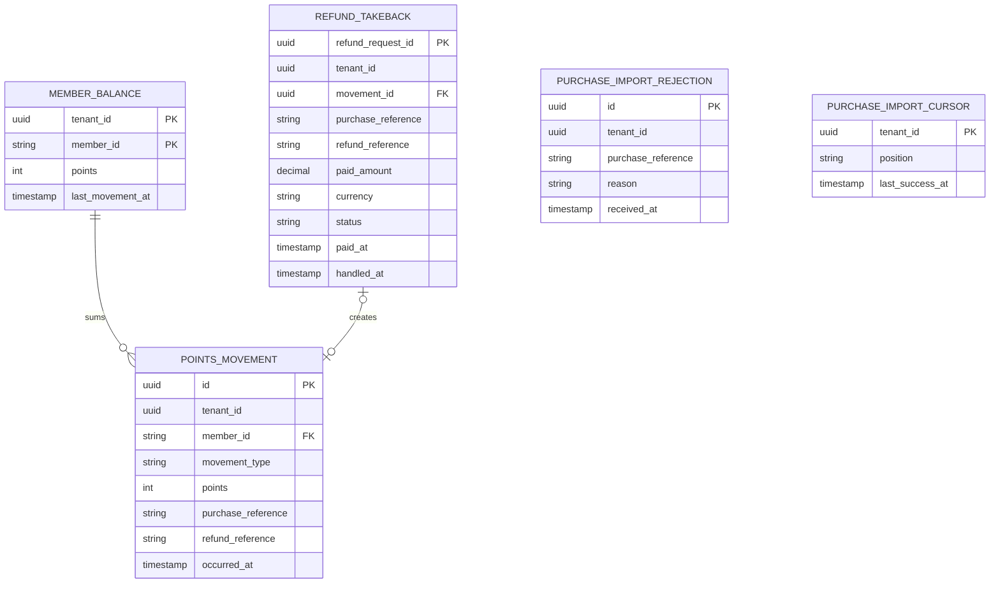
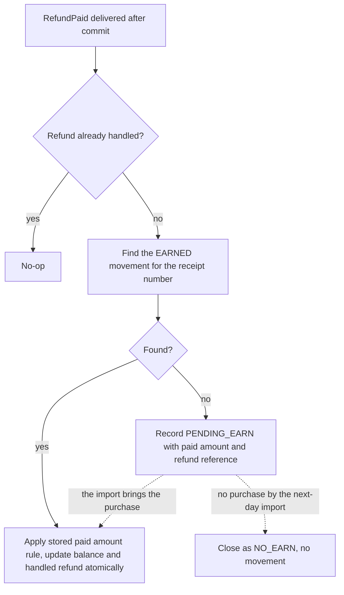

<!--
CHUNK: 13d
TITLE: Detailed Service Spec - loyalty-service
PROJECT: Refunds Platform
VERSION: 1.1
DEPENDS_ON: 09, 07, 10 (event hub - topic names, event names, and payload contracts must match chunk 10 verbatim), 11 (API contracts - integration endpoints carry their API ID and match chunk 11 verbatim), 12 (roles - permission tokens match chunk 12 verbatim)
PART OF: SDD - Refunds Platform
-->

# 17. Detailed Service Specs

---

## 17.4 loyalty-service

### What

loyalty-service is the loyalty points bounded context: a module of the `refunds-platform-core` deployable (ADR-01) that keeps each member's points as a ledger of immutable movements ([LOYALTY 03 § Points movement](../brd-loyalty-points/03-definitions-and-domain-concepts.md#points-movement)), earns points from member purchases imported from POS Records, and takes points back when refund-service reports a paid refund.

### Boundaries

- **Owns:** `PointsMovement` (types `EARNED` and `TAKEN_BACK`), `MemberBalance`, the purchase import cursor, and the record of handled refunds.
- **Does not own:** refund requests (refund-service), member enrolment and identities (outside both BRDs; §3 assumption 3), purchases (POS Records).
- **Upstream consumers:** the web app through the API gateway; refund-service through the in-process `RefundPaid` event.
- **Downstream dependencies:** POS Records (API-04).

### Input

| Type | Source | Description |
|------|--------|-------------|
| REST | Web app, member area | Balance, history, and movement detail (List of APIs). |
| Schedule | `loyalty-purchase-import`, hourly | Pulls new member purchases from POS Records through API-04. |
| In-process domain event | refund-service | `RefundPaid` (§14.10). |

### Business Logic

- **Earn points** (serves [LOYALTY/UC-01](../brd-loyalty-points/06a-use-cases-member.md#uc-01-view-points-balance) and [LOYALTY/UC-02](../brd-loyalty-points/06a-use-cases-member.md#uc-02-view-points-history)): the scheduled import (Input) reads member purchases after the stored cursor (member number, purchase reference, amount) and writes one `EARNED` movement per purchase, at the tenant's earn rate (§11.2), which is 1 point per 1 EUR for the current tenant ([LOYALTY 02 § Glossary](../brd-loyalty-points/02-glossary-assumptions-facts.md#glossary), Points). A unique key on (`tenant_id`, `purchase_reference`) makes a re-imported purchase a no-op, and the cursor advances in the same transaction. Each record is validated: one that yields no positive points, has a non-positive amount, is not in the tenant currency, or fails validation is written to `purchase_import_rejection` (`tenant_id`, `purchase_reference`, `reason`, `received_at`), counted with `outcome=rejected`, and passed by the cursor. Only a transport or authentication failure stops the run. **[NEEDS CLARIFICATION: how a purchase amount with cents becomes whole points (LOYALTY 11 says points are whole numbers): round down, round half up, or round up?]**
- **Take points back** ([LOYALTY/UC-02](../brd-loyalty-points/06a-use-cases-member.md#uc-02-view-points-history) BR-1: points taken back after a refund; BR-3: a partial refund takes only the refunded amount's points; A1: show the refund reference): the `RefundPaid` listener sets tenant context from `tenantId` before any query. It matches `receiptNumber` to the purchase reference, then computes `floor(paidAmount.amount)` points for a partial refund in EUR, at the stated rate of 1 point per full 1 EUR. AC-2 gives 30 points for 30.50 EUR of an 80.00 EUR purchase. The negative movement carries the event's `referenceNumber`. The handled-refund key (`tenant_id`, `refund_request_id`) makes replay a no-op. Persist `purchase_reference`, `refund_reference`, `paid_amount`, `currency`, `paid_at` and `status` with that key before acknowledging the event. The movement, balance and handled-refund update commit atomically. If the purchase is not imported, keep `PENDING_EARN`; the import uses the stored amount and reference with the same calculation when it inserts the earn. The existing next-day import boundary still closes a missing purchase as `NO_EARN`. **[NEEDS CLARIFICATION: is the LOYALTY purchase reference ([LOYALTY 08 § Integrations](../brd-loyalty-points/08-integrations.md#integrations)) the same identifier as the REFUNDS receipt number ([REFUNDS/UC-01](../brd-refunds-portal/06a-use-cases-customer.md#uc-01-request-a-refund) step 1)? The take-back matches them one to one.]** **[NEEDS CLARIFICATION: LOYALTY owner must decide how a refund below 1 EUR is shown when its whole-point take-back is zero, and whether multiple partial refunds aggregate cents or cap total points; BR-3 and AC-2 do not state these rules. No cumulative rounding or cap is assumed.]**
- **Balance** (LOYALTY/NFR-01): the balance is the sum of the movements; `MemberBalance` is updated in the same transaction as every movement insert, so the stored balance never differs from the ledger.
- **View balance** ([LOYALTY/UC-01](../brd-loyalty-points/06a-use-cases-member.md#uc-01-view-points-balance) steps 1-2): returns the balance and the date of the last movement (AC-1: 120 points and the date of the last movement). A member with no movement gets a balance of 0, and the web app explains how points are earned (A1).
- **View history** ([LOYALTY/UC-02](../brd-loyalty-points/06a-use-cases-member.md#uc-02-view-points-history) steps 1-4): lists the movements newest first with date, purchase or refund reference, and points, with server-side pagination; the detail returns the purchase or refund the movement came from.
- **Own points only** ([LOYALTY/UC-01](../brd-loyalty-points/06a-use-cases-member.md#uc-01-view-points-balance) BR-1: members see only their own points; [LOYALTY/UC-02](../brd-loyalty-points/06a-use-cases-member.md#uc-02-view-points-history) BR-2: members see only their own points): every query filters by the `member_id` claim; the path never carries a member number.
- **Display rule:** points are whole numbers and negative movements carry a minus sign ([LOYALTY 11 § UI/UX Expectations](../brd-loyalty-points/11-summary-and-uiux.md#uiux-expectations)).

**State machine:** not applicable; movements are immutable facts and the balance is derived from them.

### Output

| Type | Destination | Description |
|------|-------------|-------------|
| REST response | Web app | Balance, movements, and movement detail. |

### Integrations

| Integration | Direction | Protocol | Purpose | Contract | Failure Handling |
|-------------|-----------|----------|---------|----------|------------------|
| POS Records | Outbound, sync | HTTPS REST | Pull member purchases after the cursor | API-04 (§15) | A transport or authentication failure stops the run and the next run resumes from the cursor; a record that fails validation is rejected and passed (Business Logic); an alert fires when no run has succeeded for a day. |
| refund-service | Inbound, in process | Domain event | Take points back after a paid refund | `RefundPaid` (§14.10) | Publication log replays until the listener completes; the listener is idempotent. |

### DB Modeling

#### Entity Relationship

**Figure 24: loyalty-service - Entity relationship**

**Summary:** A member's balance is the sum of their movements; each handled refund may create one take-back movement, the import cursor records how far the purchase import has read, and rejected purchase records are kept for review, all in the `loyalty` schema.

#### Tables Design

| Table | Column | Type | Constraints | Notes |
|-------|--------|------|-------------|-------|
| `points_movement` | `id` | uuid | PK | UUIDv7 |
| `points_movement` | `tenant_id`, `member_id` | uuid, varchar | NOT NULL | Member number from POS Records |
| `points_movement` | `movement_type`, `points` | varchar, int | `EARNED` > 0, `TAKEN_BACK` < 0 | Whole points |
| `points_movement` | `purchase_reference` | varchar | UNIQUE (`tenant_id`, `purchase_reference`) where `EARNED` | One earn per purchase |
| `points_movement` | `refund_reference` | varchar | NULL for `EARNED` | REFUNDS reference number |
| `member_balance` | `tenant_id`, `member_id`, `points`, `last_movement_at` | uuid, varchar, int, timestamptz | PK (`tenant_id`, `member_id`) | Updated with every movement |
| `refund_takeback` | `tenant_id`, `refund_request_id`, `movement_id`, `handled_at` | uuid, uuid, uuid, timestamptz | PK (`tenant_id`, `refund_request_id`) | One handling per paid refund |
| `refund_takeback` | `purchase_reference`, `status`, `paid_at` | varchar, varchar, timestamptz | CHECK status in `APPLIED`, `PENDING_EARN`, `NO_EARN` | A pending take-back waits for the import |
| `refund_takeback` | `refund_reference`, `paid_amount`, `currency` | varchar, numeric(19,4), char(3) | NOT NULL; `paid_amount` > 0 | Persist the event reference and Money value for the pending-import path; source: [LOYALTY/UC-02](../brd-loyalty-points/06a-use-cases-member.md#uc-02-view-points-history) BR-3 and AC-2 |
| `purchase_import_rejection` | `tenant_id`, `purchase_reference`, `reason`, `received_at` | uuid, varchar, text, timestamptz | NOT NULL | Purchase records the import rejected and passed |
| `purchase_import_cursor` | `tenant_id`, `position`, `last_success_at` | uuid, varchar, timestamptz | PK `tenant_id` | Import position; its format depends on API-04 |

[NEEDS CLARIFICATION: the full column list, remaining constraints, and secondary indexes of the `loyalty` schema; the BRD describes the concepts, not a relational schema.]

[NEEDS CLARIFICATION: Solution Architecture Team and loyalty-service owner must reconcile tenant-leading points_movement and refund_takeback keys, member and movement foreign keys, occurred_at and rejection id coverage, and retention for purchase_import_cursor, purchase_import_rejection and handled refunds with no movement. The new paid amount and refund reference must survive the pending-import path; full schema and retention approval remain open.]

#### Migration Strategy

- **Tool:** Flyway, versioned SQL files in the module's own migration folder (§11.1).
- **Backward compatibility:** additive changes; expand-contract across two releases.
- **Data backfill:** batched per tenant after the expand step.
- **Rollback:** forward-fix migrations.

#### Retention Policy

- `points_movement`, `member_balance`: kept while the member is in the loyalty program. [NEEDS CLARIFICATION: retention after a member leaves the program.]
- `refund_takeback`: kept as long as the movement it created.

#### Archival

- **Cold storage:** none in this release (§6 object storage Not applicable).
- **Format:** not applicable.
- **Schedule:** not applicable.
- **Restore SLA:** not applicable; database backups follow the §6 PostgreSQL row.

#### Data Encryption

- **At rest:** per §11.6.
- **In transit:** TLS per §11.6.
- **Key management:** per §11.6.
- **PII columns:** `member_id` (a personal identifier); masked in non-production data.

### Multi-Tenancy Specifications

- **Strategy override:** none; shared schema with `tenant_id` (§11.2).
- **Tenant filter:** every query filters by the tenant and by the caller's `member_id` claim.
- **Cross-tenant queries:** forbidden.

### API Standards

- **Style:** REST with JSON (ADR-04).
- **Versioning:** URI prefix `/v1` (§15.1).
- **Authentication:** Keycloak JWT, validated at the gateway and in the core (ADR-07).
- **Idempotency:** read-only endpoints; the import and the take-back are idempotent through their unique keys.
- **Pagination:** server-side, `page` and `size` on the movements list, newest first.
- **Error envelope:** per the §15.1 error model.

#### List of APIs (Swagger-friendly)

| Method | Path | Summary | Request Body | Response | Permission token (§16) | API ID (§15) |
|--------|------|---------|--------------|----------|------------------------|--------------|
| GET | `/v1/members/me/points` | Get the caller's points balance and the date of the last movement | - | `PointsBalanceView` | `loyalty.points.read-own` | - |
| GET | `/v1/members/me/points/movements` | List the caller's points movements, newest first | - | `PointsMovementPage` | `loyalty.points.read-own` | - |
| GET | `/v1/members/me/points/movements/{movementId}` | Get one movement with the purchase or refund it came from | - | `PointsMovementDetail` | `loyalty.points.read-own` | - |

No other service or external system calls these endpoints, so none carries an API ID. [NEEDS CLARIFICATION: field-level response schemas (OpenAPI) for the endpoints above; the paths follow the use-case steps and §15.1, the field shapes need architect input.]

### Event-Driven Architecture (If Applicable)

#### Event Model

**Published events:**

| Event Name | Producer | Producer Specs | Consumers | Consumer Specs | Schema (Summary) | Delivery Guarantee |
|------------|----------|----------------|-----------|----------------|------------------|---------------------|
| None | loyalty-service | The module publishes no integration event (§14.4) | - | - | - | - |

**Consumed events:**

| Event Name | Producer (owning service) | Topic | Effect in this service | Idempotency / ordering |
|------------|---------------------------|-------|------------------------|------------------------|
| None | - | - | The module consumes no integration event; it handles `RefundPaid` in process (below). | - |

**In-process domain events (modules only):**

| Event | Publisher module | Listener modules | Transaction phase (before commit / after commit) | Payload (DTO) | Notes |
|---|---|---|---|---|---|
| `RefundPaid` | refund-service | loyalty-service | after commit | `RefundPaidEvent`: `tenantId`, `refundRequestId`, `referenceNumber`, `receiptNumber`, `paidAmount`, `paidAt` | The listener sets the tenant context from `tenantId` before any query, then writes the take-back (or the pending take-back) and the handled-refund record in one transaction; idempotent on `refundRequestId`. |

#### Messaging Infra

Not applicable - no integration events.

### Constraints

- **Authorization, [LOYALTY/UC-01](../brd-loyalty-points/06a-use-cases-member.md#uc-01-view-points-balance) and [LOYALTY/UC-02](../brd-loyalty-points/06a-use-cases-member.md#uc-02-view-points-history):** role `MEMBER` with `loyalty.points.read-own`; own points only (`member_id` claim), per [LOYALTY 07 § Users & Use Cases Matrix](../brd-loyalty-points/07-users-use-cases-matrix.md#users--use-cases-matrix) footnote (1).
- **Take-back timing:** a paid refund's points are taken back within one hour (LOYALTY/NFR-02); the in-process listener normally completes within seconds.
- **No redemption:** points are never spent in this release ([LOYALTY 04 § Out of Scope](../brd-loyalty-points/04-scope-and-personas.md#out-of-scope)), the interaction of multiple refunds with earn rounding remains an owner question in Business Logic; this document does not claim a nonnegative balance from that exclusion alone.

### Error Handling

- **Synchronous APIs:** RFC 9457 Problem Details per §15.1.
- **Validation errors:** 400 `VALIDATION_FAILED` for bad paging parameters.
- **Domain errors:** a movement id that does not belong to the caller answers 404 `NOT_FOUND`, never 403, so movement ids of other members are not revealed ([LOYALTY/UC-02](../brd-loyalty-points/06a-use-cases-member.md#uc-02-view-points-history) BR-2: own points only).
- **Auth errors:** 401 `UNAUTHENTICATED`; 403 `FORBIDDEN` when the token has no `MEMBER` role or no `member_id` claim.
- **Server errors:** 500 `INTERNAL_ERROR` with the correlation id only.
- **Async consumers:** the `RefundPaid` listener rolls back on failure and the publication log redelivers it; a transport or authentication failure stops the import, which resumes from the cursor on the next run, and a record that fails validation is rejected and passed (Business Logic).
- **Poison messages:** a `RefundPaid` that fails repeatedly stays incomplete in the publication log and raises an alert on its age (§11.4). [NEEDS CLARIFICATION: redelivery attempts before the alert.]

### Observability & Monitoring

#### Logging

- JSON per §11.4, with `refundRequestId` and movement id as searchable fields.
- Never logs member numbers or `tenant_id` at INFO or above.
- Retention per the §6 logging row.

#### Metrics

| Metric | Type | Labels | Purpose |
|--------|------|--------|---------|
| `loyalty_points_movements_total` | counter | `movement_type` | Earned and taken-back volume |
| `loyalty_takeback_lag_seconds` | histogram | - | Time from `paidAt` to the take-back, against LOYALTY/NFR-02 (one hour); also covers take-backs applied by the import |
| `loyalty_purchase_import_last_success_timestamp` | gauge | - | Freshness of the purchase import |
| `loyalty_purchase_import_records_total` | counter | `outcome` (imported, duplicate, rejected) | Import volume; an alert fires when a run rejects any record |

#### Tracing

- OpenTelemetry spans for every endpoint, the import run, the API-04 call, and the `RefundPaid` listener.
- The listener span links to the trace of the transaction that marked the refund Paid.
- Sampling per the §6 tracing row.

### Developer Notes

- **Recommended patterns:** hexagonal ports `PosPurchasePort` and `RefundPaidListener`; the ledger is append-only; records for DTOs.
- **Avoid:** reading the `refund` schema; updating or deleting a movement; computing the balance in the web app.
- **Testing:** JUnit 5 and Mockito for the points rules; Testcontainers with PostgreSQL for the ledger, the balance invariant, and listener idempotency; a stub of API-04 until its contract is supplied. Test the 30.50 EUR partial refund as -30, a duplicate delivery as a no-op, and refund-before-import as the same amount and refund reference. Zero-point and multiple-refund expectations await the Business Logic marker.

### Service-Level Diagrams

#### Implementation Flow Chart

**Figure 25: loyalty-service - Take-back flow**

**Summary:** Each paid refund is handled once; it takes back the points of the refunded amount for the matching purchase, or waits as a pending take-back that the import applies, or closes with nothing to take back.

#### Sequence Diagram (Service-Internal)

Not applicable: the cross-module interaction is shown in §8.5.3, and the service-internal steps are the flow above.

### Compliance

- **GDPR:** member numbers and purchase references are personal data; the ledger is visible only to its member. [NEEDS CLARIFICATION: lawful basis and the erasure path for a member's ledger, and whether ISO 27001 or SOC 2 controls apply to this module.]
- **PCI-DSS:** not applicable; no card data.
- **ISO 27001 / SOC 2:** see the clarification above.
- **Local regulations:** none stated by the BRDs.

### Deployment Strategy

- **Service-specific override:** none; the module ships in the `refunds-platform-core` image and Helm chart (ADR-09). The import runs on one replica at a time through a database lock.
- **Replicas:** per the core deployable (§11.3).
- **Strategy:** rolling update; migrations for the `loyalty` schema run before the new version takes traffic.
- **Health checks:** liveness and readiness probes of the core.
- **Rollback:** Helm rollback; migrations stay backward compatible.

### Future Enhancements

- Export the history ([LOYALTY/UC-02](../brd-loyalty-points/06a-use-cases-member.md#uc-02-view-points-history) future enhancement).
- Redeem points at checkout ([LOYALTY 12 § Wishlist](../brd-loyalty-points/12-appendix-and-wishlist.md#wishlist)); this is one of the extraction triggers of ADR-01.

<!-- MASTER: refunds-platform-sdd-master.md | PREV: 13c-service-notification.md | NEXT: 14-performance-and-capacity.md -->
