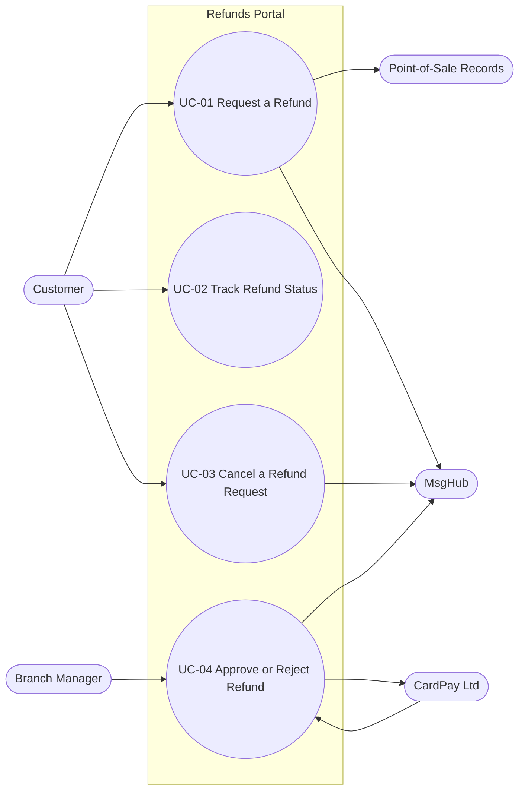

<!--
CHUNK: 03
TITLE: System Users & Use Cases
PROJECT: Refunds Portal
VERSION: 1.0
DEPENDS_ON: 01
PART OF: SDD - Refunds Portal
-->

# 7. System Users & Use Cases

## 7.1 Actors

Human actors are the personas of [BRD 04 § Personas / Actors](../brd-refunds-portal/04-scope-and-personas.md#personas--actors); system actors are the partners of [BRD 08](../brd-refunds-portal/08-integrations.md). Their roles and permissions are defined in §16.

| Actor | Type (Human / System) | Description | Primary Interface |
|-------|-----------------------|-------------|-------------------|
| Customer | Human | BRD persona Customer; role `CUSTOMER` (§16.4.1). Requests, tracks, and cancels own refund requests. | `refunds-portal-web` customer area in a browser on a phone or computer, signed in through the IAM |
| Branch Manager | Human | BRD persona Branch Manager; role `BRANCH_MANAGER` (§16.4.2). Decides on the requests of one branch and reads its branch report. | `refunds-portal-web` branch-manager area in a browser, signed in through the IAM |
| CardPay Ltd (payment provider) | System | Executes payouts to the original card and returns payout results (INT-01). Calls in when it delivers results by callback. | Outbound API-03 and API-06; inbound API-04 (§15) |
| MsgHub (notification partner) | System | Delivers customer emails and SMS messages (INT-02). Does not call in. | Outbound API-05 (§15) |
| Point-of-Sale Records (Retail IT team) | System | Answers receipt lookups: lines, amounts, branch, purchase date (INT-03). Does not call in. | Outbound API-01 (§15) |

## 7.2 Use Case Diagram

**Figure 1: Use Case Diagram**

**Summary:** The Customer drives UC-01 to UC-03 and the Branch Manager drives UC-04 (which includes partial refunds; UC-05 is merged into UC-04 in [BRD 05 § Use Case Summary](../brd-refunds-portal/05-user-journeys-overview.md#use-case-summary)). UC-01 depends on the Point-of-Sale records, UC-04 on CardPay in both directions, and UC-01, UC-03, and UC-04 send messages through MsgHub.

<!-- MASTER: refunds-portal-sdd-master.md | PREV: 02-ecosystem-overview.md | NEXT: 04-architecture-style-and-diagrams.md -->
