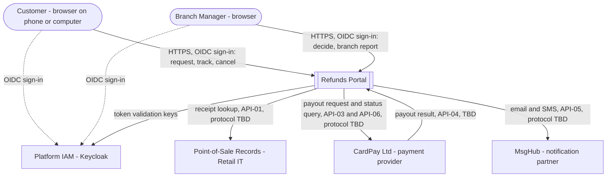
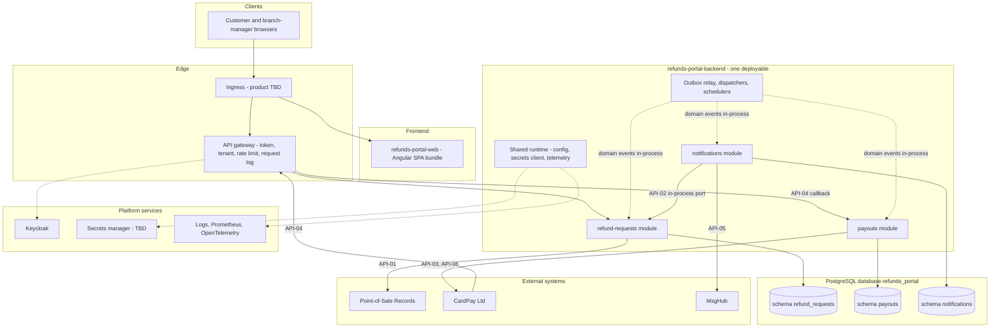

<!--
CHUNK: 04
TITLE: System Design - Architecture Style, Context & HLA Diagrams
PROJECT: Refunds Portal
VERSION: 1.0
DEPENDS_ON: 01, 02
PART OF: SDD - Refunds Portal
-->

# 8. System Design / High-Level Architecture

## 8.1 Architecture Style

### 8.1.1 What

A **modular monolith** (ADR-01): one Java 21 / Spring Boot backend deployable, `refunds-portal-backend`, made of the DDD modules of §13, each with a hexagonal structure (domain core, inbound REST / event / scheduler adapters, outbound persistence and provider adapters). Modules never share tables: each owns one schema in the single PostgreSQL database `refunds_portal`. Between modules, **queries** are synchronous in-process calls to a published port (contract in §15), and **state changes** are domain events written to the producer's transactional outbox in the same transaction as the change and delivered in-process, after commit, to each subscribing module's inbox (§14; ADR-02). Every call to an external provider is dispatched from committed state (the outbox or a durable work row), never from inside a user's request transaction. There is no message broker and no service mesh in this release. One Angular SPA, `refunds-portal-web`, is the only client; it reaches the backend through an ingress and an API gateway.

### 8.1.2 Why

- **Small, stable scope, one team.** Four use cases and two personas ([BRD 05 § Use Case Summary](../brd-refunds-portal/05-user-journeys-overview.md#use-case-summary), [BRD 04 § Personas / Actors](../brd-refunds-portal/04-scope-and-personas.md#personas--actors)) and three integrations ([BRD 08](../brd-refunds-portal/08-integrations.md)) form a handful of small bounded contexts that one team builds and releases together (team count assumed, the BRD does not state it; ADR-01). Separate services would add a broker, network failure modes, and several pipelines without a driver that needs them.
- **Modest volume with seasonal peaks.** Request volume ([BRD 02 § Facts](../brd-refunds-portal/02-glossary-assumptions-facts.md#facts)) and the seasonal multiplier of NFR-03 are absorbed by scaling one stateless deployable horizontally; no part has a load profile that needs independent scaling.
- **Money safety comes from the outbox and idempotency, not from deployment separation.** NFR-01 (never lost, never paid twice) is met by committing state and the outbound intent in one transaction and by one idempotent payout per approved request (ADR-02, ADR-08). A separate payout service would not add safety, only a network hop.
- **Availability through fewer moving parts.** NFR-02 is served by at least two replicas of one deployable plus PostgreSQL HA (targets in §18); a single deployable has fewer components that can fail than a set of services joined by a broker.
- **Cheap extraction later.** Enforced module boundaries, ports, per-module schemas, and outbox-based events with stable logical topic names let a module become a service when an ADR-01 trigger fires (for example the online-shop refunds of [BRD 12 § Wishlist](../brd-refunds-portal/12-appendix-and-wishlist.md#wishlist)).

### 8.1.3 How

- **Bounded contexts:** refund request lifecycle, receipt eligibility, branch decisions, and the branch report → `refund-requests` (§17.1); payout execution to the original card → `payouts` (§17.2); customer and branch-manager messaging → `notifications` (§17.3). Identity lives in the IAM (§16), not in a module.
- **Inter-module communication:** state changes as domain events on logical topics (§14.4) through the per-module outbox, relay, and inbox with deduplication on `(consumer, event_id)`; queries through in-process ports only (§15, `Internal (in-process)` contracts); at most one synchronous hop. No module calls another module's REST endpoints.
- **External communication:** providers are reached only through anti-corruption adapters with timeouts, retries with exponential backoff and jitter, circuit breakers, and bulkheads (§12, §15). Provider callbacks (API-04) enter through the gateway and are normalised in the owning module before any domain event.
- **Data ownership:** schema `refund_requests`, `payouts`, `notifications` in database `refunds_portal`; each module has its own Flyway migration stream, outbox table, and inbox table; no cross-schema joins, foreign keys, or reads (ADR-03). Shared schema with `tenant_id` inside each module schema (ADR-04).
- **Deployment model:** one OCI image and one Helm chart for `refunds-portal-backend`, at least two replicas, rolling updates gated on readiness; the frontend bundle is served from the edge (ADR-09, §11.3). Hosting **[NEEDS CLARIFICATION: on-premises or cloud (R-08)]**.
- **Extraction path:** when a module is extracted, its logical topic becomes a broker topic with the same name, its in-process port becomes an HTTP contract under the same API ID with a new version, and its schema moves to its own database (ADR-01, ADR-02).

## 8.2 Context Diagram

**Figure 2: System Context Diagram**

**Summary:** Customers and branch managers sign in through the platform IAM and use the portal over HTTPS. The portal calls the Point-of-Sale records for receipts, CardPay for payouts (CardPay may call back with results), and MsgHub for customer messages; every provider protocol is `TBD - external` until the provider documentation is supplied (§15.6).

## 8.3 High-Level Architecture Diagram

**Figure 3: High-Level Architecture**

**Summary:** Browsers load the SPA and call the backend through the ingress and the API gateway, which validates tokens against Keycloak. Inside the one deployable, the modules own their schemas, exchange state changes through the outbox relay, and make one in-process query (API-02); each provider is reached from the module that owns it, and CardPay's callback enters through the gateway. The edge products and the secrets manager depend on the hosting decision (R-08); every component reports to the observability stack.

<!-- MASTER: refunds-portal-sdd-master.md | PREV: 03-users-and-use-cases.md | NEXT: 05-workflows-and-sequences.md -->
