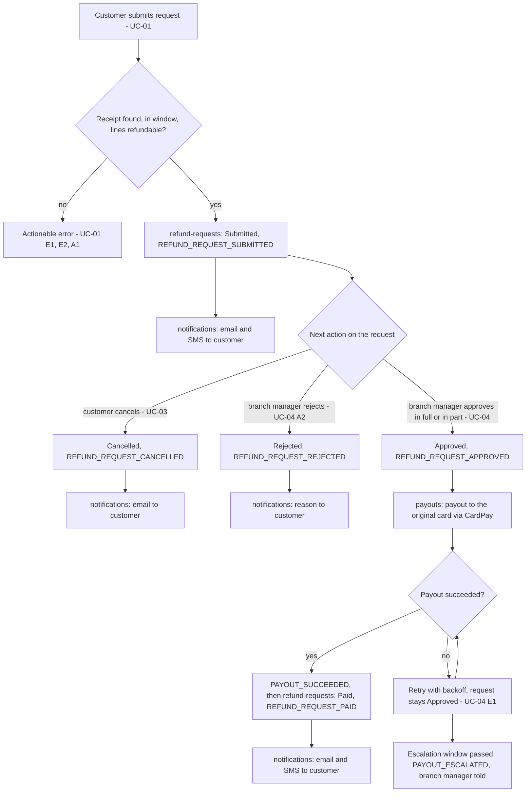
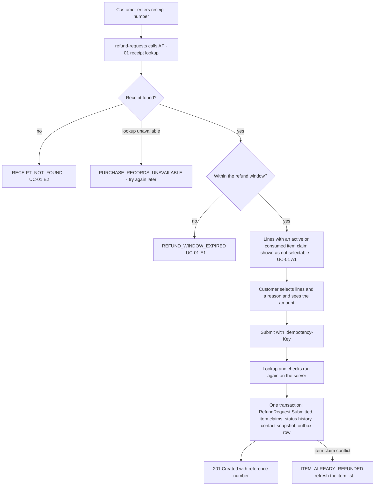
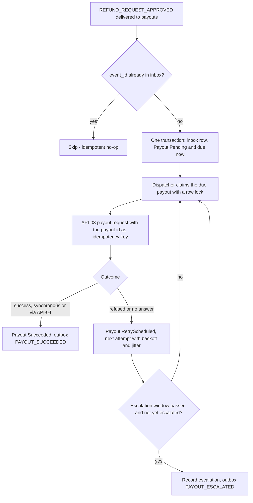
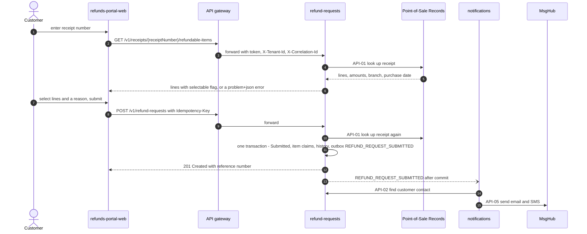
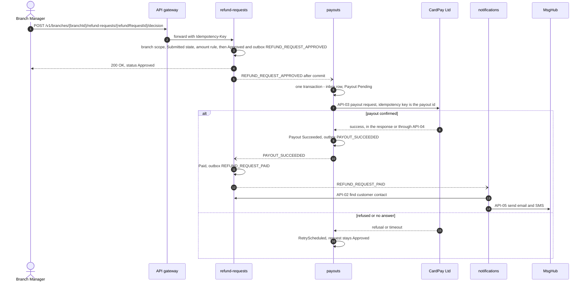
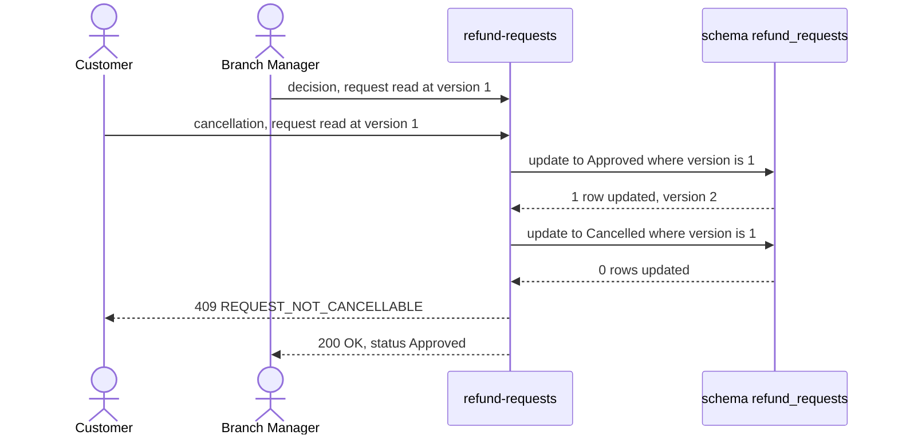

<!--
CHUNK: 05
TITLE: System Design - Workflow & Sequence Diagrams
PROJECT: Refunds Portal
VERSION: 1.0
DEPENDS_ON: 04
PART OF: SDD - Refunds Portal
-->

## 8.4 Workflow Diagrams

The behavioural steps are owned by the BRD use cases ([BRD 06a](../brd-refunds-portal/06a-use-cases-customer.md), [BRD 06b](../brd-refunds-portal/06b-use-cases-branch-manager.md)); these workflows show the technical realisation and cite the steps by ID.

### 8.4.1 Workflow: Refund Request Lifecycle (end to end)

**Figure 4: Workflow - Refund Request Lifecycle**

**Summary:** This is the [BRD 05 § Summarized Workflow](../brd-refunds-portal/05-user-journeys-overview.md#summarized-workflow) expressed as module state changes and domain events: a submitted request ends Cancelled, Rejected, or Approved, and an approved request ends Paid once its payout succeeds. Every state change publishes an event that drives the next module; a failing payout keeps the request Approved, retries, and escalates to the branch manager.

### 8.4.2 Workflow: Receipt Check and Submission (UC-01)

**Figure 5: Workflow - Receipt Check and Submission**

**Summary:** The receipt lookup is always done by the backend, first to show the refundable lines and again at submission, so the client never supplies amounts or eligibility. Submission commits the request, the item claims that enforce the item-once rule, and the outbox row together; a concurrent claim on the same line fails the transaction with an actionable error.

### 8.4.3 Workflow: Payout Dispatch, Retry, and Escalation (UC-04 steps 6-7, E1)

**Figure 6: Workflow - Payout Dispatch, Retry, and Escalation**

**Summary:** A payout is created once per approved request and dispatched from committed state by a dispatcher that locks the row, so two replicas never send the same attempt. Every attempt reuses the payout id as the idempotency key; failures are retried with backoff, and when the escalation window of UC-04 E1 passes the payout is escalated once while retries continue (the stop condition is flagged in §17.2).

## 8.5 Sequence Diagrams

The sequences use the candidate event names of §14.5 and the contracts of §15. **[NEEDS CLARIFICATION: confirm these sequences once the candidate events (§14.5) are ratified and CardPay's result delivery model (synchronous response or callback, API-03 and API-04) is known.]**

### 8.5.1 Sequence: Submit a Refund Request (UC-01)

**Figure 7: Sequence - Submit a Refund Request**

**Summary:** The customer's two calls reach refund-requests through the gateway, and each makes at most one synchronous provider call (the receipt lookup), keeping the one-hop rule. After the request is committed, the relay delivers the event to notifications, which resolves the contact in-process and sends the messages through MsgHub.

### 8.5.2 Sequence: Approve, Pay Out, and Mark Paid (UC-04)

**Figure 8: Sequence - Approve, Pay Out, and Mark Paid**

**Summary:** The decision commits Approved and its event in one transaction and answers the branch manager at once; the payout runs asynchronously from committed state. Success travels back as PAYOUT_SUCCEEDED, refund-requests marks the request Paid and publishes the customer-facing fact, and notifications tells the customer; a refusal or timeout only schedules a retry.

### 8.5.3 Sequence: Cancellation Racing a Decision (UC-03 E1)

**Figure 9: Sequence - Cancellation Racing a Decision**

**Summary:** Optimistic locking on the aggregate version makes the first committed transition win; the losing cancellation receives a conflict that the customer area shows as "the request can no longer be cancelled" (UC-03 E1). The same guard protects a decision that races a cancellation.

<!-- MASTER: refunds-portal-sdd-master.md | PREV: 04-architecture-style-and-diagrams.md | NEXT: 06-principles-and-decisions.md -->
