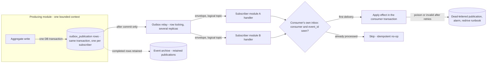
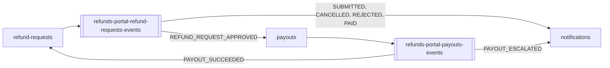

<!--
CHUNK: 10
TITLE: Centralized Event Hub (Platform Event Catalog & Payload Contracts)
PROJECT: Refunds Portal
VERSION: 1.0
DEPENDS_ON: 05, 07, 08, 09
RECONCILES_WITH: every per-service chunk (13a, 13b, 13c) - Event Model + Messaging Infra sub-sections
PART OF: SDD - Refunds Portal
PURPOSE: Single cross-module catalog of every platform event - name, producer, consumers, envelope, payload contract, business what/when/why - plus the event-hub topology. Consolidates what is otherwise distributed across the per-module Event Models.
CONSISTENCY_RULE: This chunk is the platform contract registry. Topic names, event names, envelope fields, and payload contracts here MUST match the per-service chunks character-for-character. Consumer lists are reconciled from BOTH sides (each producer's published table AND each consumer's consumed table). Where a per-service spec and this catalog disagree, the per-service spec is authoritative for its own published events and the divergence is flagged in the Consistency Notes section - never silently reconciled.
-->

# 14. Centralized Event Hub (Platform Event Catalog & Payload Contracts)

> **What this chunk is.** The one place that lists **every event on the platform** with its producer, consumers, key family, payload contract, and business meaning (what / when / why), plus the hub topology that carries them. It is a derived consolidation of the per-module Event Models (§17.1 to §17.3, § Event-Driven Architecture). Downstream LLD generation and implementers read this chunk as the single contract surface.

---

## 14.1 Purpose & Scope

The platform is a modular monolith (ADR-01): every cross-module state change travels as a domain event through the producing module's transactional outbox and is delivered in-process by the outbox relay (ADR-02); queries between modules use in-process ports (§15), at most one synchronous hop.

1. **What events exist:** the events of §14.5, published by the producing modules of §14.4. The event count is owned by the §14.9.99 coverage matrix.
2. **Who produces and who consumes each:** §14.5, reconciled from both the producers' published tables and the consumers' consumed tables in §17.1 to §17.3.
3. **What each event carries:** the envelope of §14.3 plus the payload contract of §14.9.
4. **Why and when each fires:** the Business column of §14.5, citing the BRD step that produces the fact.

**Out of scope:** events internal to one module that never leave it; provider callbacks (API-04 is a REST callback, normalised inside payouts before any event); provider requests (API-01, API-03, API-05, API-06 are synchronous calls, not events); the in-process query API-02.

## 14.2 Hub Topology Decision

**Decision:** one logical hub realised in-process: one logical topic per producing module, carried by that module's transactional outbox and delivered by the outbox relay as one publication per subscribing module. There is no broker in this release (ADR-02).

What makes it *one hub* is the shared contract surface:

- **One envelope standard** (§14.3) on every event, on every topic.
- **One messaging pattern:** outbox → relay → in-process subscriber → inbox. The producer writes one `outbox_publication` per event and subscribing module in the same transaction as the aggregate change; the subscriber list per logical topic is static configuration of the deployable. The relay reads committed, due publications with row locking, so several replicas relay concurrently without double delivery; it invokes the subscriber's handler, which records `(consumer, event_id)` in its own inbox in the same transaction as its effect, and marks the publication completed after that commit. A failed call is retried with exponential backoff and jitter; after the last attempt the publication is dead-lettered and alarmed. **[NEEDS CLARIFICATION: maximum delivery attempts and backoff bounds.]**
- **One schema source:** JSON Schema files versioned in the repository, additive-only checked in CI. The platform schema registry arrives with the broker at the first extraction.
- **One event archive:** completed publications are retained in each producer's `outbox_publication` for the module's retention window and serve as the archive for replay (§17.X Retention Policy).
- **One delivery semantic:** at-least-once delivery, exactly-once **effect** via `(consumer, event_id)` inbox dedup, per-aggregate ordering via `aggregate_version`.

| Dimension | In-process outbox hub (chosen) | Broker hub, Kafka or SNS + SQS (rejected for this release) |
|---|---|---|
| Access control | Module-boundary tests and schema ownership; no network access to control | Topic access rules per service identity |
| Blast radius | One deployable: a relay fault reaches every module (R-09), limited by per-module relay workers | Producers and consumers fail independently across processes |
| Archive / replay granularity | Per publication (event × subscriber): replay resets one publication | Per topic, by offset or archive stream |
| Ownership | The producing module owns its outbox and its topic name | The producing service owns its topic |
| Cost / fan-out | No extra infrastructure; fan-out limited to in-process subscribers | A cluster to operate; unbounded fan-out across services |

### 14.2.1 Async Backbone (the universal per-event mechanism)

**Figure 10: Async Backbone (in-process outbox hub)**

**Summary:** Every event is committed with its aggregate change as one publication per subscribing module, then delivered after commit by the relay to each subscriber's handler, whose inbox turns redeliveries into no-ops. Failures retry and then dead-letter with an alarm; retained publications are the replay archive.

### 14.2.2 Hub Topology & Fan-Out Landscape

**Figure 11: Hub Topology & Fan-Out**

**Summary:** refund-requests and payouts each own one logical topic and consume each other's money facts, while notifications only consumes; the edge labels abbreviate the `REFUND_REQUEST_` events whose full names are in §14.5.1.

## 14.3 Standard Event Envelope (every event, every topic)

| Field | Type | Meaning |
|---|---|---|
| `event_id` | UUIDv7 | Globally unique; the inbox dedup key `(consumer, event_id)` → exactly-once effect. |
| `event_type` | string | SCREAMING_SNAKE_CASE, past-tense fact (e.g., `REFUND_REQUEST_APPROVED`). |
| `schema_version` | semver | Version of the event's JSON Schema (additive-only). |
| `aggregate_id` | UUIDv7 | The producing aggregate instance (a refund request id or a payout id). |
| `aggregate_type` | string | `RefundRequest` or `Payout`. |
| `aggregate_version` | int | Per-aggregate monotonic counter; the ordering and transition guard. |
| `occurred_at` | timestamp (UTC) | When the fact happened (the commit of the transition). |
| `correlation_id` | UUIDv7 | Opaque request/trace correlation; carries no tenant data or PII. |
| `causation_id` | UUIDv7 (optional) | The event that caused this one (for example `PAYOUT_SUCCEEDED` for `REFUND_REQUEST_PAID`). |
| `tenant_id` | UUIDv7 | Tenant key (ADR-04). |
| `payload{}` | JSON | Event-specific body; schema per §14.9. |

**Key-family variants:**

- **Tenant-keyed** (`tenant_id` + `aggregate_id`): every event of this release.
- No generic or tenant-less keys exist.

## 14.4 Topic Registry

| # | Topic | Owner (sole publisher) | Key family | Phase |
|---|---|---|---|---|
| 1 | `refunds-portal-refund-requests-events` | refund-requests | Tenant-keyed (`tenant_id` + `aggregate_id`) | Release 1 |
| 2 | `refunds-portal-payouts-events` | payouts | Tenant-keyed (`tenant_id` + `aggregate_id`) | Release 1 |

Topics are logical: in this release a topic is the channel name on the owner's outbox publications, and at extraction it becomes a broker topic with the same name (ADR-02).

**No topic, no published events (consumers only):** notifications.

## 14.5 Platform Event Catalog

**Status legend:** `committed` / `candidate` / `Analytics-only` / `Pn` = phase. Every event of this release is `candidate`: the name is fixed and the payload awaits ratification (§14.9).

### 14.5.1 refund-requests — `refunds-portal-refund-requests-events` (tenant-keyed; Release 1)

| Event | Consumers | Payload (beyond envelope) | Business: what · when · why | Status |
|---|---|---|---|---|
| `REFUND_REQUEST_SUBMITTED` | notifications | `referenceNumber`, `branchId`, `customerId`, `receiptNumber`, `requestedAmount`, `items`, `reason` | A customer submitted a refund request · when UC-01 step 6 commits · notifications tells the customer by email and SMS | candidate |
| `REFUND_REQUEST_CANCELLED` | notifications | `referenceNumber`, `branchId`, `customerId` | The customer withdrew a Submitted request · when UC-03 step 5 commits · notifications tells the customer by email | candidate |
| `REFUND_REQUEST_APPROVED` | payouts | `referenceNumber`, `branchId`, `customerId`, `receiptNumber`, `requestedAmount`, `approvedAmount`, `partial`, `partialReason`, `decidedBy`, `originalPaymentReference` | A branch manager approved a request in full or in part · when UC-04 step 6 commits (A1 for a lower amount) · payouts pays the approved amount to the original card | candidate |
| `REFUND_REQUEST_REJECTED` | notifications | `referenceNumber`, `branchId`, `customerId`, `rejectionReason`, `decidedBy` | A branch manager rejected a request with a reason · when UC-04 A2 commits · notifications tells the customer the reason | candidate |
| `REFUND_REQUEST_PAID` | notifications | `referenceNumber`, `branchId`, `customerId`, `paidAmount`, `payoutId` | The refund is paid · when refund-requests applies `PAYOUT_SUCCEEDED` (UC-04 step 7) · notifications tells the customer by email and SMS; the customer's timeline (UC-02) shows Paid | candidate |

### 14.5.2 payouts — `refunds-portal-payouts-events` (tenant-keyed; Release 1)

| Event | Consumers | Payload (beyond envelope) | Business: what · when · why | Status |
|---|---|---|---|---|
| `PAYOUT_SUCCEEDED` | refund-requests | `refundRequestId`, `referenceNumber`, `branchId`, `amount`, `providerReference` | CardPay confirmed the payout · when a confirmed result is recorded (API-03 response or API-04 callback) · refund-requests marks the request Paid | candidate |
| `PAYOUT_ESCALATED` | notifications | `refundRequestId`, `referenceNumber`, `branchId`, `amount`, `firstAttemptAt`, `attemptCount`, `lastFailureCode` | A payout still fails when the escalation window passes · once per payout (UC-04 E1) · notifications tells the branch manager | candidate |

## 14.6 Cross-Cutting Event Guarantees

1. **Atomicity:** the aggregate change and its outbox publications commit in one transaction; the relay delivers only committed publications (no dual-writes).
2. **Delivery:** at-least-once everywhere; consumers dedup on `(consumer, event_id)` in their own inbox.
3. **Ordering:** per aggregate via `aggregate_version`; consumers validate state transitions (for example Approved → Paid) instead of relying on delivery order. A delivery that arrives before its precondition is retried, then dead-lettered.
4. **Poison handling:** invalid transitions and undeserializable payloads dead-letter with an alarm and a redrive runbook (§20); never silently dropped.
5. **Schema evolution:** additive-only, checked in CI; a breaking change is a new event name.
6. **Replay:** by resetting retained publications for one subscriber, never by publishing a new event.
7. **Money facts once:** `PAYOUT_SUCCEEDED` is written once per payout and `REFUND_REQUEST_PAID` once per request, because each is tied to a single state transition; consumers still dedup.
8. **No contact data in events:** payloads carry identifiers, amounts, and reasons; customer contact data stays in refund-requests and is read through API-02 (NFR-04). Free-text reason fields are tagged `pii` because users may type personal data into them. **[NEEDS CLARIFICATION: erasure path for `pii` fields held in retained publications.]**

## 14.7 Universal Subscribers & Cross-Service Doctrines

- **Universal subscribers:** none in this release; there is no analytics module and the archive is the retained outbox (§14.2).
- **notifications** is the broad consumer of message moments; it binds only the events of its message plan (§17.3), not every event.
- **One customer timeline:** customer-facing messages are driven only by refund request events. A payout fact reaches the customer only through refund-requests, which applies `PAYOUT_SUCCEEDED` and re-publishes the customer-facing `REFUND_REQUEST_PAID`. `PAYOUT_ESCALATED` is staff-facing and is consumed by notifications directly.
- **Provider callbacks are not events:** API-04 is normalised inside payouts; only payouts publishes payout facts.

## 14.8 Consistency Notes & Open Flags

Producer and consumer tables of §17.1 to §17.3 were reconciled against this catalog from both sides: every consumed event has exactly one producer, every producer's consumer list equals the union of the consumers' consumed tables, topic and event names match character-for-character, and every payload field a consumer's effect relies on exists in §14.9. No producer/consumer divergence was found. The open flags below are not divergences between chunks; they are contract points that stay open until decided.

| # | Where (chunks) | Divergence | Resolution / flag |
|---|---|---|---|
| 1 | 13c vs BRD 04 and BRD 05 | `REFUND_REQUEST_APPROVED` has no customer-message consumer, although the BRD says customers are told the outcome "at each step"; UC-04 names no message at approval | Open: flagged in §17.3 Business Logic |
| 2 | 13a, 13b, §14.9.3 | Source of `originalPaymentReference` (Point-of-Sale lookup or a CardPay lookup) is undecided | Open: flagged in §3 assumption 3 and §15.5 |
| 3 | 13b, §14.9.6 | Format of `providerReference` depends on the CardPay documentation | Open: `TBD - external` (API-03, API-04) |
| 4 | 13b, §14.9.7 | Values of `lastFailureCode` depend on the CardPay error mapping | Open: `TBD - external` (API-03) |
| 5 | All events | Every event is `candidate`: payload field names, types, and requiredness await ratification | Open: flagged in §14.9 and in each §17.X Event Model |

## 14.9 Payload Contract Samples

**[NEEDS CLARIFICATION: the payload contracts below are candidates derived from the UC flows; ratify field names, types, and requiredness before they are frozen in the JSON Schema files.]**

### 14.9.0 Common Value Objects

| Value object | Fields | Used by |
|---|---|---|
| `Money` | `amount decimal(19,4)`, `currency string(ISO-4217)` | `REFUND_REQUEST_SUBMITTED`, `REFUND_REQUEST_APPROVED`, `REFUND_REQUEST_PAID`, `PAYOUT_SUCCEEDED`, `PAYOUT_ESCALATED` |
| `RefundItem` | `receiptLineId string`, `description string`, `amount ref(Money)` | `REFUND_REQUEST_SUBMITTED` |

### 14.9.1 `REFUND_REQUEST_SUBMITTED` — candidate

**Producer:** refund-requests · **Topic:** `refunds-portal-refund-requests-events` · **Key family:** tenant-keyed

| Field | Type | Required | Notes |
|---|---|---|---|
| `referenceNumber` | string | R | Human-readable reference (UC-01 step 6) |
| `branchId` | string | R | Branch of the receipt (Point-of-Sale identifier) |
| `customerId` | string | R | IAM subject of the customer |
| `receiptNumber` | string | R | Receipt the request is for |
| `requestedAmount` | ref(Money) | R | Sum of the selected lines |
| `items` | array<ref(RefundItem)> | R | Selected receipt lines |
| `reason` | string | R | Customer's reason (UC-01 step 3); `pii` (free text) |

### 14.9.2 `REFUND_REQUEST_CANCELLED` — candidate

**Producer:** refund-requests · **Topic:** `refunds-portal-refund-requests-events` · **Key family:** tenant-keyed

| Field | Type | Required | Notes |
|---|---|---|---|
| `referenceNumber` | string | R | Human-readable reference |
| `branchId` | string | R | Branch of the receipt |
| `customerId` | string | R | IAM subject of the customer |

### 14.9.3 `REFUND_REQUEST_APPROVED` — candidate

**Producer:** refund-requests · **Topic:** `refunds-portal-refund-requests-events` · **Key family:** tenant-keyed

| Field | Type | Required | Notes |
|---|---|---|---|
| `referenceNumber` | string | R | Human-readable reference |
| `branchId` | string | R | Branch of the receipt |
| `customerId` | string | R | IAM subject of the customer |
| `receiptNumber` | string | R | Receipt the request is for |
| `requestedAmount` | ref(Money) | R | Amount the customer asked for |
| `approvedAmount` | ref(Money) | R | Amount to pay out; equals `requestedAmount` unless `partial` |
| `partial` | bool | R | True for a lower approved amount (UC-04 A1) |
| `partialReason` | string | C | Required when `partial` is true; `pii` (free text) |
| `decidedBy` | string | R | IAM subject of the branch manager |
| `originalPaymentReference` | string | R | Opaque reference of the original card payment used by payouts; source open (§14.8 #2) |

### 14.9.4 `REFUND_REQUEST_REJECTED` — candidate

**Producer:** refund-requests · **Topic:** `refunds-portal-refund-requests-events` · **Key family:** tenant-keyed

| Field | Type | Required | Notes |
|---|---|---|---|
| `referenceNumber` | string | R | Human-readable reference |
| `branchId` | string | R | Branch of the receipt |
| `customerId` | string | R | IAM subject of the customer |
| `rejectionReason` | string | R | Reason told to the customer (UC-04 A2); `pii` (free text) |
| `decidedBy` | string | R | IAM subject of the branch manager |

### 14.9.5 `REFUND_REQUEST_PAID` — candidate

**Producer:** refund-requests · **Topic:** `refunds-portal-refund-requests-events` · **Key family:** tenant-keyed

| Field | Type | Required | Notes |
|---|---|---|---|
| `referenceNumber` | string | R | Human-readable reference |
| `branchId` | string | R | Branch of the receipt |
| `customerId` | string | R | IAM subject of the customer |
| `paidAmount` | ref(Money) | R | Amount paid; equals the approved amount |
| `payoutId` | uuid | R | The payout that succeeded (`aggregate_id` of `PAYOUT_SUCCEEDED`) |

### 14.9.6 `PAYOUT_SUCCEEDED` — candidate

**Producer:** payouts · **Topic:** `refunds-portal-payouts-events` · **Key family:** tenant-keyed

| Field | Type | Required | Notes |
|---|---|---|---|
| `refundRequestId` | uuid | R | The refund request paid by this payout |
| `referenceNumber` | string | R | Human-readable reference of the refund request |
| `branchId` | string | R | Branch of the refund request |
| `amount` | ref(Money) | R | Amount paid |
| `providerReference` | string | R | CardPay's reference for the payout; format `TBD - external` (§14.8 #3) |

### 14.9.7 `PAYOUT_ESCALATED` — candidate

**Producer:** payouts · **Topic:** `refunds-portal-payouts-events` · **Key family:** tenant-keyed

| Field | Type | Required | Notes |
|---|---|---|---|
| `refundRequestId` | uuid | R | The refund request whose payout is failing |
| `referenceNumber` | string | R | Human-readable reference of the refund request |
| `branchId` | string | R | Branch whose manager is told (UC-04 E1) |
| `amount` | ref(Money) | R | Amount of the failing payout |
| `firstAttemptAt` | timestamp | R | Start of the escalation window |
| `attemptCount` | int | R | Attempts made so far |
| `lastFailureCode` | string | O | Platform failure code mapped from CardPay's last error; values `TBD - external` (§14.8 #4) |

### 14.9.99 Coverage Matrix

| Event | Catalog (§14.5) | Contract (§14.9 / registry) | Status |
|---|---|---|---|
| `REFUND_REQUEST_SUBMITTED` | ✓ | §14.9.1 | candidate |
| `REFUND_REQUEST_CANCELLED` | ✓ | §14.9.2 | candidate |
| `REFUND_REQUEST_APPROVED` | ✓ | §14.9.3 | candidate |
| `REFUND_REQUEST_REJECTED` | ✓ | §14.9.4 | candidate |
| `REFUND_REQUEST_PAID` | ✓ | §14.9.5 | candidate |
| `PAYOUT_SUCCEEDED` | ✓ | §14.9.6 | candidate |
| `PAYOUT_ESCALATED` | ✓ | §14.9.7 | candidate |

<!-- MASTER: refunds-portal-sdd-master.md | PREV: 09-services-summary.md | NEXT: 11-api-contracts.md -->
