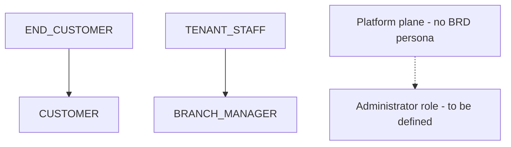
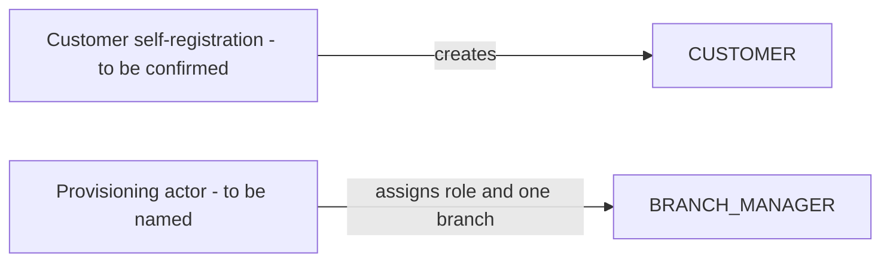
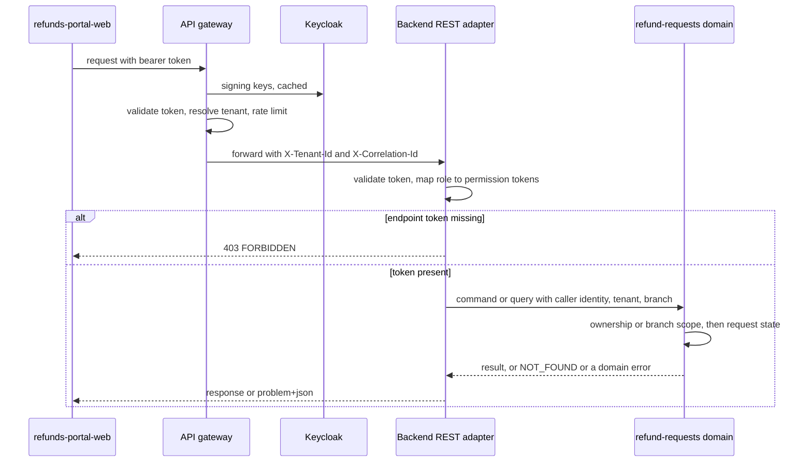

<!--
CHUNK: 12
TITLE: Centralized User Roles & Authorities (Platform-Wide)
PROJECT: Refunds Portal
VERSION: 1.0
DEPENDS_ON: 03, 07, 09 (+ per-service chunks 13a, 13b, 13c for per-service authorization notes)
PART OF: SDD - Refunds Portal
PURPOSE: Single platform-wide reference for user types, roles, sub-roles, and their authorities - who can do what, who can create whom, which modules each role touches, and how a role resolves to an allowed action at request time. Consolidates the BRD's Users & Use Cases Matrix and the per-module authorization notes into one canonical catalogue. Companion reference to the Centralized Event Hub (chunk 10).
CONSISTENCY_RULE: Role names, permission tokens, and per-service authorization notes in the 13x chunks MUST match this catalogue verbatim. Divergences are flagged here (see the drift register), never silently reconciled.
-->

# 16. Centralized User Roles & Authorities (Platform-Wide)

> **What this chunk is.** The one place that answers: what user types exist, which roles they break into, what each role is allowed to do, who may create whom, and which modules each role interacts with. The IAM configuration and the backend's authorization checks seed from this catalogue.

---

## 16.1 Business Overview

Users live inside one tenant, the retailer (ADR-04), in two tiers. End customers buy in branches and handle refunds for their own purchases; branch staff, in this release only branch managers, decide on the refunds of one branch. The split and its limits come from the personas and access levels of [BRD 04 § Personas / Actors](../brd-refunds-portal/04-scope-and-personas.md#personas--actors), the [BRD 07](../brd-refunds-portal/07-users-use-cases-matrix.md) matrix with its "own branch only" footnote, and NFR-04. The BRD defines no platform-operator or administrator persona (§16.4.3).

## 16.2 Resolution Model — How a Role Becomes an Allowed Action

1. **Identity.** Keycloak issues an access token carrying the subject, the tenant claim, the realm role, and, for staff, the branch claim (ADR-06). **[NEEDS CLARIFICATION: claim names for tenant and branch, and the source of the branch assignment (§3 assumption 6).]**
2. **Edge gate (API gateway).** Issuer, signature, and expiry; tenant resolved from the claim and forwarded as `X-Tenant-Id`; rate limits (R-05).
3. **Permission gate (backend inbound REST adapter).** The backend validates the token again, maps the role to its permission tokens through the static map of §16.11, and rejects a call whose endpoint token is missing with 403 `FORBIDDEN` (ADR-07).
4. **Contextual gates (refund-requests domain).** Tenant on every query; ownership for `CUSTOMER` (`customer_id` equals the token subject); branch scope for `BRANCH_MANAGER` (`branch_id` equals the token branch claim, and the `{branchId}` path parameter equals it too); state (only Submitted requests can be cancelled or decided). A resource outside ownership or branch scope returns 404 `NOT_FOUND`, so its existence is not disclosed (ADR-07).

| Gate | Enforcement point | Source |
|---|---|---|
| Authentication, tenant | API gateway, then backend | ADR-06, ADR-04 |
| Permission token | Backend inbound REST adapter | ADR-07, §16.11 |
| Ownership and branch scope | refund-requests domain | BRD 07 footnote 1, UC-02 rule, NFR-04 |
| Request state | `RefundRequest` aggregate | UC-03 and UC-04 preconditions |

## 16.3 User Types (Tier 1)

| User type | Tenancy plane | Identity source | Description |
|---|---|---|---|
| `END_CUSTOMER` | End-customer (inside the tenant) | Keycloak realm, customer accounts **[NEEDS CLARIFICATION: self-registration or a guest flow (§3 assumption 5)]** | Buyers who request refunds for their branch purchases (BRD 04 persona Customer) |
| `TENANT_STAFF` | Tenant | Keycloak realm, staff accounts **[NEEDS CLARIFICATION: local IAM accounts or federation with the retailer's directory]** | Retailer staff; in this release only branch managers (BRD 04 persona Branch Manager) |

## 16.4 Role Catalogue — Authorities & Related Services

### 16.4.1 END_CUSTOMER Roles

| Role | Scope | Core authorities | Related services |
|---|---|---|---|
| `CUSTOMER` | Own requests | Look up a receipt; submit a refund request; list and read own requests; cancel own Submitted requests | refund-requests |

### 16.4.2 TENANT_STAFF Sub-Roles

| Sub-role | Scope | Core authorities | Related services |
|---|---|---|---|
| `BRANCH_MANAGER` | Own branch | Read the branch queue and its requests; approve in full or in part, or reject; read the branch refund report | refund-requests |

`BRANCH_MANAGER` is the only staff role of this release.

### 16.4.3 Platform Plane (operator — outside tenant tenancy)

Not applicable for this release: the BRD defines no platform-operator persona. **[NEEDS CLARIFICATION: who administers tenants, branch-manager accounts, and branch assignments, and does that need a role in this catalogue (§16.6)?]**

## 16.5 Capability Matrix (canonical)

| Capability | `CUSTOMER` | `BRANCH_MANAGER` |
|---|---|---|
| Look up a receipt's refundable items (UC-01) | Yes | - |
| Submit a refund request (UC-01) | Yes | - |
| Track refund requests (UC-02) | Yes¹ | - |
| Cancel a Submitted request (UC-03) | Yes¹ | - |
| View the branch's refund requests (UC-04) | - | Yes² |
| Approve in full or in part, or reject (UC-04) | - | Yes² |
| Read the branch refund report (BRD 09) | - | Yes²³ |

¹ Own requests only (BRD 04 access level; UC-02 rule; NFR-04).
² Own branch only (BRD 07 footnote 1; NFR-04).
³ Derived from the audience of BRD 09; BRD 07 has no row for the report (§16.12.3 #1).

Being told about an escalated payout (UC-04 E1) is a message to the branch manager, not a capability; it needs no permission token.

## 16.6 Grant / Invitation Authority (who can create whom)

| Grantor role | May create / invite | Constraints |
|---|---|---|
| None (self-registration) | `CUSTOMER` | **[NEEDS CLARIFICATION: self-registration with verified email and mobile number, or another identity model (§3 assumption 5).]** |
| **[NEEDS CLARIFICATION: provisioning actor, for example Retail IT through the IAM console, or a tenant administrator role]** | `BRANCH_MANAGER` | Exactly one branch assignment per manager (§3 assumption 6) |

## 16.7 Role → Related-Services Matrix (platform-wide)

| Role | refund-requests | payouts | notifications |
|---|---|---|---|
| `CUSTOMER` | write (own requests) | -¹ | -² |
| `BRANCH_MANAGER` | write (decide, own branch) | -¹ | -² |

¹ No direct interaction; payouts acts on approved requests through events.
² No direct interaction; notifications sends messages to these users.

## 16.8 Lifecycle, Scope & Revocation Rules

1. **Grant.** A customer holds `CUSTOMER` from account creation (§16.6, open); a branch manager holds `BRANCH_MANAGER` and one branch assignment from provisioning (§16.6, open).
2. **Change.** A branch manager moved to another branch receives the new branch claim with the next token; access to the old branch ends when the current access token expires. **[NEEDS CLARIFICATION: access-token lifetime.]** Decisions already made stay attributed to their author in the status history.
3. **Suspension or revocation.** Disabling an account in the IAM stops new tokens, and existing tokens expire. In-flight work continues: Submitted requests of the branch stay in its queue for the next manager (R-06), and a committed approval still proceeds to payout, which does not depend on the approver's account.
4. **Erasure.** Erasing a customer removes the IAM account and the contact snapshot in refund-requests; refund records keep the IAM subject as a pseudonymous reference for their retention period. **[NEEDS CLARIFICATION: erasure policy (§17.1 Compliance).]**

## 16.9 Diagrams

### 16.9.1 Role Taxonomy (user types → roles → sub-roles)

**Figure 12: Role Taxonomy**

**Summary:** Each user type has one role in this release: customers hold `CUSTOMER` and branch staff hold `BRANCH_MANAGER`. The dotted branch marks the administrator role that no BRD persona defines yet (§16.4.3).

### 16.9.2 Grant / Invitation Authority (who may create whom)

**Figure 13: Grant Authority**

**Summary:** Customers obtain their role by registering, and branch managers are provisioned with their role and one branch by an actor the BRD does not name; both grant paths are open (§16.6).

### 16.9.3 Per-Request Authorization (how a role yields a decision)

**Figure 14: Per-Request Authorization**

**Summary:** The gateway authenticates and resolves the tenant, the backend adapter turns the role into permission tokens and checks the endpoint's token, and the domain applies ownership, branch scope, and state before acting. Each denial has one fixed answer: 403 for a missing token, 404 for an out-of-scope resource.

## 16.10 Traceability

| Capability / rule | Source (BRD UC / matrix row / ADR / 13x chunk) |
|---|---|
| Look up a receipt and submit (`refund-requests.receipt.read`, `refund-requests.refund-request.create`) | BRD 07 UC-01 row; UC-01; §17.1 |
| Track own requests (`refund-requests.refund-request.read`) | BRD 07 UC-02 row; UC-02 rule; §17.1 |
| Cancel own Submitted request (`refund-requests.refund-request.cancel`) | BRD 07 UC-03 row; UC-03 rule; §17.1 |
| Branch queue and decision (`refund-requests.branch-queue.read`, `refund-requests.refund-request.decide`) | BRD 07 UC-04 row and footnote 1; UC-04 rules; §17.1 |
| Branch report (`refund-requests.branch-report.read`) | BRD 09 audience; NFR-04; §17.1; §16.12.3 #1 |
| Own-requests gate | BRD 04 access level; UC-02 rule; NFR-04; ADR-07 |
| Own-branch gate | BRD 07 footnote 1; UC-04 rule; NFR-04; ADR-07 |
| 404 for out-of-scope resources | ADR-07 |

## 16.11 Permission × Role Matrix (platform-wide)

| Permission token | `CUSTOMER` | `BRANCH_MANAGER` |
|---|---|---|
| `refund-requests.receipt.read` | ✓ | - |
| `refund-requests.refund-request.create` | ✓ | - |
| `refund-requests.refund-request.read` | ✓¹ | - |
| `refund-requests.refund-request.cancel` | ✓¹ | - |
| `refund-requests.branch-queue.read` | - | ✓² |
| `refund-requests.refund-request.decide` | - | ✓² |
| `refund-requests.branch-report.read` | - | ✓² |

¹ Own requests only. ² Own branch only. `refund-requests.receipt.read` carries no ownership gate, because a receipt is not yet linked to a customer; R-05 covers the resulting exposure.

## 16.12 Implementation Seed & Reconciliation

### 16.12.1 Seed Strategy

The realm roles `CUSTOMER` and `BRANCH_MANAGER` are defined in the Keycloak realm configuration, versioned in the repository **[NEEDS CLARIFICATION: realm configuration tooling]**. The role-to-permission map is a static, versioned table in the backend code built from §16.11, with a test that fails when an endpoint declares a token that is not in the map. A change to §16.11 changes the map, its test, and this chunk together.

### 16.12.2 Per-Role Action Counts (drift baseline)

| Role | Seeded permission count |
|---|---|
| `CUSTOMER` | 4 |
| `BRANCH_MANAGER` | 3 |

### 16.12.3 Drift & Reconciliation Register

The authorization notes of §17.1 match §16.11 verbatim; §17.2 and §17.3 are called by no user role and check no permission token. The open items below are gaps against the BRD, not divergences between chunks.

| # | Where | Divergence | Resolution / flag |
|---|---|---|---|
| 1 | BRD 07 vs BRD 09 vs §16.11 | The branch report has no row in the BRD matrix; `refund-requests.branch-report.read` is derived from the audience of BRD 09 and the own-branch rule | Open: confirm the report's access rule in the BRD |
| 2 | BRD 04 and BRD 07 vs §16.6 | No persona or use case provisions branch managers or assigns their branch | Open: §16.4.3, §16.6 |
| 3 | BRD vs §16.6 | No use case covers customer registration or sign-in | Open: §3 assumption 5 |
| 4 | §16.11 | The token naming convention `<module>.<resource>.<action>` is a candidate | Open: confirm the naming convention |

<!-- MASTER: refunds-portal-sdd-master.md | PREV: 11-api-contracts.md | NEXT: 13a-service-refund-requests.md -->
