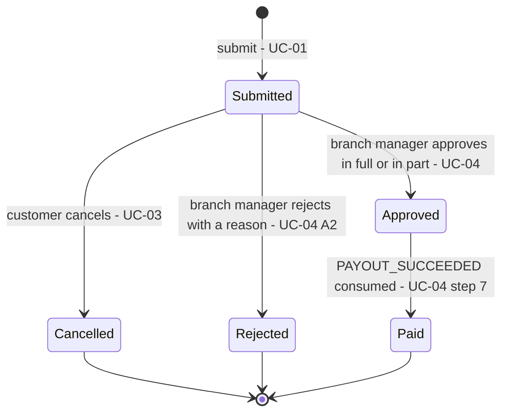
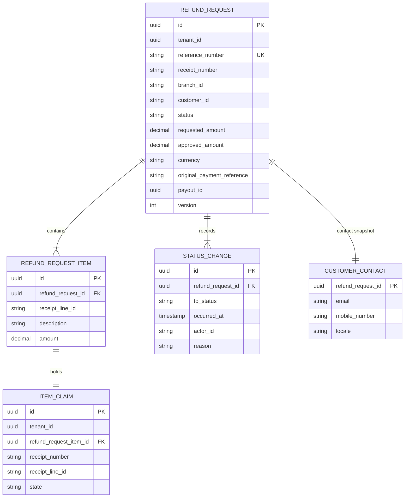
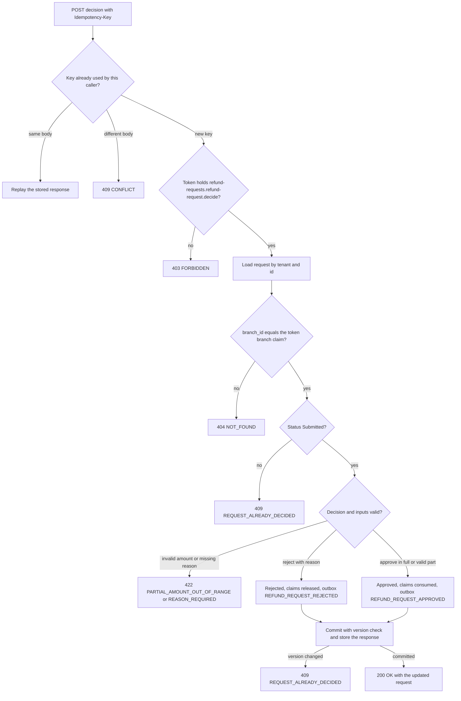
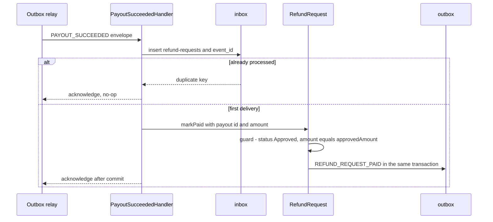

<!--
CHUNK: 13a
TITLE: Detailed Service Spec - Refund Requests (module)
PROJECT: Refunds Portal
VERSION: 1.0
DEPENDS_ON: 09, 07, 10 (event hub - topic names, event names, and payload contracts must match chunk 10 verbatim), 11 (API contracts - integration endpoints carry their API ID and match chunk 11 verbatim), 12 (roles - permission tokens match chunk 12 verbatim)
PART OF: SDD - Refunds Portal
-->

# 17. Detailed Service Specs

---

## 17.1 Refund Requests

### What

`refund-requests` is the module of `refunds-portal-backend` that is the system of record for refund requests. It checks a receipt's eligibility against the Point-of-Sale records, records the customer's request, enforces the lifecycle of [BRD 03 § Refund request lifecycle](../brd-refunds-portal/03-definitions-and-domain-concepts.md#refund-request-lifecycle), serves the customer's status views and the branch manager's decision queue, and produces the branch refund report of [BRD 09](../brd-refunds-portal/09-reporting-and-analytics.md). Bounded context: the refund request lifecycle and branch decisions.

### Boundaries

- **Owns:** the `RefundRequest` aggregate (items, status history, decision, paid record), item claims (the item-once registry), the customer contact snapshot, the reference-number sequence, the idempotency records of its client writes, and its outbox and inbox.
- **Does not own:** receipts and purchases (Point-of-Sale records, Retail IT); payouts and payout attempts (payouts, §17.2); message delivery and templates (notifications, §17.3); identities, roles, and branch assignments (IAM, §16).
- **Upstream consumers:** the customer and branch-manager areas of `refunds-portal-web` through the gateway; notifications through the in-process port API-02; payouts and notifications consume its events (§14.5.1).
- **Downstream dependencies:** Point-of-Sale Records (API-01); payouts events (`PAYOUT_SUCCEEDED`).

### Input

| Type | Source | Description |
|------|--------|-------------|
| REST | Customer area, through the gateway | Receipt lookup, submission, list, detail with history, cancellation (UC-01, UC-02, UC-03) |
| REST | Branch-manager area, through the gateway | Branch queue, request detail, decision, branch report (UC-04, BRD 09) |
| Event | payouts: `PAYOUT_SUCCEEDED` | Marks an Approved request Paid (UC-04 step 7) |
| In-process port | notifications: API-02 | Contact lookup for a refund request's messages |
| Schedule | Retention job | Deletes or anonymises rows past their retention period (periods open in § Retention Policy) |

### Business Logic

**Responsibility:** turn the BRD lifecycle into an aggregate whose transitions are the only way to change a request, with every transition, its history row, and its event committed in one transaction.

**Commands** (behavioural steps are owned by the cited UC; this is the technical realisation):

- **Look up refundable items** (UC-01 steps 1-2). Calls `PurchaseRecordsPort.findReceipt(tenantId, receiptNumber)` (adapter: API-01) outside any transaction and maps the answer to a `Receipt` value object (receipt number, branch id, purchase timestamp, lines with line id, description, and `Money` amount). Not found → `RECEIPT_NOT_FOUND` (UC-01 E2). Purchase outside the refund window → `REFUND_WINDOW_EXPIRED` (UC-01 E1). Each line is returned with `selectable = false` when an active or consumed item claim exists for it (UC-01 A1).
- **Submit** (UC-01 steps 3-6). Requires an `Idempotency-Key`. Looks the receipt up again (the client never supplies amounts or eligibility), re-checks the window and the claims, and computes `requestedAmount` as the sum of the selected lines. Then, in one transaction: creates the `RefundRequest` (UUIDv7 id, reference number, status Submitted, branch from the receipt, customer from the token subject), inserts one item claim per selected line (state `ACTIVE`; the unique constraint turns a concurrent claim into `ITEM_ALREADY_REFUNDED`), stores the contact snapshot, appends the status-history row, writes `REFUND_REQUEST_SUBMITTED` to the outbox, and stores the idempotent response.
- **Cancel** (UC-03). Owner gate (`customer_id` equals the token subject); transition Submitted → Cancelled, else `REQUEST_NOT_CANCELLABLE` (UC-03 E1); claims move to `RELEASED`; history row; outbox `REFUND_REQUEST_CANCELLED`. The optimistic-lock check on `version` resolves a race with a decision (Figure 9).
- **Decide** (UC-04). Branch gate (`branch_id` equals the token branch claim) and state gate (Submitted, else `REQUEST_ALREADY_DECIDED`).
  - *Approve in full:* no amount, or an amount equal to `requestedAmount`.
  - *Approve in part* (UC-04 A1): an amount greater than zero and less than `requestedAmount`, with a reason; otherwise `PARTIAL_AMOUNT_OUT_OF_RANGE` or `REASON_REQUIRED`.
  - Both approvals: status Approved with `approvedAmount`; claims move to `CONSUMED`; history row with the partial reason when present; outbox `REFUND_REQUEST_APPROVED`, which carries the original payment reference captured from the receipt.
  - *Reject* (UC-04 A2): a reason is required (`REASON_REQUIRED`); status Rejected; claims move to `RELEASED`; history row with the reason; outbox `REFUND_REQUEST_REJECTED`.
- **Mark Paid** (UC-04 step 7), on `PAYOUT_SUCCEEDED`: inbox deduplication; the request must be Approved and the paid amount must equal `approvedAmount`; status Paid with `payout_id`; history row; outbox `REFUND_REQUEST_PAID`.

**Queries:**

- **Own requests** (UC-02 steps 1-2): the caller's requests with reference number, amount, and status, newest first, paginated.
- **Own request detail** (UC-02 steps 3-4): the request with its status history (each change with its UTC timestamp) and the rejection reason when rejected.
- **Branch queue** (UC-04 steps 1-2): Submitted requests of the caller's branch, oldest first, with amount and reason, paginated.
- **Branch request detail** (UC-04 step 3): one request of the caller's branch.
- **Branch refund report** (BRD 09): for one branch and one day, the count of requests per status, the amounts paid, and the average time from submission to decision (Approved or Rejected), computed from this module's tables. **[NEEDS CLARIFICATION: report day boundary (branch local day or UTC day), whether "requests per status" counts current statuses or transitions during the day, and whether the report is only on screen or also delivered by email.]**

**Cross-cutting participation:** tenant filter on every query and write (ADR-04); `Idempotency-Key` on every client write; the status history is the audit trail of every decision (actor, time, reason); outbox for every event (ADR-02).

**State machine:**

**Figure 15: Refund Request State Machine**

**Summary:** The five statuses of UC-02 are the aggregate's states; only Submitted accepts a customer or branch-manager action, and only a successful payout moves Approved to Paid. A failing payout leaves the request Approved (UC-04 E1); there is no transition out of Approved other than Paid in this release (R-07).

### Output

| Type | Destination | Description |
|------|-------------|-------------|
| REST response | `refunds-portal-web` | Refundable items, created request with reference number, request lists and details with history, branch queue, decision result, branch report |
| Event | payouts, notifications | Lifecycle events on `refunds-portal-refund-requests-events` (§14.5.1) |
| In-process port response | notifications | `CustomerContact` for a refund request (API-02) |

### Integrations

| Integration | Direction | Protocol | Purpose | Contract | Failure Handling |
|-------------|-----------|----------|---------|----------|------------------|
| Point-of-Sale Records | Outbound, Sync | HTTPS (`TBD - external`) | Receipt lookup at UC-01 step 2 and again at submission | API-01 (§15) | Timeout, one retry on timeout or 503, circuit breaker; `PURCHASE_RECORDS_UNAVAILABLE` to the user (§12 INT-03) |
| notifications | Inbound, Sync (in-process) | Java port | Contact lookup for messages | API-02 (§15) | Read-only; `NOT_FOUND` for an unknown request |
| payouts | Outbound, Async | Domain event | Start the payout of an approved request | `REFUND_REQUEST_APPROVED` (§14) | Outbox retry with backoff, then dead-letter and alarm |
| payouts | Inbound, Async | Domain event | Mark a request Paid | `PAYOUT_SUCCEEDED` (§14) | Inbox deduplication; an invalid transition is retried, then dead-lettered with an alarm |
| notifications | Outbound, Async | Domain event | Customer messages | `REFUND_REQUEST_SUBMITTED`, `REFUND_REQUEST_CANCELLED`, `REFUND_REQUEST_REJECTED`, `REFUND_REQUEST_PAID` (§14) | Outbox retry with backoff, then dead-letter and alarm |

### DB Modeling

#### Entity Relationship

**Figure 16: Refund Requests Conceptual ERD**

**Summary:** A refund request contains the receipt lines the customer selected, records every status change with actor, time, and reason, and keeps one contact snapshot; each selected line holds one item claim that enforces the item-once rule across requests. The model is conceptual, derived from the BRD's concepts; the physical design is open below.

#### Tables Design

**[NEEDS CLARIFICATION: full physical table design (column types, nullability, check constraints, indexes). The BRD describes the concepts but does not commit to a relational schema. The rows below are the candidate tables and the constraints that enforce BRD rules.]**

| Table | Column | Type | Constraints | Notes |
|-------|--------|------|-------------|-------|
| `refund_request` | `tenant_id`, `reference_number` | - | `uk_refund_request_reference` unique | Reference number shown to the customer (UC-01 step 6); format **[NEEDS CLARIFICATION: reference number format]** |
| `refund_request` | `version` | - | Optimistic lock | Guards concurrent cancel and decide (Figure 9) |
| `refund_request` | `approved_amount` | - | Check: greater than 0 and not greater than `requested_amount` | UC-04 rules |
| `refund_request_item` | `refund_request_id` | - | FK to `refund_request` | Lines selected in UC-01 step 3 |
| `status_change` | `refund_request_id`, `occurred_at` | - | FK to `refund_request`; index | History of UC-02 step 4 |
| `item_claim` | `tenant_id`, `receipt_number`, `receipt_line_id` | - | Partial unique index where `state` is `ACTIVE` or `CONSUMED` | Item-once rule (UC-01) |
| `customer_contact` | `refund_request_id` | - | PK and FK to `refund_request` | PII (§ Data Encryption) |
| `idempotency_record` | `tenant_id`, `caller_id`, `idempotency_key` | - | Unique | Stored response for replays |
| `outbox_publication` | `tenant_id`, `event_id`, `subscriber` | - | Unique | One publication per event and subscribing module (§14.2) |
| `inbox` | `consumer`, `event_id` | - | Unique | Processed `PAYOUT_SUCCEEDED` events |

#### Migration Strategy

- **Tool:** Flyway, versioned SQL files in this module's own migration stream, schema `refund_requests` (§11.1).
- **Backward compatibility:** additive changes; breaking changes by expand-contract across two releases, so the previous application version runs on the new schema.
- **Data backfill:** an idempotent, batched job per tenant for any new column that needs values on existing rows.
- **Rollback:** roll the application back to the previous version, which stays compatible with the expanded schema; a failed migration is fixed forward with a new version.

#### Retention Policy

- `refund_request`, `refund_request_item`, `status_change`: **[NEEDS CLARIFICATION: retention period for refund records (financial record-keeping rules of the retailer's jurisdiction).]**
- `customer_contact`: **[NEEDS CLARIFICATION: retention period for contact data after the request is closed (Paid, Rejected, or Cancelled).]**
- `item_claim`: kept as long as the receipt can still be refunded or its request is retained, whichever is longer.
- `idempotency_record`, `outbox_publication`, `inbox`: **[NEEDS CLARIFICATION: retention windows for replay and redrive.]**

#### Archival

- **Cold storage:** **[NEEDS CLARIFICATION: archival destination, format, schedule, and restore SLA; the BRD states no archival requirement.]**
- **Format:** see above.
- **Schedule:** see above.
- **Restore SLA:** see above.

#### Data Encryption

- **At rest:** **[NEEDS CLARIFICATION: storage-level encryption only, or column-level encryption for `customer_contact`?]**
- **In transit:** TLS per §11.6.
- **Key management:** keys in the secrets manager or a key service of the chosen hosting (§6).
- **PII columns:** `customer_contact.email`, `customer_contact.mobile_number`; the free-text `reason` columns may contain personal data. All are masked in non-production environments and never logged (§11.4).

### Multi-Tenancy Specifications

- **Strategy override:** none (ADR-04).
- **Tenant filter:** every query and write filters by `tenant_id`; in addition, customer operations filter by `customer_id` and branch-manager operations by `branch_id` (§16.2).
- **Cross-tenant queries:** none; the branch report is per tenant and branch.

### API Standards

- **Style:** REST with JSON (ADR-05).
- **Versioning:** URI prefix `/v1`.
- **Authentication:** OIDC bearer JWT, validated by the gateway and by the backend (ADR-06).
- **Idempotency:** `Idempotency-Key` required on every `POST`; the key is stored per tenant and caller with the response; a replay returns the stored response and a reused key with a different body returns `CONFLICT`. **[NEEDS CLARIFICATION: idempotency record retention window.]**
- **Pagination:** server-side `page`, `size`, and `sort` on list endpoints; the branch queue defaults to oldest first (UC-04 step 2).
- **Error envelope:** RFC 9457 Problem Details with `errorCode` (§11.7).

#### List of APIs (Swagger-friendly)

**[NEEDS CLARIFICATION: request and response schemas (OpenAPI) for these candidate endpoints; the UCs imply the operations but not the payload shapes.]**

| Method | Path | Summary | Request Body | Response | Auth Scope | API ID (§15) |
|--------|------|---------|--------------|----------|------------|--------------|
| GET | `/v1/receipts/{receiptNumber}/refundable-items` | Receipt lines with a selectable flag (UC-01 steps 1-2) | - | `RefundableItemsView` | `refund-requests.receipt.read` | - |
| POST | `/v1/refund-requests` | Submit a refund request (UC-01 steps 3-6) | `SubmitRefundRequest` | `RefundRequestView` (201) | `refund-requests.refund-request.create` | - |
| GET | `/v1/refund-requests` | Own requests (UC-02 steps 1-2) | - | `RefundRequestPage` | `refund-requests.refund-request.read` | - |
| GET | `/v1/refund-requests/{refundRequestId}` | Own request with history (UC-02 steps 3-4) | - | `RefundRequestDetailView` | `refund-requests.refund-request.read` | - |
| POST | `/v1/refund-requests/{refundRequestId}/cancellation` | Cancel a Submitted request (UC-03) | - | `RefundRequestView` | `refund-requests.refund-request.cancel` | - |
| GET | `/v1/branches/{branchId}/refund-requests` | Branch queue, Submitted by default, oldest first (UC-04 steps 1-2) | - | `RefundRequestPage` | `refund-requests.branch-queue.read` | - |
| GET | `/v1/branches/{branchId}/refund-requests/{refundRequestId}` | One request of the branch (UC-04 step 3) | - | `RefundRequestDetailView` | `refund-requests.branch-queue.read` | - |
| POST | `/v1/branches/{branchId}/refund-requests/{refundRequestId}/decision` | Approve in full or in part, or reject (UC-04) | `RefundDecision` | `RefundRequestView` | `refund-requests.refund-request.decide` | - |
| GET | `/v1/branches/{branchId}/refund-report` | Branch refund report for a day (BRD 09) | - | `BranchRefundReport` | `refund-requests.branch-report.read` | - |

**In-process port provided to other modules:** `CustomerContactQuery.findContact` (API-02, §15.3). It is not exposed over HTTP.

### Event-Driven Architecture (If Applicable)

#### Event Model

**Published events:**

| Event Name | Producer | Producer Specs | Consumers | Consumer Specs | Schema (Summary) | Delivery Guarantee |
|------------|----------|----------------|-----------|----------------|------------------|---------------------|
| `REFUND_REQUEST_SUBMITTED` | refund-requests | Topic `refunds-portal-refund-requests-events`; key `tenant_id` + `aggregate_id`; outbox publication per subscriber | notifications | Inbox `(notifications, event_id)` | `referenceNumber`, `branchId`, `customerId`, `receiptNumber`, `requestedAmount`, `items`, `reason` (§14.9.1) | At-least-once delivery, exactly-once effect |
| `REFUND_REQUEST_CANCELLED` | refund-requests | Topic `refunds-portal-refund-requests-events`; key `tenant_id` + `aggregate_id` | notifications | Inbox `(notifications, event_id)` | `referenceNumber`, `branchId`, `customerId` (§14.9.2) | At-least-once delivery, exactly-once effect |
| `REFUND_REQUEST_APPROVED` | refund-requests | Topic `refunds-portal-refund-requests-events`; key `tenant_id` + `aggregate_id` | payouts | Inbox `(payouts, event_id)`; payout unique per refund request | `referenceNumber`, `branchId`, `customerId`, `receiptNumber`, `requestedAmount`, `approvedAmount`, `partial`, `partialReason`, `decidedBy`, `originalPaymentReference` (§14.9.3) | At-least-once delivery, exactly-once effect |
| `REFUND_REQUEST_REJECTED` | refund-requests | Topic `refunds-portal-refund-requests-events`; key `tenant_id` + `aggregate_id` | notifications | Inbox `(notifications, event_id)` | `referenceNumber`, `branchId`, `customerId`, `rejectionReason`, `decidedBy` (§14.9.4) | At-least-once delivery, exactly-once effect |
| `REFUND_REQUEST_PAID` | refund-requests | Topic `refunds-portal-refund-requests-events`; key `tenant_id` + `aggregate_id` | notifications | Inbox `(notifications, event_id)` | `referenceNumber`, `branchId`, `customerId`, `paidAmount`, `payoutId` (§14.9.5) | At-least-once delivery, exactly-once effect |

**Consumed events:**

| Event Name | Producer (owning service) | Topic | Effect in this service | Idempotency / ordering |
|------------|---------------------------|-------|------------------------|------------------------|
| `PAYOUT_SUCCEEDED` | payouts | `refunds-portal-payouts-events` | Marks the request identified by `refundRequestId` Paid when `amount` equals `approvedAmount`, stores the envelope `aggregate_id` as `payout_id`, publishes `REFUND_REQUEST_PAID` | Inbox `(refund-requests, event_id)`; the Approved → Paid state guard makes a repeated fact a no-op |

**[NEEDS CLARIFICATION: ratify the candidate event names and payload contracts of §14.5.1 and §14.9 (status `candidate`).]**

#### Messaging Infra

- **Broker:** not applicable; the outbox relay delivers in-process (ADR-02, §14.2).
- **Schema registry:** not applicable while events stay in-process; payload schemas are JSON Schema files versioned in the repository, additive-only checked in CI (§14.6).
- **Serialization:** JSON.
- **Topic strategy:** logical topic `refunds-portal-refund-requests-events` (§14.4), key `tenant_id` + `aggregate_id`.
- **Retention:** outbox publications per § Retention Policy; they also serve as the event archive (§14.2).
- **DLQ strategy:** a publication that exhausts its retries is dead-lettered in `outbox_publication` with an alarm and redriven by runbook (§14.6, §20).

### Constraints

- A refund can be requested only within the refund window of the purchase ([BRD 02 § Glossary](../brd-refunds-portal/02-glossary-assumptions-facts.md#glossary); UC-01 rules). **[NEEDS CLARIFICATION: window boundary: calendar days in the branch's local time zone, or elapsed time from the purchase timestamp in UTC?]**
- A receipt line is held by at most one Submitted or Approved request (UC-01 rule "an item can be refunded only once"). **[NEEDS CLARIFICATION: confirm that lines of a Rejected or Cancelled request are released and can be requested again, and how multi-unit lines are handled (whole line or per unit).]**
- The reason given at submission (UC-01 step 3) **[NEEDS CLARIFICATION: free text, or a fixed list of reasons?]**
- Amounts are computed by the backend from the receipt lines; the client never supplies them.
- Only Submitted requests can be cancelled (UC-03 rule) or decided (UC-04 precondition).
- A partial amount is greater than zero and less than the requested amount, with a reason; a rejection always has a reason (UC-04 rules).
- **Authorization notes (tokens verbatim from §16.11):** `CUSTOMER` holds `refund-requests.receipt.read`, `refund-requests.refund-request.create`, `refund-requests.refund-request.read`, and `refund-requests.refund-request.cancel`, each limited to own requests ([BRD 07](../brd-refunds-portal/07-users-use-cases-matrix.md) UC-01 to UC-03; UC-02 rule; NFR-04). `BRANCH_MANAGER` holds `refund-requests.branch-queue.read`, `refund-requests.refund-request.decide`, and `refund-requests.branch-report.read`, each limited to the own branch (BRD 07 UC-04 footnote 1; BRD 09; NFR-04). The `{branchId}` path parameter must equal the token branch claim.

### Error Handling

- **Synchronous APIs:** RFC 9457 Problem Details (§11.7). Domain codes of this module:

| HTTP status | `errorCode` | When | Retryable |
|-------------|-------------|------|-----------|
| 404 | `RECEIPT_NOT_FOUND` | The Point-of-Sale records have no such receipt (UC-01 E2) | No |
| 422 | `REFUND_WINDOW_EXPIRED` | The purchase is outside the refund window (UC-01 E1) | No |
| 409 | `ITEM_ALREADY_REFUNDED` | A selected line was claimed by another request meanwhile (UC-01 A1) | No |
| 409 | `REQUEST_NOT_CANCELLABLE` | The request is no longer Submitted (UC-03 E1) | No |
| 409 | `REQUEST_ALREADY_DECIDED` | The request is no longer Submitted when a decision arrives | No |
| 422 | `PARTIAL_AMOUNT_OUT_OF_RANGE` | A partial amount is not greater than zero and less than the requested amount (UC-04 rule) | No |
| 422 | `REASON_REQUIRED` | A rejection or a partial approval has no reason (UC-04 rules) | No |
| 503 | `PURCHASE_RECORDS_UNAVAILABLE` | API-01 timed out, failed, or its circuit breaker is open (R-04) | Yes, after a pause |

- **Validation errors:** 400 `VALIDATION_FAILED` with `errors[]` per field (for example no line selected).
- **Domain errors:** 409 and 422 as above; the SPA shows the mapped message and never retries automatically.
- **Auth errors:** 401 `UNAUTHENTICATED`; 403 `FORBIDDEN` when the permission token is missing; a request outside the caller's ownership or branch returns 404 `NOT_FOUND` (ADR-07).
- **Server errors:** 500 `INTERNAL_ERROR` with `correlationId`; no stack traces or provider messages in the body.
- **Async consumers:** the `PAYOUT_SUCCEEDED` handler is idempotent through the inbox; a request that is not Approved, or a paid amount that differs from `approvedAmount`, is retried with backoff and then dead-lettered with an alarm, never applied.
- **Poison messages:** a payload that cannot be deserialised is dead-lettered at once with an alarm and redriven by runbook (§20).

### Observability & Monitoring

#### Logging

- JSON per §11.4 with `module` = `refund-requests`.
- Business events logged at INFO with the reference number and status only: submission, cancellation, decision, paid.
- No contact data, reasons, or `tenant_id` at INFO; retention per §6.

#### Metrics

**[NEEDS CLARIFICATION: confirm the module metrics below and their SLO thresholds (§18).]**

| Metric | Type | Labels | Purpose |
|--------|------|--------|---------|
| `refund_requests_submitted_total` | counter | `outcome` | Submission volume and seasonal peaks (NFR-03) |
| `refund_requests_decided_total` | counter | `decision` (`approved_full`, `approved_partial`, `rejected`) | Decision mix |
| `refund_request_time_to_decision_seconds` | histogram | - | Time from Submitted to decision; BRD 09 KPI |
| `refund_request_time_to_paid_seconds` | histogram | - | Time from Submitted to Paid; BRD 01 objective 1 |
| `refund_requests_approved_unpaid` | gauge | - | Approved requests waiting for payout (R-07) |
| `receipt_lookup_duration_seconds` | histogram | `outcome` | API-01 latency and failures (R-04) |

#### Tracing

- OpenTelemetry server spans for every REST call and a client span for every API-01 call.
- The trace context is stored with each outbox publication, so consumers' spans join the originating trace (§11.4).
- Sampling per §6.

### Developer Notes

- **Recommended patterns:** `RefundRequest` as the aggregate root with one method per transition that returns the domain event; application services own the transaction boundary; the API-01 call happens before the transaction opens; optimistic locking through `version`; a module-local outbox publisher port; `Money` value object for every amount; `CustomerContactQuery` in the module's published API package.
- **Avoid:** calling API-01 inside a database transaction; accepting amounts or eligibility from the client; reading another module's schema; putting contact data in events or logs; exposing internal ids in customer messages (use the reference number).
- **Testing:** JUnit 5 and Mockito unit tests for every transition and rule; Testcontainers PostgreSQL integration tests for item-claim uniqueness, optimistic locking, idempotent replays, and outbox atomicity; contract tests for API-01 against a stub built from the Retail IT documentation once supplied; Playwright end-to-end tests for UC-01 to UC-04. Test names follow `methodName_scenario_expectedResult`.

### Service-Level Diagrams

#### Implementation Flow Chart

**Figure 17: Refund Requests - Decision Flow (UC-04)**

**Summary:** A decision passes the idempotency, permission, branch, state, and input checks in that order, then commits the transition, the claim change, and the event together under the optimistic lock. A concurrent change surfaces as a conflict, never as a lost update.

#### Sequence Diagram (Service-Internal)

**Figure 18: Refund Requests - Handling PAYOUT_SUCCEEDED**

**Summary:** The inbox insert and the state change share one transaction, so a redelivered event is a no-op and a first delivery moves the request to Paid and publishes the customer-facing fact atomically. A failed guard rolls back and the relay retries, then dead-letters.

### Compliance

- **GDPR:** **[NEEDS CLARIFICATION: the applicable data-protection regime; lawful basis for the contact snapshot (performance of the refund); retention after closure; erasure flow that removes contact data while keeping the refund record.]**
- **PCI-DSS:** the module stores no card data. **[NEEDS CLARIFICATION: confirm that the original payment reference is an opaque provider reference and not cardholder data.]**
- **ISO 27001 / SOC 2:** **[NEEDS CLARIFICATION: applicable control framework.]**
- **Local regulations:** **[NEEDS CLARIFICATION: consumer-refund and financial record-keeping rules in the retailer's jurisdiction.]**

### Deployment Strategy

- **Service-specific override:** none; the module ships in `refunds-portal-backend` (ADR-09, §11.3).
- **Replicas:** those of the deployable (§11.3).
- **Strategy:** rolling update of the deployable.
- **Health checks:** the module contributes to readiness through its database connectivity only; the Point-of-Sale adapter's state never fails readiness, so an API-01 outage cannot take every replica out of service.
- **Rollback:** the deployable's rollback (§11.3); migrations stay backward compatible.

### Future Enhancements

- Bulk approval of small refunds (UC-04 Future Enhancements).
- Extraction into a separate service when an ADR-01 trigger fires; the logical topic and API-02 keep their names.

<!-- MASTER: refunds-portal-sdd-master.md | PREV: 12-centralized-user-roles.md | NEXT: 13b-service-payouts.md -->
