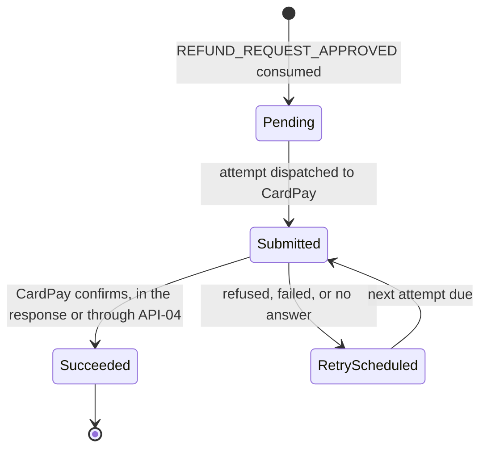
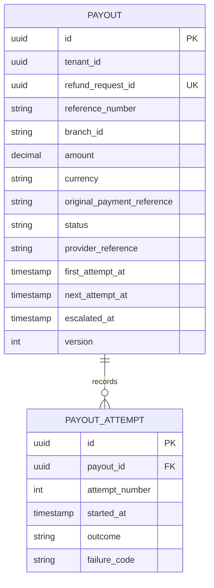
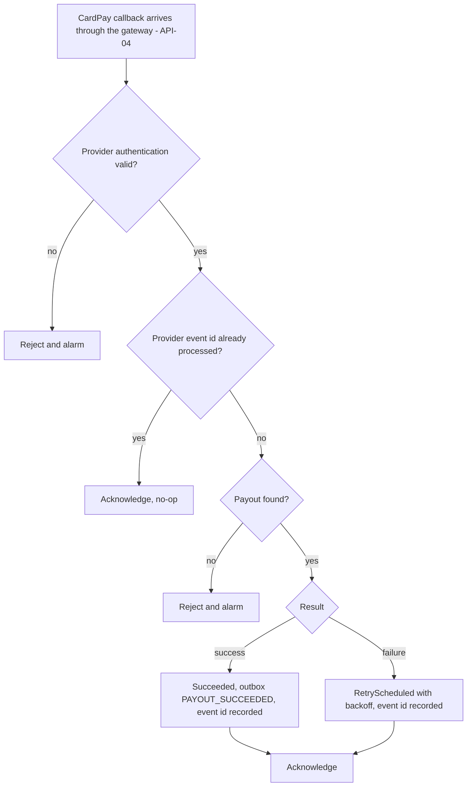
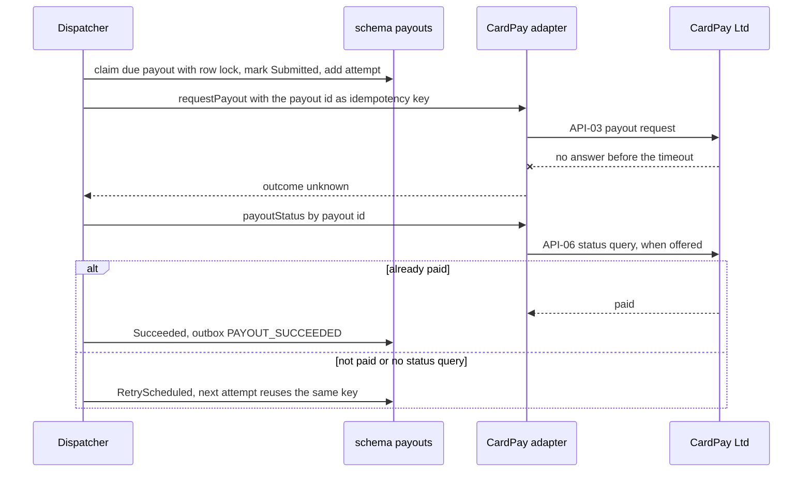

<!--
CHUNK: 13b
TITLE: Detailed Service Spec - Payouts (module)
PROJECT: Refunds Portal
VERSION: 1.0
DEPENDS_ON: 09, 07, 10 (event hub - topic names, event names, and payload contracts must match chunk 10 verbatim), 11 (API contracts - integration endpoints carry their API ID and match chunk 11 verbatim), 12 (roles - permission tokens match chunk 12 verbatim)
PART OF: SDD - Refunds Portal
-->

# 17. Detailed Service Specs

---

## 17.2 Payouts

### What

`payouts` is the module of `refunds-portal-backend` that pays each approved refund back to the original card through CardPay exactly once (NFR-01), retries failed attempts, and escalates a payout that still fails when the escalation window of UC-04 E1 passes. Bounded context: payout execution.

### Boundaries

- **Owns:** the `Payout` aggregate (one per approved refund request), its attempt log, the provider references, the processed-callback register, and its outbox and inbox.
- **Does not own:** the refund request and its status (refund-requests, §17.1); card data (CardPay; this module holds only the opaque original payment reference); messages (notifications, §17.3).
- **Upstream consumers:** refund-requests, through `REFUND_REQUEST_APPROVED`; CardPay, through result callbacks (API-04) that enter through the gateway.
- **Downstream dependencies:** CardPay (API-03, and API-06 when CardPay offers a status query); its events are consumed by refund-requests and notifications (§14.5.2).

### Input

| Type | Source | Description |
|------|--------|-------------|
| Event | refund-requests: `REFUND_REQUEST_APPROVED` | Creates the payout for an approved request |
| REST (inbound callback) | CardPay through the gateway: API-04 | Payout result, when CardPay reports results asynchronously |
| Schedule | Payout dispatcher | Claims due payouts (Pending, or RetryScheduled with a due next attempt) and sends them |
| Schedule | Escalation check | Finds payouts past the escalation window that are not Succeeded and not yet escalated |

### Business Logic

**Responsibility:** guarantee that an approved refund produces exactly one successful payout to the original card, or a visible escalation, never a lost or a doubled payout.

- **Create** (on `REFUND_REQUEST_APPROVED`, UC-04 step 6). Inbox deduplication, then in one transaction: a `Payout` with status Pending, `amount` = `approvedAmount`, the `originalPaymentReference`, `referenceNumber`, `branchId`, and `refundRequestId` (the event's `aggregate_id`), due now. The unique key `(tenant_id, refund_request_id)` makes a second payout for the same request impossible (ADR-08).
- **Dispatch** (scheduler, per tenant). Claims due payouts with row locking so two replicas never take the same payout, marks each Submitted and records a new attempt, commits, and only then calls API-03 with the payout id as the idempotency key, outside any transaction. The outcome is recorded in a new transaction:
  - *Confirmed:* Succeeded, provider reference stored, outbox `PAYOUT_SUCCEEDED`.
  - *Accepted, result later:* stays Submitted until API-04 delivers the result; no callback within the callback timeout counts as no answer **[NEEDS CLARIFICATION: callback timeout; depends on CardPay's result model]**.
  - *Refused, failed, or no answer:* RetryScheduled, next attempt after exponential backoff with jitter **[NEEDS CLARIFICATION: retry schedule]**. After a timeout, the next attempt first asks CardPay for the status by payout id (API-06) when CardPay offers that query (ADR-08, R-03).
  - *Permanent refusal* (for example a closed card): **[NEEDS CLARIFICATION: escalate at once, or keep retrying until the escalation window as UC-04 E1 states? The provider error mapping is `TBD - external`.]**
- **Receive result** (API-04). Authenticated with CardPay's scheme, deduplicated on the provider's event id, matched to the payout, then the same transition as a synchronous outcome.
- **Escalate** (UC-04 E1). When the escalation window (tenant configuration, launch value from UC-04 E1, §11.5) has passed since the first attempt and the payout is not Succeeded and not yet escalated: set `escalated_at` and write `PAYOUT_ESCALATED` to the outbox, once. Retries continue. **[NEEDS CLARIFICATION: is "one day" 24 hours from the first attempt or one business day; do retries stop at some point, and is there a terminal failed state (R-07)?]**

**Cross-cutting participation:** tenant context per payout (per-tenant CardPay credentials); idempotency on the event (inbox), the callback (provider event id), and the provider write (payout id); outbox for every event; bulkhead and circuit breaker around the CardPay adapter.

**State machine:**

**Figure 19: Payout State Machine**

**Summary:** A payout moves between Submitted and RetryScheduled until CardPay confirms it; Succeeded is the only terminal state in this release. Escalation is a one-time mark (`escalated_at`) with its event, not a state, so retries continue after it; a terminal failure state is open (R-07).

### Output

| Type | Destination | Description |
|------|-------------|-------------|
| REST call | CardPay | Payout requests (API-03) and status queries (API-06, when offered) |
| REST response | CardPay | Acknowledgements of result callbacks (API-04) |
| Event | refund-requests | `PAYOUT_SUCCEEDED` on `refunds-portal-payouts-events` (§14.5.2) |
| Event | notifications | `PAYOUT_ESCALATED` on `refunds-portal-payouts-events` (§14.5.2) |

### Integrations

| Integration | Direction | Protocol | Purpose | Contract | Failure Handling |
|-------------|-----------|----------|---------|----------|------------------|
| CardPay Ltd | Outbound, Sync | HTTPS (`TBD - external`) | Payout request | API-03 (§15) | Timeout; retries with backoff and jitter under the same key; circuit breaker; bulkhead; escalation (§12 INT-01) |
| CardPay Ltd | Outbound, Sync | HTTPS (`TBD - external`) | Payout status query by payout id, when CardPay offers one | API-06 (§15) | Timeout and circuit breaker shared with API-03; an unavailable status query falls back to a retry with the same key |
| CardPay Ltd | Inbound, Sync | HTTPS callback (`TBD - external`) | Payout result | API-04 (§15) | Authenticated; idempotent on the provider event id; an unknown payout is rejected and alarmed |
| refund-requests | Inbound, Async | Domain event | Start the payout | `REFUND_REQUEST_APPROVED` (§14) | Inbox deduplication; unique payout per refund request |
| refund-requests | Outbound, Async | Domain event | Mark the request Paid | `PAYOUT_SUCCEEDED` (§14) | Outbox retry with backoff, then dead-letter and alarm |
| notifications | Outbound, Async | Domain event | Tell the branch manager | `PAYOUT_ESCALATED` (§14) | Outbox retry with backoff, then dead-letter and alarm |

### DB Modeling

#### Entity Relationship

**Figure 20: Payouts Conceptual ERD**

**Summary:** One payout per approved refund request, with its schedule and escalation mark, and one attempt row per call to CardPay with its outcome. The model is conceptual; the physical design is open below.

#### Tables Design

**[NEEDS CLARIFICATION: full physical table design (column types, nullability, check constraints, indexes). The rows below are the candidate tables and the constraints that enforce NFR-01 and UC-04 E1.]**

| Table | Column | Type | Constraints | Notes |
|-------|--------|------|-------------|-------|
| `payout` | `tenant_id`, `refund_request_id` | - | Unique | One payout per approved request (ADR-08) |
| `payout` | `tenant_id`, `status`, `next_attempt_at` | - | Index | Dispatcher claim query |
| `payout` | `version` | - | Optimistic lock | Guards a callback racing a dispatcher outcome |
| `payout_attempt` | `payout_id` | - | FK to `payout` | Attempt history |
| `provider_callback` | `tenant_id`, `provider_event_id` | - | Unique | API-04 deduplication; the provider event id field is `TBD - external` |
| `outbox_publication` | `tenant_id`, `event_id`, `subscriber` | - | Unique | One publication per event and subscribing module (§14.2) |
| `inbox` | `consumer`, `event_id` | - | Unique | Processed `REFUND_REQUEST_APPROVED` events |

#### Migration Strategy

- **Tool:** Flyway, versioned SQL files in this module's own migration stream, schema `payouts` (§11.1).
- **Backward compatibility:** additive changes; expand-contract for breaking changes.
- **Data backfill:** idempotent, batched job per tenant.
- **Rollback:** application rollback to the previous, schema-compatible version; failed migrations fixed forward.

#### Retention Policy

- `payout`, `payout_attempt`: **[NEEDS CLARIFICATION: retention period for payout records (financial record-keeping rules).]**
- `provider_callback`, `outbox_publication`, `inbox`: **[NEEDS CLARIFICATION: retention windows for deduplication, replay, and redrive.]**

#### Archival

- **Cold storage:** **[NEEDS CLARIFICATION: archival destination, format, schedule, and restore SLA for payout records.]**
- **Format:** see above.
- **Schedule:** see above.
- **Restore SLA:** see above.

#### Data Encryption

- **At rest:** storage-level encryption per the platform default (§17.1 Data Encryption, same open decision).
- **In transit:** TLS per §11.6, including every CardPay call and callback.
- **Key management:** CardPay credentials per tenant in the secrets manager (§6).
- **PII columns:** none. `original_payment_reference` is treated as confidential and masked in logs and non-production data.

### Multi-Tenancy Specifications

- **Strategy override:** none (ADR-04).
- **Tenant filter:** every query filters by `tenant_id`; the dispatcher and the escalation check run their claim queries per tenant and use that tenant's CardPay credentials.
- **Cross-tenant queries:** none.

### API Standards

- **Style:** REST, for the inbound CardPay callback only (API-04); no client-facing endpoints.
- **Versioning:** URI prefix `/v1` for our callback endpoint once its path is defined.
- **Authentication:** CardPay's scheme for callbacks (`TBD - external`); not the IAM.
- **Idempotency:** callbacks deduplicated on the provider event id; payout transitions are idempotent; outbound attempts reuse the payout id as the key.
- **Pagination:** not applicable.
- **Error envelope:** RFC 9457 (§11.7) unless CardPay requires a specific acknowledgement format (`TBD - external`).

#### List of APIs (Swagger-friendly)

| Method | Path | Summary | Request Body | Response | Auth Scope | API ID (§15) |
|--------|------|---------|--------------|----------|------------|--------------|
| TBD | TBD | Receive a payout result from CardPay (UC-04 step 7) | TBD | TBD | CardPay scheme (`TBD - external`) | API-04 |

No user-facing endpoint exists for payouts in this release; acting on an escalated payout has no use case yet (R-07).

### Event-Driven Architecture (If Applicable)

#### Event Model

**Published events:**

| Event Name | Producer | Producer Specs | Consumers | Consumer Specs | Schema (Summary) | Delivery Guarantee |
|------------|----------|----------------|-----------|----------------|------------------|---------------------|
| `PAYOUT_SUCCEEDED` | payouts | Topic `refunds-portal-payouts-events`; key `tenant_id` + `aggregate_id`; outbox publication per subscriber | refund-requests | Inbox `(refund-requests, event_id)`; Approved → Paid guard | `refundRequestId`, `referenceNumber`, `branchId`, `amount`, `providerReference` (§14.9.6) | At-least-once delivery, exactly-once effect |
| `PAYOUT_ESCALATED` | payouts | Topic `refunds-portal-payouts-events`; key `tenant_id` + `aggregate_id` | notifications | Inbox `(notifications, event_id)` | `refundRequestId`, `referenceNumber`, `branchId`, `amount`, `firstAttemptAt`, `attemptCount`, `lastFailureCode` (§14.9.7) | At-least-once delivery, exactly-once effect |

**Consumed events:**

| Event Name | Producer (owning service) | Topic | Effect in this service | Idempotency / ordering |
|------------|---------------------------|-------|------------------------|------------------------|
| `REFUND_REQUEST_APPROVED` | refund-requests | `refunds-portal-refund-requests-events` | Creates the payout from `approvedAmount`, `originalPaymentReference`, `referenceNumber`, `branchId`, and the envelope `aggregate_id` as the refund request id | Inbox `(payouts, event_id)`; unique payout per `(tenant_id, refund_request_id)` |

**[NEEDS CLARIFICATION: ratify the candidate event names and payload contracts of §14.5.2 and §14.9 (status `candidate`).]**

#### Messaging Infra

- **Broker:** not applicable; the outbox relay delivers in-process (ADR-02, §14.2).
- **Schema registry:** not applicable while events stay in-process; JSON Schema files in the repository, additive-only checked in CI (§14.6).
- **Serialization:** JSON.
- **Topic strategy:** logical topic `refunds-portal-payouts-events` (§14.4), key `tenant_id` + `aggregate_id`.
- **Retention:** outbox publications per § Retention Policy; they also serve as the event archive (§14.2).
- **DLQ strategy:** a publication that exhausts its retries is dead-lettered in `outbox_publication` with an alarm and redriven by runbook (§14.6, §20).

### Constraints

- Exactly one payout per approved refund request; its amount and currency equal the approved amount (UC-04 A1 lower amount included).
- Payouts go only to the original card ([BRD 02 § Assumptions / Constraints](../brd-refunds-portal/02-glossary-assumptions-facts.md#assumptions--constraints) item 2), through the original payment reference; no other destination is accepted.
- Every attempt carries the payout id as the idempotency key (ADR-08).
- One escalation per payout, when the escalation window of UC-04 E1 passes.
- Callbacks are accepted only with valid CardPay authentication (`TBD - external`).
- No card data is stored or logged.
- **Authorization notes:** no user role calls this module, so it checks no permission token of §16; its only inbound HTTP call is API-04, authenticated by CardPay's scheme.

### Error Handling

- **Synchronous APIs (API-04):** an invalid provider authentication is rejected and alarmed; an unknown payout is rejected and alarmed; a duplicate callback is acknowledged as a no-op. Status codes and body follow API-04 once CardPay's documentation is supplied (`TBD - external`).
- **Validation errors:** a callback that fails schema validation is rejected and logged with its correlation id, without the payload.
- **Domain errors:** a result for a Succeeded payout is a no-op; a success whose amount differs from the payout amount is not applied and raises an alarm.
- **Auth errors:** see API-04; no IAM tokens are involved.
- **Server errors:** 500 with `correlationId`; CardPay retries per its own policy (`TBD - external`).
- **Async consumers:** the `REFUND_REQUEST_APPROVED` handler is idempotent through the inbox and the unique payout; failures are retried, then dead-lettered with an alarm.
- **Provider errors (API-03):** each CardPay error maps to a retryable or permanent `failure_code` (`TBD - external`); a timeout is an unknown outcome, resolved by a status query (API-06) when offered, otherwise by a retry with the same key. An open circuit breaker postpones due attempts; the escalation clock keeps running.
- **Poison messages:** dead-lettered at once with an alarm; redriven by runbook (§20).

### Observability & Monitoring

#### Logging

- JSON per §11.4 with `module` = `payouts`.
- INFO logs carry the payout id, reference number, attempt number, and outcome; never card references, credentials, or provider payloads.
- Retention per §6.

#### Metrics

**[NEEDS CLARIFICATION: confirm the module metrics below and their SLO thresholds (§18).]**

| Metric | Type | Labels | Purpose |
|--------|------|--------|---------|
| `payouts_created_total` | counter | - | Approved requests entering payout |
| `payout_attempts_total` | counter | `outcome` (`succeeded`, `refused`, `timeout`, `error`) | CardPay behaviour per attempt |
| `payout_time_to_success_seconds` | histogram | - | Approval to payout success (BRD 01 objective 1) |
| `payouts_in_progress` | gauge | `status` | Backlog of Pending, Submitted, and RetryScheduled payouts |
| `payouts_escalated_total` | counter | - | UC-04 E1 escalations; any increase alerts |
| `cardpay_call_duration_seconds` | histogram | `operation`, `outcome` | API-03 and API-06 latency |

#### Tracing

- Consumer spans linked to the approval trace through the outbox (§11.4).
- One client span per API-03 attempt or API-06 query and one server span per API-04 callback.
- Sampling per §6; payout spans are always sampled **[NEEDS CLARIFICATION: confirm forced sampling for money flows]**.

### Developer Notes

- **Recommended patterns:** a dispatcher that claims due rows with row locking and calls CardPay outside any database transaction; the aggregate guards every transition; the payout id is the only idempotency key ever sent; the CardPay adapter maps provider responses to a small internal outcome type (confirmed, accepted-pending, refused-retryable, refused-permanent, unknown); circuit breaker, bulkhead, and timeout per adapter with the platform resilience library (Resilience4j).
- **Avoid:** calling CardPay from an event handler's transaction; generating a new key per attempt; treating a timeout as a failure without a status check; storing or logging card data.
- **Testing:** unit tests for transitions and the escalation rule; Testcontainers PostgreSQL integration tests proving two dispatchers never claim the same payout and a duplicate approval creates no second payout; contract tests for API-03, API-04, and API-06 against a CardPay stub or sandbox once the documentation is supplied; fault-injection tests for a timeout after the provider has paid (R-03). Test names follow `methodName_scenario_expectedResult`.

### Service-Level Diagrams

#### Implementation Flow Chart

**Figure 21: Payouts - CardPay Callback Handling (API-04)**

**Summary:** A callback is authenticated, deduplicated, matched to its payout, and applied with the same transitions as a synchronous result, in one transaction with the record of its event id. The status codes and fields are `TBD - external` until CardPay's documentation is supplied.

#### Sequence Diagram (Service-Internal)

**Figure 22: Payouts - Attempt After a Timeout**

**Summary:** A timeout never triggers a blind second payout: the dispatcher first asks CardPay whether the payout already went through and otherwise retries with the same idempotency key. This is the R-03 mitigation of ADR-08 and depends on CardPay's capabilities (§3 assumption 4).

### Compliance

- **GDPR:** the module holds no direct personal data; it references refund requests by id and reference number.
- **PCI-DSS:** no card numbers are stored, processed, or logged; payouts use the provider's reference to the original payment. **[NEEDS CLARIFICATION: confirm the PCI scope of the CardPay integration model (API-03).]**
- **ISO 27001 / SOC 2:** same framework as §17.1 (open there).
- **Local regulations:** **[NEEDS CLARIFICATION: payment rules for card refunds in the retailer's jurisdiction.]**

### Deployment Strategy

- **Service-specific override:** none; the module ships in `refunds-portal-backend` (ADR-09, §11.3).
- **Replicas:** those of the deployable; the dispatcher runs on every replica and row locking prevents double claims.
- **Strategy:** rolling update of the deployable; in-flight attempts finish or time out before shutdown, and an unfinished attempt is resolved by the status check.
- **Health checks:** readiness depends on database connectivity only; CardPay's state is a metric and a circuit breaker, never a readiness input.
- **Rollback:** the deployable's rollback (§11.3).

### Future Enhancements

- Periodic payout reconciliation with CardPay settlement data, if the §2.2 clarification requires it.
- Extraction into a separate service when an ADR-01 trigger fires (for example a second payment provider or a dedicated payments team).

<!-- MASTER: refunds-portal-sdd-master.md | PREV: 13a-service-refund-requests.md | NEXT: 13c-service-notifications.md -->
