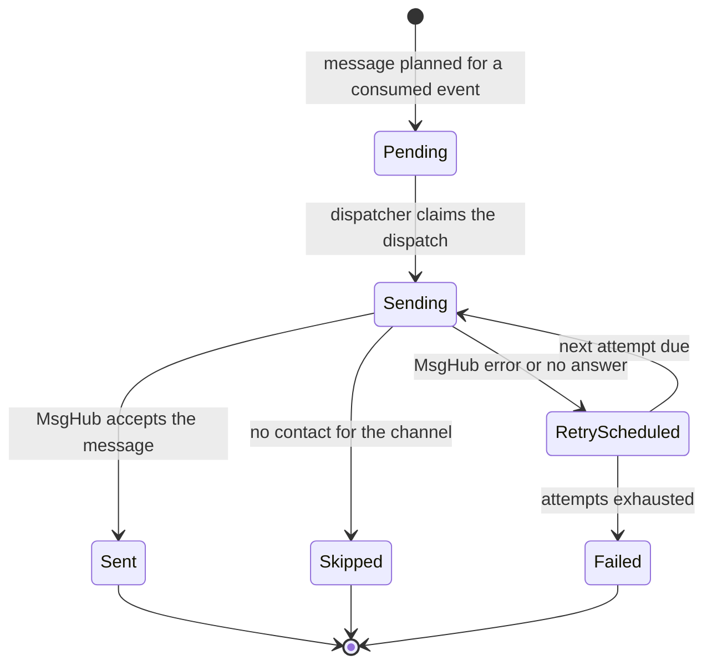
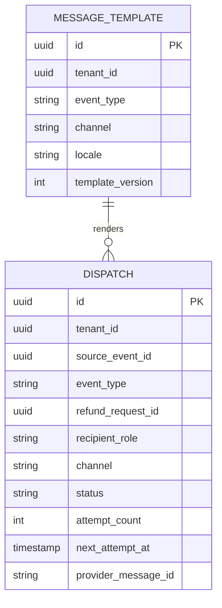
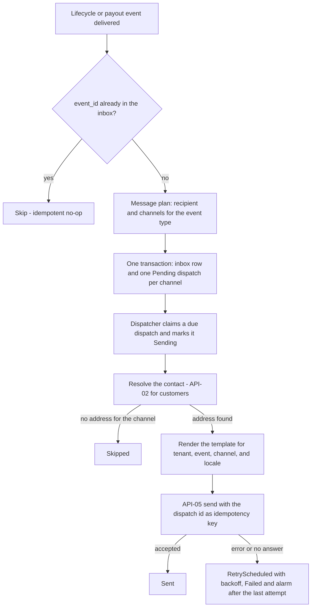
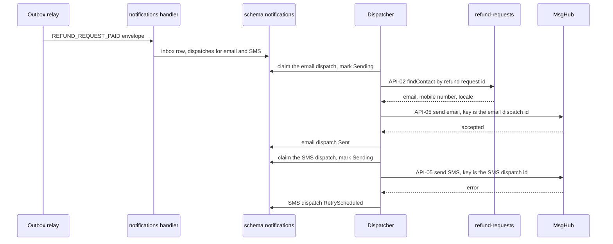

<!--
CHUNK: 13c
TITLE: Detailed Service Spec - Notifications (module)
PROJECT: Refunds Portal
VERSION: 1.0
DEPENDS_ON: 09, 07, 10 (event hub - topic names, event names, and payload contracts must match chunk 10 verbatim), 11 (API contracts - integration endpoints carry their API ID and match chunk 11 verbatim), 12 (roles - permission tokens match chunk 12 verbatim)
PART OF: SDD - Refunds Portal
-->

# 17. Detailed Service Specs

---

## 17.3 Notifications

### What

`notifications` is the module of `refunds-portal-backend` that turns refund lifecycle and payout events into messages: customer emails and SMS messages through MsgHub at the message moments of the BRD, and the branch-manager message of UC-04 E1. Bounded context: message planning and delivery. It publishes no events.

### Boundaries

- **Owns:** the message dispatch log (one dispatch per event, recipient, and channel), the message templates per tenant, event type, channel, and locale, and its inbox.
- **Does not own:** customer contact data (refund-requests, through API-02); refund request state (§17.1); payout state (§17.2); identities (IAM, §16).
- **Upstream consumers:** none call it; it consumes events from refund-requests and payouts (§14.5).
- **Downstream dependencies:** refund-requests (API-02, in-process); MsgHub (API-05).

### Input

| Type | Source | Description |
|------|--------|-------------|
| Event | refund-requests: `REFUND_REQUEST_SUBMITTED` | Customer message (UC-01 step 6) |
| Event | refund-requests: `REFUND_REQUEST_CANCELLED` | Customer message (UC-03 step 5) |
| Event | refund-requests: `REFUND_REQUEST_REJECTED` | Customer message with the reason (UC-04 A2) |
| Event | refund-requests: `REFUND_REQUEST_PAID` | Customer message (UC-04 step 7) |
| Event | payouts: `PAYOUT_ESCALATED` | Branch-manager message (UC-04 E1) |
| Schedule | Message dispatcher | Claims due dispatches and sends them |

### Business Logic

**Responsibility:** deliver each BRD message moment once per channel, from committed state, without storing contact data and without ever affecting the refund lifecycle.

**Message plan.** A derived view of the cited BRD steps; the business wording of each message stays in the BRD.

| Event | Recipient | Channels | Source |
|-------|-----------|----------|--------|
| `REFUND_REQUEST_SUBMITTED` | Customer | Email, SMS | UC-01 step 6 |
| `REFUND_REQUEST_CANCELLED` | Customer | Email | UC-03 step 5 |
| `REFUND_REQUEST_REJECTED` | Customer | **[NEEDS CLARIFICATION: UC-04 A2 says the customer is told the reason but names no channel; email, SMS, or both?]** | UC-04 A2 |
| `REFUND_REQUEST_PAID` | Customer | Email, SMS | UC-04 step 7 |
| `PAYOUT_ESCALATED` | Branch manager of the payout's branch | **[NEEDS CLARIFICATION: channel for UC-04 E1 (email, SMS, or an in-portal alert) and the source of branch-manager recipients and contact data (for example IAM user attributes); a synchronous lookup would need its own API contract (§15.5).]** | UC-04 E1 |

`REFUND_REQUEST_APPROVED` is not consumed. **[NEEDS CLARIFICATION: BRD 04 and BRD 05 say the customer is told the outcome "at each step", but UC-04 names no message at approval; confirm whether an approval message is sent (§14.8).]**

**Processing:**

1. **Plan** (event handler). Inbox deduplication on `(notifications, event_id)`, and in the same transaction one `dispatch` row per planned channel with status Pending, a UUIDv7 dispatch id, the source `event_id`, and the non-personal message fields from the payload (reference number, amounts with currency, reason).
2. **Dispatch** (scheduler, per tenant). Claims due dispatches with row locking, marks them Sending, and commits. For a customer message it resolves the contact through API-02 with the event's `aggregate_id` (the refund request id); with no address for the channel, the dispatch is Skipped. It renders the template for the tenant, event type, channel, and the contact's locale, then calls API-05 with the dispatch id as the idempotency key.
3. **Record.** Accepted → Sent with MsgHub's message id; error or no answer → RetryScheduled with exponential backoff and jitter; the last allowed attempt failing → Failed with an alarm **[NEEDS CLARIFICATION: maximum attempts per message (§12 INT-02)]**. A Sending dispatch that stays unanswered past the call timeout returns to RetryScheduled.

Contact data is held in memory for one attempt only and is resolved again for every retry; the notifications schema never stores it.

**State machine:**

**Figure 23: Message Dispatch State Machine**

**Summary:** Each planned message moves from Pending through Sending to Sent, or loops through RetryScheduled until it is Sent or Failed; a missing address ends it as Skipped. Sent means MsgHub accepted the message; delivery receipts are not part of this release (BRD 08 direction "We send").

### Output

| Type | Destination | Description |
|------|-------------|-------------|
| REST call | MsgHub | Email and SMS message requests (API-05) |
| In-process call | refund-requests | Contact lookups (API-02) |
| Event | - | None; the module publishes no events (§14.4) |

### Integrations

| Integration | Direction | Protocol | Purpose | Contract | Failure Handling |
|-------------|-----------|----------|---------|----------|------------------|
| refund-requests | Outbound, Sync (in-process) | Java port | Customer contact for a refund request | API-02 (§15) | `NOT_FOUND` fails the dispatch with an alarm; a missing address for a channel skips that channel |
| MsgHub | Outbound, Sync | HTTPS (`TBD - external`) | Send an email or an SMS message | API-05 (§15) | Timeout, retries with backoff and jitter, circuit breaker, bulkhead; Failed with an alarm after the last attempt (§12 INT-02) |
| refund-requests | Inbound, Async | Domain events | Customer message moments | `REFUND_REQUEST_SUBMITTED`, `REFUND_REQUEST_CANCELLED`, `REFUND_REQUEST_REJECTED`, `REFUND_REQUEST_PAID` (§14) | Inbox deduplication; planning failures retried, then dead-lettered with an alarm |
| payouts | Inbound, Async | Domain event | Branch-manager escalation message | `PAYOUT_ESCALATED` (§14) | Inbox deduplication; planning failures retried, then dead-lettered with an alarm |

### DB Modeling

#### Entity Relationship

**Figure 24: Notifications Conceptual ERD**

**Summary:** Each dispatch records one message for one event, recipient role, and channel, with its delivery state and schedule, and is rendered from a tenant's template for that event, channel, and locale. The model is conceptual and holds no contact data; the physical design is open below.

#### Tables Design

**[NEEDS CLARIFICATION: full physical table design (column types, nullability, check constraints, indexes). The rows below are the candidate tables and their key constraints.]**

| Table | Column | Type | Constraints | Notes |
|-------|--------|------|-------------|-------|
| `dispatch` | `tenant_id`, `source_event_id`, `recipient_role`, `channel` | - | Unique | One message per event, recipient, and channel |
| `dispatch` | `tenant_id`, `status`, `next_attempt_at` | - | Index | Dispatcher claim query |
| `message_template` | `tenant_id`, `event_type`, `channel`, `locale`, `template_version` | - | Unique | Tenant-branded templates per locale |
| `inbox` | `consumer`, `event_id` | - | Unique | Processed events |

#### Migration Strategy

- **Tool:** Flyway, versioned SQL files in this module's own migration stream, schema `notifications` (§11.1).
- **Backward compatibility:** additive changes; expand-contract for breaking changes.
- **Data backfill:** idempotent, batched job per tenant; template changes are new template versions, never edits in place.
- **Rollback:** application rollback to the previous, schema-compatible version; failed migrations fixed forward.

#### Retention Policy

- `dispatch`: **[NEEDS CLARIFICATION: retention period for the message dispatch log.]**
- `message_template`: kept while a version is active or referenced by a retained dispatch.
- `inbox`: **[NEEDS CLARIFICATION: retention window for deduplication.]**

#### Archival

- **Cold storage:** not applicable; the dispatch log is operational data with no archival requirement in the BRD.
- **Format:** not applicable.
- **Schedule:** not applicable.
- **Restore SLA:** not applicable.

#### Data Encryption

- **At rest:** storage-level encryption per the platform default (§17.1 Data Encryption, same open decision).
- **In transit:** TLS per §11.6, including every MsgHub call.
- **Key management:** MsgHub credentials per tenant in the secrets manager (§6).
- **PII columns:** none; contact data is never stored in this schema.

### Multi-Tenancy Specifications

- **Strategy override:** none (ADR-04).
- **Tenant filter:** every query filters by `tenant_id`; templates are per tenant, so each tenant's brand and product name appear in its messages; the dispatcher runs per tenant with that tenant's MsgHub credentials.
- **Cross-tenant queries:** none.

### API Standards

- **Style:** not applicable; the module exposes no HTTP endpoint and provides no in-process port.
- **Versioning:** not applicable.
- **Authentication:** not applicable for inbound calls; outbound per API-02 (in-process) and API-05 (`TBD - external`).
- **Idempotency:** inbox on events; the dispatch id is the idempotency key sent to MsgHub when MsgHub supports one (`TBD - external`).
- **Pagination:** not applicable.
- **Error envelope:** not applicable.

#### List of APIs (Swagger-friendly)

| Method | Path | Summary | Request Body | Response | Auth Scope | API ID (§15) |
|--------|------|---------|--------------|----------|------------|--------------|
| - | - | Not applicable: the module exposes no HTTP endpoint | - | - | - | - |

### Event-Driven Architecture (If Applicable)

#### Event Model

**Published events:** none. `notifications` is a consumer-only module (§14.4).

**Consumed events:**

| Event Name | Producer (owning service) | Topic | Effect in this service | Idempotency / ordering |
|------------|---------------------------|-------|------------------------|------------------------|
| `REFUND_REQUEST_SUBMITTED` | refund-requests | `refunds-portal-refund-requests-events` | Plans the customer email and SMS with `referenceNumber` and `requestedAmount`; contact through API-02 by `aggregate_id` | Inbox `(notifications, event_id)`; no ordering needed across events |
| `REFUND_REQUEST_CANCELLED` | refund-requests | `refunds-portal-refund-requests-events` | Plans the customer email with `referenceNumber`; contact through API-02 by `aggregate_id` | Inbox `(notifications, event_id)` |
| `REFUND_REQUEST_REJECTED` | refund-requests | `refunds-portal-refund-requests-events` | Plans the customer message with `referenceNumber` and `rejectionReason`; contact through API-02 by `aggregate_id` | Inbox `(notifications, event_id)` |
| `REFUND_REQUEST_PAID` | refund-requests | `refunds-portal-refund-requests-events` | Plans the customer email and SMS with `referenceNumber` and `paidAmount`; contact through API-02 by `aggregate_id` | Inbox `(notifications, event_id)` |
| `PAYOUT_ESCALATED` | payouts | `refunds-portal-payouts-events` | Plans the branch-manager message with `referenceNumber`, `branchId`, `amount`, and `firstAttemptAt` | Inbox `(notifications, event_id)` |

**[NEEDS CLARIFICATION: ratify the candidate event names and payload contracts of §14.5 and §14.9 (status `candidate`).]**

#### Messaging Infra

- **Broker:** not applicable; the outbox relay delivers in-process (ADR-02, §14.2).
- **Schema registry:** not applicable while events stay in-process; payload schemas per §14.9.
- **Serialization:** JSON.
- **Topic strategy:** consumes `refunds-portal-refund-requests-events` and `refunds-portal-payouts-events` (§14.4); owns no topic.
- **Retention:** not applicable (no outbox; inbox retention above).
- **DLQ strategy:** deliveries to this module that exhaust their retries are dead-lettered in the producer's `outbox_publication` with an alarm (§14.6); dispatches that exhaust their retries end Failed with an alarm.

### Constraints

- Messages never change, block, or roll back the refund lifecycle; a failed message is alarmed, not retried forever.
- Contact data is never stored or logged in this module; it is resolved through API-02 for each attempt (NFR-04).
- Messages show amounts with their currency (BRD 11) and the reference number, never internal ids.
- Channels per event follow the message plan above; templates exist for every launch locale (§11.7).
- **Authorization notes:** no user role calls this module, so it checks no permission token of §16; its only synchronous call into another module is API-02, in-process.

### Error Handling

- **Synchronous APIs:** none exposed.
- **Validation errors:** an event payload missing a field the template needs fails planning; the delivery is retried, then dead-lettered with an alarm.
- **Domain errors:** a duplicate event is a no-op (inbox); a missing address for a channel ends the dispatch Skipped with a WARN log without the address.
- **Auth errors:** a MsgHub authentication failure opens the circuit breaker and alarms; dispatches wait in RetryScheduled.
- **Server errors (API-05):** each MsgHub error maps to retryable or permanent (`TBD - external`); a permanent error (for example an invalid number) ends the dispatch Failed without further attempts.
- **Async consumers:** idempotent through the inbox; retried with backoff, then dead-lettered with an alarm.
- **Poison messages:** dead-lettered at once with an alarm; redriven by runbook (§20).

### Observability & Monitoring

#### Logging

- JSON per §11.4 with `module` = `notifications`.
- INFO logs carry the dispatch id, event type, channel, and outcome; never addresses, message bodies, or reasons.
- Retention per §6.

#### Metrics

**[NEEDS CLARIFICATION: confirm the module metrics below and their SLO thresholds (§18).]**

| Metric | Type | Labels | Purpose |
|--------|------|--------|---------|
| `notifications_dispatched_total` | counter | `event_type`, `channel`, `outcome` | Delivery per message moment and channel |
| `notification_dispatch_latency_seconds` | histogram | `channel` | Event commit to MsgHub acceptance |
| `notifications_failed_total` | counter | `channel` | Any increase alerts |
| `msghub_call_duration_seconds` | histogram | `outcome` | API-05 latency |

#### Tracing

- Consumer spans linked to the originating trace through the outbox (§11.4).
- One client span per API-05 call; the API-02 call is an internal span.
- Sampling per §6.

### Developer Notes

- **Recommended patterns:** plan in the event handler, send in the dispatcher; one dispatch per channel so email and SMS succeed or fail independently; the dispatch id as the only idempotency key; templates versioned and rendered with non-personal payload fields plus the contact resolved at send time; circuit breaker, bulkhead, and timeout on the MsgHub adapter.
- **Avoid:** calling MsgHub from an event handler's transaction; storing contact data or rendered bodies; building message text by string concatenation (use templates with parameters for i18n).
- **Testing:** unit tests for the message plan per event; Testcontainers PostgreSQL integration tests for inbox deduplication and dispatcher claiming; contract tests for API-05 against a MsgHub stub once the documentation is supplied; template tests per locale, including right-to-left rendering. Test names follow `methodName_scenario_expectedResult`.

### Service-Level Diagrams

#### Implementation Flow Chart

**Figure 25: Notifications - Plan and Dispatch**

**Summary:** Planning and sending are separate steps: the handler commits one dispatch per channel with the inbox row, and the dispatcher sends each dispatch from committed state with its own idempotency key and retry schedule.

#### Sequence Diagram (Service-Internal)

**Figure 26: Notifications - Paid Message on Two Channels**

**Summary:** The paid event produces two independent dispatches; the email is sent while the SMS fails and is rescheduled without resending the email. The contact comes from refund-requests through the in-process port and is not stored.

### Compliance

- **GDPR:** contact data is processed transiently and sent to MsgHub as a processor. **[NEEDS CLARIFICATION: data-processing agreement with MsgHub and the lawful basis for transactional email and SMS.]**
- **PCI-DSS:** not applicable; no card data.
- **ISO 27001 / SOC 2:** same framework as §17.1 (open there).
- **Local regulations:** **[NEEDS CLARIFICATION: rules for transactional SMS and email in the retailer's jurisdiction (sender identity, opt-out).]**

### Deployment Strategy

- **Service-specific override:** none; the module ships in `refunds-portal-backend` (ADR-09, §11.3).
- **Replicas:** those of the deployable; the dispatcher runs on every replica and row locking prevents double claims.
- **Strategy:** rolling update of the deployable; a dispatch left Sending by a stopped replica returns to RetryScheduled after the call timeout.
- **Health checks:** readiness depends on database connectivity only; MsgHub's state never fails readiness.
- **Rollback:** the deployable's rollback (§11.3).

### Future Enhancements

- Push notifications in the mobile app (UC-02 Future Enhancements) as a new channel, once a mobile app exists (§2.2).
- Extraction into a separate service when an ADR-01 trigger fires (for example message volume from new channels or tenants).

<!-- MASTER: refunds-portal-sdd-master.md | PREV: 13b-service-payouts.md | NEXT: 14-performance-and-capacity.md -->
