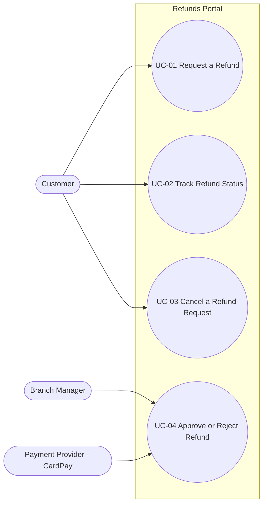

<!--
CHUNK: 03
TITLE: System Users & Use Cases
PROJECT: Refunds Portal
VERSION: 1.0
DEPENDS_ON: 01 (§7.3 also reads 05, 09, 10, 11, and 13x)
PART OF: SDD - Refunds Portal
-->

# 7. System Users & Use Cases

## 7.1 Actors

Human actors are the personas of [BRD Personas / Actors](../brd-refunds-portal/04-scope-and-personas.md#personas--actors); the system actor is the external system that calls in ([BRD Integrations](../brd-refunds-portal/08-integrations.md#integrations)).

| Actor | Type (Human / System) | Description | Primary Interface |
|-------|-----------------------|-------------|-------------------|
| Customer | Human | BRD persona Customer: requests refunds for branch purchases and follows them; sees only their own requests. | Refunds Portal web application (phone and computer browsers), signed in through the platform IAM |
| Branch Manager | Human | BRD persona Branch Manager: decides on the refund requests of their own branch and reads the daily branch report. | Refunds Portal web application (branch-manager screens), signed in through the platform IAM |
| Payment Provider (CardPay Ltd) | System | Executes payouts to the original card and reports payout results back (supporting actor of [UC-04](../brd-refunds-portal/06b-use-cases-branch-manager.md#uc-04-approve--reject-refund)). | Payout result API (API-03, §15) |

POS Records and MsgHub are called by the platform and never call in, so they appear in the context diagram (§8.2) and §12, not as actors.

## 7.2 Use Case Diagram

**Figure 1: Use Case Diagram**

**Summary:** The customer drives [UC-01](../brd-refunds-portal/06a-use-cases-customer.md#uc-01-request-a-refund), [UC-02](../brd-refunds-portal/06a-use-cases-customer.md#uc-02-track-refund-status-web-and-mobile), and [UC-03](../brd-refunds-portal/06a-use-cases-customer.md#uc-03-cancel-a-refund-request); the branch manager drives [UC-04](../brd-refunds-portal/06b-use-cases-branch-manager.md#uc-04-approve--reject-refund), with the payment provider as the supporting actor that pays out and reports the result. [UC-05](../brd-refunds-portal/05-user-journeys-overview.md#use-case-summary) is merged into the approval use case in the BRD and is not drawn; its row in §7.3 records the merge.

## 7.3 Use Case Traceability (BRD → SDD)

One row per BRD use case, in the order of the [BRD Use Case Summary](../brd-refunds-portal/05-user-journeys-overview.md#use-case-summary). Owner from §13, entry points from the §17.1 List of APIs, flows from the chunk 05 `Use cases:` lines, APIs from §15.2, events from the §14.5 citations.

| Use case (BRD) | Title | Owner (§17.X) | Entry points | Flows (§8.4 / §8.5) | APIs (§15) | Events (§14) | Status |
|----------------|-------|---------------|--------------|---------------------|------------|--------------|--------|
| [UC-01](../brd-refunds-portal/06a-use-cases-customer.md#uc-01-request-a-refund) | Request a Refund | [refund](./13a-service-refund.md) | `GET /v1/receipts/{receiptNumber}/refundable-items`, `POST /v1/refund-requests` | [§8.4.1](./05-workflows-and-sequences.md#841-workflow-refund-request-lifecycle), [§8.5.1](./05-workflows-and-sequences.md#851-sequence-submit-a-refund-request) | API-01, API-04 | `REFUND_REQUEST_SUBMITTED` | Active |
| [UC-02](../brd-refunds-portal/06a-use-cases-customer.md#uc-02-track-refund-status-web-and-mobile) | Track Refund Status (Web and Mobile) | [refund](./13a-service-refund.md) | `GET /v1/refund-requests`, `GET /v1/refund-requests/{refundRequestId}` | [§8.4.1](./05-workflows-and-sequences.md#841-workflow-refund-request-lifecycle) | - | - | Active |
| [UC-03](../brd-refunds-portal/06a-use-cases-customer.md#uc-03-cancel-a-refund-request) | Cancel a Refund Request | [refund](./13a-service-refund.md) | `POST /v1/refund-requests/{refundRequestId}/cancellation` | [§8.4.1](./05-workflows-and-sequences.md#841-workflow-refund-request-lifecycle), [§8.5.2](./05-workflows-and-sequences.md#852-sequence-cancel-a-refund-request) | API-04 | `REFUND_REQUEST_CANCELLED` | Active |
| [UC-04](../brd-refunds-portal/06b-use-cases-branch-manager.md#uc-04-approve--reject-refund) | Approve / Reject Refund | [refund](./13a-service-refund.md) | `GET /v1/branches/{branchId}/refund-requests`, `GET /v1/branches/{branchId}/refund-requests/{refundRequestId}`, `POST /v1/branches/{branchId}/refund-requests/{refundRequestId}/decision` | [§8.4.1](./05-workflows-and-sequences.md#841-workflow-refund-request-lifecycle), [§8.4.2](./05-workflows-and-sequences.md#842-workflow-payout-retry-and-escalation), [§8.5.3](./05-workflows-and-sequences.md#853-sequence-refund-decision-and-payout), [§8.5.4](./05-workflows-and-sequences.md#854-sequence-payout-retry-and-escalation) | API-02, API-03, API-04 | `REFUND_APPROVED`, `REFUND_REJECTED`, `PAYOUT_SUCCEEDED`, `REFUND_PAID`, `PAYOUT_ESCALATED`, `REFUND_PAYOUT_ESCALATED` | Active |
| [UC-05](../brd-refunds-portal/05-user-journeys-overview.md#use-case-summary) | Issue Partial Refund | - | - | - | - | - | Merged into UC-04 |

<!-- MASTER: refunds-portal-sdd-master.md | PREV: 02-ecosystem-overview.md | NEXT: 04-architecture-style-and-diagrams.md -->
