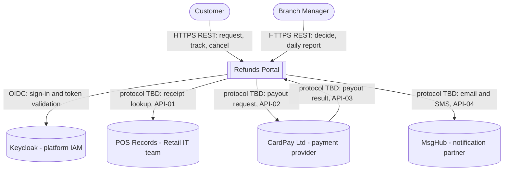

<!--
CHUNK: 04
TITLE: System Design - Architecture Style, Context & HLA Diagrams
PROJECT: Refunds Portal
VERSION: 1.0
DEPENDS_ON: 01, 02
PART OF: SDD - Refunds Portal
-->

# 8. System Design / High-Level Architecture

## 8.1 Architecture Style

### 8.1.1 What

A **modular monolith** (ADR-01): one Spring Boot deployable made of the DDD modules `refund`, `payout`, and `notification` (§13), each built as a hexagon (ports and adapters) and each owning one schema in a single PostgreSQL database.

- **Between modules:** a module changes another module's state only by publishing a domain event. The event is written to the producing module's outbox table in the same transaction as the state change and dispatched by an in-process relay after commit to one handler per consuming module, which deduplicates on `(consumer, event_id)` (§14). No module calls another synchronously in this release (ADR-05); there are no cross-schema queries.
- **To external systems:** synchronous HTTPS calls through anti-corruption adapters (§15). The receipt lookup to POS Records runs while the customer waits; payout calls to CardPay and message calls to MsgHub run from schedulers driven by persisted state, never from a customer's request thread.
- **From clients:** the Angular SPA calls REST endpoints under `/v1` through the API gateway with Keycloak-issued tokens; CardPay's payout results enter through the same gateway (API-03).

### 8.1.2 Why

- **The drivers call for one deployable.** This is the first production release of a product that will grow, built by one team (the BRD names no team size; the scope suggests one), with moderate load and a seasonal peak ([BRD Facts](../brd-refunds-portal/02-glossary-assumptions-facts.md#facts) 1-2, NFR-03). No module has a scaling, failure, or release need that differs from the others, so separate services would add a broker, service-to-service security, and distributed failure modes without a benefit (ADR-01).
- **Money and requests must never be lost (NFR-01, Business Objective 2).** The transactional outbox with inbox deduplication gives at-least-once dispatch and exactly-once effect inside one database, with no distributed transaction and no broker to lose messages.
- **Customers can use the portal at any time (NFR-02).** Stateless replicas serve every request; customer actions never wait on CardPay or MsgHub, only on POS Records for the receipt check (§12 INT-01 fallback).
- **Only the customer and their branch's manager see a request (NFR-04).** One module owns every refund request and enforces the own-request and own-branch gates in one place (§16.2).
- **The contexts are small and stable** ([BRD Definitions & Important Details](../brd-refunds-portal/03-definitions-and-domain-concepts.md#definitions--important-details): one request lifecycle and branch ownership). Module boundaries, logical event channels, and ports keep the extraction of a module into a service cheap when an ADR-01 trigger fires.

### 8.1.3 How

- **Bounded contexts:** `refund` owns refund requests, receipt eligibility, decisions, and the daily branch report (§17.1); `payout` owns payouts to the original card (§17.2); `notification` owns customer and branch-manager messages (§17.3). All three run in one deployable.
- **Inter-service communication:** in-process domain events only, on two logical channels (§14.4); payout facts are consumed only by `refund`, which re-publishes its own facts (§14.7). External systems are reached over HTTPS through adapters with timeouts, retries with exponential backoff and jitter, circuit breakers, and bulkheads (§12, §15).
- **Data ownership:** one PostgreSQL database; one schema per module (`refund`, `payout`, `notification`) with no cross-schema joins, foreign keys, or grants; shared-schema multi-tenancy with `tenant_id` on every row and index (ADR-03, ADR-06).
- **Deployment model:** one OCI image and one Helm chart on Kubernetes (ADR-09); stateless replicas; schedulers claim work with row locks, so any replica can run them.

## 8.2 Context Diagram

**Figure 2: System Context Diagram**

**Summary:** Customers and branch managers use the portal over HTTPS; the portal reads receipts from POS Records, sends payouts to CardPay and receives their results, sends email and SMS through MsgHub, and relies on the platform IAM for sign-in. The three external protocols stay TBD until their providers' documentation is supplied (§15.6).

## 8.3 High-Level Architecture Diagram

**Figure 3: High-Level Architecture**

```mermaid
flowchart TB
  WEB[Browser: customer and branch-manager screens]
  SPA[Angular SPA static assets]
  GW[API gateway]
  IAM[Keycloak IAM]
  OBS[Logs, metrics, traces]
  subgraph Backend[Backend deployable - Spring Boot]
    REF[refund module]
    PAYM[payout module]
    NOTI[notification module]
    RELAY[Outbox relay and schedulers]
  end
  subgraph Data[PostgreSQL - one database]
    SREF[(schema refund)]
    SPAY[(schema payout)]
    SNOT[(schema notification)]
  end
  subgraph External
    POS[(POS Records)]
    CP[(CardPay)]
    MH[(MsgHub)]
  end
  WEB -->|load app| SPA
  WEB -->|OIDC sign-in| IAM
  WEB -->|REST /v1 + JWT| GW
  GW --> REF
  GW -->|API-03 results| PAYM
  REF --> SREF
  PAYM --> SPAY
  NOTI --> SNOT
  REF & PAYM -.->|events via outbox| RELAY
  RELAY -.->|dispatch| REF & PAYM & NOTI
  REF -->|API-01| POS
  PAYM -->|API-02| CP
  CP -->|API-03| GW
  NOTI -->|API-04| MH
  Backend -.->|telemetry| OBS
```

**Summary:** Browsers load the SPA and call the backend through the API gateway; inside the one deployable, each module writes only its own schema, exchanges domain events through the outbox relay, and owns exactly one external adapter. Telemetry from the deployable flows to the observability stack.

**[NEEDS CLARIFICATION: layer composition still open in §6: the API gateway and ingress products, where the SPA static assets are served from, the observability back ends, and the hosting (on-prem or managed cloud Kubernetes).]**

<!-- MASTER: refunds-portal-sdd-master.md | PREV: 03-users-and-use-cases.md | NEXT: 05-workflows-and-sequences.md -->
