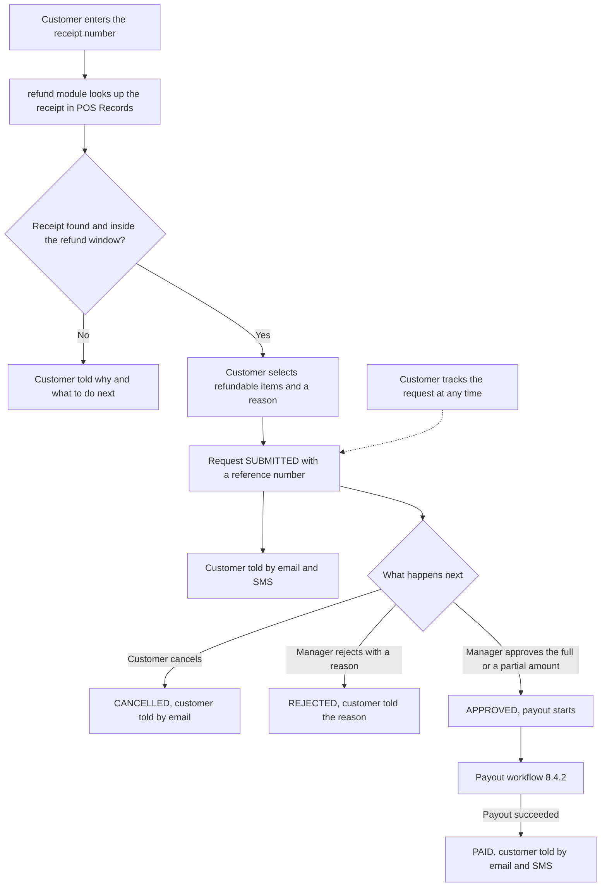
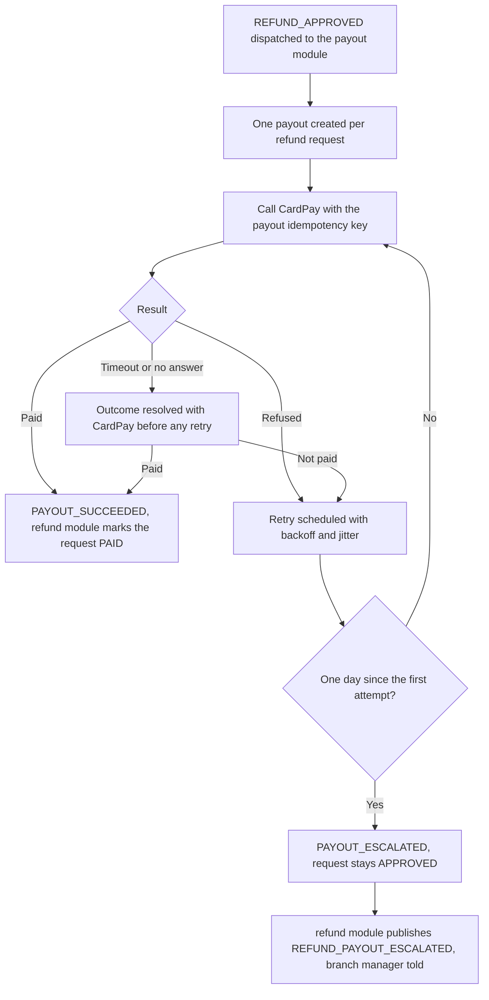

<!--
CHUNK: 05
TITLE: System Design - Workflow & Sequence Diagrams
PROJECT: Refunds Portal
VERSION: 1.0
DEPENDS_ON: 04
PART OF: SDD - Refunds Portal
-->

## 8.4 Workflow Diagrams

The first workflow re-expresses the [BRD Summarized Workflow](../brd-refunds-portal/05-user-journeys-overview.md#summarized-workflow) technically; the second details the payout step that the BRD states in one line.

### 8.4.1 Workflow: Refund request lifecycle

**Use cases:** [UC-01](../brd-refunds-portal/06a-use-cases-customer.md#uc-01-request-a-refund), [UC-02](../brd-refunds-portal/06a-use-cases-customer.md#uc-02-track-refund-status-web-and-mobile), [UC-03](../brd-refunds-portal/06a-use-cases-customer.md#uc-03-cancel-a-refund-request), [UC-04](../brd-refunds-portal/06b-use-cases-branch-manager.md#uc-04-approve--reject-refund)

**Figure 4: Workflow - Refund request lifecycle**

**Summary:** The receipt is checked before any request exists; a submitted request then ends cancelled by the customer, rejected, or approved and paid, and the customer is told at each of those steps. Tracking reads the request and its history at any point without changing it.

### 8.4.2 Workflow: Payout retry and escalation

**Use cases:** [UC-04](../brd-refunds-portal/06b-use-cases-branch-manager.md#uc-04-approve--reject-refund)

**Figure 5: Workflow - Payout retry and escalation**

**Summary:** An approval creates exactly one payout, retried with the same idempotency key until CardPay pays it or the escalation window of §17.2 passes; an unknown outcome is resolved before any retry, so the refund is never paid twice. An escalation leaves the request Approved and tells the branch manager; what follows the escalation is open in §17.2.

## 8.5 Sequence Diagrams

### 8.5.1 Sequence: Submit a refund request

**Use cases:** [UC-01](../brd-refunds-portal/06a-use-cases-customer.md#uc-01-request-a-refund)

**[NEEDS CLARIFICATION: sequence diagram for Submit a refund request - see the use cases above.]**

### 8.5.2 Sequence: Cancel a refund request

**Use cases:** [UC-03](../brd-refunds-portal/06a-use-cases-customer.md#uc-03-cancel-a-refund-request)

**[NEEDS CLARIFICATION: sequence diagram for Cancel a refund request - see the use cases above.]**

### 8.5.3 Sequence: Refund decision and payout

**Use cases:** [UC-04](../brd-refunds-portal/06b-use-cases-branch-manager.md#uc-04-approve--reject-refund)

**[NEEDS CLARIFICATION: sequence diagram for Refund decision and payout - see the use cases above.]**

### 8.5.4 Sequence: Payout retry and escalation

**Use cases:** [UC-04](../brd-refunds-portal/06b-use-cases-branch-manager.md#uc-04-approve--reject-refund)

**[NEEDS CLARIFICATION: sequence diagram for Payout retry and escalation - see the use cases above.]**

<!-- MASTER: refunds-portal-sdd-master.md | PREV: 04-architecture-style-and-diagrams.md | NEXT: 06-principles-and-decisions.md -->
