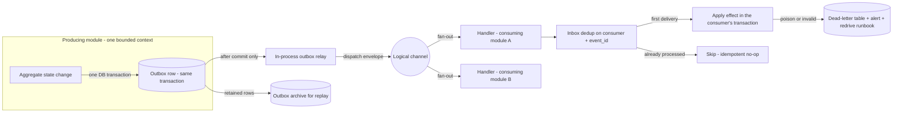
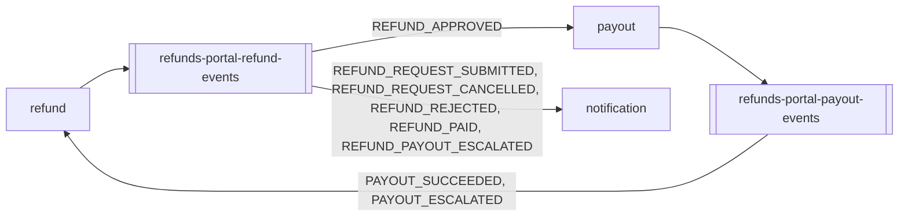

<!--
CHUNK: 10
TITLE: Centralized Event Hub (Platform Event Catalog & Payload Contracts)
PROJECT: Refunds Portal
VERSION: 1.0
DEPENDS_ON: 05, 07, 08, 09
RECONCILES_WITH: every per-service chunk (13a, 13b, 13c) - Event Model + Messaging Infra sub-sections
PART OF: SDD - Refunds Portal
PURPOSE: Single cross-service catalog of every platform event - name, producer, consumers, envelope, payload contract, business what/when/why - plus the centralized event-hub topology. Consolidates what is otherwise distributed across the per-service Event Models.
CONSISTENCY_RULE: This chunk is the platform contract registry. Topic names, event names, envelope fields, and payload contracts here MUST match the per-service chunks character-for-character. Consumer lists are reconciled from BOTH sides (each producer's published table AND each consumer's consumed table). Where a per-service spec and this catalog disagree, the per-service spec is authoritative for its own published events and the divergence is flagged in the Consistency Notes section - never silently reconciled.
-->

# 14. Centralized Event Hub (Platform Event Catalog & Payload Contracts)

> **What this chunk is.** The one place that lists **every event on the platform** with its producer, consumers, key family, payload contract, and business meaning (what / when / why), plus the hub topology that carries them. It is a derived consolidation of the per-module Event Models (each `13x` chunk § Event-Driven Architecture). Downstream LLD generation and implementers read this chunk as the single contract surface. The platform is a modular monolith (ADR-01), so this is the domain event catalog of the modules: events cross module boundaries in-process, through the transactional outbox.

---

## 14.1 Purpose & Scope

The portal is event-driven between modules: every cross-module state change is a domain event, written to the producing module's outbox in the same transaction as the change and dispatched in-process after commit (ADR-02, ADR-05). Synchronous calls exist only to external systems (§15), one hop deep.

1. **What events exist:** the events of §14.5, published by `refund` and `payout`; their count is the §14.9.99 coverage matrix.
2. **Who produces and consumes each:** §14.5, reconciled from both sides with the Event Models of §17.1-§17.3.
3. **What each carries:** the envelope of §14.3 plus the payload contracts of §14.9.
4. **Why and when each fires:** the what · when · why column of §14.5, citing the BRD use case step that fires the event.

**Out of scope:** events that never leave their module; CardPay payout results (a provider callback, API-03, not an event on the hub); POS Records lookups and MsgHub calls (API-01, API-04), which the adapters translate before any event exists.

## 14.2 Hub Topology Decision

**Decision:** one logical hub realised in-process: one logical channel per producing module, carried by a transactional outbox table in the producer's schema and an in-process relay that dispatches each envelope to one handler per consuming module; no external broker in this release (ADR-02).

What makes it *one hub* is the shared contract surface:

- **One envelope standard** (§14.3) on every event, on every channel.
- **One messaging pattern:** outbox (same transaction as the state change) -> in-process relay (after commit) -> consumer handler with inbox deduplication; no dual writes.
- **One schema registry:** one JSON Schema per event, versioned in the application repository; additive-only changes are checked in CI. A registry service replaces it when the first extraction introduces a broker (ADR-02).
- **One event archive:** dispatched outbox rows stay in the producer's schema for replay. **[NEEDS CLARIFICATION: how long dispatched outbox rows are kept for replay.]**
- **One delivery semantic:** at-least-once delivery, exactly-once **effect** via `(consumer, event_id)` inbox deduplication, per-aggregate ordering via `aggregate_version`.

| Dimension | In-process outbox relay (chosen) | External broker now: Kafka or SNS+SQS (rejected) |
|---|---|---|
| Access control | Inside one process; modules see only the published event contracts | Per-topic ACLs and service identities to manage |
| Blast radius | A stuck handler delays only its own consuming module; the outbox holds the backlog | Broker outage delays every consumer; one more system to keep available (NFR-02) |
| Archive / replay granularity | Per producer, from the outbox rows, to one consumer handler | Per topic, from broker retention or an archive subscription |
| Ownership | The producing module owns its outbox table and channel | The platform team owns the cluster; modules own topics |
| Cost / fan-out | No extra infrastructure; fan-out is a handler list per channel | A cluster to run for a handful of low-volume events |

### 14.2.1 Async Backbone (the universal per-event mechanism)

**Figure 6: Async backbone - outbox, relay, inbox**

**Summary:** Every event is written in the producer's transaction, dispatched only after commit, and applied at most once per consumer through the inbox; an event that cannot be applied goes to the consumer's dead-letter table with an alert, and the retained outbox rows allow replay to a single consumer.

### 14.2.2 Hub Topology & Fan-Out Landscape

**Figure 7: Hub topology - producers, channels, consumers**

**Summary:** `refund` feeds `payout` with approvals and `notification` with every fact a customer or branch manager is told about; `payout` reports its outcomes back to `refund` only, which re-publishes them as refund facts (§14.7).

## 14.3 Standard Event Envelope (every event, every topic)

| Field | Type | Meaning |
|---|---|---|
| `event_id` | UUIDv7 | Globally unique; the inbox dedup key `(consumer, event_id)` -> exactly-once effect. |
| `event_type` | string | SCREAMING_SNAKE_CASE, past-tense fact (e.g., `REFUND_APPROVED`). |
| `schema_version` | semver | Schema version from the registry (additive-only). |
| `aggregate_id` | UUIDv7 | The producing aggregate instance (the refund request id, or the payout id). |
| `aggregate_type` | string | The producing aggregate: `RefundRequest` or `Payout`. |
| `aggregate_version` | int | Per-aggregate monotonic counter; the ordering and transition guard. |
| `occurred_at` | timestamp (UTC) | When the fact happened. |
| `correlation_id` | UUIDv7 | Opaque request and trace correlation; carries no tenant data or PII. |
| `causation_id` | UUIDv7 (optional) | The event that caused this one (for example, the `PAYOUT_SUCCEEDED` behind a `REFUND_PAID`). |
| `tenant_id` | UUIDv7 | Tenant key (ADR-03). |
| `payload{}` | JSON | Event-specific body; schema owned by the registry (§14.9). |

**Key-family variants:**

- **Tenant-keyed:** every event; key `tenant_id` + `aggregate_id`.
- No generic-key family and no exception.

## 14.4 Topic Registry

Channels are logical topics: dispatched in-process today, and the broker topic names on the first extraction (ADR-02).

| # | Topic | Owner (sole publisher) | Key family | Phase |
|---|---|---|---|---|
| 1 | `refunds-portal-refund-events` | refund | Tenant-keyed (`RefundRequest`) | P1 |
| 2 | `refunds-portal-payout-events` | payout | Tenant-keyed (`Payout`) | P1 |

**No topic, no published events (consumers only):** notification.

## 14.5 Platform Event Catalog

**Status legend:** `committed` / `candidate` / `Analytics-only` / `Pn` = phase. Every event below is `candidate`: its name is fixed, and its payload contract awaits ratification (§14.9).

### 14.5.1 refund — `refunds-portal-refund-events` (tenant-keyed; P1)

| Event | Consumers | Payload (beyond envelope) | Business: what · when · why | Status |
|---|---|---|---|---|
| `REFUND_REQUEST_SUBMITTED` | notification | `reference_number`, `branch_id`, `requested_amount`, `customer_contact` | A customer submitted a refund request · [UC-01](../brd-refunds-portal/06a-use-cases-customer.md#uc-01-request-a-refund) step 6 · the customer is told by email and SMS, with the reference number | candidate |
| `REFUND_REQUEST_CANCELLED` | notification | `reference_number`, `customer_contact` | A customer cancelled a Submitted request · [UC-03](../brd-refunds-portal/06a-use-cases-customer.md#uc-03-cancel-a-refund-request) step 5 · the customer is told by email | candidate |
| `REFUND_APPROVED` | payout | `reference_number`, `branch_id`, `receipt_number`, `approved_amount`, `partial`, `partial_reason`, `original_payment_reference` | A branch manager approved a request in full or in part · [UC-04](../brd-refunds-portal/06b-use-cases-branch-manager.md#uc-04-approve--reject-refund) step 6 (A1 for a partial amount) · the payout to the original card starts | candidate |
| `REFUND_REJECTED` | notification | `reference_number`, `rejection_reason`, `customer_contact` | A branch manager rejected a request with a reason · [UC-04](../brd-refunds-portal/06b-use-cases-branch-manager.md#uc-04-approve--reject-refund) A2 · the customer is told the reason | candidate |
| `REFUND_PAID` | notification | `reference_number`, `paid_amount`, `customer_contact` | The refund was paid to the original card · [UC-04](../brd-refunds-portal/06b-use-cases-branch-manager.md#uc-04-approve--reject-refund) step 7, re-published on `PAYOUT_SUCCEEDED` · the customer is told by email and SMS | candidate |
| `REFUND_PAYOUT_ESCALATED` | notification | `reference_number`, `branch_id`, `approved_amount`, `first_attempt_at`, `last_failure_reason` | The payout of an approved request still fails when the escalation window passes; the request stays Approved · [UC-04](../brd-refunds-portal/06b-use-cases-branch-manager.md#uc-04-approve--reject-refund) E1, re-published on `PAYOUT_ESCALATED` · the branch manager is told | candidate |

### 14.5.2 payout — `refunds-portal-payout-events` (tenant-keyed; P1)

| Event | Consumers | Payload (beyond envelope) | Business: what · when · why | Status |
|---|---|---|---|---|
| `PAYOUT_SUCCEEDED` | refund | `refund_request_id`, `paid_amount`, `provider_reference` | CardPay confirmed the payout · [UC-04](../brd-refunds-portal/06b-use-cases-branch-manager.md#uc-04-approve--reject-refund) step 7 · the request becomes Paid | candidate |
| `PAYOUT_ESCALATED` | refund | `refund_request_id`, `attempt_count`, `first_attempt_at`, `last_failure_reason` | The payout had no success when the escalation window of §17.2 passed · [UC-04](../brd-refunds-portal/06b-use-cases-branch-manager.md#uc-04-approve--reject-refund) E1 · the refund records the escalation and the branch manager is told | candidate |

## 14.6 Cross-Cutting Event Guarantees

1. **Atomicity:** domain state and outbox row commit in one transaction; the relay dispatches only after commit (no dual writes).
2. **Delivery:** at-least-once everywhere; consumers deduplicate on `(consumer, event_id)`.
3. **Ordering:** per aggregate via `aggregate_version` (validated transitions for the refund and payout state machines), not by dispatch order.
4. **Poison handling:** invalid transitions and undeserializable events go to the consumer's dead-letter table with an alert and a redrive runbook; never silently dropped.
5. **Schema evolution:** additive-only, checked in CI; a breaking change is a new event name.
6. **Replay:** from the producer's retained outbox rows to one consumer handler, never re-published to every consumer.
7. **Money effect at most once:** one payout per refund request and one idempotency key per payout (§17.2, NFR-01), whatever the number of `REFUND_APPROVED` deliveries.
8. **Dispatch never blocks the user:** the relay runs after commit, so a slow or failing consumer delays only its own effect, never the request that produced the event.

## 14.7 Universal Subscribers & Cross-Service Doctrines

- **Universal subscribers:** none. No analytics or audit consumer binds every channel in this release.
- **Notification breadth rule:** `notification` subscribes only to `refund` facts that a BRD use case says a customer or the branch manager is told about (§17.3), and never to `payout` events.
- **Re-publication doctrine:** payout facts (`PAYOUT_SUCCEEDED`, `PAYOUT_ESCALATED`) are consumed only by `refund`, the module that initiated the payout, which records them on the request and re-publishes its own domain facts (`REFUND_PAID`, `REFUND_PAYOUT_ESCALATED`).

## 14.8 Consistency Notes & Open Flags

Every Event Model in §17.1-§17.3 matches this catalog; no divergence is open.

| # | Where (chunks) | Divergence | Resolution / flag |
|---|---|---|---|
| - | 13a, 13b, 13c vs this chunk | None found: channel names, event names, payload fields, and consumer lists agree from both sides | Reconciled 2026-09-28 |

## 14.9 Payload Contract Samples

**[NEEDS CLARIFICATION: ratify the candidate payload contracts below (field names, types, required flags) with the module owners. They are derived from the BRD use cases and from the consumer effects in §17.1-§17.3.]**

### 14.9.0 Common Value Objects

| Value object | Fields | Used by |
|---|---|---|
| `Money` | `amount decimal(19,4)`, `currency string(ISO-4217)` | `REFUND_REQUEST_SUBMITTED`, `REFUND_APPROVED`, `REFUND_PAID`, `REFUND_PAYOUT_ESCALATED`, `PAYOUT_SUCCEEDED` |
| `CustomerContact` | `email string` (`pii`), `mobile string` (`pii`) | `REFUND_REQUEST_SUBMITTED`, `REFUND_REQUEST_CANCELLED`, `REFUND_REJECTED`, `REFUND_PAID` |

**Erasure path:** `CustomerContact` is stored in the `refund` outbox rows and in the `notification` message records; both fall under the erasure flow flagged in §17.1 and §17.3.

### 14.9.1 `REFUND_REQUEST_SUBMITTED` — candidate

**Producer:** refund · **Topic:** `refunds-portal-refund-events` · **Key family:** tenant-keyed

| Field | Type | Required | Notes |
|---|---|---|---|
| `reference_number` | string | R | Customer-facing reference of the request |
| `branch_id` | string | R | Branch of the purchase |
| `requested_amount` | ref(Money) | R | Amount of the selected lines |
| `customer_contact` | ref(CustomerContact) | R | `pii`; recipient of the email and the SMS |

### 14.9.2 `REFUND_REQUEST_CANCELLED` — candidate

**Producer:** refund · **Topic:** `refunds-portal-refund-events` · **Key family:** tenant-keyed

| Field | Type | Required | Notes |
|---|---|---|---|
| `reference_number` | string | R | Customer-facing reference of the request |
| `customer_contact` | ref(CustomerContact) | R | `pii`; recipient of the email |

### 14.9.3 `REFUND_APPROVED` — candidate

**Producer:** refund · **Topic:** `refunds-portal-refund-events` · **Key family:** tenant-keyed

| Field | Type | Required | Notes |
|---|---|---|---|
| `reference_number` | string | R | Customer-facing reference of the request |
| `branch_id` | string | R | Branch of the purchase |
| `receipt_number` | string | R | Receipt of the purchase; lets CardPay locate the original payment if it supports that (API-02) |
| `approved_amount` | ref(Money) | R | Amount to pay out |
| `partial` | bool | R | True when the approved amount is lower than the requested amount |
| `partial_reason` | string | C | Present when `partial` is true |
| `original_payment_reference` | string | O | Present when POS Records returns it (R-04) |

### 14.9.4 `REFUND_REJECTED` — candidate

**Producer:** refund · **Topic:** `refunds-portal-refund-events` · **Key family:** tenant-keyed

| Field | Type | Required | Notes |
|---|---|---|---|
| `reference_number` | string | R | Customer-facing reference of the request |
| `rejection_reason` | string | R | The branch manager's reason, shown to the customer |
| `customer_contact` | ref(CustomerContact) | R | `pii`; recipient of the rejection message |

### 14.9.5 `REFUND_PAID` — candidate

**Producer:** refund · **Topic:** `refunds-portal-refund-events` · **Key family:** tenant-keyed

| Field | Type | Required | Notes |
|---|---|---|---|
| `reference_number` | string | R | Customer-facing reference of the request |
| `paid_amount` | ref(Money) | R | Amount paid to the original card |
| `customer_contact` | ref(CustomerContact) | R | `pii`; recipient of the email and the SMS |

### 14.9.6 `REFUND_PAYOUT_ESCALATED` — candidate

**Producer:** refund · **Topic:** `refunds-portal-refund-events` · **Key family:** tenant-keyed

| Field | Type | Required | Notes |
|---|---|---|---|
| `reference_number` | string | R | Customer-facing reference of the request |
| `branch_id` | string | R | Branch whose manager is told |
| `approved_amount` | ref(Money) | R | Amount still unpaid |
| `first_attempt_at` | timestamp | R | First payout attempt (UTC) |
| `last_failure_reason` | string | O | Last refusal or failure reported for the payout |

### 14.9.7 `PAYOUT_SUCCEEDED` — candidate

**Producer:** payout · **Topic:** `refunds-portal-payout-events` · **Key family:** tenant-keyed

| Field | Type | Required | Notes |
|---|---|---|---|
| `refund_request_id` | uuid | R | The refund request the payout belongs to |
| `paid_amount` | ref(Money) | R | Amount CardPay confirmed |
| `provider_reference` | string | R | CardPay's reference for the payout |

### 14.9.8 `PAYOUT_ESCALATED` — candidate

**Producer:** payout · **Topic:** `refunds-portal-payout-events` · **Key family:** tenant-keyed

| Field | Type | Required | Notes |
|---|---|---|---|
| `refund_request_id` | uuid | R | The refund request the payout belongs to |
| `attempt_count` | int | R | Attempts made when the escalation window passed |
| `first_attempt_at` | timestamp | R | First payout attempt (UTC) |
| `last_failure_reason` | string | O | Last refusal or failure reported by CardPay |

### 14.9.99 Coverage Matrix

| Event | Catalog (§14.5) | Contract (§14.9 / registry) | Status |
|---|---|---|---|
| `REFUND_REQUEST_SUBMITTED` | ✓ | §14.9.1 | candidate |
| `REFUND_REQUEST_CANCELLED` | ✓ | §14.9.2 | candidate |
| `REFUND_APPROVED` | ✓ | §14.9.3 | candidate |
| `REFUND_REJECTED` | ✓ | §14.9.4 | candidate |
| `REFUND_PAID` | ✓ | §14.9.5 | candidate |
| `REFUND_PAYOUT_ESCALATED` | ✓ | §14.9.6 | candidate |
| `PAYOUT_SUCCEEDED` | ✓ | §14.9.7 | candidate |
| `PAYOUT_ESCALATED` | ✓ | §14.9.8 | candidate |

<!-- MASTER: refunds-portal-sdd-master.md | PREV: 09-services-summary.md | NEXT: 11-api-contracts.md -->
