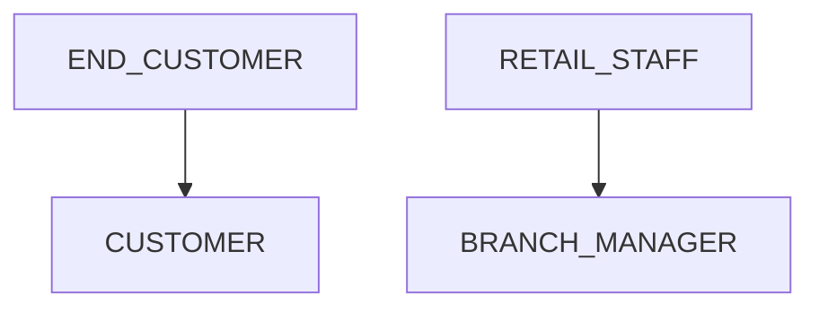
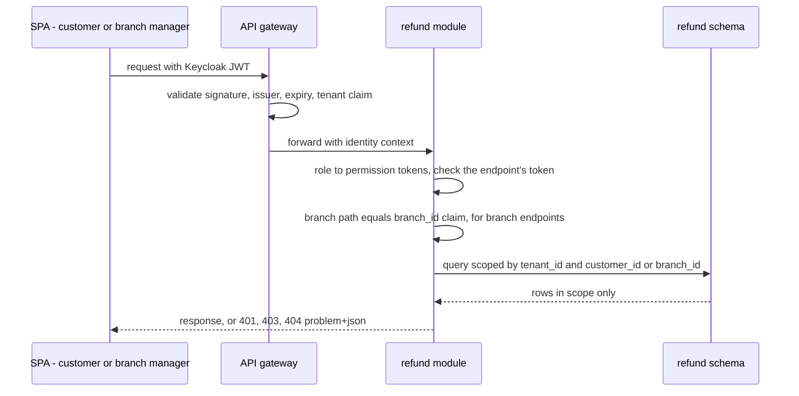

<!--
CHUNK: 12
TITLE: Centralized User Roles & Authorities (Platform-Wide)
PROJECT: Refunds Portal
VERSION: 1.0
DEPENDS_ON: 03, 07, 09 (+ per-service chunks 13a, 13b, 13c for per-service authorization notes)
PART OF: SDD - Refunds Portal
PURPOSE: Single platform-wide reference for user types, roles, sub-roles, and their authorities - who can do what, who can create whom, which services each role touches, and how a role resolves to an allowed action at request time. Consolidates the BRD's Users & Use Cases Matrix and the per-service authorization notes into one canonical catalogue. Companion reference to the Centralized Event Hub (chunk 10).
CONSISTENCY_RULE: Role names, permission tokens, and per-service authorization notes in the 13x chunks MUST match this catalogue verbatim. Divergences are flagged here (see the drift register), never silently reconciled.
-->

# 16. Centralized User Roles & Authorities (Platform-Wide)

> **What this chunk is.** The one place that answers: what user types exist, which roles they hold, what each role is allowed to do, who may create or invite whom, and which modules each role interacts with. It is derived from the [BRD Users & Use Cases Matrix](../brd-refunds-portal/07-users-use-cases-matrix.md#users--use-cases-matrix) and the §17.1 authorization notes.

---

## 16.1 Business Overview

The portal has two tiers of users inside one retailer (one tenant, ADR-03). **Customers** are buyers who request refunds for their own branch purchases and follow them; they see only their own requests. **Branch managers** are retailer staff who each run one branch; they decide on their branch's requests and read its daily report, and see only their branch's requests (NFR-04). The BRD defines no platform operator or support role.

## 16.2 Resolution Model — How a Role Becomes an Allowed Action

1. **Identity:** the user signs in to Keycloak (one realm, ADR-07); the JWT carries the subject, the tenant claim, the realm role (`CUSTOMER` or `BRANCH_MANAGER`), and for branch managers the `branch_id` claim.
2. **Edge gate (API gateway):** validates signature, issuer, expiry, and the tenant claim, and rejects anything else with 401.
3. **Permission gate (`refund` module):** maps the role to its permission tokens (§16.11) and checks the token the endpoint requires (§17.1 List of APIs); a missing token is 403.
4. **Contextual gates (`refund` module):** own request: every customer query is scoped by `customer_id` = subject ([UC-02](../brd-refunds-portal/06a-use-cases-customer.md#uc-02-track-refund-status-web-and-mobile) BR-1); own branch: the path `branchId` must equal the `branch_id` claim (403 otherwise) and every branch query is scoped by it (matrix footnote 1, [UC-04](../brd-refunds-portal/06b-use-cases-branch-manager.md#uc-04-approve--reject-refund) BR-1). A request outside the scope answers 404, so its existence is not disclosed (NFR-04).
5. **Domain rules** (only Submitted requests can be cancelled or decided) are state checks in the aggregate, not authorization.

**[NEEDS CLARIFICATION: confirm these enforcement points and where the role-to-permission map lives: Keycloak client roles, or an application table seeded by Flyway (ADR-08).]**

## 16.3 User Types (Tier 1)

| User type | Tenancy plane | Identity source | Description |
|---|---|---|---|
| `END_CUSTOMER` | End-customer | Keycloak, single realm (§6) | Buyers of the retailer's branches (BRD persona Customer) |
| `RETAIL_STAFF` | Tenant (retailer) | Keycloak, single realm (§6) | Staff of the retailer's branches, carrying a `branch_id` (BRD persona Branch Manager) |

## 16.4 Role Catalogue — Authorities & Related Services

### 16.4.1 END_CUSTOMER Roles

| Role | Scope | Core authorities | Related services |
|---|---|---|---|
| `CUSTOMER` | Own requests | Look up a receipt; submit a refund request; list and open own requests; cancel an own Submitted request | refund (write, read); notification (message recipient only) |

### 16.4.2 RETAIL_STAFF Sub-Roles

| Sub-role | Scope | Core authorities | Related services |
|---|---|---|---|
| `BRANCH_MANAGER` | Own branch | View the branch's Submitted requests and open them; approve in full or in part, or reject with a reason; read the daily branch report; receive the payout escalation message | refund (write, read); notification (message recipient only) |

### 16.4.3 Platform Plane (operator — outside tenant tenancy)

No platform operator role is defined in the BRD. **[NEEDS CLARIFICATION: is a platform operator or support role needed, for example to provision branch managers, to act on escalated payouts, or to redrive dead-lettered events?]**

## 16.5 Capability Matrix (canonical)

| Capability | `CUSTOMER` | `BRANCH_MANAGER` |
|---|---|---|
| Look up a receipt and its refundable lines | Yes | - |
| Submit a refund request | Yes | - |
| Track own refund requests | Yes¹ | - |
| Cancel an own Submitted request | Yes¹ | - |
| View and open the branch's requests | - | Yes² |
| Approve (full or partial) or reject a request | - | Yes² |
| Read the daily branch refund report | - | Yes² |

¹ Own requests only ([UC-02](../brd-refunds-portal/06a-use-cases-customer.md#uc-02-track-refund-status-web-and-mobile) BR-1, NFR-04).
² Own branch only ([BRD Users & Use Cases Matrix](../brd-refunds-portal/07-users-use-cases-matrix.md#users--use-cases-matrix) footnote 1).

## 16.6 Grant / Invitation Authority (who can create whom)

No BRD use case covers account creation or role assignment.

| Grantor role | May create / invite | Constraints |
|---|---|---|
| **[NEEDS CLARIFICATION: who creates customer accounts: self-registration in the IAM, or another channel]** | `CUSTOMER` | The account's profile must carry the contact details used for messages (§17.1 Constraints) |
| **[NEEDS CLARIFICATION: who provisions branch managers and assigns their branch]** | `BRANCH_MANAGER` | Exactly one `branch_id` per branch manager (§3 assumption 4) |

## 16.7 Role → Related-Services Matrix (platform-wide)

| Role | refund | payout | notification |
|---|---|---|---|
| `CUSTOMER` | write | - | - |
| `BRANCH_MANAGER` | write | - | - |

`payout` and `notification` expose no user-facing endpoint; users only receive the messages `notification` sends.

## 16.8 Lifecycle, Scope & Revocation Rules

1. **Grant:** per §16.6 (open).
2. **Change:** a branch manager moved to another branch gets the new `branch_id` in the next token; the old branch's requests stay in the old branch's queue, because the queue belongs to the branch, not to the person.
3. **Suspension / revocation:** disabling the IAM account stops new tokens, and access ends when the current token expires. In-flight requests and payouts are unaffected: they belong to the purchase's branch and customer, not to a session. **[NEEDS CLARIFICATION: access-token lifetime.]**
4. **Erasure:** **[NEEDS CLARIFICATION: erasure path for a customer's identity and for the contact details on their requests and messages (§17.1, §17.3).]**

## 16.9 Diagrams

### 16.9.1 Role Taxonomy (user types → roles → sub-roles)

**Figure 8: Role taxonomy**

**Summary:** Each user type holds one role in this release: end customers hold `CUSTOMER`, and retail staff hold `BRANCH_MANAGER` with their branch claim.

### 16.9.2 Grant / Invitation Authority (who may create whom)

**[NEEDS CLARIFICATION: diagram pending architect input: the grantors are open (§16.6).]**

### 16.9.3 Per-Request Authorization (how a role yields a decision)

**Figure 9: Per-request authorization**

**Summary:** The gateway authenticates and checks the tenant; the refund module checks the permission token and the branch claim, and every query is scoped to the caller's own requests or own branch, so a request outside the scope is never returned (NFR-04). This is the proposed model of §16.2.

## 16.10 Traceability

| Capability / rule | Source (BRD UC / matrix row / ADR / 13x chunk) |
|---|---|
| Look up a receipt (`refund.receipt.read`) | [UC-01](../brd-refunds-portal/06a-use-cases-customer.md#uc-01-request-a-refund) steps 1-2; [BRD matrix, UC-01 row](../brd-refunds-portal/07-users-use-cases-matrix.md#users--use-cases-matrix); §17.1 |
| Submit a refund request (`refund.request.create`) | [UC-01](../brd-refunds-portal/06a-use-cases-customer.md#uc-01-request-a-refund) steps 3-6; [BRD matrix, UC-01 row](../brd-refunds-portal/07-users-use-cases-matrix.md#users--use-cases-matrix); §17.1 |
| Track own requests (`refund.request.read`) | [UC-02](../brd-refunds-portal/06a-use-cases-customer.md#uc-02-track-refund-status-web-and-mobile); [BRD matrix, UC-02 row](../brd-refunds-portal/07-users-use-cases-matrix.md#users--use-cases-matrix); §17.1 |
| Cancel an own Submitted request (`refund.request.cancel`) | [UC-03](../brd-refunds-portal/06a-use-cases-customer.md#uc-03-cancel-a-refund-request); [BRD matrix, UC-03 row](../brd-refunds-portal/07-users-use-cases-matrix.md#users--use-cases-matrix); §17.1 |
| View and open the branch's requests (`refund.branch-request.read`) | [UC-04](../brd-refunds-portal/06b-use-cases-branch-manager.md#uc-04-approve--reject-refund) steps 1-3; [BRD matrix, UC-04 row](../brd-refunds-portal/07-users-use-cases-matrix.md#users--use-cases-matrix); §17.1 |
| Approve or reject (`refund.branch-request.decide`) | [UC-04](../brd-refunds-portal/06b-use-cases-branch-manager.md#uc-04-approve--reject-refund) steps 3-6, A1, A2; [BRD matrix, UC-04 row](../brd-refunds-portal/07-users-use-cases-matrix.md#users--use-cases-matrix); §17.1 |
| Read the daily branch report (`refund.branch-report.read`) | [BRD Reporting / Analytics](../brd-refunds-portal/09-reporting-and-analytics.md#reporting--analytics) (audience Branch Manager); §17.1 |
| Own-request rule | [UC-02](../brd-refunds-portal/06a-use-cases-customer.md#uc-02-track-refund-status-web-and-mobile) BR-1; NFR-04 |
| Own-branch rule | [BRD matrix](../brd-refunds-portal/07-users-use-cases-matrix.md#users--use-cases-matrix) footnote 1; [UC-04](../brd-refunds-portal/06b-use-cases-branch-manager.md#uc-04-approve--reject-refund) BR-1; [BRD Branch ownership](../brd-refunds-portal/03-definitions-and-domain-concepts.md#branch-ownership); NFR-04 |
| Resolution model | ADR-07, ADR-08 |

## 16.11 Permission × Role Matrix (platform-wide)

| Permission token | `CUSTOMER` | `BRANCH_MANAGER` |
|---|---|---|
| `refund.receipt.read` | ✓ | - |
| `refund.request.create` | ✓ | - |
| `refund.request.read` | ✓¹ | - |
| `refund.request.cancel` | ✓¹ | - |
| `refund.branch-request.read` | - | ✓² |
| `refund.branch-request.decide` | - | ✓² |
| `refund.branch-report.read` | - | ✓² |

¹ Own requests only. ² Own branch only.

## 16.12 Implementation Seed & Reconciliation

### 16.12.1 Seed Strategy

The two realm roles and the `branch_id` user attribute (mapped into the token) are created in Keycloak per environment; the role-to-token map of §16.11 is seeded where ADR-08 places it (open), and any change to §16.11 changes the seed in the same pull request.

### 16.12.2 Per-Role Action Counts (drift baseline)

| Role | Seeded permission count |
|---|---|
| `CUSTOMER` | 4 |
| `BRANCH_MANAGER` | 3 |

### 16.12.3 Drift & Reconciliation Register

| # | Where | Divergence | Resolution / flag |
|---|---|---|---|
| - | BRD matrix vs 13a vs this chunk | None found: every Yes cell of the matrix has its tokens, every §17.1 Auth Scope is a token of §16.11, and no token lacks a role | Reconciled 2026-09-28 |

<!-- MASTER: refunds-portal-sdd-master.md | PREV: 11-api-contracts.md | NEXT: 13a-service-refund.md -->
