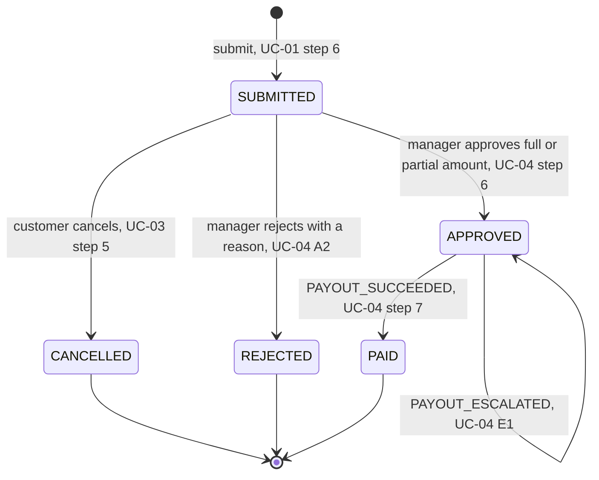
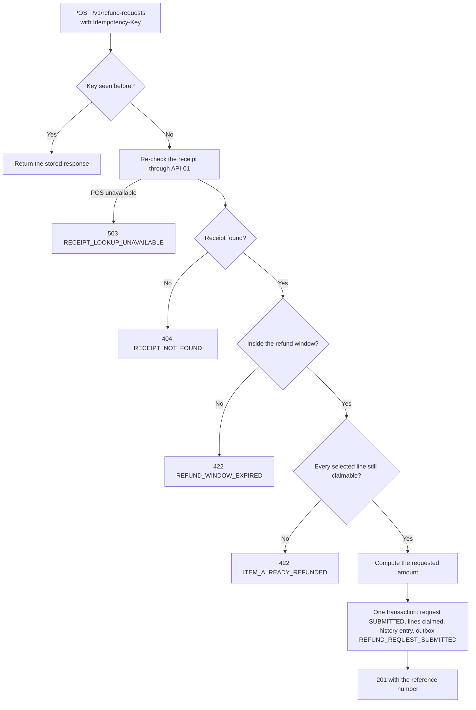
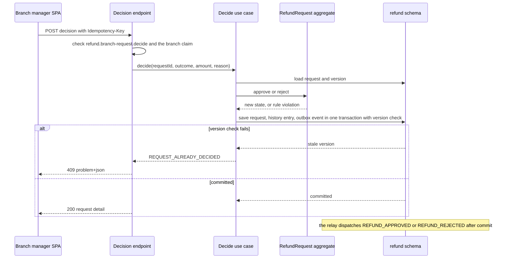

<!--
CHUNK: 13a
TITLE: Detailed Service Spec - refund
PROJECT: Refunds Portal
VERSION: 1.0
DEPENDS_ON: 09, 07, 10 (event hub - topic names, event names, and payload contracts must match chunk 10 verbatim), 11 (API contracts - integration endpoints carry their API ID and match chunk 11 verbatim), 12 (roles - permission tokens match chunk 12 verbatim)
PART OF: SDD - Refunds Portal
-->

# 17. Detailed Service Specs

---

## 17.1 refund

### What

The `refund` module owns the refund request bounded context: the receipt eligibility check against POS Records, the refund request and its lifecycle (Submitted, Approved, Rejected, Cancelled, Paid), the branch manager's decision, the status history the customer follows, and the daily branch refund report. It is a module of the single deployable (ADR-01) and the only module with user-facing endpoints.

### Boundaries

- **Owns:** the `RefundRequest` aggregate (reference number, receipt number, branch, customer, selected receipt lines, requested and approved amounts, reason, status, status history, decision), the item claims that stop a receipt line from being refunded twice, the customer contact snapshot used for messages, and the branch report query.
- **Does not own:** receipts and purchase data (POS Records, read through API-01); payouts and the CardPay interaction (`payout`, §17.2); message delivery (`notification`, §17.3); identities, roles, and branch assignment (Keycloak, §16).
- **Upstream consumers:** the SPA (customer and branch-manager screens) through the API gateway; `payout` (its `PAYOUT_SUCCEEDED` and `PAYOUT_ESCALATED` facts).
- **Downstream dependencies:** POS Records (API-01); `payout` and `notification` consume its events (§14.5.1).

### Input

| Type | Source | Description |
|------|--------|-------------|
| REST | SPA, customer screens | Receipt lookup, submission, list and detail of own requests, cancellation (List of APIs below) |
| REST | SPA, branch-manager screens | Branch queue, request detail, decision, daily branch report |
| Event | `payout` (`PAYOUT_SUCCEEDED`) | The payout of an approved request succeeded |
| Event | `payout` (`PAYOUT_ESCALATED`) | The payout still fails when the escalation window of §17.2 passes |
| REST response | POS Records (API-01) | Receipt lines, amounts, branch, and purchase date |

### Business Logic

The module realises the use cases it owns (§13). Each paragraph cites the BRD part it realises and adds only the technical design.

**Receipt check** ([UC-01](../brd-refunds-portal/06a-use-cases-customer.md#uc-01-request-a-refund) steps 1-2, A1, E1, E2, BR-1, BR-2, AC-2). `GET /v1/receipts/{receiptNumber}/refundable-items` calls POS Records through the receipt port (API-01) and returns each receipt line with its amount, currency, and a `refundable` flag. A line is not refundable while an item claim holds it (A1, BR-2). The purchase date is checked against the refund window (BR-1); outside it the call answers `REFUND_WINDOW_EXPIRED` (E1, AC-2). An unknown receipt answers `RECEIPT_NOT_FOUND` (E2). The lookup stores nothing.

**Submission** ([UC-01](../brd-refunds-portal/06a-use-cases-customer.md#uc-01-request-a-refund) steps 3-6, BR-1, BR-2, AC-1). `POST /v1/refund-requests` (with `Idempotency-Key`) repeats the receipt check against POS Records, because the receipt may have changed since the lookup; the POS call runs before the database transaction, never inside it. Then, in one transaction, it creates the request in `SUBMITTED` with a new reference number, claims each selected line, writes the first status history entry, stores the customer contact snapshot, and appends `REFUND_REQUEST_SUBMITTED` to the outbox. It answers 201 with the reference number; the email and SMS follow from `notification` (§17.3). Two concurrent submissions of the same line cannot both claim it: the claim is unique, so the second answers `ITEM_ALREADY_REFUNDED`.

**Tracking** ([UC-02](../brd-refunds-portal/06a-use-cases-customer.md#uc-02-track-refund-status-web-and-mobile) steps 1-4, A1, BR-1, AC-1). `GET /v1/refund-requests` lists the caller's own requests (filtered on the token subject as `customer_id`), newest first and paginated server-side, with reference number, amount and currency, and status; an empty page realises A1. `GET /v1/refund-requests/{refundRequestId}` returns one own request with its status history (UTC timestamps, and the reason when Rejected).

**Cancellation** ([UC-03](../brd-refunds-portal/06a-use-cases-customer.md#uc-03-cancel-a-refund-request) steps 1-5, E1, BR-1, AC-1). The SPA asks for confirmation (steps 3-4), then `POST /v1/refund-requests/{refundRequestId}/cancellation` (with `Idempotency-Key`) moves `SUBMITTED` to `CANCELLED`, releases the item claims, writes the history entry, and appends `REFUND_REQUEST_CANCELLED`. The update carries the aggregate `version`: if the branch manager decided in the meantime, the version check fails and the call answers `REQUEST_ALREADY_DECIDED` (E1).

**Decision** ([UC-04](../brd-refunds-portal/06b-use-cases-branch-manager.md#uc-04-approve--reject-refund) steps 1-6, A1, A2, BR-1, BR-2, BR-3, AC-1). `GET /v1/branches/{branchId}/refund-requests` returns the branch's `SUBMITTED` requests oldest first (`submitted_at` ascending) with amount and reason (steps 1-2); `GET /v1/branches/{branchId}/refund-requests/{refundRequestId}` opens one (step 3). `POST /v1/branches/{branchId}/refund-requests/{refundRequestId}/decision` (with `Idempotency-Key`) takes `APPROVE` with the confirmed amount (steps 4-5; a lower amount with a reason is a partial approval, A1, BR-2) or `REJECT` with a reason (A2, BR-3). Approval moves `SUBMITTED` to `APPROVED`, stores the approved amount, and appends `REFUND_APPROVED`; the payout starts in `payout` from that event (step 6, ADR-05). Rejection moves `SUBMITTED` to `REJECTED`, releases the item claims, and appends `REFUND_REJECTED`. Both writes carry the version check, so a cancellation and a decision cannot both succeed. The path `branchId` must equal the caller's `branch_id` claim (BR-1).

**Payout outcome** ([UC-04](../brd-refunds-portal/06b-use-cases-branch-manager.md#uc-04-approve--reject-refund) step 7, E1, AC-1, AC-2). On `PAYOUT_SUCCEEDED` the handler moves `APPROVED` to `PAID`, records the paid amount and provider reference in the history, and appends `REFUND_PAID`, which drives the customer's email and SMS. On `PAYOUT_ESCALATED` the request stays `APPROVED`; the handler records the escalation in the history and appends `REFUND_PAYOUT_ESCALATED`, which drives the branch manager's message. Both handlers deduplicate through the inbox.

**Daily branch report** ([BRD Reporting / Analytics](../brd-refunds-portal/09-reporting-and-analytics.md#reporting--analytics)). `GET /v1/branches/{branchId}/refund-report` with a `date` query parameter computes, for one branch and one day, the requests per status, the amounts paid, and the average time to decision (from `submitted_at` to the decision timestamp), from the module's own tables. **[NEEDS CLARIFICATION: is the daily report only viewed on demand in the portal, or also delivered each day (for example by email); and is its day the branch's local calendar day?]**

**State machine:**

**Figure 10: refund - refund request state machine**

**Summary:** A request starts `SUBMITTED` and leaves it exactly once, by cancellation, rejection, or approval; an approved request becomes `PAID` only on the payout module's success fact, and an escalation keeps it `APPROVED`. These are the lifecycle states of [BRD Definitions & Important Details](../brd-refunds-portal/03-definitions-and-domain-concepts.md#refund-request-lifecycle).

### Output

| Type | Destination | Description |
|------|-------------|-------------|
| REST response | SPA | Receipt lines, created request, request list and detail, branch queue, decision result, daily report; errors as Problem Details |
| Event | `payout` | `REFUND_APPROVED` |
| Event | `notification` | `REFUND_REQUEST_SUBMITTED`, `REFUND_REQUEST_CANCELLED`, `REFUND_REJECTED`, `REFUND_PAID`, `REFUND_PAYOUT_ESCALATED` |
| Report | Branch manager (SPA) | Daily branch refund report |

### Integrations

| Integration | Direction | Protocol | Purpose | Contract | Failure Handling |
|-------------|-----------|----------|---------|----------|------------------|
| POS Records | Outbound, Sync | Per API-01 (TBD - external) | Receipt lookup and the re-check at submission | API-01 (§15) | Timeout, retries with backoff and jitter, circuit breaker, bulkhead (§12 INT-01); on failure the call answers 503 `RECEIPT_LOOKUP_UNAVAILABLE` and creates nothing |
| `payout` | Outbound, Async (in-process) | Outbox relay | Start the payout of an approved request | `REFUND_APPROVED` (§14) | The outbox guarantees dispatch; a failing handler is retried, then dead-lettered with an alert |
| `payout` | Inbound, Async (in-process) | Outbox relay | Payout outcomes | `PAYOUT_SUCCEEDED`, `PAYOUT_ESCALATED` (§14) | Inbox deduplication; an invalid transition is dead-lettered with an alert |
| `notification` | Outbound, Async (in-process) | Outbox relay | Customer and branch-manager messages | `REFUND_REQUEST_SUBMITTED`, `REFUND_REQUEST_CANCELLED`, `REFUND_REJECTED`, `REFUND_PAID`, `REFUND_PAYOUT_ESCALATED` (§14) | The outbox guarantees dispatch; the refund flow never waits for a message |

### DB Modeling

#### Entity Relationship

The entities and fields below are the concepts the BRD names (receipt, branch, lines, amounts, reason, lifecycle, decision), plus the platform's outbox and inbox; the relational schema is pending (Tables Design).

**Figure 11: refund - conceptual entity relationship**

```mermaid
erDiagram
  REFUND_REQUEST ||--|{ REFUND_REQUEST_ITEM : contains
  REFUND_REQUEST ||--|{ REFUND_STATUS_CHANGE : records
  REFUND_REQUEST ||--o| REFUND_DECISION : receives
  REFUND_REQUEST {
    uuid id PK
    uuid tenant_id
    string reference_number
    string receipt_number
    string branch_id
    string customer_id
    string customer_email "pii"
    string customer_mobile "pii"
    string status
    decimal requested_amount
    string currency
    string reason
    int version
  }
  REFUND_REQUEST_ITEM {
    uuid id PK
    uuid refund_request_id FK
    string receipt_line_id
    decimal amount
    boolean claim_active
  }
  REFUND_STATUS_CHANGE {
    uuid id PK
    uuid refund_request_id FK
    string status
    timestamp changed_at
    string note
  }
  REFUND_DECISION {
    uuid id PK
    uuid refund_request_id FK
    string outcome
    decimal approved_amount
    string reason
    string decided_by
    timestamp decided_at
  }
  OUTBOX_EVENT {
    uuid event_id PK
    string event_type
    uuid aggregate_id
    json payload
  }
  INBOX_EVENT {
    uuid event_id PK
    string consumer
  }
```

**Summary:** A refund request contains the receipt lines it claims, records every status change, and receives at most one decision; the outbox holds the events it publishes and the inbox the payout events it has applied. The customer contact fields are PII.

#### Tables Design

**[NEEDS CLARIFICATION: table list, column types, constraints, and indexes for the entities above. The BRD describes the concepts but does not commit to a relational schema. Platform rules apply: UUIDv7 keys, `tenant_id` on every table and in every index, audit columns and `version` (§11.1). Candidate unique rules: the reference number per tenant; one active claim per tenant, receipt, and receipt line.]**

#### Migration Strategy

- **Tool:** Flyway, versioned SQL in the `refund` schema's migration location (§11.1).
- **Backward compatibility:** expand-contract (§11.1).
- **Data backfill:** none at go-live (greenfield); later backfills run as versioned migrations or batch jobs in the expand phase.
- **Rollback:** forward fix with a new versioned migration; a Helm rollback of the application is safe because every migration is backward compatible.

#### Retention Policy

- **[NEEDS CLARIFICATION: retention of refund requests, lines, status history, and decisions (financial record-keeping), of the customer contact snapshot (personal data), and of the `refund` outbox and inbox rows (§14.2).]**

#### Archival

- **[NEEDS CLARIFICATION: archival destination, format, schedule, and restore SLA for closed refund requests.]**

#### Data Encryption

- **At rest:** **[NEEDS CLARIFICATION: database or volume encryption at rest, and whether the contact columns get column-level encryption.]**
- **In transit:** TLS between the deployable and PostgreSQL and on every external call (§11.6).
- **Key management:** **[NEEDS CLARIFICATION: key management service and rotation policy.]**
- **PII columns:** `customer_email`, `customer_mobile`, `customer_id`; masked or synthetic in every non-production environment.

### Multi-Tenancy Specifications

- **Strategy override:** none; shared schema with `tenant_id` (§11.2).
- **Tenant filter:** every query filters on the token's tenant; customer endpoints add `customer_id` = token subject; branch endpoints add `branch_id` = the caller's `branch_id` claim (§16.2, NFR-04).
- **Cross-tenant queries:** none; the queue and the report are always per tenant and branch.

### API Standards

- **Style:** REST over HTTPS with JSON (ADR-04).
- **Versioning:** URI prefix `/v1`.
- **Authentication:** Keycloak-issued bearer JWT, validated at the gateway and again in the module (§11.6).
- **Idempotency:** `Idempotency-Key` required on the submission, cancellation, and decision endpoints (they trigger messages or a payout); a replay with the same key returns the stored response, and a reuse with a different body answers 409 `CONFLICT`. **[NEEDS CLARIFICATION: how long idempotency keys are kept.]**
- **Pagination:** server-side, `page` and `size` query parameters with a stable sort (customer list: newest first; branch queue: `submitted_at` ascending, then id).
- **Error envelope:** RFC 9457 Problem Details with an `errorCode` (§15.1); the module's domain codes are under Error Handling.

#### List of APIs (Swagger-friendly)

Every endpoint below is client-facing (called only by the SPA), so none carries an API ID; the contracts are in the module's OpenAPI specification (§21).

| Method | Path | Summary | Request Body | Response | Auth Scope | API ID (§15) |
|--------|------|---------|--------------|----------|------------|--------------|
| GET | `/v1/receipts/{receiptNumber}/refundable-items` | Look up a receipt's lines with amounts and refundable flags | - | `RefundableItems` | `refund.receipt.read` | - |
| POST | `/v1/refund-requests` | Submit a refund request | `SubmitRefundRequest` | `RefundRequestCreated` | `refund.request.create` | - |
| GET | `/v1/refund-requests` | List the caller's own refund requests | - | `RefundRequestPage` | `refund.request.read` | - |
| GET | `/v1/refund-requests/{refundRequestId}` | Open one own request with its status history | - | `RefundRequestDetail` | `refund.request.read` | - |
| POST | `/v1/refund-requests/{refundRequestId}/cancellation` | Cancel a Submitted request | - | `RefundRequestDetail` | `refund.request.cancel` | - |
| GET | `/v1/branches/{branchId}/refund-requests` | Branch queue: Submitted requests, oldest first | - | `BranchRefundRequestPage` | `refund.branch-request.read` | - |
| GET | `/v1/branches/{branchId}/refund-requests/{refundRequestId}` | Open one request of the branch | - | `RefundRequestDetail` | `refund.branch-request.read` | - |
| POST | `/v1/branches/{branchId}/refund-requests/{refundRequestId}/decision` | Approve (full or partial) or reject a Submitted request | `RefundDecision` | `RefundRequestDetail` | `refund.branch-request.decide` | - |
| GET | `/v1/branches/{branchId}/refund-report` | Daily branch refund report (`date` query parameter) | - | `BranchRefundReport` | `refund.branch-report.read` | - |

**[NEEDS CLARIFICATION: request and response schemas (OpenAPI) for the endpoints above. The use cases imply the endpoints and their fields but do not fix the shapes.]**

### Event-Driven Architecture (If Applicable)

#### Event Model

**Published events:**

| Event Name | Producer | Producer Specs | Consumers | Consumer Specs | Schema (Summary) | Delivery Guarantee |
|------------|----------|----------------|-----------|----------------|------------------|---------------------|
| `REFUND_REQUEST_SUBMITTED` | refund | Channel `refunds-portal-refund-events` (§14.4); key `tenant_id` + `aggregate_id`; ordered by `aggregate_version` | notification | Inbox deduplication on (`notification`, `event_id`) | `reference_number`, `branch_id`, `requested_amount`, `customer_contact` (§14.9.1) | At-least-once delivery; exactly-once effect |
| `REFUND_REQUEST_CANCELLED` | refund | Channel `refunds-portal-refund-events` (§14.4); key `tenant_id` + `aggregate_id`; ordered by `aggregate_version` | notification | Inbox deduplication on (`notification`, `event_id`) | `reference_number`, `customer_contact` (§14.9.2) | At-least-once delivery; exactly-once effect |
| `REFUND_APPROVED` | refund | Channel `refunds-portal-refund-events` (§14.4); key `tenant_id` + `aggregate_id`; ordered by `aggregate_version` | payout | Inbox deduplication on (`payout`, `event_id`); one payout per refund request | `reference_number`, `branch_id`, `receipt_number`, `approved_amount`, `partial`, `partial_reason`, `original_payment_reference` (§14.9.3) | At-least-once delivery; exactly-once effect |
| `REFUND_REJECTED` | refund | Channel `refunds-portal-refund-events` (§14.4); key `tenant_id` + `aggregate_id`; ordered by `aggregate_version` | notification | Inbox deduplication on (`notification`, `event_id`) | `reference_number`, `rejection_reason`, `customer_contact` (§14.9.4) | At-least-once delivery; exactly-once effect |
| `REFUND_PAID` | refund | Channel `refunds-portal-refund-events` (§14.4); key `tenant_id` + `aggregate_id`; ordered by `aggregate_version` | notification | Inbox deduplication on (`notification`, `event_id`) | `reference_number`, `paid_amount`, `customer_contact` (§14.9.5) | At-least-once delivery; exactly-once effect |
| `REFUND_PAYOUT_ESCALATED` | refund | Channel `refunds-portal-refund-events` (§14.4); key `tenant_id` + `aggregate_id`; ordered by `aggregate_version` | notification | Inbox deduplication on (`notification`, `event_id`) | `reference_number`, `branch_id`, `approved_amount`, `first_attempt_at`, `last_failure_reason` (§14.9.6) | At-least-once delivery; exactly-once effect |

**Consumed events:**

| Event Name | Producer (owning service) | Topic | Effect in this service | Idempotency / ordering |
|------------|---------------------------|-------|------------------------|------------------------|
| `PAYOUT_SUCCEEDED` | payout | `refunds-portal-payout-events` | `APPROVED` -> `PAID` for `refund_request_id`; the history records `paid_amount` and `provider_reference`; appends `REFUND_PAID` | Inbox deduplication on (`refund`, `event_id`); the transition is validated against the current state |
| `PAYOUT_ESCALATED` | payout | `refunds-portal-payout-events` | The request stays `APPROVED`; the history records the escalation with `first_attempt_at` and `last_failure_reason`; appends `REFUND_PAYOUT_ESCALATED` | Inbox deduplication on (`refund`, `event_id`); applied only while the request is `APPROVED` |

#### Messaging Infra

- **Broker:** none; in-process relay over the `refund` outbox table (ADR-02, §14.2).
- **Schema registry:** JSON Schema per event in the application repository; additive-only changes checked in CI (§14.2).
- **Serialization:** JSON.
- **Topic strategy:** logical channel `refunds-portal-refund-events`; key `tenant_id` + `aggregate_id` (the refund request id).
- **Retention:** dispatched outbox rows are kept for replay per §14.2.
- **DLQ strategy:** a failing handler is retried with backoff, then its event goes to the consuming module's dead-letter table with an alert; redrive per §20.

### Constraints

- **Refund window and single refund per line** ([UC-01](../brd-refunds-portal/06a-use-cases-customer.md#uc-01-request-a-refund) BR-1, BR-2): checked at lookup and re-checked at submission. **[NEEDS CLARIFICATION: is the refund window counted in calendar days in the branch's local time zone, or in whole 24-hour periods from the purchase timestamp stored in UTC?]**
- **Item claims:** a receipt line is claimed by a request in `SUBMITTED`, `APPROVED`, or `PAID`, and a line has at most one active claim; rejection and cancellation release the claim. **[NEEDS CLARIFICATION: confirm that a line from a Rejected or Cancelled request can be requested again, and that a line refunded in part cannot.]**
- **State rules:** only `SUBMITTED` requests can be cancelled ([UC-03](../brd-refunds-portal/06a-use-cases-customer.md#uc-03-cancel-a-refund-request) BR-1) or decided ([UC-04](../brd-refunds-portal/06b-use-cases-branch-manager.md#uc-04-approve--reject-refund) preconditions).
- **Amounts:** a partial amount is greater than 0, less than the requested amount, and comes with a reason ([UC-04](../brd-refunds-portal/06b-use-cases-branch-manager.md#uc-04-approve--reject-refund) BR-2, A1); a rejection always has a reason (BR-3); every amount carries its currency ([BRD UI/UX Expectations](../brd-refunds-portal/11-summary-and-uiux.md#uiux-expectations)).
- **Requested amount:** **[NEEDS CLARIFICATION: is it the sum of the selected lines' paid amounts from POS Records, or do rules of the Store refund policy v3 ([BRD Appendix](../brd-refunds-portal/12-appendix-and-wishlist.md#appendix)) adjust it?]**
- **Reference number:** unique per tenant and shown to the customer. **[NEEDS CLARIFICATION: reference number format.]**
- **Customer contact:** the email address and mobile number are captured at submission and kept with the request for its messages. **[NEEDS CLARIFICATION: source of the contact details: the identity profile's claims, or fields on the request form.]**
- **Authorization** (tokens verbatim from §16.11): the customer endpoints require `refund.receipt.read`, `refund.request.create`, `refund.request.read`, or `refund.request.cancel` (role `CUSTOMER`) and serve only the caller's own requests ([UC-02](../brd-refunds-portal/06a-use-cases-customer.md#uc-02-track-refund-status-web-and-mobile) BR-1, NFR-04); the branch endpoints require `refund.branch-request.read`, `refund.branch-request.decide`, or `refund.branch-report.read` (role `BRANCH_MANAGER`), and the path `branchId` must equal the caller's `branch_id` claim ([BRD Users & Use Cases Matrix](../brd-refunds-portal/07-users-use-cases-matrix.md#users--use-cases-matrix) footnote 1; [UC-04](../brd-refunds-portal/06b-use-cases-branch-manager.md#uc-04-approve--reject-refund) BR-1).

### Error Handling

- **Synchronous APIs:** RFC 9457 Problem Details with an `errorCode` (§15.1); `title` and `detail` say what went wrong and what the user can do next (§11.6).
- **Validation errors:** 400 `VALIDATION_FAILED`, with `errors[]` naming each field: no line selected or no reason given ([UC-01](../brd-refunds-portal/06a-use-cases-customer.md#uc-01-request-a-refund) step 3), a partial approval without a reason ([UC-04](../brd-refunds-portal/06b-use-cases-branch-manager.md#uc-04-approve--reject-refund) A1), a rejection without a reason (A2, BR-3).
- **Domain errors:** [UC-01](../brd-refunds-portal/06a-use-cases-customer.md#uc-01-request-a-refund) E2 -> 404 `RECEIPT_NOT_FOUND` (check the number and try again); [UC-01](../brd-refunds-portal/06a-use-cases-customer.md#uc-01-request-a-refund) E1 -> 422 `REFUND_WINDOW_EXPIRED` (the purchase is outside the refund window; visit the branch); [UC-01](../brd-refunds-portal/06a-use-cases-customer.md#uc-01-request-a-refund) A1 -> a claimed line is returned with `refundable: false`, and submitting it answers 422 `ITEM_ALREADY_REFUNDED`; [UC-03](../brd-refunds-portal/06a-use-cases-customer.md#uc-03-cancel-a-refund-request) E1 -> 409 `REQUEST_ALREADY_DECIDED`; a decision on a request that is no longer `SUBMITTED` -> 409 `REQUEST_ALREADY_DECIDED`; [UC-04](../brd-refunds-portal/06b-use-cases-branch-manager.md#uc-04-approve--reject-refund) BR-2 -> 422 `INVALID_PARTIAL_AMOUNT`.
- **Auth errors:** 401 `UNAUTHENTICATED`; a `branchId` other than the caller's claim -> 403 `FORBIDDEN`; another customer's request, or another branch's request under the caller's branch path -> 404 `NOT_FOUND`, so its existence is not disclosed (NFR-04).
- **Server errors:** 500 `INTERNAL_ERROR` with no internal detail; POS Records unavailable or its circuit open -> 503 `RECEIPT_LOOKUP_UNAVAILABLE` (receipts cannot be checked right now; try again in a few minutes).
- **Async consumers:** the `PAYOUT_SUCCEEDED` and `PAYOUT_ESCALATED` handlers are idempotent (inbox) and validate the transition; an event for a request that is not `APPROVED` is dead-lettered with an alert, never applied.
- **Poison messages:** after bounded retries the event goes to the `refund` dead-letter table with an alert; redrive per §20.

### Observability & Monitoring

#### Logging

- Structured JSON per §11.4, with `module` = `refund`.
- The reference number and request id may be logged; customer contact details, `customer_id`, and `tenant_id` are never logged at INFO level.
- Retention per the §6 logging row.

#### Metrics

| Metric | Type | Labels | Purpose |
|--------|------|--------|---------|
| `refund_requests_submitted_total` | counter | - | Intake volume; input of the §18 load estimates |
| `refund_decisions_total` | counter | `outcome` (`approved_full`, `approved_partial`, `rejected`) | Decision mix |
| `refund_time_to_decision_seconds` | histogram | - | Business Objective 1: submission to decision |
| `refund_time_to_payout_seconds` | histogram | - | Business Objective 1: submission to Paid |
| `refund_receipt_lookup_duration_seconds` | histogram | `outcome` | POS Records health (INT-01) |
| `refund_outbox_pending_events` | gauge | - | Outbox backlog (§14.2) |

The standard HTTP server RED metrics per endpoint come in addition.

#### Tracing

- OpenTelemetry instrumentation of the REST endpoints, the POS Records client, JDBC, and the event handlers.
- The submission's correlation id is written into every event envelope of the request, so one refund can be followed from submission to Paid.
- Sampling per the §6 tracing row.

### Developer Notes

- **Recommended patterns:** a hexagonal module (`ReceiptLookupPort` implemented by the POS Records adapter, `RefundRequestRepository`, `EventOutbox`); transitions only inside the `RefundRequest` aggregate, guarded by its current state; optimistic locking on `version`; the POS call before the transaction, the state change and the outbox append inside it.
- **Avoid:** calling POS Records inside a database transaction; reading `payout` or `notification` tables; logging contact details; transition rules in controllers.
- **Testing:** JUnit 5 and Mockito for the aggregate and application services (every transition and every exception flow cited above); Testcontainers PostgreSQL for repositories, item claims, the outbox, and the concurrent cancel-versus-decide case; an adapter contract test for API-01 once its contract is defined; Playwright for the customer and branch-manager journeys; test names `methodName_scenario_expectedResult`.

### Service-Level Diagrams

#### Implementation Flow Chart

**Figure 12: refund - submission flow**

**Summary:** A submission replays safely by its idempotency key, re-checks the receipt outside the transaction, and maps each failed check to the error of the exception flow it realises; only a fully valid request is written, together with its claims and its outbox event, in one transaction.

#### Sequence Diagram (Service-Internal)

**Figure 13: refund - decision sequence**

**Summary:** The decision endpoint checks the permission token and the branch claim, the aggregate enforces the state and amount rules, and one transaction saves the new state with its outbox event under a version check; a concurrent cancellation or decision makes the version check fail and returns 409.

### Compliance

- **GDPR:** customer contact details and `customer_id` are personal data. **[NEEDS CLARIFICATION: lawful basis, retention window, and right-to-erasure flow for the customer data this module holds.]**
- **PCI-DSS:** not applicable; the module stores and transmits no card data.
- **ISO 27001 / SOC 2:** **[NEEDS CLARIFICATION: applicable control framework, if any.]**
- **Local regulations:** **[NEEDS CLARIFICATION: consumer-protection and record-keeping rules that apply to refunds.]**

### Deployment Strategy

- **Service-specific override:** none; the module ships in the single deployable (§11.3).
- **Replicas:** those of the deployable (§11.3).
- **Strategy:** rolling update (§11.3).
- **Health checks:** liveness and readiness endpoints; readiness includes the database but not POS Records, because a POS outage must not take replicas out of rotation (the API answers 503 `RECEIPT_LOOKUP_UNAVAILABLE` instead).
- **Rollback:** Helm rollback of the deployable, safe because migrations are backward compatible (§11.1).

### Future Enhancements

- Push notifications in the mobile app ([UC-02](../brd-refunds-portal/06a-use-cases-customer.md#uc-02-track-refund-status-web-and-mobile) Future Enhancements); delivery would be a new channel in `notification` (§17.3).
- Bulk approval of small refunds ([UC-04](../brd-refunds-portal/06b-use-cases-branch-manager.md#uc-04-approve--reject-refund) Future Enhancements).

<!-- MASTER: refunds-portal-sdd-master.md | PREV: 12-centralized-user-roles.md | NEXT: 13b-service-payout.md -->
