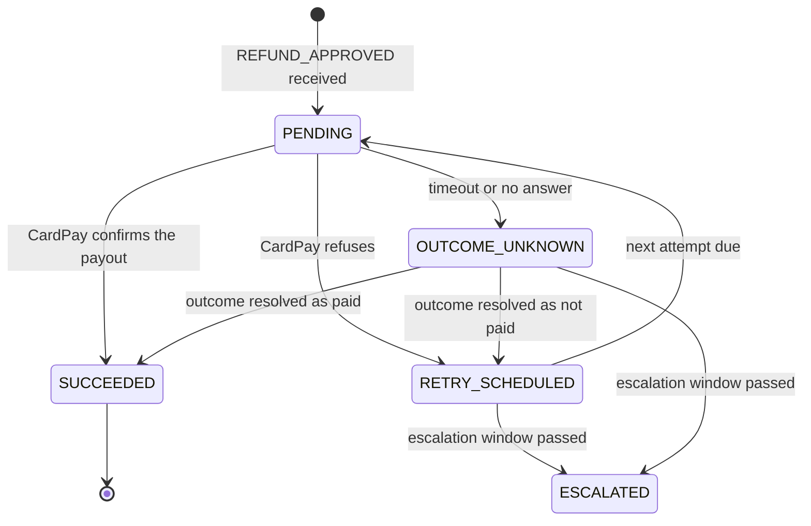
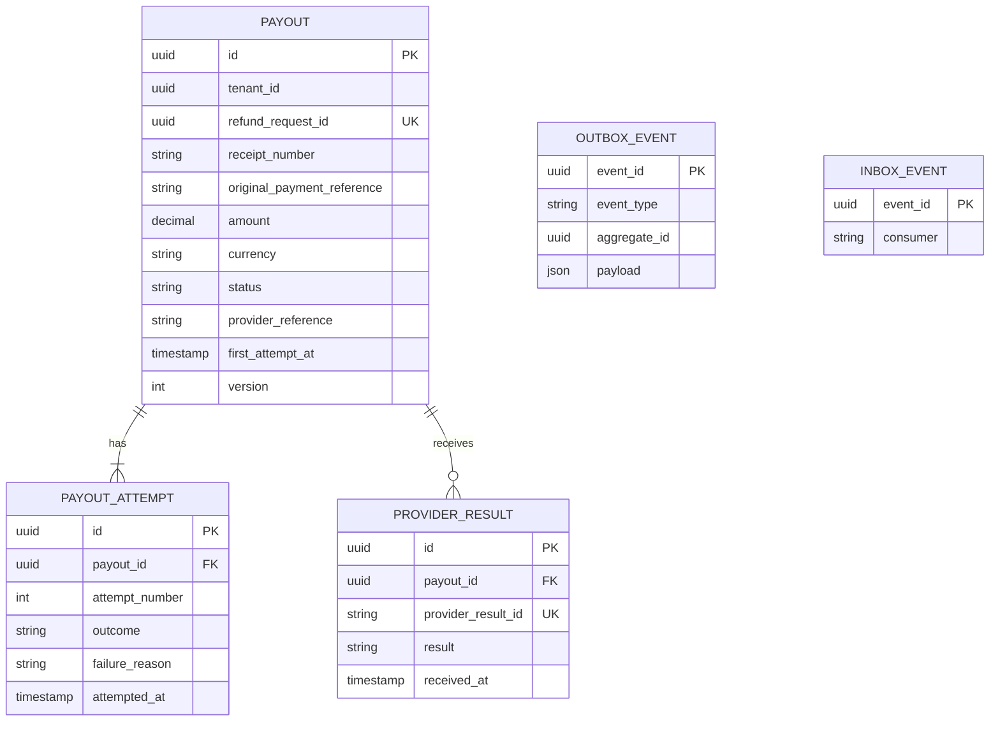
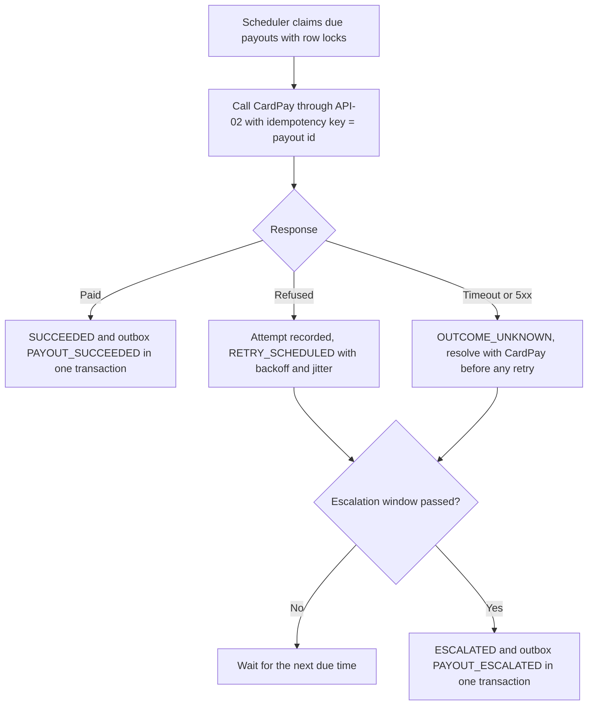
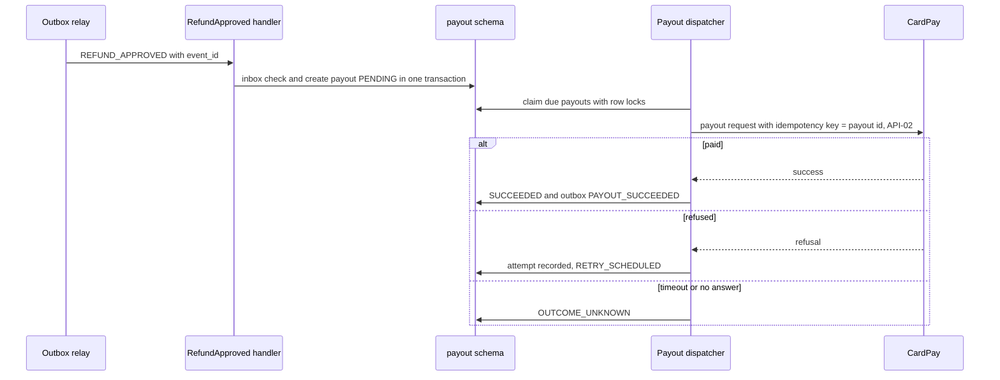

<!--
CHUNK: 13b
TITLE: Detailed Service Spec - payout
PROJECT: Refunds Portal
VERSION: 1.0
DEPENDS_ON: 09, 07, 10 (event hub - topic names, event names, and payload contracts must match chunk 10 verbatim), 11 (API contracts - integration endpoints carry their API ID and match chunk 11 verbatim), 12 (roles - permission tokens match chunk 12 verbatim)
PART OF: SDD - Refunds Portal
-->

# 17. Detailed Service Specs

---

## 17.2 payout

### What

The `payout` module pays each approved refund back to the original card through CardPay and reports the outcome, so that refund money is never lost or paid twice (NFR-01). It is a module of the single deployable (ADR-01) with no user-facing endpoint.

### Boundaries

- **Owns:** the `Payout` aggregate (one per refund request: amount, currency, status, provider reference, first attempt time), its attempts, the provider results received, and the retry and escalation schedule.
- **Does not own:** the refund request and its status (`refund`, §17.1); customer and branch-manager messages (`notification`, §17.3); card details (CardPay; the platform never holds card data).
- **Upstream consumers:** `refund` (its `REFUND_APPROVED` fact); CardPay (payout results, API-03).
- **Downstream dependencies:** CardPay (API-02); `refund` consumes its events (§14.5.2).

### Input

| Type | Source | Description |
|------|--------|-------------|
| Event | `refund` (`REFUND_APPROVED`) | Start the payout of an approved request for the approved amount |
| REST (inbound) | CardPay (API-03) | A payout result; mechanism TBD - external |
| Schedule | Payout dispatcher | Claims due payouts and calls CardPay |
| Schedule | Escalation check | Escalates payouts without success when the escalation window passes |

### Business Logic

The module owns no use case (§13); it realises the money movement of [UC-04](../brd-refunds-portal/06b-use-cases-branch-manager.md#uc-04-approve--reject-refund) steps 6-7, E1, AC-1, and AC-2, which `refund` owns, under NFR-01.

**Payout creation** ([UC-04](../brd-refunds-portal/06b-use-cases-branch-manager.md#uc-04-approve--reject-refund) step 6). On `REFUND_APPROVED` the handler (inbox deduplication) creates one `Payout` in `PENDING` for `approved_amount`, unique per tenant and refund request, so a redelivered event is a no-op. The payout keeps `receipt_number` and, when present, `original_payment_reference`, because payouts go only to the card used for the purchase ([BRD Assumptions / Constraints](../brd-refunds-portal/02-glossary-assumptions-facts.md#assumptions--constraints) 2). **[NEEDS CLARIFICATION: how CardPay addresses the original card (R-04): by the original payment reference returned by POS Records (API-01), or by a receipt-based lookup on CardPay's side (API-02).]**

**Dispatch.** A scheduler claims due payouts with row locks (`FOR UPDATE SKIP LOCKED`), so any replica can run it without double dispatch. It calls API-02 outside any database transaction, with the payout id as the idempotency key on every attempt, and records the attempt before and after the call.

**Outcomes** ([UC-04](../brd-refunds-portal/06b-use-cases-branch-manager.md#uc-04-approve--reject-refund) step 7, E1). Paid: `SUCCEEDED`, and `PAYOUT_SUCCEEDED` appended to the outbox in the same transaction. Refused: `RETRY_SCHEDULED`, with the next attempt set by exponential backoff with jitter. Timeout, 5xx, or no answer: `OUTCOME_UNKNOWN`; the outcome is resolved with CardPay (status query or result, API-02, API-03) before any new attempt, never by a blind retry. **[NEEDS CLARIFICATION: retry intervals and attempt cap inside the escalation window.]**

**Escalation** ([UC-04](../brd-refunds-portal/06b-use-cases-branch-manager.md#uc-04-approve--reject-refund) E1, AC-2). The escalation window is one day from the first attempt. A payout without success when the window passes moves to `ESCALATED` and appends `PAYOUT_ESCALATED` exactly once; the refund request stays Approved (`refund` owns that state). **[NEEDS CLARIFICATION: after the escalation, does the payout keep retrying, stop, or wait for an action by the branch manager; and which action can the branch manager take? The BRD exception flow cited above says only that the branch manager is told.]**

**Results** (API-03). Results are deduplicated on the provider's result identifier. A result for a `SUCCEEDED` payout is acknowledged and ignored; a success result for a payout in `PENDING`, `RETRY_SCHEDULED`, or `OUTCOME_UNKNOWN` completes it as above.

**Never paid twice** (NFR-01): one payout per refund request, one idempotency key for all its attempts, and no new attempt while an outcome is unknown.

**State machine:**

**Figure 14: payout - payout state machine**

**Summary:** A payout is attempted from `PENDING`, retried after a refusal, and never retried while its outcome is unknown; it ends `SUCCEEDED`, or becomes `ESCALATED` when the escalation window passes. What follows `ESCALATED` is open (see the escalation clarification above).

### Output

| Type | Destination | Description |
|------|-------------|-------------|
| REST call | CardPay (API-02) | Payout request with the payout's idempotency key |
| REST response | CardPay (API-03) | Acknowledgement of a payout result (TBD - external) |
| Event | `refund` | `PAYOUT_SUCCEEDED`, `PAYOUT_ESCALATED` |

### Integrations

| Integration | Direction | Protocol | Purpose | Contract | Failure Handling |
|-------------|-----------|----------|---------|----------|------------------|
| CardPay - payout request | Outbound, Sync (from the dispatcher) | Per API-02 (TBD - external) | Pay out an approved refund | API-02 (§15) | Backoff-and-jitter retries with the same idempotency key, outcome resolution before any retry, circuit breaker and bulkhead, escalation when the window passes (§12 INT-02) |
| CardPay - payout result | Inbound, Sync | Per API-03 (TBD - external) | Receive payout results | API-03 (§15) | Deduplicated on the provider's result identifier; unauthenticated results rejected per the provider scheme (TBD - external) |
| `refund` | Inbound, Async (in-process) | Outbox relay | Approved refunds | `REFUND_APPROVED` (§14) | Inbox deduplication; a failing handler is retried, then dead-lettered with an alert |
| `refund` | Outbound, Async (in-process) | Outbox relay | Payout outcomes | `PAYOUT_SUCCEEDED`, `PAYOUT_ESCALATED` (§14) | The outbox guarantees dispatch |

### DB Modeling

#### Entity Relationship

**Figure 15: payout - conceptual entity relationship**

**Summary:** One payout exists per refund request (unique `refund_request_id`); it records every attempt and every provider result, the latter unique on the provider's identifier. The outbox holds the payout facts and the inbox the approvals already applied.

#### Tables Design

**[NEEDS CLARIFICATION: table list, column types, constraints, and indexes for the entities above. Platform rules apply: UUIDv7 keys, `tenant_id` on every table and in every index, audit columns and `version` (§11.1). Required unique rules: one payout per tenant and refund request; one provider result per provider result identifier.]**

#### Migration Strategy

- **Tool:** Flyway, versioned SQL in the `payout` schema's migration location (§11.1).
- **Backward compatibility:** expand-contract (§11.1).
- **Data backfill:** none at go-live (greenfield).
- **Rollback:** forward fix with a new versioned migration; payouts in flight resume from their persisted state after an application rollback.

#### Retention Policy

- **[NEEDS CLARIFICATION: retention of payouts, attempts, and provider results as financial records, and of the `payout` outbox and inbox rows (§14.2).]**

#### Archival

- **[NEEDS CLARIFICATION: archival destination, format, schedule, and restore SLA for settled payouts.]**

#### Data Encryption

- **At rest:** **[NEEDS CLARIFICATION: database or volume encryption at rest.]**
- **In transit:** TLS to PostgreSQL and to CardPay (§11.6).
- **Key management:** **[NEEDS CLARIFICATION: key management service and rotation policy; CardPay credentials rotate per §11.6.]**
- **PII columns:** none; the module holds no contact data and no card data.

### Multi-Tenancy Specifications

- **Strategy override:** none; shared schema with `tenant_id` (§11.2).
- **Tenant filter:** every query filters on `tenant_id`; the dispatcher reads due payouts across tenants and processes each one under its own tenant context (§11.2).
- **Cross-tenant queries:** only the dispatcher's due-payout selection. The tenant context on each CardPay call follows API-02 (TBD - external).

### API Standards

- **Style:** REST over HTTPS for the one inbound endpoint (API-03), shaped by CardPay's result scheme (TBD - external).
- **Versioning:** URI prefix `/v1` once the endpoint path is defined (§15.1).
- **Authentication:** the provider's scheme for results (signature or credential), TBD - external (API-03).
- **Idempotency:** results deduplicated on the provider's result identifier; outbound attempts reuse the payout id as the idempotency key.
- **Pagination:** not applicable.
- **Error envelope:** as CardPay's result scheme expects (TBD - external); internal errors never leak details.

#### List of APIs (Swagger-friendly)

| Method | Path | Summary | Request Body | Response | Auth Scope | API ID (§15) |
|--------|------|---------|--------------|----------|------------|--------------|
| TBD | TBD | Receive a CardPay payout result | TBD | TBD | Provider authentication (TBD - external) | API-03 |

### Event-Driven Architecture (If Applicable)

#### Event Model

**Published events:**

| Event Name | Producer | Producer Specs | Consumers | Consumer Specs | Schema (Summary) | Delivery Guarantee |
|------------|----------|----------------|-----------|----------------|------------------|---------------------|
| `PAYOUT_SUCCEEDED` | payout | Channel `refunds-portal-payout-events` (§14.4); key `tenant_id` + `aggregate_id`; ordered by `aggregate_version` | refund | Inbox deduplication on (`refund`, `event_id`) | `refund_request_id`, `paid_amount`, `provider_reference` (§14.9.7) | At-least-once delivery; exactly-once effect |
| `PAYOUT_ESCALATED` | payout | Channel `refunds-portal-payout-events` (§14.4); key `tenant_id` + `aggregate_id`; ordered by `aggregate_version` | refund | Inbox deduplication on (`refund`, `event_id`) | `refund_request_id`, `attempt_count`, `first_attempt_at`, `last_failure_reason` (§14.9.8) | At-least-once delivery; exactly-once effect |

**Consumed events:**

| Event Name | Producer (owning service) | Topic | Effect in this service | Idempotency / ordering |
|------------|---------------------------|-------|------------------------|------------------------|
| `REFUND_APPROVED` | refund | `refunds-portal-refund-events` | Creates one payout in `PENDING` for `approved_amount`, keyed by the refund request (`aggregate_id`), keeping `receipt_number` and `original_payment_reference` | Inbox deduplication on (`payout`, `event_id`); unique payout per tenant and refund request |

#### Messaging Infra

- **Broker:** none; in-process relay over the `payout` outbox table (ADR-02, §14.2).
- **Schema registry:** JSON Schema per event in the application repository; additive-only changes checked in CI (§14.2).
- **Serialization:** JSON.
- **Topic strategy:** logical channel `refunds-portal-payout-events`; key `tenant_id` + `aggregate_id` (the payout id).
- **Retention:** dispatched outbox rows are kept for replay per §14.2.
- **DLQ strategy:** a failing `REFUND_APPROVED` handler is retried with backoff, then the event goes to the `payout` dead-letter table with an alert; redrive per §20.

### Constraints

- One payout per refund request; its amount and currency are exactly `approved_amount` and are never recomputed.
- Payouts go only to the original card ([BRD Assumptions / Constraints](../brd-refunds-portal/02-glossary-assumptions-facts.md#assumptions--constraints) 2).
- CardPay is never called inside a database transaction; state is written before and after each call.
- No new attempt while an outcome is unknown (NFR-01).
- No permission token applies: the module has no user-facing endpoint, and API-03 is authenticated by the provider's scheme (TBD - external).

### Error Handling

- **Synchronous APIs (API-03 inbound):** a result that fails the provider's authentication is rejected; a result for an unknown payout reference is acknowledged, logged at WARN without personal data, and raises an alert.
- **Validation errors:** a malformed result is rejected per the provider scheme (TBD - external).
- **Domain errors:** CardPay refusals follow the retry path until the escalation window passes ([UC-04](../brd-refunds-portal/06b-use-cases-branch-manager.md#uc-04-approve--reject-refund) E1). **[TBD - EXTERNAL: CardPay error codes and which refusals are final (API-02); until known, every refusal is treated as retryable.]**
- **Auth errors:** a 401 or 403 from CardPay opens the circuit and raises an alert (credential problem), without consuming the payout's retries.
- **Server errors:** 5xx and timeouts from CardPay lead to `OUTCOME_UNKNOWN` and outcome resolution, never to a blind retry.
- **Async consumers:** the `REFUND_APPROVED` handler is idempotent (inbox plus the unique payout).
- **Poison messages:** after bounded retries the event goes to the `payout` dead-letter table with an alert; redrive per §20.

### Observability & Monitoring

#### Logging

- Structured JSON per §11.4, with `module` = `payout`.
- Payout id, refund request id, attempt number, and provider reference may be logged; `tenant_id` never at INFO level; no card data exists to log.
- Retention per the §6 logging row.

#### Metrics

| Metric | Type | Labels | Purpose |
|--------|------|--------|---------|
| `payout_attempts_total` | counter | `outcome` (`paid`, `refused`, `unknown`) | CardPay health and refusal rate |
| `payout_escalations_total` | counter | - | Escalations ([UC-04](../brd-refunds-portal/06b-use-cases-branch-manager.md#uc-04-approve--reject-refund) E1); alert on any increase |
| `payout_outcome_unknown` | gauge | - | Payouts awaiting outcome resolution (NFR-01 watch) |
| `payout_time_to_success_seconds` | histogram | - | Approval to confirmed payout |
| `payout_provider_call_duration_seconds` | histogram | `outcome` | API-02 latency |

#### Tracing

- OpenTelemetry spans for the `REFUND_APPROVED` handler, each dispatcher run, each CardPay call, and each API-03 result.
- The correlation id from the `REFUND_APPROVED` envelope is carried into the payout facts.
- Sampling per the §6 tracing row.

### Developer Notes

- **Recommended patterns:** `PayoutProviderPort` behind a CardPay anti-corruption adapter; Resilience4j circuit breaker and bulkhead on the adapter; transitions only inside the `Payout` aggregate; row-lock claims for the dispatcher.
- **Avoid:** a new idempotency key per attempt; retrying an unknown outcome; calling CardPay inside a transaction; reading `refund` tables.
- **Testing:** JUnit 5 and Mockito for the state machine (every transition, including unknown outcomes and the escalation window); Testcontainers PostgreSQL for the unique payout per refund request, `SKIP LOCKED` claims across two dispatchers, and the outbox; a CardPay stub for API-02 and API-03 once they are documented; test names `methodName_scenario_expectedResult`.

### Service-Level Diagrams

#### Implementation Flow Chart

**Figure 16: payout - dispatch flow**

**Summary:** Each dispatcher run claims due payouts, calls CardPay once per payout with the stable idempotency key, and turns the answer into a success fact, a scheduled retry, or an outcome to resolve; when the escalation window passes without success the payout escalates once.

#### Sequence Diagram (Service-Internal)

**Figure 17: payout - approval to payout sequence**

**Summary:** The approval is applied once through the inbox and creates the payout; the dispatcher later calls CardPay outside any transaction and records the outcome, with a timeout recorded as an unknown outcome rather than a failure.

### Compliance

- **GDPR:** the module holds no personal data beyond references to the refund request.
- **PCI-DSS:** not applicable while CardPay addresses the original card by reference and the platform never receives card data. **[NEEDS CLARIFICATION: confirm with CardPay that no cardholder data reaches the platform (R-04).]**
- **ISO 27001 / SOC 2:** **[NEEDS CLARIFICATION: applicable control framework, if any.]**
- **Local regulations:** **[NEEDS CLARIFICATION: record-keeping rules for refund payouts.]**

### Deployment Strategy

- **Service-specific override:** none; the module ships in the single deployable (§11.3).
- **Replicas:** those of the deployable (§11.3); the dispatcher and the escalation check run on every replica, coordinated by row locks.
- **Strategy:** rolling update (§11.3); an in-flight attempt interrupted by a restart is recorded as an unknown outcome and resolved before any retry.
- **Health checks:** liveness and readiness endpoints; readiness does not depend on CardPay.
- **Rollback:** Helm rollback of the deployable; payouts resume from their persisted state.

### Future Enhancements

- None identified from the BRD.

<!-- MASTER: refunds-portal-sdd-master.md | PREV: 13a-service-refund.md | NEXT: 13c-service-notification.md -->
