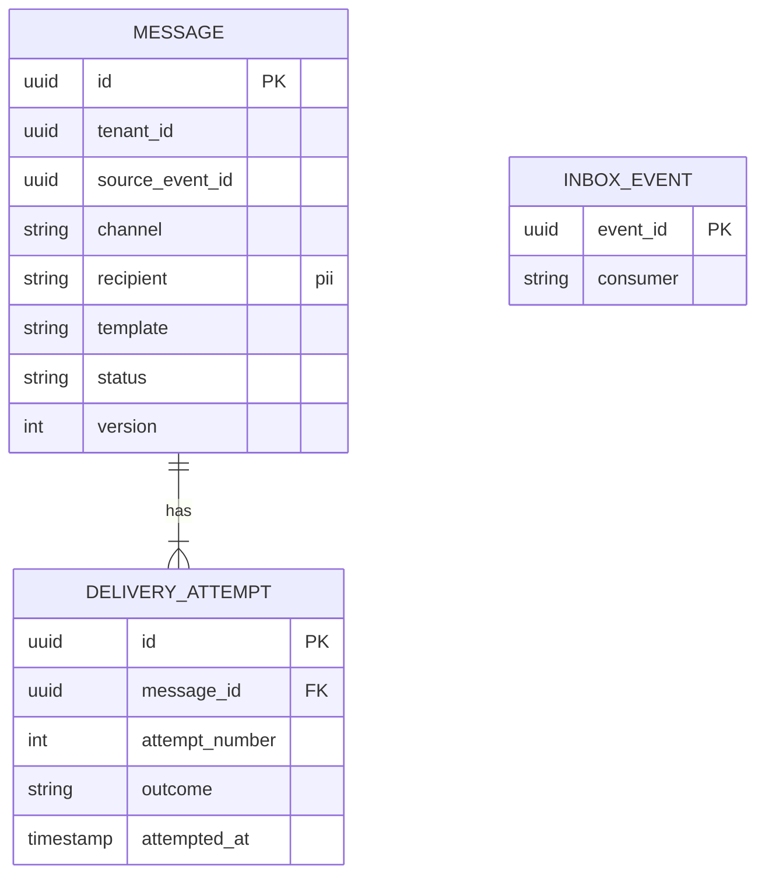
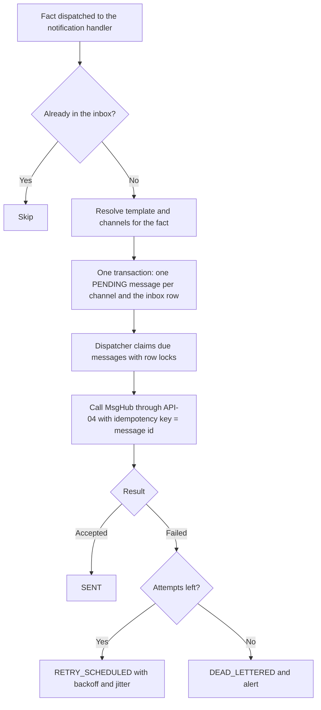

<!--
CHUNK: 13c
TITLE: Detailed Service Spec - notification
PROJECT: Refunds Portal
VERSION: 1.0
DEPENDS_ON: 09, 07, 10 (event hub - topic names, event names, and payload contracts must match chunk 10 verbatim), 11 (API contracts - integration endpoints carry their API ID and match chunk 11 verbatim), 12 (roles - permission tokens match chunk 12 verbatim)
PART OF: SDD - Refunds Portal
-->

# 17. Detailed Service Specs

---

## 17.3 notification

### What

The `notification` module turns refund facts into messages: customer messages by email and SMS through MsgHub ([BRD In Scope](../brd-refunds-portal/04-scope-and-personas.md#in-scope)), and the branch-manager message for an escalated payout. It sends each message at most once per fact and channel, with retries. It is a module of the single deployable (ADR-01), consumes events only, and has no user-facing endpoint.

### Boundaries

- **Owns:** message records, delivery attempts, and message templates.
- **Does not own:** when a message is due (decided by the facts `refund` publishes), the recipients' contact data (carried in those facts), and the delivery itself (MsgHub).
- **Upstream consumers:** `refund` (its customer-facing and escalation facts).
- **Downstream dependencies:** MsgHub (API-04).

### Input

| Type | Source | Description |
|------|--------|-------------|
| Event | `refund` (`REFUND_REQUEST_SUBMITTED`) | A request was submitted |
| Event | `refund` (`REFUND_REQUEST_CANCELLED`) | A request was cancelled |
| Event | `refund` (`REFUND_REJECTED`) | A request was rejected, with its reason |
| Event | `refund` (`REFUND_PAID`) | A request was paid |
| Event | `refund` (`REFUND_PAYOUT_ESCALATED`) | A payout still fails when the escalation window of §17.2 passes |
| Schedule | Message dispatcher | Claims due messages and calls MsgHub |

### Business Logic

The module owns no use case (§13); it sends the messages that the use cases owned by `refund` require.

| Event | Recipient | Channels | BRD source |
|-------|-----------|----------|------------|
| `REFUND_REQUEST_SUBMITTED` | Customer | Email and SMS | [UC-01](../brd-refunds-portal/06a-use-cases-customer.md#uc-01-request-a-refund) step 6 |
| `REFUND_REQUEST_CANCELLED` | Customer | Email | [UC-03](../brd-refunds-portal/06a-use-cases-customer.md#uc-03-cancel-a-refund-request) step 5 |
| `REFUND_REJECTED` | Customer | **[NEEDS CLARIFICATION: channel for the rejection message; the exception flow names none, and the BRD scope names email and SMS for customer messages]** | [UC-04](../brd-refunds-portal/06b-use-cases-branch-manager.md#uc-04-approve--reject-refund) A2 |
| `REFUND_PAID` | Customer | Email and SMS | [UC-04](../brd-refunds-portal/06b-use-cases-branch-manager.md#uc-04-approve--reject-refund) step 7, AC-1 |
| `REFUND_PAYOUT_ESCALATED` | Branch manager of `branch_id` | **[NEEDS CLARIFICATION: channel for the branch-manager message (email through MsgHub, an alert in the portal, or both) and the source of the branch manager's contact details]** | [UC-04](../brd-refunds-portal/06b-use-cases-branch-manager.md#uc-04-approve--reject-refund) E1, AC-2 |

- **Approval message:** **[NEEDS CLARIFICATION: is the customer told when a request is approved, in particular a partial approval and its reason, before the payout? The [BRD Project Scope](../brd-refunds-portal/04-scope-and-personas.md#project-scope) says customers are told the outcome at each step, while the approval use case names messages only at Paid and at Rejected.]**
- **Idempotency:** one message per (source `event_id`, channel), enforced by a unique rule; the MsgHub idempotency key is the message id, so a redelivered fact or a retried call never sends twice.
- **Content and language:** **[NEEDS CLARIFICATION: message templates and languages.]** Amounts always show their currency ([BRD UI/UX Expectations](../brd-refunds-portal/11-summary-and-uiux.md#uiux-expectations)).
- **Delivery:** the handler writes the message rows and its inbox row in one transaction; a dispatcher claims due messages with row locks and calls API-04 outside any transaction; an accepted call marks the message `SENT`; a failure schedules a retry with exponential backoff and jitter; after the last attempt the message is `DEAD_LETTERED` with an alert. The refund flow never waits for a message.

**State machine (per message):**

```text
States: PENDING -> SENT
        PENDING -> RETRY_SCHEDULED -> PENDING
        RETRY_SCHEDULED -> DEAD_LETTERED

Transitions and triggers:
  PENDING          --[MsgHub accepts the message]--> SENT
  PENDING          --[MsgHub call fails]--> RETRY_SCHEDULED
  RETRY_SCHEDULED  --[next attempt due]--> PENDING
  RETRY_SCHEDULED  --[attempts exhausted]--> DEAD_LETTERED
```

### Output

| Type | Destination | Description |
|------|-------------|-------------|
| REST call | MsgHub (API-04) | One email or SMS per message, with the message's idempotency key |

### Integrations

| Integration | Direction | Protocol | Purpose | Contract | Failure Handling |
|-------------|-----------|----------|---------|----------|------------------|
| MsgHub | Outbound, Sync (from the dispatcher) | Per API-04 (TBD - external) | Send email and SMS messages | API-04 (§15) | Backoff-and-jitter retries with the same idempotency key, circuit breaker and bulkhead, dead-letter with an alert after the last attempt (§12 INT-03) |
| `refund` | Inbound, Async (in-process) | Outbox relay | Facts that trigger messages | `REFUND_REQUEST_SUBMITTED`, `REFUND_REQUEST_CANCELLED`, `REFUND_REJECTED`, `REFUND_PAID`, `REFUND_PAYOUT_ESCALATED` (§14) | Inbox deduplication; a fact missing its recipient data is dead-lettered with an alert |

### DB Modeling

#### Entity Relationship

**Figure 18: notification - conceptual entity relationship**



**Summary:** Each fact produces one message per channel (unique on source event and channel), and each message records its delivery attempts; the inbox records the facts already handled. The recipient is PII.

#### Tables Design

**[NEEDS CLARIFICATION: table list, column types, constraints, and indexes for the entities above. Platform rules apply: UUIDv7 keys, `tenant_id` on every table and in every index, audit columns (§11.1). Required unique rule: one message per tenant, source event, and channel.]**

#### Migration Strategy

- **Tool:** Flyway, versioned SQL in the `notification` schema's migration location (§11.1).
- **Backward compatibility:** expand-contract (§11.1).
- **Data backfill:** none at go-live (greenfield).
- **Rollback:** forward fix with a new versioned migration; pending messages resume after an application rollback.

#### Retention Policy

- **[NEEDS CLARIFICATION: retention of messages and delivery attempts, which hold contact details, and of the `notification` inbox rows.]**

#### Archival

- **[NEEDS CLARIFICATION: whether sent messages are archived at all, or only deleted after retention.]**

#### Data Encryption

- **At rest:** **[NEEDS CLARIFICATION: database or volume encryption at rest, and column-level encryption of the recipient.]**
- **In transit:** TLS to PostgreSQL and to MsgHub (§11.6).
- **Key management:** **[NEEDS CLARIFICATION: key management service and rotation policy.]**
- **PII columns:** `recipient` (email address or mobile number) and the rendered message body; masked or synthetic in every non-production environment.

### Multi-Tenancy Specifications

- **Strategy override:** none; shared schema with `tenant_id` (§11.2).
- **Tenant filter:** every query filters on `tenant_id`; the dispatcher reads due messages across tenants and processes each one under its own tenant context (§11.2).
- **Cross-tenant queries:** only the dispatcher's due-message selection. The tenant context on each MsgHub call follows API-04 (TBD - external).

### API Standards

Not applicable for this release: the module exposes no endpoint; it calls MsgHub through API-04 (§15).

#### List of APIs (Swagger-friendly)

Not applicable for this release.

### Event-Driven Architecture (If Applicable)

#### Event Model

**Published events:** none; this module publishes no events (§14.4 lists it as consumer-only).

**Consumed events:**

| Event Name | Producer (owning service) | Topic | Effect in this service | Idempotency / ordering |
|------------|---------------------------|-------|------------------------|------------------------|
| `REFUND_REQUEST_SUBMITTED` | refund | `refunds-portal-refund-events` | Creates an email message and an SMS message to `customer_contact` with `reference_number` and `requested_amount` | Inbox deduplication on (`notification`, `event_id`); unique message per event and channel |
| `REFUND_REQUEST_CANCELLED` | refund | `refunds-portal-refund-events` | Creates an email message to `customer_contact` with `reference_number` | Inbox deduplication on (`notification`, `event_id`); unique message per event and channel |
| `REFUND_REJECTED` | refund | `refunds-portal-refund-events` | Creates the rejection message to `customer_contact` with `reference_number` and `rejection_reason` (channel per the clarification above) | Inbox deduplication on (`notification`, `event_id`); unique message per event and channel |
| `REFUND_PAID` | refund | `refunds-portal-refund-events` | Creates an email message and an SMS message to `customer_contact` with `reference_number` and `paid_amount` | Inbox deduplication on (`notification`, `event_id`); unique message per event and channel |
| `REFUND_PAYOUT_ESCALATED` | refund | `refunds-portal-refund-events` | Creates the branch-manager message for `branch_id` with `reference_number`, `approved_amount`, and `first_attempt_at` (channel and contact per the clarification above) | Inbox deduplication on (`notification`, `event_id`); unique message per event and channel |

#### Messaging Infra

- **Broker:** none; in-process relay (ADR-02, §14.2); this module only consumes.
- **Schema registry:** the consumed events' JSON Schemas in the application repository (§14.2).
- **Serialization:** JSON.
- **Topic strategy:** consumes the logical channel `refunds-portal-refund-events` (§14.4).
- **Retention:** not applicable (no outbox); inbox retention per the Retention Policy above.
- **DLQ strategy:** a failing handler is retried with backoff, then the event goes to the `notification` dead-letter table with an alert; undeliverable messages are `DEAD_LETTERED` with an alert; redrive per §20.

### Constraints

- A message never blocks or rolls back a refund transition; the modules are decoupled by the outbox (ADR-05).
- Contact details are used only to send the message they came with and are never logged.
- No permission token applies: the module has no endpoint.

### Error Handling

- **Synchronous APIs:** not applicable (no endpoint).
- **Validation errors:** a fact without the recipient data its message needs is dead-lettered with an alert, not sent.
- **Domain errors:** a permanent MsgHub rejection (for example an invalid address) ends the message as `DEAD_LETTERED` without further retries. **[TBD - EXTERNAL: MsgHub error codes and which ones are permanent (API-04).]**
- **Auth errors:** a 401 or 403 from MsgHub opens the circuit and raises an alert (credential problem), without consuming the messages' retries.
- **Server errors:** 5xx and timeouts from MsgHub are retried with backoff and jitter under the same idempotency key.
- **Async consumers:** handlers are idempotent (inbox plus the unique message per event and channel).
- **Poison messages:** after bounded retries the event goes to the `notification` dead-letter table with an alert; redrive per §20.

### Observability & Monitoring

#### Logging

- Structured JSON per §11.4, with `module` = `notification`.
- Message id, channel, source event id, and reference number may be logged; recipients, message bodies, and `tenant_id` are never logged at INFO level.
- Retention per the §6 logging row.

#### Metrics

| Metric | Type | Labels | Purpose |
|--------|------|--------|---------|
| `notification_messages_total` | counter | `channel`, `outcome` (`sent`, `dead_lettered`) | Delivery results |
| `notification_delivery_attempts_total` | counter | `channel`, `outcome` | MsgHub health |
| `notification_pending_messages` | gauge | `channel` | Delivery backlog |
| `notification_provider_call_duration_seconds` | histogram | `channel` | API-04 latency |

#### Tracing

- OpenTelemetry spans for each handler invocation, each dispatcher run, and each MsgHub call.
- The correlation id of the source fact is carried into the message record and the MsgHub call.
- Sampling per the §6 tracing row.

### Developer Notes

- **Recommended patterns:** Strategy per channel (email sender, SMS sender) behind a `MessageSenderPort`, so a new channel is a new strategy; a MsgHub anti-corruption adapter with Resilience4j circuit breaker and bulkhead; row-lock claims for the dispatcher.
- **Avoid:** calling MsgHub inside the handler's transaction; logging recipients or bodies; reading `refund` tables to find recipients.
- **Testing:** JUnit 5 and Mockito for the event-to-message mapping and the channel strategies; Testcontainers PostgreSQL for the unique message per event and channel and the row-lock claims; a MsgHub stub for API-04 once it is documented; test names `methodName_scenario_expectedResult`.

### Service-Level Diagrams

#### Implementation Flow Chart

**Figure 19: notification - message flow**



**Summary:** A fact is handled once, producing one pending message per channel; the dispatcher sends each message with its stable idempotency key and retries failures until the message is sent or dead-lettered with an alert.

#### Sequence Diagram (Service-Internal)

Not applicable for this release: the flow chart above covers the module's only interaction.

### Compliance

- **GDPR:** recipients and message bodies are personal data. **[NEEDS CLARIFICATION: lawful basis for transactional messages, retention window, and the erasure flow for message records.]**
- **PCI-DSS:** not applicable; messages carry no card data.
- **ISO 27001 / SOC 2:** **[NEEDS CLARIFICATION: applicable control framework, if any.]**
- **Local regulations:** **[NEEDS CLARIFICATION: rules for transactional email and SMS (sender identity, opt-out).]**

### Deployment Strategy

- **Service-specific override:** none; the module ships in the single deployable (§11.3).
- **Replicas:** those of the deployable (§11.3); the dispatcher runs on every replica, coordinated by row locks.
- **Strategy:** rolling update (§11.3).
- **Health checks:** liveness and readiness endpoints; readiness does not depend on MsgHub.
- **Rollback:** Helm rollback of the deployable; pending messages resume from their persisted state.

### Future Enhancements

- A push channel for the mobile app, if the push-notification enhancement of [UC-02](../brd-refunds-portal/06a-use-cases-customer.md#uc-02-track-refund-status-web-and-mobile) is taken up (§17.1 Future Enhancements).

<!-- MASTER: refunds-portal-sdd-master.md | PREV: 13b-service-payout.md | NEXT: 14-performance-and-capacity.md -->
