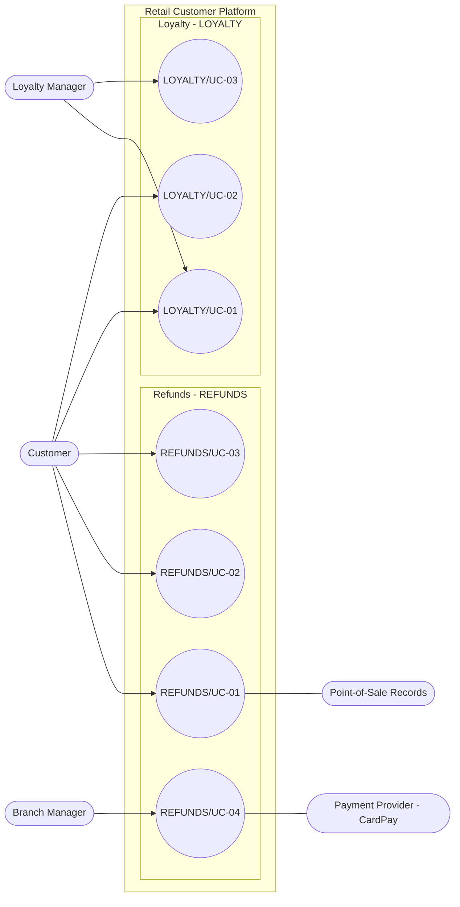

<!--
CHUNK: 03
TITLE: System Users & Use Cases
PROJECT: Retail Customer Platform
VERSION: 1.0
DEPENDS_ON: 01 (§7.3 also reads 05, 09, 10, 11, and 13x)
PART OF: SDD - Retail Customer Platform
-->

# 7. System Users & Use Cases

## 7.1 Actors

| Actor | Type (Human / System) | Description | Primary Interface |
|-------|-----------------------|-------------|-------------------|
| Customer | Human | A buyer in the retailer's branches, acting on their own records only. Unifies the personas REFUNDS Customer ([REFUNDS 04 § Personas / Actors](../brd-refunds-portal/04-scope-and-personas.md#personas--actors)) and LOYALTY Customer ([LOYALTY 04 § Personas / Actors](../brd-loyalty-points/04-scope-and-personas.md#personas--actors)): the same role, reaching refunds and points through one account (§3 item 4). | Customer web app |
| Branch Manager | Human | REFUNDS Branch Manager ([REFUNDS 04 § Personas / Actors](../brd-refunds-portal/04-scope-and-personas.md#personas--actors)): decides the refund requests of their own branch only ([REFUNDS 07 § Users & Use Cases Matrix](../brd-refunds-portal/07-users-use-cases-matrix.md#users--use-cases-matrix), footnote 1). | Staff web app |
| Loyalty Manager | Human | LOYALTY Loyalty Manager ([LOYALTY 04 § Personas / Actors](../brd-loyalty-points/04-scope-and-personas.md#personas--actors)): keeps every customer's points correct and reads any customer's balance ([LOYALTY 07 § Users & Use Cases Matrix](../brd-loyalty-points/07-users-use-cases-matrix.md#users--use-cases-matrix), footnote 1); adjustments above 5,000 points need a second loyalty manager's approval ([LOYALTY/UC-03](../brd-loyalty-points/06b-use-cases-loyalty-manager.md#uc-03-adjust-a-customers-points) BR-2). | Staff web app |
| Payment Provider (CardPay Ltd) | System | Receives payout requests and returns payout results ([REFUNDS 08 § Integrations](../brd-refunds-portal/08-integrations.md#integrations)); supporting actor of [REFUNDS/UC-04](../brd-refunds-portal/06b-use-cases-branch-manager.md#uc-04-approve--reject-refund). | HTTPS API, INT-01 (§12) |
| Point-of-Sale Records (Retail IT team) | System | Answers receipt lookups ([REFUNDS 08 § Integrations](../brd-refunds-portal/08-integrations.md#integrations)) and supplies the purchases and refunds linked to loyalty cards ([LOYALTY 08 § Integrations](../brd-loyalty-points/08-integrations.md#integrations)). | Lookup and feed, INT-03 (§12) |

The Notification Partner (MsgHub) only receives messages from the platform, so it is not an actor; it appears in §8.2 and §12.

## 7.2 Use Case Diagram

**Figure 1: Use Case Diagram**

**Summary:** The Customer drives the refund request, tracking, and cancellation use cases and the points balance and voucher use cases; the Branch Manager decides refunds, with the Payment Provider supporting the payout, and the Loyalty Manager adjusts points and reads any customer's balance. [REFUNDS/UC-05](../brd-refunds-portal/05-user-journeys-overview.md#use-case-summary) is merged into [REFUNDS/UC-04](../brd-refunds-portal/06b-use-cases-branch-manager.md#uc-04-approve--reject-refund) and has no node.

## 7.3 Use Case Traceability (BRD → SDD)

Entry points, APIs, and Events are filled in part 2 from the module chunks (13x), §15, and §14. Each owner links to its module chunk once that chunk exists.

| Use case (BRD) | Title | Owner (§17.X) | Entry points | Flows (§8.4 / §8.5) | APIs (§15) | Events (§14) | Status |
|----------------|-------|---------------|--------------|---------------------|------------|--------------|--------|
| **[Refunds Portal v1.0](../brd-refunds-portal/refunds-portal-brd-master.md) (REFUNDS)** | | | | | | | |
| [REFUNDS/UC-01](../brd-refunds-portal/06a-use-cases-customer.md#uc-01-request-a-refund) | Request a Refund | refunds | Pending (part 2) | [§8.4.1](./05-workflows-and-sequences.md#841-workflow-refund-request-lifecycle), [§8.5.1](./05-workflows-and-sequences.md#851-sequence-refund-request-submission-with-receipt-lookup) | Pending (part 2) | Pending (part 2) | Active |
| [REFUNDS/UC-02](../brd-refunds-portal/06a-use-cases-customer.md#uc-02-track-refund-status-web-and-mobile) | Track Refund Status (Web and Mobile) | refunds | Pending (part 2) | - | Pending (part 2) | Pending (part 2) | Active |
| [REFUNDS/UC-03](../brd-refunds-portal/06a-use-cases-customer.md#uc-03-cancel-a-refund-request) | Cancel a Refund Request | refunds | Pending (part 2) | [§8.4.1](./05-workflows-and-sequences.md#841-workflow-refund-request-lifecycle) | Pending (part 2) | Pending (part 2) | Active |
| [REFUNDS/UC-04](../brd-refunds-portal/06b-use-cases-branch-manager.md#uc-04-approve--reject-refund) | Approve / Reject Refund | refunds | Pending (part 2) | [§8.4.1](./05-workflows-and-sequences.md#841-workflow-refund-request-lifecycle), [§8.4.2](./05-workflows-and-sequences.md#842-workflow-card-payout-with-retry-and-escalation), [§8.5.2](./05-workflows-and-sequences.md#852-sequence-refund-decision-and-payout) | Pending (part 2) | Pending (part 2) | Active |
| [REFUNDS/UC-05](../brd-refunds-portal/05-user-journeys-overview.md#use-case-summary) | Issue Partial Refund | - | - | - | - | - | Merged into UC-04 |
| **[Loyalty Points v1.2](../brd-loyalty-points/loyalty-points-brd-master.md) (LOYALTY)** | | | | | | | |
| [LOYALTY/UC-01](../brd-loyalty-points/06a-use-cases-customer.md#uc-01-view-points-balance) | View Points Balance | loyalty | Pending (part 2) | - | Pending (part 2) | Pending (part 2) | Active |
| [LOYALTY/UC-02](../brd-loyalty-points/06a-use-cases-customer.md#uc-02-redeem-points-for-a-voucher) | Redeem Points for a Voucher | loyalty | Pending (part 2) | [§8.4.4](./05-workflows-and-sequences.md#844-workflow-redeem-points-for-a-voucher), [§8.5.3](./05-workflows-and-sequences.md#853-sequence-voucher-redemption) | Pending (part 2) | Pending (part 2) | Active |
| [LOYALTY/UC-03](../brd-loyalty-points/06b-use-cases-loyalty-manager.md#uc-03-adjust-a-customers-points) | Adjust a Customer's Points | loyalty | Pending (part 2) | [§8.4.5](./05-workflows-and-sequences.md#845-workflow-adjust-a-customers-points-with-second-approval) | Pending (part 2) | Pending (part 2) | Active |

<!-- MASTER: retail-customer-platform-sdd-master.md | PREV: 02-ecosystem-overview.md | NEXT: 04-architecture-style-and-diagrams.md -->
