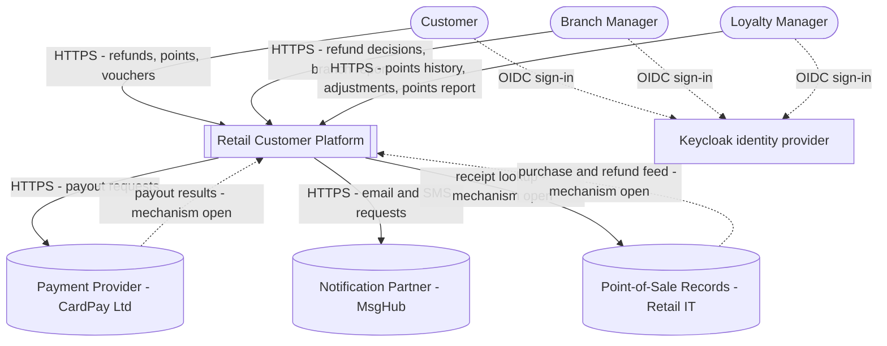
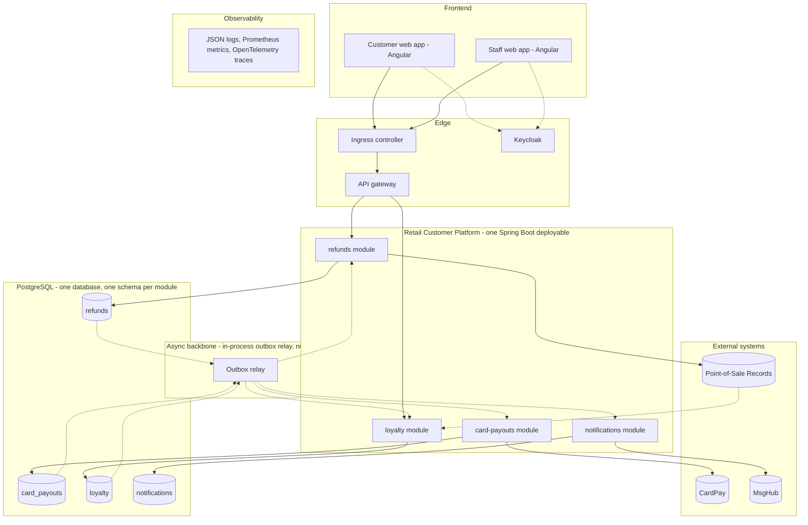

<!--
CHUNK: 04
TITLE: System Design - Architecture Style, Context & HLA Diagrams
PROJECT: Retail Customer Platform
VERSION: 1.0
DEPENDS_ON: 01, 02
PART OF: SDD - Retail Customer Platform
-->

# 8. System Design / High-Level Architecture

## 8.1 Architecture Style

### 8.1.1 What

A modular monolith (ADR-01): one Java / Spring Boot deployable whose modules (refunds, card-payouts, loyalty, notifications; §13) are DDD bounded contexts, each with a hexagonal structure (domain core, inbound and outbound ports, adapters). Modules talk to each other in two ways only: synchronous in-process calls through another module's published port, for queries and commands that need an immediate answer; and domain events that the publishing module writes to its outbox in the same PostgreSQL transaction as the state change, which an in-process relay delivers after commit, at least once, to handlers that deduplicate on the event id (ADR-02, ADR-06). There is no REST between modules, no shared table, and no message broker. Each module owns one schema of one PostgreSQL database (ADR-03). Every write to an external system (card payouts, customer messages) is dispatched from the outbox through an anti-corruption adapter; the receipt lookup is the only synchronous outbound call made while a user waits. Browser clients reach the deployable through an API gateway with Keycloak access tokens (ADR-07).

### 8.1.2 Why

- **Stage and scope:** a first production release of a product that will grow ([REFUNDS 01 § Business Objectives](../brd-refunds-portal/01-executive-summary-and-context.md#business-objectives), [LOYALTY 01 § Business Objectives](../brd-loyalty-points/01-executive-summary-and-context.md#business-objectives), [REFUNDS 12 § Wishlist](../brd-refunds-portal/12-appendix-and-wishlist.md#wishlist), [LOYALTY 12 § Wishlist](../brd-loyalty-points/12-appendix-and-wishlist.md#wishlist)) with a small use-case set (§7.3). One deployable is the cheapest to build, test, and run, and the module boundaries keep a later extraction cheap.
- **Team:** neither BRD names more than one delivery team, and one team needs no independent release cycles per context.
- **Load:** moderate with seasonal peaks ([REFUNDS 02 § Facts](../brd-refunds-portal/02-glossary-assumptions-facts.md#facts), REFUNDS/NFR-03, [LOYALTY 01 § Background and Context](../brd-loyalty-points/01-executive-summary-and-context.md#background-and-context)). Stateless replicas of one deployable scale out; no part yet needs to scale on its own (the purchase-feed volume is open, R-09).
- **Integrity:** REFUNDS/NFR-01 and LOYALTY/NFR-02 need every state change to be recorded together with the event or provider call it causes. One database gives each module a local transaction over its state and its outbox row, with no distributed transaction.
- **Availability:** REFUNDS/NFR-02 and LOYALTY/NFR-01 set different monthly disruption budgets. One deployable gives both scopes the same availability, so the deployable is engineered to the stricter budget. **[NEEDS CLARIFICATION: confirm that the loyalty scope is held to the REFUNDS/NFR-02 disruption budget while both scopes run in one deployable, or state that the LOYALTY/NFR-01 budget justifies extracting the loyalty module; §18 (part 3) states one availability target per scope.]**

### 8.1.3 How

- **Bounded contexts:** refunds (§17.1) owns refund requests and their lifecycle; card-payouts (§17.2) owns payouts to the original card; loyalty (§17.3) owns the points ledger, vouchers, and adjustments; notifications (§17.4) owns customer messages and their delivery. Ownership of the BRD use cases: §13.
- **Inter-module communication:** in-process port calls for queries and immediate commands, at most one hop per request (for example, refunds reading a payout's progress for the status history); domain events from the outbox for state changes that other modules react to: refund approved to card payout requested, payout result to refund Paid or still Approved, business steps to customer messages, and refund paid to points taken back (source open, §8.4.3). Event names and payloads: §14 (part 2).
- **External communication:** HTTPS through anti-corruption adapters with timeouts, retries with exponential backoff and jitter, circuit breakers, and bulkheads (Resilience4j); INT-01 to INT-03 in §12. Provider-owned contract details stay `TBD - external` in §15 until the provider documentation is supplied.
- **Data ownership:** one PostgreSQL database with the schemas `refunds`, `card_payouts`, `loyalty`, and `notifications`; a module's adapters use only its own schema, through a schema-scoped database role; other modules read through ports or events; shared schema with `tenant_id` (ADR-04).
- **Deployment model:** one OCI image and one Helm chart on Kubernetes; replicas are stateless and interchangeable; the outbox relay and the feed ingestion run in every replica and claim rows so that each row is handled by one replica at a time (§11.3).
- **Edge:** a customer web app and a staff web app (Angular) call the platform through the ingress and the API gateway, which handles authentication, tenant resolution, rate limiting, and request logging.

## 8.2 Context Diagram

**Figure 2: System Context Diagram**

**Summary:** Customers, branch managers, and loyalty managers use the platform over HTTPS after signing in with Keycloak; the platform sends payouts to CardPay and messages to MsgHub, looks up receipts in the Point-of-Sale Records, and receives their purchase and refund feed. **[NEEDS CLARIFICATION: architect to verify this context; the Point-of-Sale and CardPay mechanisms shown as open are flagged in §12.]**

## 8.3 High-Level Architecture Diagram

**Figure 3: High-Level Architecture**

**Summary:** Both web apps reach the single deployable through the ingress and the API gateway, and each module persists only to its own schema; the outbox relay reads committed outbox rows and delivers them to the consuming modules, which make the provider calls (CardPay from card-payouts, MsgHub from notifications), while refunds looks up receipts and loyalty ingests the Point-of-Sale feed. Every module emits logs, metrics, and traces to the observability stack (edges omitted for readability).

<!-- MASTER: retail-customer-platform-sdd-master.md | PREV: 03-users-and-use-cases.md | NEXT: 05-workflows-and-sequences.md -->
