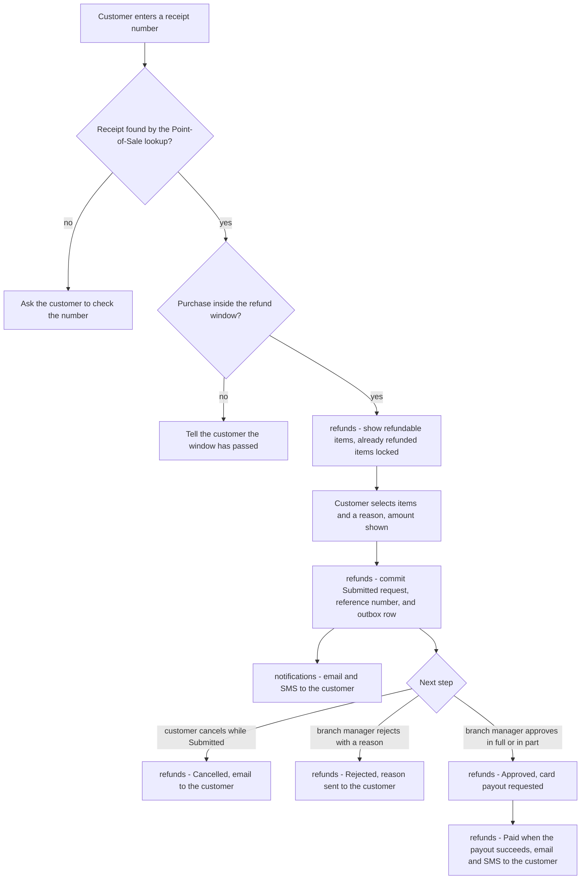
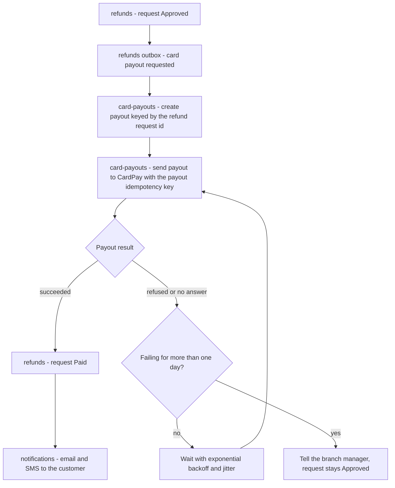
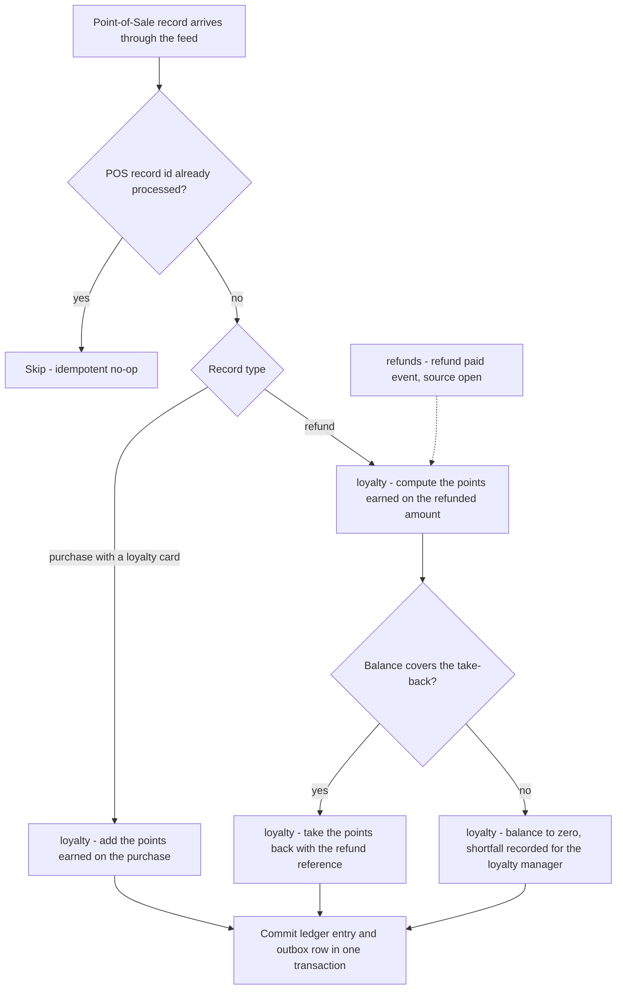
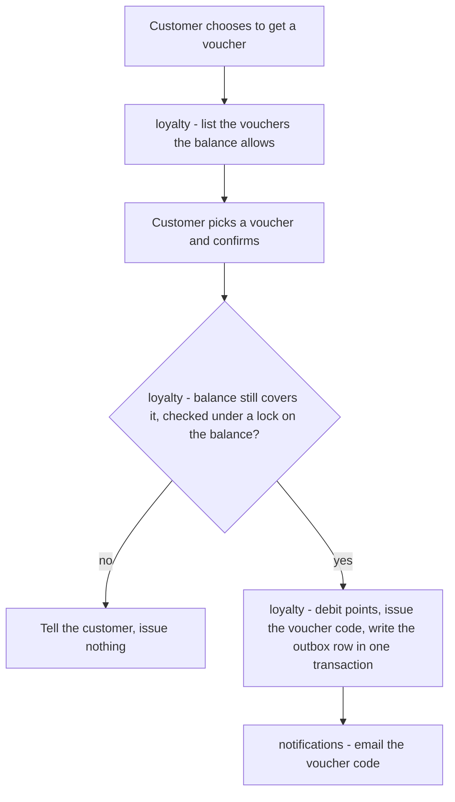
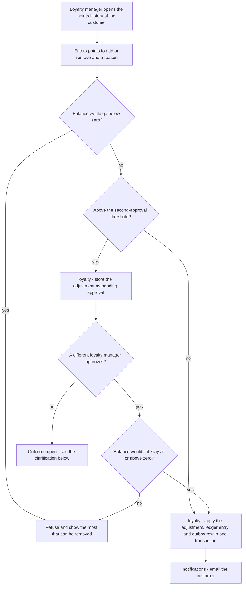

<!--
CHUNK: 05
TITLE: System Design - Workflow & Sequence Diagrams
PROJECT: Retail Customer Platform
VERSION: 1.0
DEPENDS_ON: 04
PART OF: SDD - Retail Customer Platform
-->

## 8.4 Workflow Diagrams

The workflows re-express the BRD journeys ([REFUNDS 05 § Summarized Workflow](../brd-refunds-portal/05-user-journeys-overview.md#summarized-workflow), [LOYALTY 05 § User Journeys](../brd-loyalty-points/05-user-journeys-overview.md#user-journeys)) at module level. Viewing a balance ([LOYALTY/UC-01](../brd-loyalty-points/06a-use-cases-customer.md#uc-01-view-points-balance)) and tracking a request ([REFUNDS/UC-02](../brd-refunds-portal/06a-use-cases-customer.md#uc-02-track-refund-status-web-and-mobile)) are single reads of the owning module and have no workflow.

### 8.4.1 Workflow: Refund request lifecycle

**Use cases:** [REFUNDS/UC-01](../brd-refunds-portal/06a-use-cases-customer.md#uc-01-request-a-refund), [REFUNDS/UC-03](../brd-refunds-portal/06a-use-cases-customer.md#uc-03-cancel-a-refund-request), [REFUNDS/UC-04](../brd-refunds-portal/06b-use-cases-branch-manager.md#uc-04-approve--reject-refund)

**Figure 4: Workflow - Refund request lifecycle**

**Summary:** The receipt is checked through the Point-of-Sale lookup (INT-03) before a request can be submitted ([REFUNDS/UC-01](../brd-refunds-portal/06a-use-cases-customer.md#uc-01-request-a-refund) steps 1-6, A1, E1, E2), and the submitted request ends Cancelled while still Submitted ([REFUNDS/UC-03](../brd-refunds-portal/06a-use-cases-customer.md#uc-03-cancel-a-refund-request), E1 when already decided), Rejected, or Approved and later Paid ([REFUNDS/UC-04](../brd-refunds-portal/06b-use-cases-branch-manager.md#uc-04-approve--reject-refund) steps 3-7, A1, A2). Every transition is a refunds state-machine transition committed together with its outbox row, and every customer message is sent by the notifications module from that row.

### 8.4.2 Workflow: Card payout with retry and escalation

**Use cases:** [REFUNDS/UC-04](../brd-refunds-portal/06b-use-cases-branch-manager.md#uc-04-approve--reject-refund) steps 6-7, E1

**Figure 5: Workflow - Card payout with retry and escalation**

**Summary:** An approval hands the payout to card-payouts through the outbox; the payout is keyed by the refund request, so it can be sent more than once but is paid only once (REFUNDS/NFR-01), and it is retried until it succeeds or has failed for one day, when the branch manager is told. A timeout counts as no answer and is retried with the same idempotency key, which relies on CardPay honouring that key (R-03). **[NEEDS CLARIFICATION: how the branch manager is told about a payout still failing after one day (an email through the Notification Partner, an alert in the staff web app, or both), and whether retries then continue, stop, or wait for a manager action.]**

### 8.4.3 Workflow: Points earned and taken back

**Use cases:** None - platform flow

**Figure 6: Workflow - Points earned and taken back**

**Summary:** The loyalty module turns each Point-of-Sale purchase into points earned and each refund into points taken back, never letting the balance go below zero ([LOYALTY 03 § Points balance](../brd-loyalty-points/03-definitions-and-domain-concepts.md#points-balance)); every record is deduplicated on its POS record id so that nothing counts twice (LOYALTY/NFR-02). The dotted edge is the open question below: whether a portal refund ([REFUNDS/UC-04](../brd-refunds-portal/06b-use-cases-branch-manager.md#uc-04-approve--reject-refund) step 7) also reaches the loyalty module from the refunds module. **[NEEDS CLARIFICATION: which source tells the loyalty module that a purchase was refunded? [LOYALTY 08 § Integrations](../brd-loyalty-points/08-integrations.md#integrations) expects refunds from the Point-of-Sale Records, but portal refunds are paid through the Payment Provider. If portal refunds are also written to the Point-of-Sale Records, the feed is the single source and the dotted edge is removed; if not, the loyalty module also consumes the refund-paid event of the refunds module. Also confirm which reference [LOYALTY/UC-01](../brd-loyalty-points/06a-use-cases-customer.md#uc-01-view-points-balance) BR-2 shows for a portal refund: the portal reference number ([REFUNDS/UC-01](../brd-refunds-portal/06a-use-cases-customer.md#uc-01-request-a-refund) step 6) or the Point-of-Sale refund reference.]**

### 8.4.4 Workflow: Redeem points for a voucher

**Use cases:** [LOYALTY/UC-02](../brd-loyalty-points/06a-use-cases-customer.md#uc-02-redeem-points-for-a-voucher)

**Figure 7: Workflow - Redeem points for a voucher**

**Summary:** The balance check and the debit happen in one transaction under a lock on the customer's balance, so a take-back arriving at the same moment cannot leave a voucher uncovered ([LOYALTY/UC-02](../brd-loyalty-points/06a-use-cases-customer.md#uc-02-redeem-points-for-a-voucher) step 4, E1). The email with the code follows from the outbox and never blocks the redemption.

### 8.4.5 Workflow: Adjust a customer's points with second approval

**Use cases:** [LOYALTY/UC-03](../brd-loyalty-points/06b-use-cases-loyalty-manager.md#uc-03-adjust-a-customers-points)

**Figure 8: Workflow - Adjust a customer's points with second approval**

**Summary:** Adjustments at or below the threshold apply at once; larger ones wait for a second loyalty manager, who must be a different person, and the balance check runs again at approval because the balance may have changed ([LOYALTY/UC-03](../brd-loyalty-points/06b-use-cases-loyalty-manager.md#uc-03-adjust-a-customers-points) steps 3-4, E1, BR-1, BR-2, AC-1). Every applied adjustment carries its reason and emails the customer. **[NEEDS CLARIFICATION: what happens when the second loyalty manager does not approve an adjustment above the threshold of [LOYALTY/UC-03](../brd-loyalty-points/06b-use-cases-loyalty-manager.md#uc-03-adjust-a-customers-points) BR-2, and whether a pending adjustment expires; the use case covers only the approval.]**

## 8.5 Sequence Diagrams

One heading per critical interaction. Each diagram needs the interface decisions flagged in §12 and the contracts of §14 and §15 (part 2).

### 8.5.1 Sequence: Refund request submission with receipt lookup

**Use cases:** [REFUNDS/UC-01](../brd-refunds-portal/06a-use-cases-customer.md#uc-01-request-a-refund)

**[NEEDS CLARIFICATION: sequence diagram for refund request submission with receipt lookup - see the use cases above.]**

### 8.5.2 Sequence: Refund decision and payout

**Use cases:** [REFUNDS/UC-04](../brd-refunds-portal/06b-use-cases-branch-manager.md#uc-04-approve--reject-refund)

**[NEEDS CLARIFICATION: sequence diagram for refund decision and payout - see the use cases above.]**

### 8.5.3 Sequence: Voucher redemption

**Use cases:** [LOYALTY/UC-02](../brd-loyalty-points/06a-use-cases-customer.md#uc-02-redeem-points-for-a-voucher)

**[NEEDS CLARIFICATION: sequence diagram for voucher redemption - see the use cases above.]**

### 8.5.4 Sequence: POS purchase and refund feed ingestion

**Use cases:** None - platform flow

**[NEEDS CLARIFICATION: sequence diagram for POS purchase and refund feed ingestion - see the platform flow in §8.4.3.]**

<!-- MASTER: retail-customer-platform-sdd-master.md | PREV: 04-architecture-style-and-diagrams.md | NEXT: 06-principles-and-decisions.md -->
