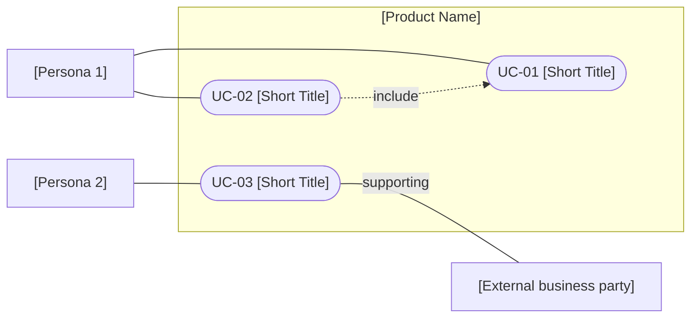

<!--
CHUNK: 05
TITLE: User Journeys & Use Cases - Overview
PROJECT: [Project Name]
VERSION: [X.X]
DEPENDS_ON: 04
PART OF: BRD - [Project Name]
LANGUAGE: Business language only. No technology names, protocols, or implementation terminology - the how is owned by the SDD.
-->

# User Journeys & Use Cases

<!-- Start with the end-to-end journey of each primary persona, in plain business language. One short narrative per persona, describing what they come to the system to accomplish and the path they take. -->

## User Journeys

### [Persona 1] Journey

[1 paragraph: what this user wants to accomplish end-to-end, the path they take through the system, and the outcome they leave with.]

### [Persona 2] Journey

[1 paragraph.]

## Summarized Workflow

<!-- Optional: A simplified step-by-step summary of the key journey(s). Diagrams are inline Mermaid (business-language labels), each with a mandatory 1-2 sentence prose summary. Append a `> Miro: <url>` link only if the user asked for a board. -->

[Workflow description with numbered steps and/or an inline Mermaid flowchart + prose summary.]

## Use Case Summary

<!-- Every use case in the BRD, one row each. UC numbering is sequential across the whole BRD. Group rows per persona - the detailed chunks (06a, 06b, ...) split per persona in the same order. -->

| UC ID | Use Case | Primary Actor | Description |
|-------|----------|---------------|-------------|
| **[Persona 1]** | | | |
| UC-01 | [Short Title] | [Persona 1] | [1-3 sentence summary of the goal and outcome] |
| UC-02 | [Short Title] | [Persona 1] | [Summary] |
| **[Persona 2]** | | | |
| UC-03 | [Short Title] | [Persona 2] | [Summary] |

<!--
USE CASE DIAGRAMS SLOT (to-do step 5 in 14-todo.md). Emit nothing here at first generation, and do not copy this comment into the generated chunk.
Add the section below only after to-do steps 1-4 are confirmed complete. One overview diagram if it fits about 30 lines, otherwise one per persona in the order above. Every UC-NN (except rows marked Merged into or Removed) appears in at least one diagram; every association matches the use-case actor fields and the matrix (07); include / extend only where a narrative documents it. Notation: mermaid-diagrams.md § Use-case diagrams.

## Use Case Diagrams

### Figure N - Use cases: [Overview | Persona name]

**Summary:** [1-2 sentences: who does what inside the product boundary, and the relationships shown.]
-->

<!-- MASTER: brd-master.md | PREV: 04-scope-and-personas.md | NEXT: 06a-use-cases-detailed.md -->
