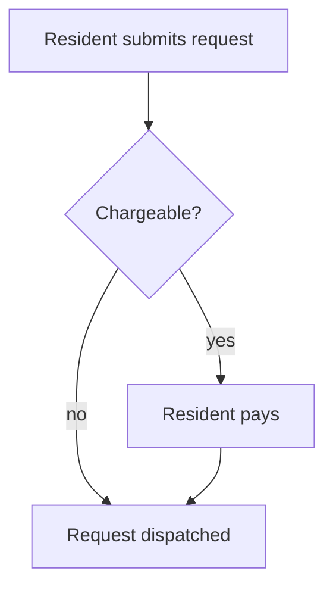
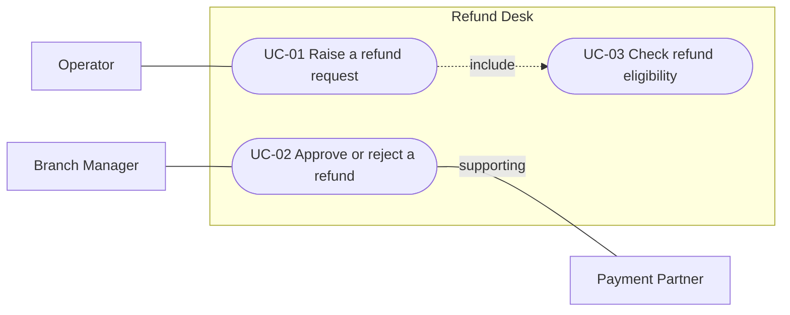
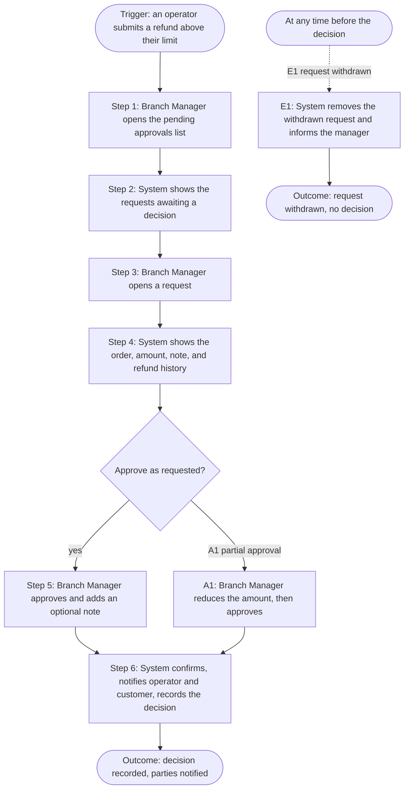

# Mermaid Diagrams (default) — with Miro on demand

All BRD diagrams are authored as **inline Mermaid** by default. Every diagram is followed by a 1-2 sentence prose **Summary** so a reader without a Mermaid renderer still understands what it says. Miro boards are produced **only when the user explicitly asks** — see § Miro on demand.

## Why Mermaid-first

1. The BRD lives in git next to the SDD and LLD; inline diagrams version, diff, and review with the text.
2. Downstream skills (`sdd-unifier`, reviewers) read the BRD directly — an inline diagram is machine-readable; a board link is not.
3. No external dependency: the document is complete offline, with no MCP or board access required.

## Business language only

BRD diagrams follow the same rule as BRD text: **no technical terminology**. Nodes and edges are named after personas, business concepts, and business actions ("Resident submits request", "Finance approves refund") — never components, services, protocols, or datastores. If a source diagram is technical, park the technical content in Appendix § Technical Inputs for the SDD and redraw the business view.

---

## Diagram-type → dialect map

| Template section | Diagram | Mermaid dialect |
|---|---|---|
| Executive Summary (optional, if context helps) | Simple context sketch — the product and its major business neighbours | `flowchart TB` |
| Background (optional) | Current-state ("as-is") flow if the SoW describes one worth visualising | `flowchart LR` |
| Definitions & Important Details → concept lifecycle | Business states and transitions (e.g., an order from placed to delivered) | `stateDiagram-v2` |
| Definitions & Important Details → concept relationships | Business concepts and how they relate (no schema detail) | `flowchart LR` |
| User Journeys → Summarized Workflow | End-to-end journey / workflow per primary persona | `flowchart TD` (or `journey`) |
| User Journeys → Use Case Diagrams (chunk 05) - **gated, checklist step 5** | Actors, use cases, system boundary, relationships | `flowchart LR` with a `subgraph` boundary (see § Use-case diagrams) |
| Use case detail → Flowchart (chunks `06*`) - **gated, checklist step 5** | Main, alternate, and exception flows of one use case that has 3 or more Main Flow steps and at least one decision point | `flowchart TD` (see § Use-case flowcharts) |
| Integrations | The product in the middle, business partners around it, arrows labelled with the business purpose (not the mechanism) | `flowchart LR` |

**Do not** draw a diagram for: glossary, assumptions, scope, NFR tables, the Users & Use Cases Matrix, or any UC that is linear (no alternate flow, no exception flow, no path-changing rule) or has fewer than 3 Main Flow steps: the numbered steps are the diagram.

**Gated diagrams.** Use-case diagrams and use-case flowcharts are never drawn during first generation. They are added to chunks 05 and `06*` at step 5 of the product-manager checklist (`14-todo.md`), only after steps 1-4 are confirmed complete. Rules: `delivery-chunks.md` § The gated diagram step. Every other diagram in this table is part of normal generation.

---

## Block conventions

````markdown


**Summary:** [1-2 sentences of prose describing the flow.]
````

**Rules:**

- Always use the `mermaid` language hint on the fence.
- The **Summary** line after every diagram is mandatory — it is the no-renderer fallback.
- Keep diagrams scoped (~30 lines max); split large journeys into per-phase diagrams.
- Figure numbering is sequential across the whole BRD; every figure gets a row in chunk 00's Figures index with its chunk + section. Figures added later (to-do step 5) take the next free number; existing figures are never renumbered, because other chunks cite them.
- Validate every emitted Mermaid block parses; on failure, fall back to a numbered text description + `[NEEDS CLARIFICATION: Mermaid syntax error — review]` and surface the count in the handoff summary.

## Use-case diagrams (chunk 05, gated)

Mermaid has no native use-case diagram, so the notation is fixed here. Drawn only at checklist step 5, in a `## Use Case Diagrams` section after the Use Case Summary.

| Element | Notation |
|---|---|
| System boundary | `subgraph SYS["[Product Name]"] ... end` |
| Use case | Stadium node inside the boundary, label = ID + short title: `UC01(["UC-01 Raise a refund request"])` |
| Actor (persona or external business party) | Rectangle outside the boundary: `BM["Branch Manager"]`. Personas on the left, external parties on the right. |
| Primary actor association | Plain line: `BM --- UC02` |
| Supporting actor association | Labelled line: `UC02 -- "supporting" --- PG` |
| Include | Dotted arrow from the base use case to the included one: `UC01 -. "include" .-> UC03` |
| Extend | Dotted arrow from the extending use case to the base one: `UC02 -. "extend" .-> UC01` |

````markdown


**Summary:** Operators raise refund requests, which always include an eligibility check; Branch Managers decide on them, with the Payment Partner supporting the payout.
````

**Rules:**

- Every `UC-NN` of the BRD appears in at least one diagram (rows marked `Merged into` or `Removed` excepted). One overview diagram if it fits about 30 lines; otherwise one per persona, in chunk-05 persona order.
- Every association matches the use case's Primary / Supporting Actor fields and the matrix (07). A mismatch is a consistency finding, not a drawing choice.
- Draw `include` / `extend` **only where a narrative documents it** (a Main Flow step or Precondition invokes another use case; an alternate or exception flow hands over to one). Never infer a relationship. Label every relationship edge.

---

## Use-case flowcharts (chunks `06*`, gated)

Drawn only at checklist step 5, as a `### Flowchart` sub-section directly after `### Alternate & Exception Flows`.

**Required** when the use case has 3 or more Main Flow steps **and** at least one decision point (an alternate flow, an exception flow, or a business rule that changes the path). **Skipped** for linear use cases and for use cases with fewer than 3 steps; the skip reason is recorded in `14-todo.md`, nothing is added to the chunk.

| Element | Notation |
|---|---|
| Start | Stadium node with the Trigger: `T(["Trigger: ..."])` |
| Main Flow step | Rectangle, label names the step: `S3["Step 3: Branch Manager opens a request"]` (never `"3. ..."`: a label that starts with a number and a period can render as a broken list) |
| Decision point | Rhombus phrased as a question: `D1{"Approve as requested?"}`; every outgoing edge is labelled |
| Alternate path | Solid edge labelled with the flow ID: `D1 -- "A1 partial approval" --> A1` |
| Exception path | Dotted edge labelled with the flow ID, leaving the step the narrative names: `S4 -. "E1 payment refused" .-> E1`. When the narrative ties the exception to no step, it leaves its own start node instead: `X1(["At any time before the decision"])`. Never pick a step for it. |
| End | Stadium node per outcome: `O1(["Outcome: ..."])` |

````markdown


**Summary:** The Branch Manager reviews a pending request and approves it as raised or with a reduced amount; if the operator withdraws the request first, the flow ends without a decision.
````

**Rules:**

- The narrative is the source of truth; the flowchart is a derived view. Every node and edge traces to a step, an A/E flow, or a business rule. Every documented A/E flow appears.
- Never invent behaviour to complete a path (where a branch rejoins, what happens after a failure). Record a to-do item (`TD-NN` in `14-todo.md`), mark the flowchart `Provisional` there, and finalise it after the answer.
- Keep diagrams scoped (about 30 lines); a very long use case may compress consecutive steps without decisions into one node that keeps the step range (`"Steps 2-4: ..."`).

---

## Label and syntax safety (all diagrams)

- Wrap every node label and every edge label in double quotes. No double quotes, Markdown, or line breaks inside a label.
- A label never starts with a number followed by a period or a bracket, or with a hyphen. Write `"Step 3: ..."`, not `"3. ..."`.
- Edge labels use the quoted form (`A -- "text" --> B`, `A -- "text" --- B`), never the pipe form (`A ---|text| B`): pipes break Markdown tables.
- Node IDs use letters and digits only. Never use `end` as an ID. Keep a space on both sides of every link.
- One statement or one chain per line. Every `subgraph` has its `end`.
- If a Mermaid parser or renderer is available in the session, parse every block with it and look at one rendered use-case diagram and one rendered flowchart (a block can parse and still render a label wrongly); otherwise check each block line by line against the examples in this file.
- A parser that works wherever Node and Chrome are installed is the Mermaid CLI through `npx` (`npx -y @mermaid-js/mermaid-cli -p <puppeteer-config.json> -i diagram.mmd -o diagram.svg`, with `executablePath` in the config pointing at the installed Chrome and `PUPPETEER_SKIP_DOWNLOAD=true` set). It downloads a tool on first use, so ask the user before running it. Write the test files to a scratch location, never into the BRD folder. An error message or a missing output file means the block does not parse.

---

## Syntax quick reference

See `../lld-unifier/mermaid-diagrams.md` § Mermaid syntax quick reference for the dialect cheatsheet — the conventions are shared across the unifier skills.

---

## Miro on demand (only when the user explicitly asks)

In the product-manager checklist (`14-todo.md`), Miro is positioned as an optional step **after** step 5 (use-case diagrams and flowcharts), for collaboration or presentation. It is still produced on explicit request only.

If — and only if — the user asks for a Miro board ("put the diagrams on Miro", "create a board"):

1. Load Miro tools via ToolSearch (they are deferred).
2. Create or reuse a board named `BRD — [Project Name] — Diagrams` (`Miro:context_explore` to check; ask for the URL when updating an existing BRD — don't guess).
3. Author the requested figures with `Miro:diagram_get_dsl` → `Miro:diagram_create`; frame names mirror the BRD figure titles.
4. Append the link BELOW the corresponding inline Mermaid block — additive, never a replacement:

   ```markdown
   > Miro: https://miro.com/app/board/<board-id>/?moveToWidget=<widget-id>
   ```

5. Record the board URL in chunk 00's Figures index and in the handoff summary.

**Never** write a Miro placeholder (`> Miro: [TBD]`) when no real board exists, and never drop the inline Mermaid in favour of a board link — the Mermaid stays authoritative.

If the Miro MCP is unavailable when the user asked for a board: generate the BRD normally (Mermaid is unaffected), tell the user the Miro MCP wasn't available, and list the figures that would be mirrored to the board once it is.
