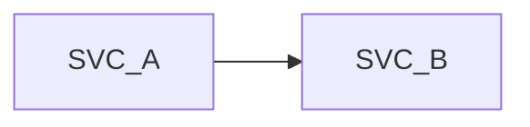
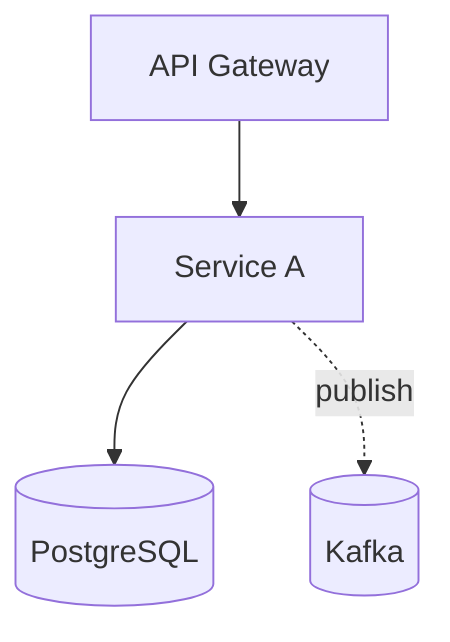
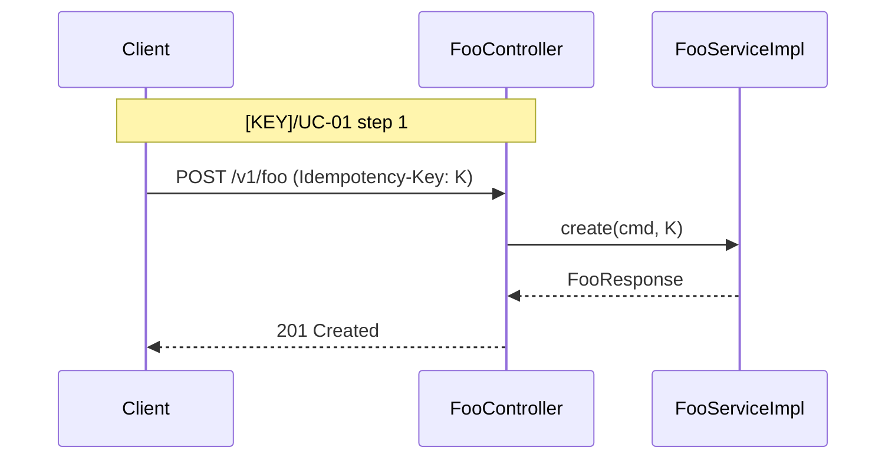

# Low-Level Design Document - [Project Name]

| Field | Value |
|-------|-------|
| Document Title | Low-Level Design - [Project Name] |
| Version | [X.X] |
| Status | [Draft / In Review / Approved] |
| Direction | [from-code / from-sdd / hybrid / partial] |
| Date | [YYYY-MM-DD] |
| Author(s) | [Names] |
| Reviewers | [Names of people, never a stand-in] |
| Approvers | [Names of people, never a stand-in] |
| Related BRD(s) | [One per source BRD, with its key from the SDD's Source BRDs register: `[KEY]` [[brd-slug]-brd-master.md](./brd-[brd-slug]/[brd-slug]-brd-master.md); or `Not applicable`] |
| Related SDD | [[sdd-slug]-sdd-master.md](./sdd-[sdd-slug]/[sdd-slug]-sdd-master.md) [or `Not applicable`] |
| Source Code Path | [path or `Not applicable`] |

> **Production bug?** Start at [§19.9 Use-Case Traceability Index](#199-use-case-traceability-index).

---

## Direction Summary

> **How to read this LLD given its direction:**
>
> - **`from-code`**: every section was reverse-engineered from existing source. Structural claims (class names, schemas, topics) are high-confidence; semantic claims (rationale, intent) are medium-confidence unless cross-validated.
> - **`from-sdd`**: every section was forward-designed from the SDD (and CLAUDE.md defaults). Treat as a build target for the implementer. Patterns are proposals annotated with their triggering CLAUDE.md rule.
> - **`hybrid`**: sections are unified across SDD intent and code reality. Drift markers (`⚠`, `🆕`, `⛔`) call out divergences. See §18 for the drift index.
> - **`partial`**: code exists for some services; others are SDD-described placeholders.

---

## Changes Log

<!-- Initial row: Chunks: none (initial build), dated when the first build completes. Later rows: Chunks lists semantic edits only, excluding routine synchronized metadata; date = the request's first content change. Review-content changes count, and so do §18 flag rows and the §19.1 upstream state (SKILL.md § Output conventions, Versions). -->

| Version | Date | Author | Direction | Change Summary |
|---------|------|--------|-----------|----------------|
| [X.X] | [YYYY-MM-DD] | [Author] | [direction] | Initial LLD draft via lld-unifier. Chunks: none (initial build) |

## Table of Contents

<!-- Combined only: regenerated on merge and dropped on re-chunk (chunking.md § Heading map). One entry per top-level section, linked to its anchor. -->

- [1. Purpose](#1-purpose)
- [2. Scope](#2-scope)
- [... one entry per top-level section, through 21. Open Items & Clarifications](#21-open-items--clarifications)

## Confidence Flag Summary

| Flag Type | Count | Notes |
|-----------|-------|-------|
| `> Confirm:` (medium confidence) | [N] | See §18.3 for the index. |
| `> TODO:` (low confidence) | [N] | See §18.2 for the index. |
| `⚠ drift` (hybrid only) | [N] | SDD intent vs code reality divergences. |
| `🆕 code-only` (hybrid only) | [N] | Present in code, not in SDD. |
| `⛔ sdd-only` (hybrid only) | [N] | In SDD, not yet built. |
| `⚠ policy` (every direction that reads code) | [N] | Code that breaks a CLAUDE.md rule or a `pattern-rules.md` anti-pattern, indexed in §18.6. |

---

# 1. Purpose

[One paragraph stating what this LLD enables a developer or AI implementer to do.]

# 2. Scope

## 2.1 In Scope

- [Item]

## 2.2 Out of Scope

- [Item]

# 3. Assumptions

| ID | Assumption | Source | Risk if false |
|----|------------|--------|---------------|
| A-01 | [Assumption] | [BRD / SDD / CLAUDE.md / inferred] | [Risk] |

# 4. Glossary

| Term | Definition | Source |
|------|------------|--------|

> **Convention:** from an SDD, link its glossary ([SDD §5](./sdd-[sdd-slug]/01-executive-summary-scope-risks.md#5-glossary)) instead of copying it, and add rows only for LLD-specific implementation terms. From code with no SDD, define every term here.

# 5. Context

## 5.1 Bounded Context

[One paragraph.]

## 5.2 Upstream Producers (callers / event-publishers into this system)

| Upstream | Interaction | Protocol | Notes |
|----------|-------------|----------|-------|

## 5.3 Downstream Consumers (systems this LLD's services call / publish to)

| Downstream | Interaction | Protocol | Notes |
|------------|-------------|----------|-------|

## 5.4 Cross-Service Dependencies (within this LLD)



**Summary:** [1-2 sentences: which services in this LLD depend on which, and over what.]

## 5.5 Shared Conventions (apply to every service in scope)

- **Auth:** [Keycloak realm strategy / OAuth2 server / mTLS, per CLAUDE.md default unless overridden]
- **Tenant resolution:** [Header / JWT claim / subdomain, per CLAUDE.md multi-tenancy strategy]
- **Correlation ID:** [Header name and propagation rule]
- **Time zone:** UTC for all timestamps (CLAUDE.md default).
- **ID strategy:** UUIDv7 generated at the service layer (CLAUDE.md default).

# 6. Architecture Overview

## 6.1 Component Topology



**Summary:** [1-2 sentences: which services in this LLD depend on which, and over what.]

## 6.2 Deployment Topology

| Concern | Choice | Source |
|---------|--------|--------|
| Container | Docker | CLAUDE.md default |
| Orchestrator | Kubernetes (Helm) | CLAUDE.md default |
| Replicas | [N min / M max] | [SDD §17.X Deployment Strategy] |

## 6.3 Runtime Stack

| Layer | Technology | Version | Source |
|-------|-----------|---------|--------|
| Language | Java | 21 | [[SDD §6](./sdd-[sdd-slug]/02-ecosystem-overview.md#6-ecosystem-overview) row / manifest (no SDD) / CLAUDE.md default] |
| Framework | Spring Boot | 3.5+ | [[SDD §6](./sdd-[sdd-slug]/02-ecosystem-overview.md#6-ecosystem-overview) row / manifest (no SDD) / CLAUDE.md default] |
| Database | PostgreSQL | 17+ | [[SDD §6](./sdd-[sdd-slug]/02-ecosystem-overview.md#6-ecosystem-overview) row / manifest (no SDD) / CLAUDE.md default] |
| Broker | Kafka | [version] | [[SDD §6](./sdd-[sdd-slug]/02-ecosystem-overview.md#6-ecosystem-overview) row / manifest (no SDD) / CLAUDE.md default] |
| Auth | Keycloak | [version] | [[SDD §6](./sdd-[sdd-slug]/02-ecosystem-overview.md#6-ecosystem-overview) row / manifest (no SDD) / CLAUDE.md default] |
| Migrations | Flyway | [version] | [[SDD §6](./sdd-[sdd-slug]/02-ecosystem-overview.md#6-ecosystem-overview) row / manifest (no SDD) / CLAUDE.md default] |

## 6.4 Architectural Style - As Operationalised

[Concrete operationalisation of the SDD §8.1 style.]

---

# 7. Per-Service Implementation

> **Note:** in COMBINED mode, each service spec is a `## 7.N [Service Name]` block in this document, its sub-sections one level deeper (`chunking.md` § Heading map). In CHUNKS mode, each service is its own file at `04-implementation/<service-slug>.md`. Use the chunked-template detail (`chunks/04-implementation-template.md`) as the structure for each service block below - the structure does not change.

## 7.1 [Service Name 1]

> **Owns use cases (SDD 09):** [[KEY]/UC-01](./brd-[brd-slug]/06a-use-cases-[persona-slug].md#uc-01-[title-slug]), [[KEY]/UC-02](./brd-[brd-slug]/06a-use-cases-[persona-slug].md#uc-02-[title-slug]) [or: None - what it serves / Not applicable - no source BRD]
>
> **Participates in:** [KEY]/UC-03 (owner: [service]) [or: None]

### Responsibility

### Class & Interface Map
- Controllers (with the event listeners and scheduled jobs that are entry points, their trigger as the endpoint), Services, ServiceImpls, Repositories, Domain types (records), Method signatures
- Every entry point a use case's traceability line names (REST method, event listener, scheduled job) carries `@UseCase("[KEY]/UC-NN")` with that use case's keyed ID (§12.8). An `Event:` or `Schedule:` trigger that SDD §7.3 lists for a use case is an entry point too, so its listener or job carries the annotation. Platform endpoints, the entry points of a `#### Workflow:` block, and an endpoint the LLD proposes that SDD §7.3 does not list, carry none.

#### Ports and Adapters (in-process contracts)

Modular monolith or hybrid core only: one row per SDD §15 `Internal (in-process)` contract this module provides or calls (port interface, operation, API ID, role, adapter class), as in `chunks/04-implementation-template.md` § 7.2; the contract itself is in §9.6. With no SDD §15 `Internal (in-process)` contract here (a microservices SDD, a separate deployable of a hybrid, or a core whose modules call no port), write "Not applicable - no in-process contracts".

#### Authorization

| Entry point | Kind | Permission token (SDD §16, verbatim) | Enforcement point |
|-------------|------|--------------------------------------|-------------------|
| `[POST /v1/foo]` | REST | `[foo:write]` | `@PreAuthorize` on `FooController.create` |

One row per entry point of this service (REST method, event listener, scheduled job, in-process port), as in `chunks/04-implementation-template.md` § 7.2 Authorization. Tokens are the SDD §16 permission tokens, verbatim; an internal HTTP entry point checks the caller's client-credentials token in the provider's filter or sidecar, and a port checks it at the port (SDD §15.1). From code with no SDD, the scopes the code checks.

### Method-Level Pseudocode (non-trivial logic only)

### Design Patterns Applied
For each applied pattern: name, triggering CLAUDE.md rule, roles, rationale, Mermaid class diagram, pseudocode skeleton.

### Dependency Injection Graph

### Transaction Boundaries

### Error Handling
RFC 9457 mapping per exception, with its SDD §15.1 `errorCode` (`NOT_FOUND`, `VALIDATION_FAILED`, `CONFLICT`, or the contract's domain code), as in `chunks/04-implementation-template.md` § 7.7.

### Use-Case Workflows
One subsection per active use case this service owns (SDD §7.3 Owner), headed with the SDD's BRD key and the BRD's ID and title exactly. A merged or removed use case gets no block. Behaviour the BRD or SDD asks for that no use case covers (a scheduled job, a BRD chunk 09 report, an NFR-driven process) gets a `#### Workflow: [name]` block instead (`sdd-to-lld.md` § Use-case traceability). Each workflow has: the traceability line, control flow, sequence diagram (Mermaid; none for a one-step workflow or a pure CRUD endpoint, per `mermaid-diagrams.md` § When NOT to draw a diagram), idempotency points, outbox emission points, retry/timeout choices.

<!--
TRACEABILITY LINE (required, directly under the heading; rules: sdd-to-lld.md § Use-case traceability). Fields in this order, read from their homes, never restated further:
  BRD: the use case link (BRD heading anchor, built from the real heading). SDD: the §7.3 link, the same in every block.
  Owner and Entry points: exactly as SDD §7.3 writes them (method + path, or Schedule: / Event: triggers, with the service named when it is not the owner).
  UAT/BAT: every non-retired BRD chunk 16 case whose Related UC names this use case, one by one, each linked to its feature-area heading; "Pending (BRD 16 not written)" while chunk 16 is locked; "None - BRD coverage gap" when chunk 16 has none.
  Screens: from §17.3, the screen reference (the ID of the screen's chunk 14 row, its MK-NN or, in a BRD written before MK-NN, its screen ID, linked to 14-todo.md#mockup-coverage; only a screen ID with no chunk 14 row links to the BRD heading that carries it) and each §17.3 route whose Use cases cell names the use case; "Not applicable - no UI" when §17 is omitted; "> Confirm: no screen ID or MK-NN in the BRD for [KEY]/UC-NN" when the BRD has neither.
Every BRD ID carries the key from the SDD's Source BRDs register. Paths start with ./ (this file sits next to the BRD and SDD folders); links to workflow blocks are same-file anchors.
No source BRD, or pure from-code: heading "#### Workflow: [Flow name]" and the line "> **Traceability:** Not applicable - no source BRD" (or "- no source SDD"). Never a made-up UC ID.
Behaviour the BRD or SDD asks for that no use case covers: heading "#### Workflow: [Flow name]" and the line "> **Traceability:** No BRD use case - realises [link to the BRD 09 section, the [KEY]/NFR-NN, or SDD §17.X] · Entry points: [method and path, or the trigger, as the SDD writes them; where the SDD names none, the name the LLD gives it (`Schedule: [job name]`), flagged `> Confirm:`]". It gets no §19.9 row.
-->

#### [KEY]/UC-01: [Use case title, exactly as the BRD writes it]

> **Traceability:** BRD [[KEY]/UC-01](./brd-[brd-slug]/06a-use-cases-[persona-slug].md#uc-01-[title-slug]) · SDD [§7.3](./sdd-[sdd-slug]/03-users-and-use-cases.md#73-use-case-traceability-brd--sdd) · Owner: [service-name] · Entry points: `[METHOD] /v1/[path]` · UAT/BAT: [[KEY]/TC-[AREA]-01](./brd-[brd-slug]/16-uat-bat-test-cases.md#[n]-[feature-area-slug]), [[KEY]/TC-[AREA]-02](./brd-[brd-slug]/16-uat-bat-test-cases.md#[n]-[feature-area-slug]) · Screens: [[KEY]/MK-NN](./brd-[brd-slug]/14-todo.md#mockup-coverage) via `/[route]`

**Trigger:** [The entry point above and its handler, e.g. `FooController.create` with `@UseCase("[KEY]/UC-01")` / Kafka listener / Scheduled task]

**Control flow:**

```text
1. [Step] ([KEY]/UC-01 step 1)
2. [Step] ([KEY]/UC-01 step 3)
3. [Step: outbox emission point, emits foo.created]
4. [Idempotency check: ...]
5. [Step] ([KEY]/UC-01 E1: the exception flow this branch realises)
```

**Sequence diagram:**



**Summary:** [1-2 sentences describing the flow in prose.]

**Idempotency points / Outbox emission points / Retry and timeout policy:** [As in `chunks/04-implementation-template.md` § 7.8]

**Error handling:** [Validation → 400 + FooValidationException; [KEY]/UC-01 E1 → 409 + FooConflictException; DB failure → 500 + retry-after header]

#### [KEY]/UC-02: [Use case title, exactly as the BRD writes it]

<!-- Repeat the structure, traceability line included, for each active use case this service owns. -->

#### Participates in [KEY]/UC-03: [Use case title, exactly as the BRD writes it]

<!-- Only when this service realises part of a use case another service owns (a saga step, an event consumer). Never a second UC block: the owner's block holds the traceability line. -->

> **Owner's block:** [[owner-service] § [KEY]/UC-03](#[key-lowercase]uc-03-[title-slug]) · Part realised here: [[KEY]/UC-03 step N / A1 / E1] · Entry points here: [`Event: [EVENT_NAME]` as SDD §7.3 names it / None]

**Control flow:** [This service's steps only, each citing the part of the use case it realises.]

## 7.2 [Service Name 2]

[Repeat block.]

---

# 8. Data Model

## 8.1 Entity Relationship (system-wide)

<!-- Entities, keys (PK, FK), and relationships only, as the SDD's ERD draws them, with no line cap; every other column lives in § 8.2 (sdd-to-lld.md § Field mapping table, 13a DB Modeling). -->

```mermaid
erDiagram
```

**Summary:** [1-2 sentences: the main entities and their key relationships.]

## 8.2 Tables (per service)

One table per service with a Source column per row, as in `chunks/05-data-model.md` § 8.2.

## 8.3 Indexes

## 8.4 Multi-Tenancy Strategy

## 8.5 Migration Plan (Flyway)

## 8.6 Retention & Archival

## 8.7 Encryption

# 9. API Contracts

## 9.1 Endpoint Inventory

| API ID (§15) | Method | Path | Summary | Idempotency-Key | Permission token (SDD §16) | Status Codes |
|--------------|--------|------|---------|-----------------|----------------------------|--------------|
| [API-01](./sdd-[sdd-slug]/11-api-contracts.md#[api-01-heading-slug]) | `POST` | `/v1/foo` | Create foo | Required | `foo:write` | 201, 400, 409, 422 |

API ID: the SDD §15 HTTP contract (Type Internal or External) the endpoint implements, linked; `-` for an endpoint no §15 contract covers. Permission tokens are SDD §16 tokens, verbatim.

## 9.2 Request / Response Shapes

> **Source:** from an SDD, each endpoint links its SDD §15 `API-NN` contract and adds only the implementation delta; the full shape is written here only from code with no SDD, or for an endpoint the SDD does not define (flagged).

## 9.3 Authentication & Authorisation

Internal HTTP calls follow SDD §15.1: the caller sends its client-credentials token (`Authorization: Bearer`), the provider (its filter or a sidecar) checks the contract's SDD §16 permission token, and mTLS stays as the transport. The tenant travels in the `X-Tenant-Id` header on HTTP calls and in the call context in process.

## 9.4 Pagination, Sorting, Filtering

## 9.5 OpenAPI Snippets

## 9.6 In-Process Port Contracts (SDD §15)

<!-- Modular monolith or hybrid core only: one row per SDD §15 contract of Type `Internal (in-process)`. With no SDD §15 `Internal (in-process)` contract here (a microservices SDD, a separate deployable of a hybrid, or a core whose modules call no port), write "Not applicable - no in-process contracts". No HTTP method, path, headers, status codes, or resilience config: the call never leaves the process. Idempotency and Transaction are the contract's Behaviour rows, as SDD §15 writes them. -->

| API ID (§15) | Port interface | Operation | Request / response DTO records | Raised errors (`errorCode`) | Idempotency | Transaction | Permission token (SDD §16) | Implementing adapter |
|--------------|----------------|-----------|--------------------------------|-----------------------------|-------------|-------------|----------------------------|----------------------|
| [API-03](./sdd-[sdd-slug]/11-api-contracts.md#[api-03-heading-slug]) | `[ProviderPort]` | `[operation]` | `[RequestDto]` / `[ResponseDto]` | `[DomainError]` (`[DOMAIN_CODE]`) | [The key; what a repeat returns] | [Joins the caller's transaction / Runs in its own] | `[token]` | `[ProviderPortAdapter]` in `[provider-module]` |

# 10. Event Contracts

## 10.1 Topic Inventory

## 10.2 Event Schemas

> **Source:** from an SDD, each event links its SDD §14.9 payload contract and adds only the implementation delta; names match SDD §14 verbatim. The full schema is written here only from code with no SDD, or for an event the SDD does not define (flagged).

## 10.3 Producer Specs (per topic)

## 10.4 Consumer Specs (per topic)

## 10.5 DLQ Strategy

## 10.6 In-Process Domain Events (SDD §14.10)

<!-- Modular monolith or hybrid core only: one row per SDD §14.10 event. With no SDD §14.10 in-process domain event here (a microservices SDD, a separate deployable of a hybrid, or a core whose modules publish none), write "Not applicable - no in-process events". No topic, consumer group, or DLQ: the event never leaves the process. A durable Delivery line uses the §12.4 outbox as its publication log, as in `chunks/07-event-contracts.md` § 10.6. -->

> **Delivery:** [Durable / In memory], the value of the SDD §14.10 Delivery line.

| Event | Publisher module | Listener modules | Transaction phase | Payload (DTO) | When |
|-------|------------------|------------------|-------------------|---------------|------|
| [`[EventName]`](./sdd-[sdd-slug]/10-events-hub.md#1410-in-process-domain-events-modular-monolith--hybrid-core) | `[module-a]` | `[module-b], [module-c]` | [after commit] | `[EventDto]` | [The state change that raises it, as §14.10 writes it] |

# 11. State Machines & Business Rules

## 11.1 Aggregate State Machines

## 11.2 Cross-Service Business Rules

## 11.3 Algorithm Pseudocode (non-trivial only)

# 12. Cross-Cutting Concerns

## 12.1 Authentication & Tenant Resolution

Internal calls follow SDD §15.1: the caller's client-credentials token, checked by the provider (its filter or a sidecar) against the SDD §16 permission token, over mTLS; in-process port calls check the token at the port. Tenant: the `X-Tenant-Id` header on HTTP calls, the call context in process.

## 12.2 Idempotency

## 12.3 Resilience (downstream calls)

HTTP and broker calls only; in-process port calls (§9.6) take no timeout, retry, circuit breaker, or bulkhead. The defaults table comes first, then an instance table with one row per Resilience4j instance (Instance, Caller (service, API ID), Timeout, Retry, Circuit breaker, Bulkhead, Source), `Default` where a cell equals the defaults, as in `chunks/09-cross-cutting.md` § 12.3.

## 12.4 Outbox Pattern (mandatory for side effects that must follow a state change)

Every side effect that must follow a state change and must not be lost: integration events on the broker, writes to an external provider, and the §10.6 in-process events whose SDD §14.10 Delivery line is durable (the outbox is then their publication log). In-memory §10.6 events use no outbox. Table and column names follow the SDD when it names them (a `13x` DB Modeling, or SDD §11.1 for the publication log; `outbox` and `processed_at` otherwise).

## 12.5 Saga Pattern (cross-service transactions)

## 12.6 Error Model (RFC 9457 ProblemDetails)

## 12.7 Logging

| Concern | Choice |
|---------|--------|
| Mandatory fields | The SDD §11.4 Logging fields, verbatim; when it names none: `ts`, `level`, `service`, `traceId`, `spanId`, `correlationId`, `event`, `attrs`. No PII at INFO; the tenant ID only at DEBUG (Level for tenant context) |
| Use-case field | `use_case`: the keyed BRD use case ID(s) of the entry point handling the request (`REFUNDS/UC-04`), from the log MDC (§12.8). Absent on platform endpoints. |
| Level for tenant context | DEBUG (never INFO per CLAUDE.md) |
| Level for `use_case` | Any level, INFO included: a use case ID is not tenant data or PII |

## 12.8 Tracing

### Use-case attribute

<!-- Derive-from-SDD with a brd-unifier BRD only (sdd-to-lld.md § Use-case traceability). With no source BRD, write "Not applicable - no source BRD." Flag the convention "> Confirm:" unless SDD §11.4 Observability or a 13x Observability section already settles it. -->

| Concern | Choice | Source |
|---------|--------|--------|
| Attribute | `use_case` on the server or consumer span of every entry point SDD §7.3 lists for an in-scope use case, and the same key in the log MDC | [LLD convention / SDD §11.4] |
| Value | The use case ID as §7.3 writes it, with its BRD key (`REFUNDS/UC-04`). An entry point §7.3 lists under several use cases carries all of them in one string, in §7.3 order, joined by commas without spaces (`REFUNDS/UC-02,REFUNDS/UC-04`) | SDD §7.3 |
| Lookup | Match one use case as a whole comma-delimited token, e.g. regex `(^\|,)REFUNDS/UC-04(,\|$)`; never equality (misses shared entry points) or a substring (it also matches a longer ID that contains the one searched for) | LLD convention |
| Set by | A project annotation, `@UseCase("[KEY]/UC-NN")`, on the controller method, listener, or scheduled method; one aspect puts the value into the SLF4J MDC and onto the current span (OpenTelemetry `Span.current().setAttribute`), and clears the MDC afterwards | LLD convention |
| Not set | Platform endpoints (health, actuator, sign-in); an endpoint the LLD proposes that SDD §7.3 does not list | LLD convention |
| Frontend | `screen` and `use_case` from the active route's data on every error report and RUM span (§17.3); `use_case` joins the route's `useCases` in the Value form when present; a screen-only Workflow route has no `use_case` | LLD convention |

> Confirm: `use_case` is an LLD convention; the SDD does not settle a use case attribute (drop this flag when SDD §11.4 or a 13x Observability section names one).

## 12.9 Configuration

## 12.10 Health & Readiness

# 13. Operations

<!-- Light run: the sub-sections of this section that carry the light-work flag are named in SKILL.md § Light run. -->

## 13.1 Configuration (per service)

One row per variable with a Source column, as in `chunks/10-operations.md` § 13.1.

## 13.2 Health & Readiness

## 13.3 Metrics (RED: Rate, Errors, Duration)

## 13.4 Logs

> **Triage by use case:** filter logs on `use_case` matching the whole token `(^|,)[KEY]/UC-NN(,|$)` to see every request of one use case (equality misses entry points shared by several use cases; §12.8); the use case's row in §19.9 leads to its workflow, BRD use case, and test cases.

## 13.5 Tracing

- Entry-point spans (controller, listener, scheduled job) of a BRD use case carry `use_case` (§12.8), so a trace search by use case finds every request of it.

## 13.6 Dashboards

## 13.7 Alerts

One row per alert with a Source column, as in `chunks/10-operations.md` § 13.7.

## 13.8 Runbook Procedures

## 13.9 On-Call

# 14. Security

## 14.1 Data Classification

## 14.2 PII Inventory

## 14.3 Secrets Management

## 14.4 Authentication / Authorisation Decisions

Service-to-service: per SDD §15.1, the caller's client-credentials token (`Authorization: Bearer`) is checked by the provider (its filter or a sidecar) against the contract's SDD §16 permission token; mTLS stays as the transport. In-process port calls check the token at the port (§7 Authorization, Kind Port).

## 14.5 Threat Notes

## 14.6 Compliance

# 15. Performance

<!-- Light run: the sub-sections of this section that carry the light-work flag are named in SKILL.md § Light run. -->

## 15.1 SLOs (per service)

## 15.2 Caching Strategy

## 15.3 Hot-Path Indexes

## 15.4 Bulkhead & Concurrency

## 15.5 Peak Scenarios

## 15.6 Load-Test Strategy

# 16. Testing

## 16.1 Test Pyramid (per service)

| Tier | Tooling | Scope | Speed target |
|------|---------|-------|--------------|
| End-to-end | Playwright (frontend) + REST harness (backend) | One BRD use case across services, tagged per §16.8 | < 60s each |

## 16.2 Unit Test Conventions

## 16.3 Integration Test Conventions

## 16.4 Contract Tests

## 16.5 Frontend Tests (if applicable)

- End-to-end: Playwright; one spec per BRD use case, named and tagged per §16.8 (with no source BRD: one spec per critical user journey).

## 16.6 Test Data Strategy

## 16.7 CI Gates

## 16.8 E2E Spec Traceability

<!--
Derive-from-SDD with a brd-unifier BRD (sdd-to-lld.md § Use-case traceability). With no source BRD, write "Not applicable - no source BRD."
The home of spec -> use case and spec -> test case. One row per e2e spec: one spec per in-scope BRD use case, named from its key and BRD title.
Use cases and test cases carry the key from the SDD's Source BRDs register and link to their BRD headings (test cases to the chunk 16 feature-area heading that holds them), listed one by one, never as a range.
While BRD chunk 16 is not written (its delivery gate is shut): "Pending (BRD 16 not written)" in the test case column; specs carry use case tags only.
The Not automated line lists every non-retired chunk 16 case of an in-scope use case that no spec covers, with its reason. "None" when every case is automated; "Pending (BRD 16 not written)" while chunk 16 is not written.
-->

> **Convention:** one spec per BRD use case, named `e2e/[key-lowercase]-uc-NN-[title-slug].spec.ts`. Every test carries its keyed use case and test case IDs as tags: Playwright `test('[TC name]', { tag: ['@[KEY]/UC-NN', '@[KEY]/TC-[AREA]-NN'] }, async ({ page }) => { ... })`; a backend REST harness (JUnit 5) uses `@Tag("[KEY]/UC-NN")` and `@Tag("[KEY]/TC-[AREA]-NN")`. To re-run a failing UAT case or a production regression: `npx playwright test --grep "@[KEY]/TC-[AREA]-NN"`, or the JUnit Platform tag filter (the `groups` parameter of Maven Surefire or Failsafe).

| Spec | Use cases (BRD) | UAT/BAT test cases (BRD) | Parts covered | Runner |
|------|-----------------|--------------------------|---------------|--------|
| `e2e/[key-lowercase]-uc-01-[title-slug].spec.ts` | [[KEY]/UC-01](./brd-[brd-slug]/06a-use-cases-[persona-slug].md#uc-01-[title-slug]) | [[KEY]/TC-[AREA]-01](./brd-[brd-slug]/16-uat-bat-test-cases.md#[n]-[feature-area-slug]) [or: Pending (BRD 16 not written)] | [step 1-5, A1, E1] | Playwright |

**Not automated:** [[KEY]/TC-NFR-02](./brd-[brd-slug]/16-uat-bat-test-cases.md#[n]-nfr-acceptance-[ids-slug]) ([reason]) [or: None / Pending (BRD 16 not written)]

# 17. Frontend

> **Conditional section.** Generate only when the project has a UI surface (Angular, React, etc.). Omit entirely otherwise - do not stub.

## 17.1 Module / Component Tree

## 17.2 State Management Boundaries

## 17.3 Routing

<!--
Every route has a row (sdd-to-lld.md § Use-case traceability). This table is the home of route -> screen; a screen's use cases are read from the BRD, never guessed from the route.
  Screen (BRD): the ID of the BRD chunk 14 Mockup coverage row (one row per screen or flow, the screen reference) of the screen or flow the route implements, linked to 14-todo.md#mockup-coverage: its MK-NN, or in a BRD written before MK-NN the screen ID that keys the row. The chunk 14 row wins; only a screen ID with no chunk 14 row, where the BRD text carries one from its source (brd-unifier never defines one), links to the heading that carries it. Else "None - platform page" (sign-in, not found, the shell), or "None - no BRD screen ([link])" for a route that serves a Workflow block (behaviour no use case covers, such as a BRD chunk 09 report). When that screen has a chunk 14 row, the row wins: cite its ID here.
  Use cases (BRD): the use cases the BRD gives that screen (its chunk 14 row, or for a screen ID with no row the UI/UX sections that name it), linked to their BRD headings; "None - platform page" for platform pages; "None - no BRD screen ([link])" for a Workflow route, which carries no route data; "None - no BRD use case ([link])" for a Workflow route whose screen has a chunk 14 row, whose route data carries the screen only.
Every BRD ID carries the key from the SDD's Source BRDs register. Every active use case with a screen the actor sees has at least one route; a use case with neither a screen ID nor an MK-NN gets "> Confirm: no screen ID or MK-NN in the BRD for [KEY]/UC-NN".
Route: the path only. When the LLD has more than one front-end app, the app's name follows the path in parentheses (`/points` (Loyalty Points)); the 04 Screens fields and the §19.9 Routes cells carry the path alone.
Route paths and components are this LLD's design choice (from-sdd: "> Confirm:"). With no source BRD, the two BRD columns read "Not applicable - no source BRD".
-->

| Route | Component | Screen (BRD) | Use cases (BRD) | Guards | Lazy-loaded? |
|-------|-----------|--------------|-----------------|--------|--------------|
| `/foo` | `FooListComponent` | [[KEY]/MK-01](./brd-[brd-slug]/14-todo.md#mockup-coverage) | [[KEY]/UC-01](./brd-[brd-slug]/06a-use-cases-[persona-slug].md#uc-01-[title-slug]) | `authGuard` | Yes (`loadComponent`) |
| `/foo/:id` | `FooDetailComponent` | [[KEY]/MK-02](./brd-[brd-slug]/14-todo.md#mockup-coverage) | [[KEY]/UC-02](./brd-[brd-slug]/06a-use-cases-[persona-slug].md#uc-02-[title-slug]) | `authGuard`, `tenantGuard` | Yes |
| `/login` | `LoginComponent` | None - platform page | None - platform page | - | Yes |

**Use-case context at runtime.** Every route that implements a BRD screen carries it in its route data. It carries use cases only when the BRD names them for that route. A Workflow route with no BRD use case carries `screen` only. The route configuration lists each such route with its own `data` entry, one per table row with a BRD screen; a sentence that summarises the rest does not count:

```ts
{
  path: 'foo/:id',
  loadComponent: () => import('./foo-detail.component').then(m => m.FooDetailComponent),
  data: { screen: '[KEY]/MK-02', useCases: ['[KEY]/UC-02'] },
}
```

The global `ErrorHandler` and the frontend telemetry read the data of the deepest active route and attach its `screen` to every error report and RUM span; they attach `use_case` only when that route has `useCases` (§12.8). Platform pages carry no such data.

## 17.4 PrimeNG Components Used

## 17.5 Theming

## 17.6 i18n

## 17.7 Accessibility (WCAG 2.1 AA)

## 17.8 Form Conventions

## 17.9 Component Architecture

# 18. Open Questions & Flag Index

## 18.1 Drift Markers (hybrid only)

## 18.2 Low-Confidence Inferences (TODO)

<!-- A light run's `> TODO: light-work run - detail before release` flags are indexed here too (SKILL.md § Light run). -->

## 18.3 Medium-Confidence Inferences (Confirm)

## 18.4 Decisions Pending

## 18.5 Inference Confidence Summary

Open `> Confirm:` and `> TODO:` flags counted per section, with a row for every section (§1 to §17, one §7 row per service, and §20) and a Global row for the flags §18 holds itself, as in `chunks/15-open-questions.md` § 18.5.

## 18.6 Policy Findings (every direction that reads code)

# 19. References

## 19.1 Source Documents

<!-- One row per source BRD, keyed as in the SDD's Source BRDs register. The use-case trace rows record the upstream state the trace was built from, so a later run can see what changed (sdd-to-lld.md § Use-case traceability). The Related SDD version is what SKILL.md step 3c compares with the SDD's current version on the next run. Each version cell holds the upstream version this LLD last read, at its build or its last accepted refresh. It is not the version in which that part last changed, so the §7.3 row repeats the Related SDD version. -->

| Document | Path / URL | Version / state | Notes |
|----------|------------|-----------------|-------|
| Related BRD ([KEY]) | [[brd-slug]-brd-master.md](./brd-[brd-slug]/[brd-slug]-brd-master.md) | [version] | Key from the SDD's Source BRDs register |
| Related SDD | [[sdd-slug]-sdd-master.md](./sdd-[sdd-slug]/[sdd-slug]-sdd-master.md) | [version] | |
| SDD §7.3 Use Case Traceability | [03-users-and-use-cases.md § 7.3](./sdd-[sdd-slug]/03-users-and-use-cases.md#73-use-case-traceability-brd--sdd) | SDD v[X.X] | Owners and entry points of the traced use cases |
| [KEY] UAT/BAT test cases (BRD chunk 16) | [16-uat-bat-test-cases.md](./brd-[brd-slug]/16-uat-bat-test-cases.md) [or `Not written`] | [Up to date / Provisional (TD-NN) / Stale / Pending (BRD 16 not written)] | Test case IDs and their `Related UC` |
| [KEY] Mockup coverage (BRD chunk 14) | [14-todo.md § Mockup coverage](./brd-[brd-slug]/14-todo.md#mockup-coverage) | [as of BRD v[X.X]] | `MK-NN` rows (the screen references, one per screen or flow) and their use cases; the Figma links stay in the BRD row |
| Source code repo | [URL] | [commit / branch] | (from-code / hybrid) |

## 19.2 Architectural Decision Records

## 19.3 OpenAPI Specifications

## 19.4 Event Schemas

## 19.5 Runbooks

## 19.6 Threat Model

## 19.7 External References

## 19.8 Related LLDs (sibling projects, cross-references)

## 19.9 Use-Case Traceability Index

<!--
The production-bug entry point: a consolidated view, never a home (sdd-to-lld.md § Use-case traceability). One row per SDD §7.3 row, in the same order and BRD groups (repeat §7.3's group rows), merged and removed use cases included. Each column is read from its home and never states a mapping its home does not state:
  Use case (BRD), Title, Status: SDD §7.3 (the BRD's ID and title, with the SDD's key; Status is Active, Merged into [KEY]/UC-NN (keyed), or Removed, copied from SDD §7.3).
  SDD §7.3: the §7.3 heading link.
  LLD workflow: the #### [KEY]/UC-NN heading in the owner's §7 block (a same-file anchor), labelled with the owner; "Not in this LLD - owner: [service]" when the owner is out of scope (linked to its LLD when the SDD's Child LLDs table names one); "Not built yet - [service]", linked to its placeholder, when the owner has no code yet.
  Screens (BRD), Routes (LLD): §17.3; "Not applicable - no UI" when §17 is omitted.
  UAT/BAT test cases (BRD): BRD chunk 16, one by one, never a range; "Pending (BRD 16 not written)" while it is locked.
  E2E specs (LLD): §16.8.
Merged and removed rows show "-" in every mapping column. Checked both ways: every §7.3 row has a row here, and every cell here equals its home.
With no source BRD, write "Not applicable - no source BRD."
-->

> **Start here for a production bug.** Take the `use_case` and `screen` from the error report, log line, or span (§12.7-12.8), or search this table for the route, screen, or test case. The row links to the workflow block, the BRD use case, the SDD §7.3 row, the test cases, and the spec.

| Use case (BRD) | Title | SDD §7.3 | LLD workflow | Screens (BRD) | Routes (LLD) | UAT/BAT test cases (BRD) | E2E specs (LLD) | Status |
|----------------|-------|----------|--------------|---------------|--------------|--------------------------|-----------------|--------|
| **[[BRD project name] v[X.X]](./brd-[brd-slug]/[brd-slug]-brd-master.md) ([KEY])** | | | | | | | | |
| [[KEY]/UC-01](./brd-[brd-slug]/06a-use-cases-[persona-slug].md#uc-01-[title-slug]) | [Title, as in the BRD] | [§7.3](./sdd-[sdd-slug]/03-users-and-use-cases.md#73-use-case-traceability-brd--sdd) | [[service-a]](#[key-lowercase]uc-01-[title-slug]) | [[KEY]/MK-01](./brd-[brd-slug]/14-todo.md#mockup-coverage) | `/foo` | [[KEY]/TC-[AREA]-01](./brd-[brd-slug]/16-uat-bat-test-cases.md#[n]-[feature-area-slug]) | `e2e/[key-lowercase]-uc-01-[title-slug].spec.ts` | Active |
| [[KEY]/UC-02](./brd-[brd-slug]/05-user-journeys-overview.md#use-case-summary) | [Title] | [§7.3](./sdd-[sdd-slug]/03-users-and-use-cases.md#73-use-case-traceability-brd--sdd) | - | - | - | - | - | [Merged into [KEY]/UC-01 / Removed] |
| [[KEY]/UC-03](./brd-[brd-slug]/06a-use-cases-[persona-slug].md#uc-03-[title-slug]) | [Title] | [§7.3](./sdd-[sdd-slug]/03-users-and-use-cases.md#73-use-case-traceability-brd--sdd) | Not in this LLD - owner: [service-z] ([LLD](./lld-[other-slug]/[other-slug]-lld-master.md)) | - | - | [[KEY]/TC-[AREA]-03](./brd-[brd-slug]/16-uat-bat-test-cases.md#[n]-[feature-area-slug]) | - | Active |

---

# 20. Specs

<!--
Constitution-grade summary, owned by lld-unifier and authored AFTER the LLD body. Synthesised from the source SDD: Mission from SDD §1 (2-3 sentences, core idea only), Tech Stack from SDD §6 verbatim with version pins (must equal §6.3 Runtime Stack above - a mismatch is drift to flag; a pin missing from the resolved stack is never asked for and points to the §6.3 `> TODO:`, SKILL.md step 6b), Roadmap from SDD §13 + BRD UC ownership (delivery phases per SKILL.md step 6b: the BRD's own phases when the BRD is phase-based), Project Type from intake with the LLD direction taken. Direct input for speckit /constitution. Tone: short, precise, declarative. See chunks/17-specs.md for the full skeleton.
-->

## 20.1 Mission

[2-3 sentences. Core idea only.]

## 20.2 Tech Stack

- **Backend:** [Language + framework + version] 
- **Frontend:** [Framework + version] | Not applicable.
- **Mobile:** [Platform + framework] | Not applicable.
- **Data:** [Primary store + version]
- **Messaging:** [Broker] | Not applicable.

## 20.3 Roadmap

| Phase | Scope (one line) | Services / UC IDs |
|-------|------------------|-------------------|
| P1 - [Label] | [Scope] | [services; keyed UC IDs as SDD §7.3 writes them, e.g. [KEY]/UC-01, [KEY]/UC-02] |

## 20.4 Project Type

**Selected:** [Greenfield | Brownfield] - **Justification:** [one line]. **LLD direction taken:** [from-sdd | from-code | hybrid | partial].

---

# 21. Open Items & Clarifications

<!--
Output of the post-generation cleared-context reviewer pass. Captures implementation-level gaps, missing edge cases, pattern misapplications, error path concerns, contract drift vs the SDD's Centralized Event Hub (§14), Service Integration API Contracts (§15), and User Roles catalogue (§16), Specs-body mismatches, and use-case traceability gaps. Each item carries options.
This section complements (does not replace) §18, which is the author-generated index of inline `> Confirm:` and `> TODO:` flags. §21 captures the external reviewer's adversarial findings.
-->

## 21.1 How to read each item

| Field | Meaning |
|-------|---------|
| **ID** | OI-NN. Stable across revisions. |
| **Where** | Service name + sub-section, or "global". |
| **Type** | Implementation gap / Missing edge case / Pattern misapplication / Error path / Concurrency hazard / Transaction boundary / Idempotency gap / Multi-tenancy leak / Test gap / Drift / Contract drift (vs SDD §14/§15/§16) / Specs-body mismatch / Duplication (SDD content restated outside the sourced derived views in SKILL.md principle 13) / Traceability gap (a use case, route, test case, spec, or entry point the trace misses, a link that does not resolve, or a BRD ID without its key) / Missing scenario (behaviour that no BRD use case covers and no BRD or SDD section asks for; never a new UC). |
| **Concern** | One paragraph. What was missed and why it matters. |
| **Options** | At least 2 concrete choices, each with a one-line tradeoff. |
| **Recommended Answer** | REQUIRED. The reviewer's suggested option and the concrete resolution text, written so it can be pasted into the LLD as-is - always pick one, even for close calls. |
| **Why** | REQUIRED. One or two lines: the reason the recommended option wins - the evidence (CLAUDE.md rule, SDD contract, code fact, risk avoided) and the tradeoff accepted. Never empty. |
| **Status** | Open (awaiting decision) / Decided - pending application (decision, decider and date in the item; the next request that changes LLD content applies it) / Accepted - applied (link to LLD update) / Adjusted - applied (link to LLD update) / Deferred (with rationale) / Rejected (with rationale). Decisions: SKILL.md step 7a. |

## 21.2 Open Items

### OI-01: [Short title]

- **Where:** [Service / sub-section, or "global"]
- **Type:** [Implementation gap | Missing edge case | Pattern misapplication | Error path | Concurrency hazard | Transaction boundary | Idempotency gap | Multi-tenancy leak | Test gap | Drift | Contract drift | Specs-body mismatch | Duplication | Traceability gap | Missing scenario]
- **Concern:** [One paragraph.]
- **Options:**
  - **A.** [Option A] - [one-line tradeoff].
  - **B.** [Option B] - [one-line tradeoff].
- **Recommended Answer:** [Option letter + the concrete resolution text, ready to paste into the LLD.]
- **Why:** [The reason this option wins: evidence + tradeoff accepted.]
- **Status:** Open

<!-- Repeat OI block for each open item. -->

## 21.3 Resolution Log

<!-- When an open item is decided (SKILL.md step 7a), add its row here with a pointer to the LLD update (service + sub-section); the item keeps its entry above with its new status. An upstream change that settles an item, in whole or in part, adds its row too (sdd-to-lld.md § Refresh triggers). An answer the answer policy gave ends its Outcome with `Decided by Policy: <policy> (set by <name>, <date>)` (SKILL.md step 7a). -->

| ID | Resolution Date | Resolved In | Outcome |
|----|----------------|-------------|---------|
| [OI-XX] | [YYYY-MM-DD] | [Service / sub-section] | [Accepted recommendation / Adjusted: short note / Deferred / Rejected, or Settled by, Superseded by, or Reopened by SDD v[X.X] (or [KEY] v[X.X]) - short note] |

## 21.4 Reviewer Notes

<!-- The coverage table is required (SKILL.md step 7): one row per risk surface per service, plus the three `global` rows. Zero findings is valid for a surface that was checked. A delta review (SKILL.md step 7, On an update) keeps these rows and adds one dated row per changed section: its Service cell reads `[YYYY-MM-DD] delta: section N (vX.X)` or `[YYYY-MM-DD] delta: global (vX.X)`, and its Risk surface cell names the surfaces checked. A scoped application check (SKILL.md step 7, Answers in the same update) adds one dated row per applied item: its Service cell reads `[YYYY-MM-DD] application check: OI-NN (vX.X)`, and its What was checked cell names each section the item changed. The brackets are part of each label: `[2026-10-07] delta: section 16 (v1.4)`, `[2026-10-07] application check: OI-14 (v1.4)`. vX.X is the LLD version when the review runs; earlier rows keep their labels. -->

| Service | Risk surface | Checked | Findings | What was checked |
|---------|--------------|---------|----------|------------------|
| [service-a] | [Error envelope (RFC 9457) / Transactions / Idempotency / Multi-tenancy / Outbox / Saga compensation / Retry and backoff / Observability / Test coverage / Schema versioning / Duplication] | [Yes / No] | [OI-NN, … or "No issue found"] | [What the reviewer read and verified] |
| global | [Contract drift (SDD §14/§15/§16) / Specs-body / Use-case traceability] | [Yes / No] | [OI-NN, … or "No issue found"] | [What the reviewer read and verified] |

- [Note 1]
- [Note 2]
