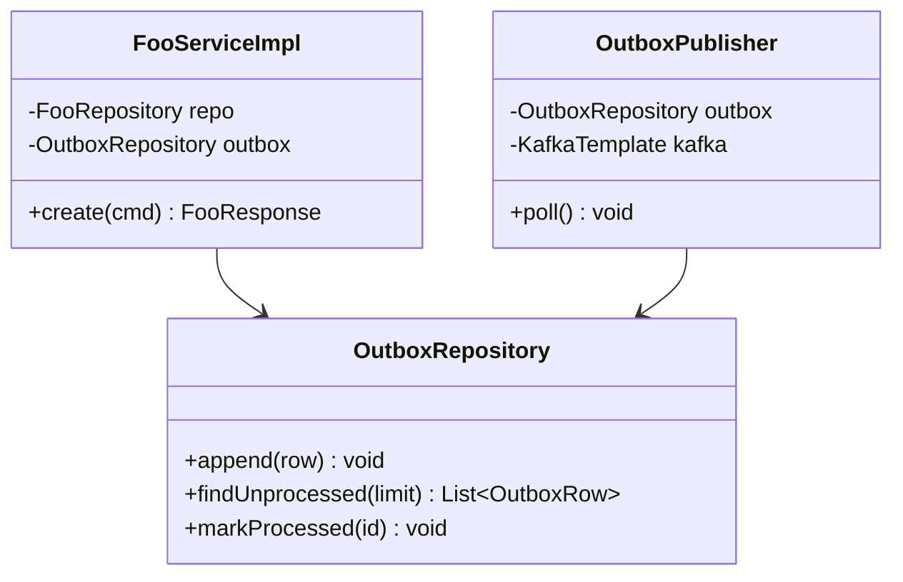
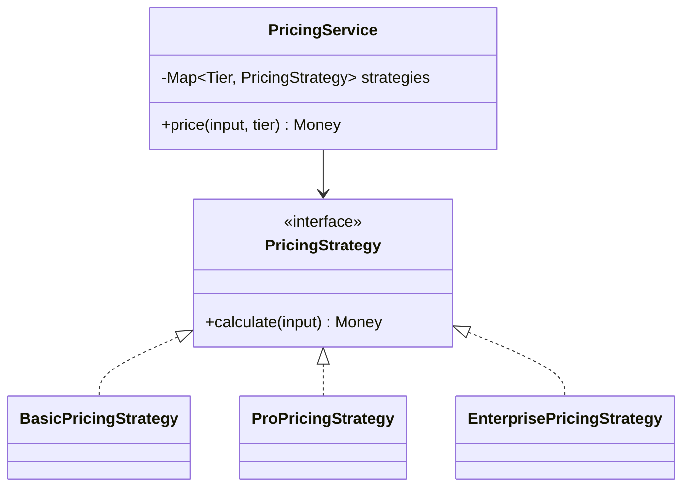
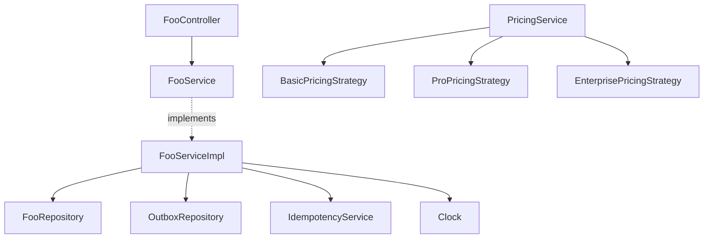
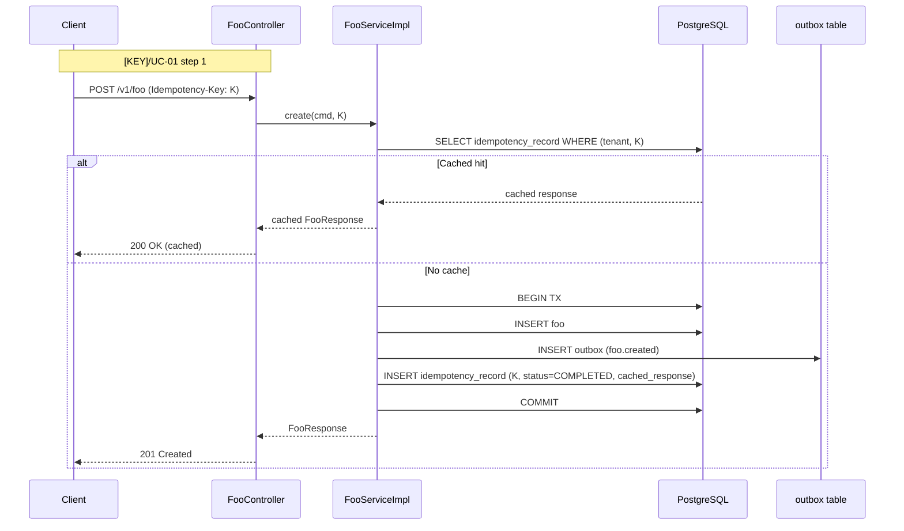
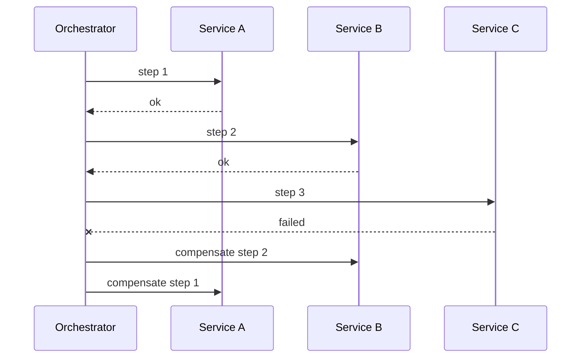

<!--
CHUNK: 04
TITLE: Per-Service Implementation - [Service Name]
PROJECT: [Project Name]
VERSION: [X.X]
DEPENDS_ON: 03, 09
PART OF: LLD - [Project Name]
NOTE: This is the TEMPLATE for a single service. In CHUNKS shape, copy this file as
      ./lld-[project-slug]/04-implementation/[service-slug].md per service.
      Cross-service sagas live with the orchestrator service's file.
-->

# 7. Per-Service Implementation - [Service Name]

> **Bounded context:** [SDD §13 row and §17.X Boundaries / inferred from code path]
>
> **Source code:** [path/to/service]
>
> **Owns use cases (SDD 09):** [[KEY]/UC-01](../../brd-[brd-slug]/06a-use-cases-[persona-slug].md#uc-01-[title-slug]), [[KEY]/UC-02](../../brd-[brd-slug]/06a-use-cases-[persona-slug].md#uc-02-[title-slug]) [or: None - what it serves / Not applicable - no source BRD]
>
> **Participates in:** [KEY]/UC-03 (owner: [service]) [or: None]

---

## 7.1 Responsibility

<!-- One paragraph. What is this service's single responsibility? Bounded-context level, not implementation level. -->

[Responsibility statement.]

---

## 7.2 Class & Interface Map

> **Convention:** list the load-bearing classes only — controllers, services, service implementations, repositories, mappers, key domain types. Skip DTOs that are obvious from controller signatures.

### Controllers

| Class | Endpoints | Notes |
|-------|-----------|-------|
| `[FooController]` | `[GET /v1/foo/{id}, POST /v1/foo, ...]` | [Auth scope, idempotency rules] |

> **Convention:** every entry point a § 7.8 traceability line names (REST method, event listener, scheduled job) carries `@UseCase("[KEY]/UC-NN")` with that use case's keyed ID (`09-cross-cutting.md` § 12.8). Platform endpoints carry none.

### Services (interfaces)

| Interface | Purpose | Implementations |
|-----------|---------|-----------------|
| `[FooService]` | [What this service interface defines] | `[FooServiceImpl]` |

### Service Implementations

| Class | Implements | Key methods |
|-------|------------|-------------|
| `[FooServiceImpl]` | `[FooService]` | `[create(...)]`, `[update(...)]`, `[query(...)]` |

### Repositories

| Class | Entity | Notes |
|-------|--------|-------|
| `[FooRepository]` | `[Foo]` | [Spring Data JPA / JDBC, custom queries if any] |

### Domain Types (records)

| Type | Kind | Purpose |
|------|------|---------|
| `[FooDto]` | record | [Inbound DTO for FooController.create] |
| `[FooResponse]` | record | [Outbound response from FooController.get] |
| `[Foo]` | entity | [Aggregate root for the foo bounded context] |

### Method Signatures (key methods only)

```java
// FooService
public interface FooService {
  FooResponse create(CreateFooCommand cmd, IdempotencyKey key);
  FooResponse update(UUID id, UpdateFooCommand cmd, IdempotencyKey key);
  Optional<FooResponse> findById(UUID id);
  Page<FooResponse> query(FooQuery query, Pageable pageable);
}
```

> **Convention:** records are used for all DTOs (CLAUDE.md default). Constructor injection only — no `@Autowired` on fields.

---

## 7.3 Method-Level Pseudocode (non-trivial logic only)

> **Convention:** include pseudocode only for methods where the algorithm is non-obvious. Skip for plain CRUD.

### `[FooServiceImpl.create]`

```text
1. Validate idempotency key:
   - Look up (tenant_id, idempotency_key) in idempotency_record table.
   - If found: return cached response.
   - If found but in-flight: return 409 Conflict (per CLAUDE.md error model).
2. Validate command (Bean Validation + domain rules).
3. Begin transaction.
4. Persist Foo aggregate.
5. Append outbox row (foo.created event payload, target topic).
6. Persist idempotency_record (status=COMPLETED, response cached).
7. Commit transaction.
8. Return FooResponse.
```

> **Confidence:** [High — confirmed in code at [file:line] / Medium — inferred from FR-NN / Low — best-guess from sequence flow]

---

## 7.4 Design Patterns Applied

> **Convention:** every applied pattern carries name, triggering CLAUDE.md rule, roles, rationale specific to this service, Mermaid class diagram, and pseudocode skeleton. Patterns inferred from code (from-code) include `> Confirm:` if pattern detection used semantic heuristics; patterns proposed (from-sdd) carry the rule attribution explicitly.

### Pattern: Outbox

> **Applied:** Outbox pattern (CLAUDE.md: "Outbox pattern is mandatory for any state change that must produce an event. No dual-writes to DB and Kafka.")
>
> **Rationale (this service):** [State changes in foo emit `foo.created` and `foo.updated` events to downstream consumers. Direct dual-write to DB+Kafka would risk inconsistency on failure. The outbox row commits in the same transaction as the state change, and a separate publisher delivers it at least once, marking it processed only after the broker acknowledges.]

**Roles:**

| Role | Class / Component | Notes |
|------|-------------------|-------|
| Outbox table | `outbox` table in service schema | Append-only; columns: id, aggregate_type, aggregate_id, event_type, target_topic, payload, created_at, processed_at |
| Outbox writer | `FooServiceImpl.create` (within tx) | Inserts outbox row inside the same transaction as the aggregate write |
| Outbox publisher | `OutboxPublisher` (scheduled, one active instance, outside the writer's tx) | Polls unprocessed rows oldest first, publishes each to Kafka, marks it processed only after the broker acknowledges |

**Class diagram:**



**Pseudocode skeleton:**

```text
@Scheduled(fixedDelay = 1s)
void poll() {
  rows = outbox.findUnprocessed(BATCH_SIZE);
  for row in rows {
    outcome = kafka.send(topic = row.target_topic, key = row.aggregate_id, payload = row.payload)
                   .awaitAck(SEND_TIMEOUT);
    if (outcome != ACKED) {
      return;
    }
    outbox.markProcessed(row.id);
  }
}
```

**Delivery rules** (per `09-cross-cutting.md` § 12.4):

- `markProcessed` runs only after `awaitAck` returns `ACKED`: the broker confirmed the write (`acks=all`).
- `FAILED` (broker error) or `TIMED_OUT` (no acknowledgement within `SEND_TIMEOUT`, from `OUTBOX_SEND_TIMEOUT_MS`): the row keeps `processed_at = NULL` and the next poll retries it. The poll stops at that row, the simplest way to keep later rows for the same key from overtaking it; a row the broker keeps rejecting therefore blocks the outbox and raises `OutboxBacklog` until its cause is fixed.
- Duplicate delivery: `markProcessed` commits per row (`poll` is not one transaction), so if the broker acknowledges but that update fails (database error, or a crash before the update), only that row is still unprocessed and the next poll publishes it again. A `FAILED` or `TIMED_OUT` send may also have reached the broker. The payload, including `eventId`, is fixed when the row is written, so consumers dedupe the re-send (`07-event-contracts.md` § 10.4).

### Pattern: Strategy (example)

> **Applied:** Strategy pattern (CLAUDE.md: "Strategy for runtime variants")
>
> **Rationale (this service):** [Pricing rules differ per tenant tier (basic, pro, enterprise). Hard-coding the variants in a single method would couple tier addition to a code change in `PricingServiceImpl`. Strategy decouples each tier's calculation into its own class, picked at runtime by tenant tier.]

**Roles:**

| Role | Class / Component |
|------|-------------------|
| Strategy interface | `PricingStrategy` |
| Concrete strategies | `BasicPricingStrategy`, `ProPricingStrategy`, `EnterprisePricingStrategy` |
| Context | `PricingService` — selects strategy by tenant tier |

**Class diagram:**



**Pseudocode skeleton:**

```text
class PricingService {
  Map<Tier, PricingStrategy> strategies; // injected by Spring

  Money price(input, tier) {
    return strategies.get(tier).calculate(input);
  }
}
```

<!-- Repeat one Pattern subsection per pattern applied: Factory Method, Mediator, Chain of Responsibility, Saga, Template Method, Facade, Composition over inheritance, etc. Always include the four parts: triggering rule, rationale, roles, Mermaid + pseudocode. -->

> **Note:** for from-sdd mode, every pattern triggered by a CLAUDE.md rule MUST be applied here (not just suggested). For from-code mode, only patterns *actually* present in code are documented; inferred-but-uncertain pattern detections are flagged with `> Confirm: pattern detected via [heuristic]`.

---

## 7.5 Dependency Injection Graph

> **Convention:** constructor injection only. Document the wiring graph for non-trivial cases (3+ collaborators, or any factory/strategy/mediator wiring).



---

## 7.6 Transaction Boundaries

| Method | Propagation | Isolation | Rollback rules |
|--------|-------------|-----------|----------------|
| `[FooServiceImpl.create]` | `REQUIRED` | `READ_COMMITTED` | rollback on `ServiceException`, no rollback on `IdempotencyHitException` |
| `[FooServiceImpl.update]` | `REQUIRED` | `REPEATABLE_READ` | rollback on `ServiceException`, no rollback on `OptimisticLockException` (caller-handled retry) |

> **Convention:** outbox row insert lives inside the same transaction as the aggregate write. No `@Transactional(propagation = REQUIRES_NEW)` for outbox writes — the whole point of the pattern is one-tx commit.

---

## 7.7 Error Handling

| Exception | RFC 9457 type | HTTP Status | When thrown | Caller action |
|-----------|---------------|-------------|-------------|---------------|
| `FooNotFoundException` | `https://errors.example.com/foo/not-found` | 404 | Foo with given ID does not exist for this tenant | None (terminal) |
| `FooValidationException` | `https://errors.example.com/foo/validation` | 400 | Bean Validation or domain rule failed | Fix payload, retry |
| `IdempotencyConflictException` | `https://errors.example.com/idempotency/conflict` | 409 | Same idempotency key in-flight on a different request | Wait + retry, OR use a new key |
| `FooConcurrencyException` | `https://errors.example.com/foo/concurrency` | 409 | Optimistic lock failure | Re-fetch and retry |

> **Convention:** all exceptions extend `ServiceException` (CLAUDE.md base class). Global `@RestControllerAdvice` translates to `ProblemDetails` (RFC 9457). Error envelope schema in `09-cross-cutting.md` § Error Model.

---

## 7.8 Use-Case Workflows

> **Convention:** one subsection per active use case this service owns (SDD §7.3 Owner), headed with the SDD's BRD key and the BRD's ID and title exactly. A merged or removed use case gets no block. Cross-service sagas live in the orchestrator service's file. Each workflow has: the traceability line, control flow, sequence diagram (Mermaid), idempotency points, outbox emission points, retry/timeout choices.

<!--
TRACEABILITY LINE (required, directly under the heading; rules: sdd-to-lld.md § Use-case traceability). Fields in this order, read from their homes, never restated further:
  BRD: the use case link (BRD heading anchor, built from the real heading). SDD: the §7.3 link, the same in every block.
  Owner and Entry points: exactly as SDD §7.3 writes them (method + path, or Schedule: / Event: triggers, with the service named when it is not the owner).
  UAT/BAT: every non-retired BRD chunk 16 case whose Related UC names this use case, one by one, each linked to its feature-area heading; "Pending (BRD 16 not written)" while chunk 16 is locked; "None - BRD coverage gap" when chunk 16 has none.
  Screens: from 14-frontend.md § 17.3, the screen ID (else the MK-NN, linked to 14-todo.md#mockup-coverage) and each route that starts the use case; "Not applicable - no UI" when chunk 14 is omitted; "> Confirm: no screen ID or MK-NN in the BRD for [KEY]/UC-NN" when the BRD has neither.
Every BRD ID carries the key from the SDD's Source BRDs register. Paths are relative to this file (../../ reaches the sibling BRD and SDD folders).
No source BRD, or pure from-code: heading "### Workflow: [Flow name]" and the line "> **Traceability:** Not applicable - no source BRD" (or "- no source SDD"). Never a made-up UC ID.
-->

### [KEY]/UC-01: [Use case title, exactly as the BRD writes it]

> **Traceability:** BRD [[KEY]/UC-01](../../brd-[brd-slug]/06a-use-cases-[persona-slug].md#uc-01-[title-slug]) · SDD [§7.3](../../sdd-[sdd-slug]/03-users-and-use-cases.md#73-use-case-traceability-brd--sdd) · Owner: [service-name] · Entry points: `[METHOD] /v1/[path]` · UAT/BAT: [[KEY]/TC-[AREA]-01](../../brd-[brd-slug]/16-uat-bat-test-cases.md#[n]-[feature-area-slug]), [[KEY]/TC-[AREA]-02](../../brd-[brd-slug]/16-uat-bat-test-cases.md#[n]-[feature-area-slug]) · Screens: [[KEY]/SCR-NN](../../brd-[brd-slug]/11-summary-and-uiux.md#[screens-heading-slug]) via `/[route]`

**Trigger:** [The entry point above and its handler, e.g. `FooController.create` with `@UseCase("[KEY]/UC-01")` / Kafka listener / Scheduled task]

**Pre-conditions:** [What must be true before this flow]

**Post-conditions:** [What is true after a successful flow]

**Control flow:**

```text
1. [Step] ([KEY]/UC-01 step 1)
2. [Step] ([KEY]/UC-01 step 3)
3. [Step — outbox emission point: emits foo.created]
4. [Step]
5. [Idempotency check: ...]
6. [Step] ([KEY]/UC-01 E1: the exception flow this branch realises)
```

**Sequence diagram:**



> Miro: [optional whiteboard view URL]

**Idempotency points:** [Header `Idempotency-Key` required on POST; (tenant_id, key) is the dedup tuple; TTL 24h on the cached record]

**Outbox emission points:** [foo.created event emitted in step 3; topic `foo.lifecycle.created`; key = aggregate ID for per-aggregate ordering]

**Retry / timeout policy:** [A failed or timed-out publish leaves the outbox row unprocessed; the next poll (every 1s) retries it until the broker acknowledges. A row that stays unprocessed raises `OutboxBacklog` (`10-operations.md` § 13.7)]

**Error handling:** [Validation → 400 + FooValidationException; [KEY]/UC-01 E1 → 409 + FooConflictException; DB failure → 500 + retry-after header]

### [KEY]/UC-02: [Use case title, exactly as the BRD writes it]

<!-- Repeat the structure, traceability line included, for each active use case this service owns. -->

### Participates in [KEY]/UC-03: [Use case title, exactly as the BRD writes it]

<!-- Only when this service realises part of a use case another service owns (a saga step, an event consumer). Never a second UC block: the owner's file holds the traceability line. -->

> **Owner's block:** [[owner-service] § [KEY]/UC-03](./[owner-slug].md#[key-lowercase]uc-03-[title-slug]) · Part realised here: [[KEY]/UC-03 step N / A1 / E1] · Entry points here: [`Event: [EVENT_NAME]` as SDD §7.3 names it / None]

**Control flow:** [This service's steps only, each citing the part of the use case it realises.]

### Cross-service Saga (orchestrator role)

> **Only present if this service is the orchestrator of a multi-service saga.** Choreography-style sagas (each service reacts to events without an orchestrator) are documented per-step in the participating services' workflow sections.

**Saga name:** [SAGA-NN: Name]

**Participating services:** [List]

**Steps:**

| Step | Service | Action | Compensating action | Idempotency |
|------|---------|--------|---------------------|-------------|
| 1 | [svc-a] | [Action] | [Compensation] | [Key strategy] |
| 2 | [svc-b] | [Action] | [Compensation] | [Key strategy] |
| 3 | [svc-c] | [Action] | [Compensation] | [Key strategy] |

**Compensation triggers:** [Conditions that trigger rollback through the chain]

**Sequence diagram:**



<!-- MASTER: [project-slug]-lld-master.md | PREV: 03-architecture.md | NEXT: 05-data-model.md -->
