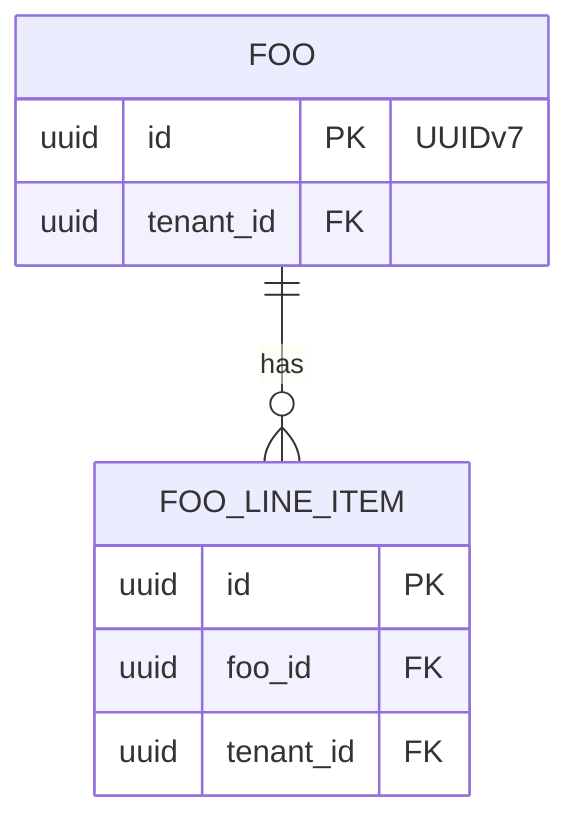

<!--
CHUNK: 05
TITLE: Data Model
PROJECT: [Project Name]
VERSION: [X.X]
DEPENDS_ON: 04
PART OF: LLD - [Project Name]
-->

# 8. Data Model

> **Per-service ownership:** each service owns its own private PostgreSQL schema (CLAUDE.md default). This chunk covers all schemas in the LLD scope.

## 8.1 Entity Relationship (system-wide)

<!-- Entities, keys (PK, FK), and relationships only, as the SDD's ERD draws them, with no line cap; every other column lives in § 8.2 (sdd-to-lld.md § Field mapping table, 13a DB Modeling). -->

**Summary:** [1-2 sentences: the main entities and their key relationships.]

> Miro: [optional whiteboard view URL]

## 8.2 Tables (per service)

### Service: `[service-a]` - schema `app_[service_a]`

| Table | Column | Type | Constraints | Notes | Source |
|-------|--------|------|-------------|-------|--------|
| `foo` | `id` | `uuid` | PK | UUIDv7, generated at service layer | [SDD §17.X Tables Design] |
| `foo` | `tenant_id` | `uuid` | NOT NULL, indexed | Required for multi-tenant queries | [SDD §17.X Tables Design] |
| `foo` | `status` | `text` | NOT NULL, CHECK in (...) | Domain-state column | [SDD §17.X Tables Design] |
| `foo` | `version` | `bigint` | NOT NULL, default 0 | Optimistic locking | [SDD §17.X Tables Design / LLD] |
| `foo` | `created_at` | `timestamptz` | NOT NULL | UTC always | [SDD §17.X Tables Design] |
| `foo` | `updated_at` | `timestamptz` | NOT NULL | UTC always | [SDD §17.X Tables Design] |
| `outbox` | `id` | `uuid` | PK | UUIDv7 | [SDD §17.X Tables Design / LLD] |
| `outbox` | `aggregate_type` | `text` | NOT NULL | e.g. "foo" | [SDD §17.X Tables Design / LLD] |
| `outbox` | `aggregate_id` | `uuid` | NOT NULL | Used as Kafka key | [SDD §17.X Tables Design / LLD] |
| `outbox` | `event_type` | `text` | NOT NULL | e.g. "foo.created" | [SDD §17.X Tables Design / LLD] |
| `outbox` | `target_topic` | `text` | NOT NULL | The target: the Kafka topic; for a provider write or a durable in-process event, the target it names (`09-cross-cutting.md` § 12.4) | [SDD §17.X Tables Design / LLD] |
| `outbox` | `payload` | `jsonb` | NOT NULL | Event payload, including `eventId`; fixed at write time | [SDD §17.X Tables Design / LLD] |
| `outbox` | `created_at` | `timestamptz` | NOT NULL | Insert time | [SDD §17.X Tables Design / LLD] |
| `outbox` | `processed_at` | `timestamptz` | NULL | Set by the publisher only after the target acknowledges the row (`09-cross-cutting.md` § 12.4); NULL = pending or retryable | [SDD §17.X Tables Design / LLD] |
| `idempotency_record` | `tenant_id` | `uuid` | PK part 1 | Composite PK | [SDD §17.X Tables Design / LLD] |
| `idempotency_record` | `idempotency_key` | `text` | PK part 2 | From `Idempotency-Key` header | [SDD §17.X Tables Design / LLD] |
| `idempotency_record` | `status` | `text` | NOT NULL | IN_PROGRESS / COMPLETED / FAILED | [SDD §17.X Tables Design / LLD] |
| `idempotency_record` | `cached_response` | `jsonb` | NULL | Set on COMPLETED | [SDD §17.X Tables Design / LLD] |
| `idempotency_record` | `created_at` | `timestamptz` | NOT NULL | Deleted after the `09-cross-cutting.md` § 12.2 TTL | [SDD §17.X Tables Design / LLD] |

> **Source:** from an SDD, each row restates the SDD row it comes from and links it (a `13x` Tables Design row, or SDD §11.1 for the publication log); `LLD` marks a table or column the LLD adds (its Notes name the pattern that needs it). A value that differs from the SDD is drift to flag (`sdd-to-lld.md` § One fact, one home, rule 3). From code with no SDD: the migration that creates it.

### Service: `[service-b]` - schema `app_[service_b]`

<!-- Repeat per service. -->

## 8.3 Indexes

| Index | Table | Columns | Type | Rationale |
|-------|-------|---------|------|-----------|
| `idx_foo_tenant` | `foo` | `(tenant_id)` | btree | Required for tenant-scoped queries (CLAUDE.md: every index in shared-schema includes tenant_id) |
| `idx_foo_tenant_status` | `foo` | `(tenant_id, status)` | btree | Hot-path: list by status |
| `idx_outbox_unprocessed` | `outbox` | `(created_at) WHERE processed_at IS NULL` | partial btree | Outbox publisher poll, oldest unprocessed first |
| `idx_idempotency_created` | `idempotency_record` | `(created_at)` | btree | Cleanup job |

## 8.4 Multi-Tenancy Strategy

> **Default per CLAUDE.md:** schema-per-tenant for high-volume services; shared-schema with `tenant_id` for low-volume.

| Service | Strategy | Rationale |
|---------|----------|-----------|
| `[service-a]` | [Schema-per-tenant / Shared with tenant_id] | [Reasoning] |
| `[service-b]` | [Schema-per-tenant / Shared with tenant_id] | [Reasoning] |

**Tenant filter enforcement:** [Hibernate filter / row-level security policy / query helper - pick one and apply uniformly]

**Cross-tenant queries:** forbidden at the application layer (CLAUDE.md). [Enforced via X.]

## 8.5 Migration Plan (Flyway)

| Version | File | Purpose |
|---------|------|---------|
| `V001__create_foo.sql` | `[service-a]/src/main/resources/db/migration` | Initial foo + foo_line_item tables |
| `V002__create_outbox.sql` | `[service-a]/...` | Outbox table |
| `V003__create_idempotency.sql` | `[service-a]/...` | Idempotency record table |

> **Convention per CLAUDE.md:** versioned SQL only; backward-compatible changes only; expand-contract for breaking changes.

## 8.6 Retention & Archival

| Table | Hot retention | Archival destination | Restore SLA |
|-------|---------------|---------------------|-------------|
| `foo` | Indefinite | N/A (operational) | N/A |
| `outbox` | 7 days after `processed_at`; unprocessed rows are never deleted | Cleanup job (delete) | N/A |
| `idempotency_record` | The `09-cross-cutting.md` § 12.2 TTL | Cleanup job (delete) | N/A |
| `audit_log` (if any) | 90 days hot | S3-compatible cold storage | 24h |

## 8.7 Encryption

| Concern | Approach |
|---------|----------|
| At rest | [pgcrypto column-level for PII / TDE / disk-level only] |
| In transit | TLS 1.2+ between services and DB |
| Key management | [KMS / Vault - rotation policy] |
| PII columns | [List + masking rule for non-prod] |

<!-- MASTER: [project-slug]-lld-master.md | PREV: 04-implementation/<service>.md | NEXT: 06-api-contracts.md -->
