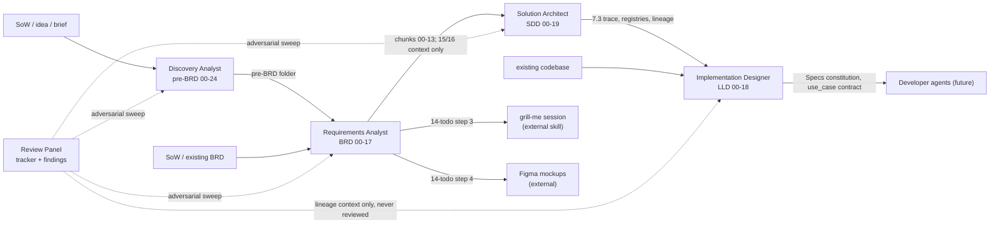

# 01. Pipeline overview

## 1. The chain

The chain answers four questions in order: is it worth building (Discovery), what must it do (Requirements), how is it built (Architecture), and exactly how does each service work (Implementation Designer). The Review Panel cuts across: it challenges whatever exists and hands changes back to the owning agents.

## 2. Stage table

| Stage | Agent | Main inputs | Main outputs | Key human decisions | Gate |
|---|---|---|---|---|---|
| Discovery | Discovery Analyst | Idea, segment, geography, currency | pre-BRD chunks 00-24, dual verdicts | Intake answers, lens, approve deliverable | Approval at step 7 (locks the Excel export; a hand-off lock is a product addition, the skill has none) |
| Requirements | Requirements Analyst | pre-BRD, SoW, or existing BRD | BRD chunks 00-14 (+15-17 gated), decision-log | Mode, part checkpoints, OI decisions, to-do evidence | Delivery gate G1-G5 locks 15-17 |
| Architecture | Solution Architect | BRD(s), CLAUDE.md defaults | SDD chunks 00-18 (+19 gated), decision-log | Project Type, architecture style, ecosystem, OI decisions | E2E gate E1-E4 locks chunk 19 |
| Implementation design | Implementation Designer | SDD, BRD(s), and/or codebase | LLD chunks 00-18, Specs, Child LLDs row | Direction, refresh offers, answers, roadmap grouping | None of its own; stops only on an unfinished SDD, and records (does not enforce) the SDD's E2E gate state (lld-unifier/SKILL.md:152) |
| Cross-review | Review Panel | The whole chain except LLD content | Tracker, findings, doc edits, hand-offs | Scope, SME domain, every point, hand-off launches | No close with Pending points; hand-offs on the user's word |

## 3. Handoff contracts

These are the load-bearing contracts between agents. The platform should treat each as a typed interface with a conformance check (the suite's `_fixtures/checkers/` scripts already implement several).

| Producer -> Consumer | What flows | Mechanism |
|---|---|---|
| Discovery -> Requirements | pre-BRD folder, chunk-by-chunk mapping | Folder/file naming contract; verdict word cited with a link, never restated; markers carried to their BRD homes; market figures stay in the pre-BRD |
| Requirements -> Architecture | BRD chunks 00-13 (+15/16 as context); Appendix § Technical Inputs for the SDD, parked verbatim; UC/persona/partner name stability | Reading-order contract in the BRD master; BRD never defines INT-NN; a renamed UC or persona breaks the chain and needs a Changes Log mapping note |
| Architecture -> Requirements (return) | Author items: UC overlap between two BRDs, behavior no UC covers | Author items are Open OIs in SDD chunk 18 for the BRD owners, decided in the SDD's own loop; separately, the derive handoff lists markers only a BRD owner can answer as "BRD follow-ups for brd-unifier" (sdd-unifier/brd-to-sdd.md:366) |
| Architecture -> Implementation Designer | SDD chunk names per the canonical map; §7.3 trace; contract registries (§14, §15, §16); Source BRDs register with keys; ADR-01; §1 Project Type line | Chain handoff check at every SDD handoff; contract names matched character-for-character downstream |
| Implementation Designer -> Architecture | Exactly one row in the SDD's Child LLDs table | Columns `LLD, Scope (§13 services), Direction, Version, SDD version, Link`; the Implementation Designer's only write into another document |
| Architecture (checker) -> Implementation Designer | Out-of-date note on the Child LLDs row | ` (out of date: SDD is now v[X.X]; refresh through lld-unifier)` appended to the SDD version cell; the LLD's next build or accepted refresh clears it once its row names the current SDD version (lld-unifier/sdd-to-lld.md:220) |
| Requirements -> Implementation Designer | BRD chunk 14 Mockup coverage (MK-NN rows), chunk 16 UAT/BAT (TC IDs), use-case chunks | Read through the SDD's trace; `Pending (BRD 16 not written)` while BRD chunk 16 is absent or `Locked` (lld-unifier/sdd-to-lld.md:55) |
| Review Panel -> Requirements | "update the todo: decisions from the business review of [the tracker's Created date] ([tracker path])" | Taken once: the BRD first checks whether an earlier update took this review, and a repeat applies pending items only, with no consistency run unless asked (brd-unifier/SKILL.md:318). Otherwise the BRD checks the decisions the review applied (never re-applies them), closes answered items (Outcome `Settled by business review [point ID]`), and raises TD-NN/OI-NN for open remainders |
| Review Panel -> Architecture | "BRD [KEY] has a new version, after the business review of [date] ([tracker path])", or "the business review changed this SDD" when no source BRD changed | Taken once: the SDD first checks whether an earlier update took this review, and a repeat applies pending items and runs the Child LLDs check only (sdd-unifier/SKILL.md:373). Otherwise it reruns reconciliation, closes or supersedes answered items, raises remainders, marks chunk 19 Stale if it exists and the review changed a chunk from 02 to 13x or an open item was raised or reopened, and runs the delta review |
| Review Panel -> Implementation Designer | "the SDD has a new version" | LLD offers the mapped refresh (never silently); the review never writes the LLD |
| Implementation Designer -> Developer agents (future) | `lld-[slug]/`, `17-specs.md` constitution, runtime use_case convention | Specs read verbatim; `@UseCase` annotations, `use_case` span/log attribute, route data honored in code |

## 4. The lineage graph

Every document knows its parents and children. The platform can render this graph from the artifacts alone:

- Each BRD links its source pre-BRD chunks inline (`[pre-BRD 07 Market Sizing](../pre-brd-[slug]/07-market-sizing-analysis.md)`).
- Each SDD chunk 00 § Document Lineage holds the **Source BRDs register** (key, BRD, version, link per parent) and the **Child LLDs table** (per child).
- Each LLD `16-references.md` § 19.1 records the SDD and BRD versions its content reflects; its master's Related SDD line links the SDD master.
- The review tracker links every document it changed, with per-document old-to-new versions in its Versioning block (a pre-BRD has no version: the block lists the pre-BRD chunks the session changed).
- Every BRD, SDD, and LLD carries a Changes Log with one row per update and a `Chunks:` list, so the platform can answer "what changed in vX.X" mechanically. The pre-BRD has neither a version nor a Changes Log (business-reviewer-unifier/apply-and-verify.md:98-100).

## 5. Entry points and skip patterns

| Starting material | Enters at | Notes |
|---|---|---|
| Bare idea | Discovery Analyst | Full research fan-out; the only agent that needs web research |
| SoW / project brief / RFP scope | Requirements Analyst (recommended) or Discovery | SoW -> SDD direct is discouraged by the Architect's own rules |
| pre-BRD (approval is not a skill condition; a No-Go or Conditional Go verdict does not block the BRD) | Requirements Analyst (TRANSFORM) | Verdict cited, markers carried, fixtures validate the mapping |
| Existing BRD (any format) | Solution Architect (DERIVE-FROM-BRD) or Requirements (TRANSFORM first) | Legacy Specs and Technical Implementation Expectations sections are consumed |
| Existing SDD | Solution Architect (TRANSFORM) or Implementation Designer (from-sdd) | TRANSFORM locks the source's technology choices |
| Existing codebase | Implementation Designer (from-code) | No SDD: Tech Stack from manifests, Project Type Brownfield, trace Not applicable |
| Codebase + SDD | Implementation Designer (hybrid, or partial if code is incomplete) | Drift markers make SDD-vs-code divergence visible |
| Existing documents, any mix | Review Panel | Scope defaults to the whole chain minus LLD content |

## 6. Update propagation

Versions only move forward, and every propagation is a confirmed task, never a silent refresh:

1. A BRD changes (targeted update, grill-me decisions, or business review): its version bumps, gated chunks 15-17 go Stale if their source meaning changed.
2. The user (or the Review Panel) tells the Architect "BRD <KEY> has a new version": the SDD takes a targeted update (register the version, derive the delta, rerun step 6a, mark chunk 19 Stale, delta review), one version bump per update.
3. The next Implementation Designer run detects the newer SDD in step 3c and makes one bundled refresh offer; the human accepts, or the LLD stays at its recorded versions and the handoff says so.
4. An out-of-date Child LLDs row is flagged by the Architect on every run until refreshed.

The same pattern holds for the review cycle; see `07-collaboration-flows.md` F3.
