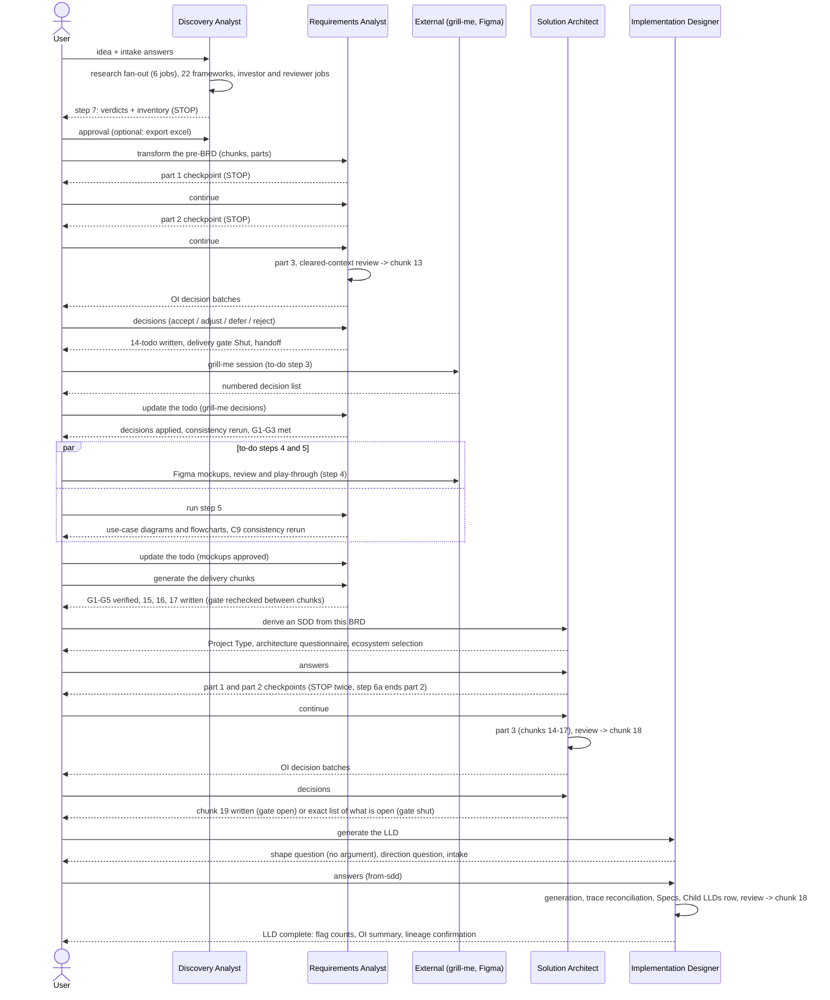
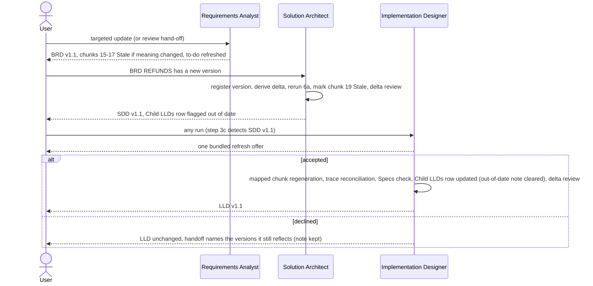
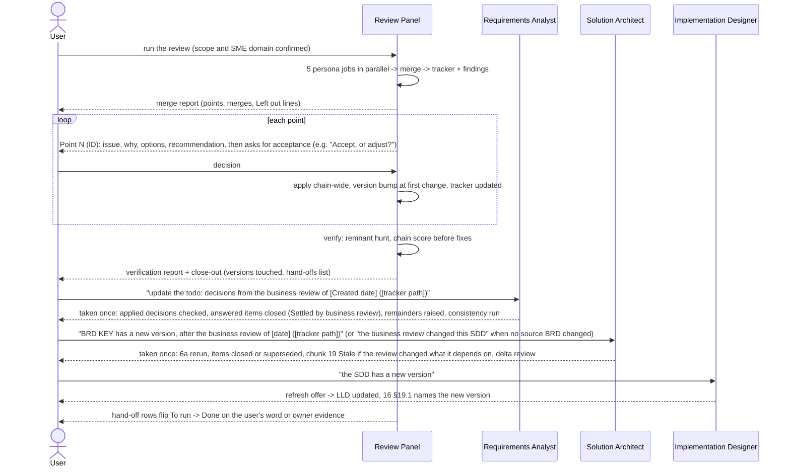

# 07. Collaboration flows

The orchestration reference: who acts, in which order, and where the human must decide. Every handoff is a confirmed task launch (see `00-vision-and-model.md` § 5.4). Stage names follow `08-states-and-vocabulary.md` § 8.

## F1. Fresh full-chain run

Typical elapsed pattern: days, not minutes. Parts checkpoints and external tasks (grill-me, Figma) are the long poles. The platform should persist run state so any stop can resume later (F4).

## F2. Update propagation: a BRD changes

Rules that hold in every propagation: one update is one version; `Deferred` never counts as closed; nothing refreshes silently; a BRD newer than the SDD's register is routed through the Architect first.

## F3. Business review cycle

In the 2026-10-07 fixture run, the test harness authorized these steps separately (R3a review, R3b BRDs, R3c SDD, R3d LLD). Those labels are harness stages, not skill output, and owners never write the tracker. Each owner takes a review hand-off once: a repeated request is answered as already taken (brd-unifier/SKILL.md:318; sdd-unifier/SKILL.md:373). The review sets an `Approved` BRD's cover to `In Review` and leaves the Reviewed/Approved By cells of its Changes Log row empty until the owner approves; chunks 15-17 that exist stay `Stale` until brd-unifier's G1-G5 gate is open again. The review never adds a gate condition (business-reviewer-unifier/apply-and-verify.md:37, 73-77).

## F4. Resume patterns

| Agent | Resume signal | Behavior |
|---|---|---|
| Discovery | None: the master is an index with no progress state | The skill defines no resume; re-running the pass is product behavior. The mid-run mode-change rule (finish the current file, then offer the conversion; never delete produced output, pre-brd-unifier/modes.md:36) applies only to a change of output shape |
| Requirements | Master Generation Progress shows a part `Pending` / `In progress` | Say which part is next; empty request -> ask "Continue with part N?"; legacy plain `brd-master.md` renamed first |
| Architect | Same mechanism, `[slug]-sdd-master.md` | Same, plus: never rerun intake or ecosystem selection; run the Child LLDs check on every resume; a part `In progress` continues after its last recorded step, and the reviewer does not run again when chunk 18 exists (sdd-unifier/parts-mode.md:159) |
| Impl. Designer | `00-metadata.md` Mode field, `16-references.md` §19.1 versions | Direction prompt defaults to the recorded Mode; step 3c compares upstream versions and offers once; legacy `lld-master.md` renamed |
| Review Panel | Tracker state | Phase detection: no tracker -> panel; Pending points -> walkthrough; Decided-but-unapplied -> apply; closed-unverified -> verify; verified -> close; hand-offs `To run` -> offer next |

## F5. Human touchpoint inventory

Every blocking and optional decision point, in chain order. "Batch" means several decisions arrive in one prompt.

| Agent | Touchpoint | Blocking | Form |
|---|---|---|---|
| Discovery | Format prompt | once, if no argument | single question |
| Discovery | Generate vs transform | conditional (ambiguity only) | single question (pre-brd-unifier/transform-detection.md:19) |
| Discovery | Intake (idea, segment, geography, currency + constraints) | yes | up to 4 questions |
| Discovery | Investor lens check | conditional (ambiguity only) | single question |
| Discovery | Step 7 approval | yes (locks the Excel export; a hand-off lock is a product addition) | explicit approval |
| Discovery | Excel export phrase | optional | explicit phrase |
| Requirements | Mode prompt | once, if no argument and no resume | single question |
| Requirements | Intake (name, source, personas) | yes | up to 3 questions |
| Requirements | HLD disambiguation | conditional | single question |
| Requirements | Part 1 and part 2 checkpoints | yes | "continue" or changes |
| Requirements | Brand/key color (no constitution, no source color) | once, first OI batch | bundled question |
| Requirements | OI acceptance loop | yes (gate G1 waits) | batches of up to 4 |
| Requirements | grill-me session | external, gate G3 | PM's dated confirmation |
| Requirements | Mockup coverage approvals | external, gate G4 | rows Approved + links |
| Requirements | "run step 5", delivery chunk requests | optional, gated | trigger phrases |
| Architect | Mode prompt, intake | once / yes | as Requirements |
| Architect | Project Type (Greenfield/Brownfield) | once, if source silent | single question |
| Architect | One SDD or one SDD per BRD | conditional (several BRDs, unclear whether one system) | single question (sdd-unifier/transform-detection.md:56) |
| Architect | Cross-BRD conflicts | conditional | per-conflict question |
| Architect | A new BRD version whose cover Status is not `Approved` | conditional | single question (sdd-unifier/brd-to-sdd.md:69) |
| Architect | Orphaned responsibility after a service is removed or merged | conditional | one question each, recommendation first (sdd-unifier/parts-mode.md:65) |
| Architect | Architecture questionnaire | yes: accept-all or walkthrough (up to 2 batches) | structured batches |
| Architect | Ecosystem selection | yes: accept-all or walkthrough (batched by concern) | structured batches |
| Architect | Part 1 and part 2 checkpoints | yes | "continue" or changes |
| Architect | OI acceptance loop | yes (gate E1 waits) | batches of up to 4 |
| Architect | Gate-blocking marker walk | when markers block E3 | design choices: two or three options with a Recommended Answer and Why; owner-only facts handed off as exact questions (sdd-unifier/SKILL.md:309) |
| Architect | Provider API documentation | external, when external contracts exist | supplied documents |
| Impl. Designer | Shape prompt + direction prompt | once + always | two questions |
| Impl. Designer | Intake (name, source material, direction confirmation) | yes | up to 3 questions (lld-unifier/SKILL.md:127) |
| Impl. Designer | Brownfield friction (only an SDD given) | conditional | single question (lld-unifier/transform-detection.md:35) |
| Impl. Designer | Project Type (if the SDD does not record it) | conditional | single question |
| Impl. Designer | Refresh offer (step 3c) | when upstream moved | one bundled offer |
| Impl. Designer | Roadmap grouping | conditional (no natural breaks) | single question |
| Impl. Designer | Answers in the same update | optional | free decisions or an answer policy |
| Review Panel | Scope confirmation | yes | confirmation of detected list |
| Review Panel | SME domain | yes, mandatory | confirm inferred or supply |
| Review Panel | Panel composition (SEC/FL/UX add-ons) | once | confirmation |
| Review Panel | Ask a reviewer for more | optional, once per reviewer | per-reviewer action |
| Review Panel | Walkthrough order | once, at walkthrough start | tracker order unless the user picks another; points are decided all first only when the user asks (business-reviewer-unifier/walkthrough-protocol.md:10-11; SKILL.md:52-53) |
| Review Panel | Every point | yes (no close with Pending) | Accept / Adjust / Reject / Defer (a one-line reason for the last two; Defer only on the user's word) / custom |
| Review Panel | Remnant adjudication | conditional | options + recommendation |
| Review Panel | Deferred escape hatch | conditional | requires the user's word |
| Review Panel | Hand-off launches | yes, per hand-off | confirmed task launch |

## F6. Variant and degraded flows

| Scenario | How the flow changes |
|---|---|
| No research backend | The skill defines no degraded mode: every figure it cannot source becomes `[NEEDS CLARIFICATION: <question>]` (pre-brd-unifier/SKILL.md:65). A degraded-mode banner is a product addition |
| LLD from-code only | No SDD/BRD: Tech Stack from dependency manifests, Project Type Brownfield, workflows headed `### Workflow: [name]`, trace `Not applicable - no source SDD` |
| Partial code + SDD | Built services get the from-code pass; unbuilt services get the canonical three-line placeholder (Status / Owns use cases / TODO re-run) |
| SoW -> Requirements direct | TRANSFORM from the SoW (brd-unifier/transform-detection.md:22-23; brd-unifier/sow-transformation.md); technical mandates parked verbatim in Appendix § Technical Inputs for the SDD |
| Pure conversions | Merge and re-chunk run without the review or gate machinery and bump nothing (a conversion never reopens or refreshes a gate). A targeted regeneration is a content update: one version bump, then each agent's tail (BRD: consistency rerun, 14 refresh, 15-17 `Stale` when meaning changed; SDD: pending items first, step 6a, delta review, step 8b; LLD: step 6a, delta review, plus the application check when answers were applied) (brd-unifier/SKILL.md:317; sdd-unifier/SKILL.md:360; lld-unifier/SKILL.md:313) |
| Legacy documents | Legacy Specs chunks consumed read-only; plain master filenames renamed; earlier chunk maps migrated; a legacy SDD owes one E3 inventory + 13x data-model sweep |
| Existing SDD (TRANSFORM) | Source technology choices locked as `source SDD` rows; replacing one is a recorded design change |
| Enterprise/internal idea | Discovery swaps to the business-case lens (same aspects, weights, bands), noted in chunk 23 |
