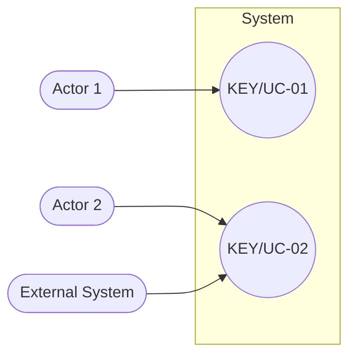

<!--
CHUNK: 03
TITLE: System Users & Use Cases
PROJECT: [Project Name]
VERSION: [X.X]
DEPENDS_ON: 01 (§7.3 also reads 05, 09, 10, 11, and 13x)
PART OF: SDD - [Project Name]
-->

# 7. System Users & Use Cases

## 7.1 Actors

<!-- List all actors (human users and external systems) that interact with the platform. -->

| Actor | Type (Human / System) | Description | Primary Interface |
|-------|-----------------------|-------------|-------------------|
| [Actor 1] | [Human / System] | [Description] | [Interface] |
| [Actor 2] | [Human / System] | [Description] | [Interface] |

## 7.2 Use Case Diagram

**Figure 1: Use Case Diagram**

<!-- Inline Mermaid is the default diagram medium. Carry the UC IDs verbatim from the BRD with their BRD key, as plain quoted labels (no links inside Mermaid; the links to the BRD are in §7.3). Append `> Miro: <url>` only if a richer whiteboard version exists on a real board. -->

**Summary:** [1-2 sentences: which actors drive which use-case clusters.]

## 7.3 Use Case Traceability (BRD → SDD)

<!--
Derive-from-BRD only. For an SDD with no source BRD, keep this heading and write: "Not applicable - no source BRD."
One row per use case of every source BRD, including the rows a BRD marks "Merged into UC-NN" or "Removed". Rows are grouped by BRD in the order of the Source BRDs register (chunk 00 § Document Lineage), each group under a row naming the BRD (data source) with its version, key, and a link to its master. Inside a group, rows follow that BRD's Use Case Summary. Every use case carries its BRD key: [KEY/UC-NN](link).
A consolidated view: every column is read from its home and never states a mapping the home does not state.
  Use case (BRD), Title, Status: the BRD Use Case Summary (title exactly as the BRD writes it).
  Owner: chunk 09 "Use cases (BRD)" column, the home of ownership (exactly one owner per active use case).
  Entry points: the named service's List of APIs (13x), method and path exactly as written there; or the trigger (Schedule: [name] / Event: [EVENT_NAME]).
  Flows: the "Use cases:" lines in chunk 05.
  APIs: chunk 11 §15.2 "Use case ref".
  Events: the "when" citations in chunk 10 §14.5.
Links: each UC ID links to its heading in the BRD (file + anchor). The owner links to its 13x chunk once that chunk exists (plain text before). Rules: brd-to-sdd.md § Use-case traceability.
Parts: part 1 fills Use case, Title, Owner, Flows, and Status; Entry points, APIs, and Events read "Pending (part 2)" until part 2 fills them.
Gaps: an active use case with no owner or no entry point gets [NEEDS CLARIFICATION: ...] in that cell; these markers keep the e2e gate shut. Flows, APIs, and Events may be "-". Merged or removed rows show "-" in every mapping column.
-->

| Use case (BRD) | Title | Owner (§17.X) | Entry points | Flows (§8.4 / §8.5) | APIs (§15) | Events (§14) | Status |
|----------------|-------|---------------|--------------|---------------------|------------|--------------|--------|
| **[[BRD project name] v[X.X]](../brd-[brd-slug]/[brd-slug]-brd-master.md) ([KEY])** | | | | | | | |
| [[KEY]/UC-01](../brd-[brd-slug]/06a-use-cases-[persona-slug].md#uc-01-[title-slug]) | [Short title, as in the BRD] | [[service-name](./13a-service-[slug].md)] | `[METHOD] /v1/[path]` | [[§8.4.1](./05-workflows-and-sequences.md#841-workflow-[flow-slug]) / -] | [API-NN / -] | [`EVENT_NAME` / -] | Active |
| [[KEY]/UC-02](../brd-[brd-slug]/05-user-journeys-overview.md#use-case-summary) | [Short title] | - | - | - | - | - | [Merged into UC-01 / Removed] |

<!-- MASTER: [project-slug]-sdd-master.md | PREV: 02-ecosystem-overview.md | NEXT: 04-architecture-style-and-diagrams.md -->
