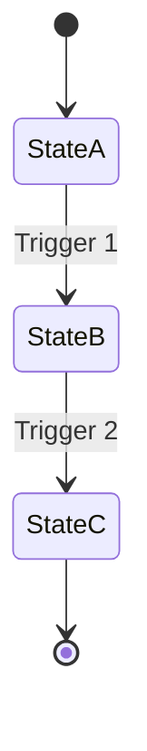
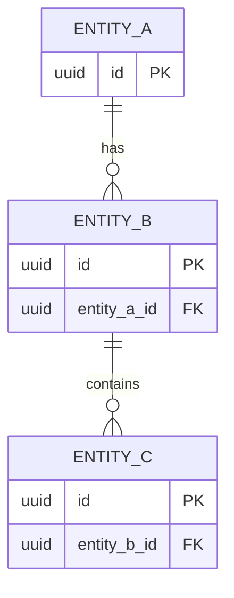
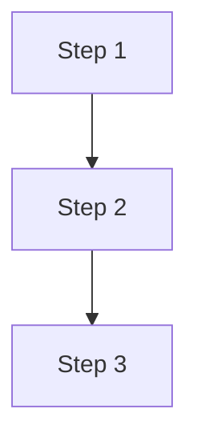
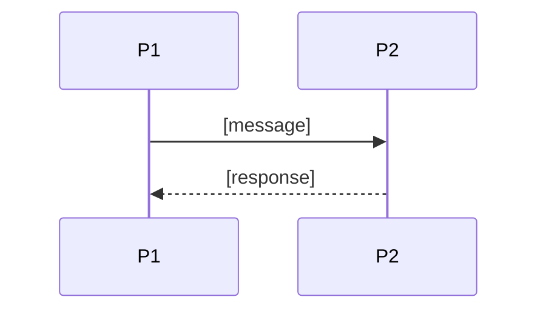

<!--
CHUNK: 13a
TITLE: Detailed Service Spec - [Service Name]
PROJECT: [Project Name]
VERSION: [X.X]
DEPENDS_ON: 09, 07, 10 (event hub - topic names, event names, and payload contracts must match chunk 10 verbatim), 11 (API contracts - integration endpoints carry their API ID and match chunk 11 verbatim), 12 (roles - permission tokens match chunk 12 verbatim)
PART OF: SDD - [Project Name]
-->

# 17. Detailed Service Specs

<!--
Repeat this chunk (13a, 13b, 13c, ...) for each service; the service number follows the chunk letter (13a -> 17.1, 13b -> 17.2, ...).
Each service follows the exact same structure for predictability and grep-ability.
-->

---

## 17.1 [Service Name]

### What

<!-- Concise definition of the service and its bounded context. -->

[Definition.]

### Boundaries

- **Owns:** [Entities / aggregates / data this service is the source of truth for]
- **Does not own:** [Things explicitly outside its boundary]
- **Upstream consumers:** [Who calls this service]
- **Downstream dependencies:** [What this service calls / consumes]

### Input

| Type | Source | Description |
|------|--------|-------------|
| [REST / Event / Schedule / Other] | [Source] | [Description] |

### Business Logic

<!-- Plain-language description of the logic, including state machines for stateful services. Derive-from-BRD: cite every use case this service owns (chunk 09 "Use cases (BRD)") as a link to its BRD heading, with the part it realises, e.g. "[REFUNDS/UC-04](BRD link) steps 3-6", "A1", "BR-2: [short label]", "AC-3: customer is notified". BR-n and AC-n are positions in the BRD lists, so each always carries its short label (brd-to-sdd.md § Use-case traceability). Write only the technical realisation, never a restated Main Flow. -->

[Description of the core logic.]

**State machine (if applicable):**

**Summary:** [1-2 sentence prose fallback: the states and the triggers that move between them.]

### Output

| Type | Destination | Description |
|------|-------------|-------------|
| [REST response / Event / File / Other] | [Destination] | [Description] |

### Integrations

<!-- Every synchronous domain or provider row carries its API ID (standard operational infrastructure is not one: SKILL.md step 6a); the full contract (URI, headers, body, error codes, security) lives in §15 (chunk 11) and is not restated here. Asynchronous rows reference the event in §14 (chunk 10). -->

| Integration | Direction | Protocol | Purpose | Contract | Failure Handling |
|-------------|-----------|----------|---------|----------|------------------|
| [System] | [Inbound / Outbound / Sync / Async] | [Protocol] | [Purpose] | [API-NN (§15) / event name (§14)] | [Failure handling] |

### DB Modeling

#### Entity Relationship

<!-- Inline Mermaid is the default diagram medium. The ERD shows entities, keys (PK, FK), and relationships only; every other column lives in Tables Design below. Append an optional `> Miro: <url>` line below the block only if a richer whiteboard version exists on a real board. -->

**Summary:** [1-2 sentences: the entities this service owns and how they relate.]

#### Tables Design

| Table | Column | Type | Constraints | Notes |
|-------|--------|------|-------------|-------|
| `[table_name]` | `[column]` | [Type] | [Constraints] | [Notes] |
| `[table_name]` | `[column]` | [Type] | [Constraints] | [Notes] |

#### Migration Strategy

- **Tool:** [Flyway / Liquibase]
- **Backward compatibility:** [Approach, e.g., additive-only changes, expand-contract for breaking changes]
- **Data backfill:** [Approach for populating new columns on existing rows]
- **Rollback:** [How to roll back a failed migration]

#### Retention Policy

- `[table_name]`: [Retention rule]
- `[table_name]`: [Retention rule]

#### Archival

- **Cold storage:** [Destination]
- **Format:** [Format]
- **Schedule:** [Schedule]
- **Restore SLA:** [SLA]

#### Data Encryption

- **At rest:** [Approach]
- **In transit:** [Approach]
- **Key management:** [KMS / Vault, rotation policy]
- **PII columns:** [List + masking policy in non-prod]

### Multi-Tenancy Specifications

<!-- Override defaults from section 11.2 only if necessary. -->

- **Strategy override:** [None / specify]
- **Tenant filter:** [How filtered]
- **Cross-tenant queries:** [Policy]

### API Standards

- **Style:** [REST / gRPC / GraphQL]
- **Versioning:** [Approach]
- **Authentication:** [Mechanism]
- **Idempotency:** [Approach]
- **Pagination:** [Approach]
- **Error envelope:** [Per the §15.1 error model, or deviation]

#### List of APIs (Swagger-friendly)

<!-- Endpoints called by another service or an external system carry their API ID and link to §15 (chunk 11), which is canonical for their contract; Method and Path must match it verbatim. Client-facing-only endpoints show "-" in the API ID column. Permission token (§16): the token the endpoint checks, verbatim from §16; an endpoint that only an external system calls (callback, webhook) writes "-" (§15.1 Authorization by contract type). -->

| Method | Path | Summary | Request Body | Response | Permission token (§16) | API ID (§15) |
|--------|------|---------|--------------|----------|------------------------|--------------|
| [METHOD] | `[path]` | [Summary] | `[RequestSchema]` | `[ResponseSchema]` | `[service].[resource].[action]` | [API-NN / -] |

### Event-Driven Architecture (If Applicable)

<!--
CONSISTENCY RULE (chunk 10 is the contract registry): every topic name, event name, and payload field in this sub-section MUST match §14 (chunk 10, Centralized Event Hub) character-for-character. List BOTH published AND consumed events - consumer lists in chunk 10 are reconciled from both sides. A divergence is flagged in chunk 10 §14.8, never silently reconciled.
-->

#### Event Model

<!-- Published events and Consumed events list integration events on the broker only. A module with no integration events writes "Not applicable - no integration events" under each. -->

**Published events:**

| Event Name | Producer | Producer Specs | Consumers | Consumer Specs | Schema (Summary) | Delivery Guarantee |
|------------|----------|----------------|-----------|----------------|------------------|---------------------|
| `[EVENT_NAME]` | [This service] | [Topic (verbatim from §14.4), partitions, retention, key] | [Consumer services] | [Consumer group, idempotency] | `[Payload summary - fields per §14.9]` | [At-least-once / Exactly-once effect] |

**Consumed events:**

| Event Name | Producer (owning service) | Topic | Effect in this service | Idempotency / ordering |
|------------|---------------------------|-------|------------------------|------------------------|
| `[EVENT_NAME]` | [Producer service] | `[topic - verbatim from §14.4]` | [Projection update / state transition / trigger] | [Inbox dedup key, aggregate_version handling] |

**In-process domain events (modules only):**

<!-- Modular monolith or hybrid core: the domain events this module publishes or handles in process (architecture-questionnaire.md § Effect on the SDD). Columns match chunk 10 §14.10 except When, which only the registry holds; names match it verbatim, from both sides. A microservice writes "Not applicable - no in-process events". -->

| Event | Publisher module | Listener modules | Transaction phase (before commit / after commit) | Payload (DTO) | Notes |
|---|---|---|---|---|---|
| `[EventName]` | [Module] | [Modules] | [after commit] | `[EventDto]`: [fields] | [Notes] |

#### Messaging Infra

<!-- Integration events on the broker only. A module with no integration events writes "Not applicable - no integration events". -->

- **Broker:** [Broker]
- **Schema registry:** [Registry / approach]
- **Serialization:** [Avro / JSON / Protobuf]
- **Topic strategy:** [Naming + partitioning]
- **Retention:** [Retention]
- **DLQ strategy:** [DLQ + replay]

### Constraints

<!-- Authorization notes: the roles allowed for each owned use case, with their §16 permission tokens verbatim; each endpoint's token is in the List of APIs Permission token (§16) column. -->

- [Constraint 1]
- [Constraint 2]
- [Constraint 3]

### Error Handling

<!-- Keep every bullet; a bullet that does not apply reads `Not applicable - [reason]`. In a module, the errors its in-process ports raise go under Synchronous APIs. Derive-from-BRD: tie each domain error to the exception flow it realises, e.g. "[REFUNDS/UC-04](BRD link) E1 -> 422 PAYOUT_REFUSED". -->

- **Synchronous APIs:** [Approach]
- **Validation errors:** [Approach]
- **Domain errors:** [Approach]
- **Auth errors:** [Approach]
- **Server errors:** [Approach]
- **Async consumers:** [Approach]
- **Poison messages:** [Approach]

### Observability & Monitoring

#### Logging

- [Format]
- [Mandatory fields]
- [Retention]

#### Metrics

| Metric | Type | Labels | Purpose |
|--------|------|--------|---------|
| `[metric_name]` | [counter / gauge / histogram] | [labels] | [purpose] |

#### Tracing

- [Instrumentation approach]
- [Context propagation]
- [Sampling]

### Developer Notes

- **Recommended patterns:** [Patterns]
- **Avoid:** [Anti-patterns]
- **Testing:** [Test strategy]

### Service-Level Diagrams

#### Implementation Flow Chart

**Summary:** [1-2 sentence prose fallback so the flow is understandable without rendering the diagram.]

#### Sequence Diagram (Service-Internal)

**Summary:** [1-2 sentence prose fallback describing the interaction.]

### Compliance

- **GDPR:** [Lawful basis, retention windows, right-to-erasure flow]
- **PCI-DSS:** [Applicability + approach]
- **ISO 27001 / SOC 2:** [Controls applicable]
- **Local regulations:** [List + how met]

### Deployment Strategy

- **Service-specific override:** [None / specify]
- **Replicas:** [min / max]
- **Strategy:** [Rolling / Blue-Green / Canary]
- **Health checks:** [Probes]
- **Rollback:** [Trigger + approach]

### Future Enhancements

- [Known gap or planned improvement 1]
- [Known gap or planned improvement 2]

<!-- MASTER: [project-slug]-sdd-master.md | PREV: 12-centralized-user-roles.md | NEXT: 14-performance-and-capacity.md -->
