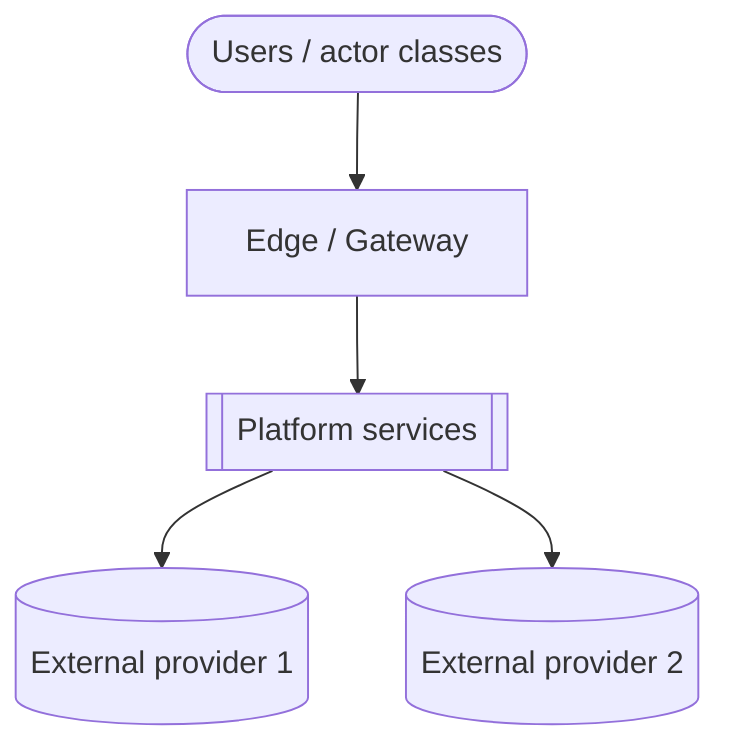
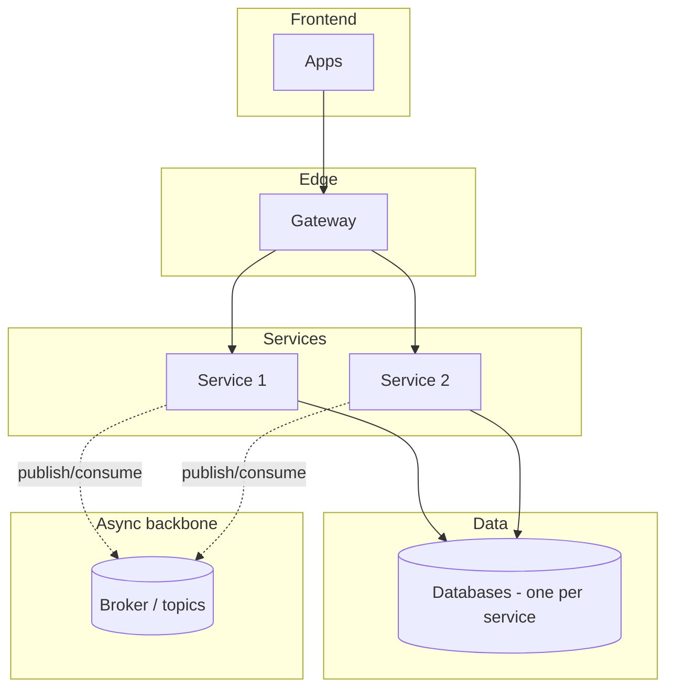
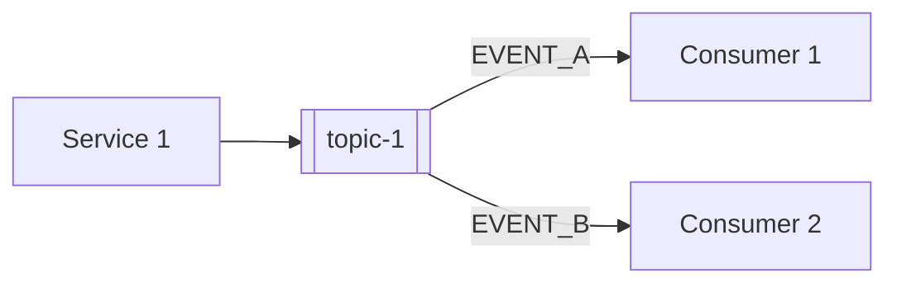
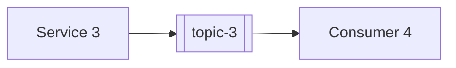
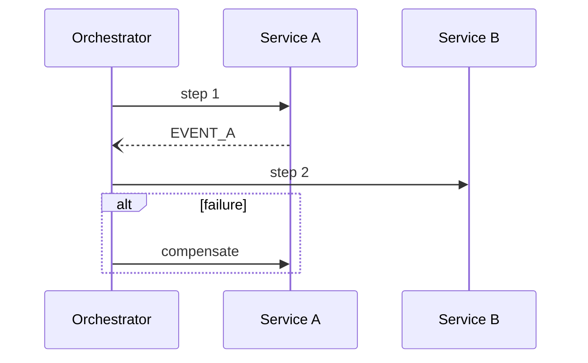

<!--
CHUNK: 19
TITLE: End-to-End System Design (Services · Topics · Producers · Consumers)
PROJECT: [Project Name]
VERSION: [X.X]
DEPENDS_ON: 04, 05, 09, 10 (event hub), 11 (API contracts), 12 (user roles), 13a+ (per-service chunks), 18 (open items: must be cleared first)
PART OF: SDD - [Project Name]
PURPOSE: The single end-to-end view of the whole system: every service, every topic, every producer->consumer edge, the synchronous REST edges, and the key sagas. Authored LAST, only after chunk 18 is cleared, so it consolidates the final reconciled and reviewed state.
GATE: This chunk cannot be generated or refreshed until the e2e gate is open (SKILL.md step 8b, conditions E1-E4): every open item in chunk 18 is resolved (Deferred counts as open), no contract divergence is open, no clarification marker is left in the chunks it consolidates or in 03 §7.3 (use-case traceability), and the contract reconciliation was rerun after the last change. No override. While the gate is shut, nothing of this chunk is written, not even a draft or outline.
FAITHFULNESS_RULE: This chunk is a faithful consolidation, not a new design. Every count, name, and edge must trace to chunks 09, 10, 11, 12, and 13x. Any deliberate simplification (clustered edges, sampled sagas) is stated explicitly - no silent caps.
NO_DUPLICATION_RULE: One fact, one home. This chunk shows only what no other chunk shows (the whole-system fan-out maps and saga views). Normative content owned elsewhere (the async mechanism §14.2.1, the topic registry §14.4, the guarantees §14.6, the doctrines §14.7) is REFERENCED, never restated.
-->

# 24. End-to-End System Design (Services · Topics · Producers · Consumers)

> **What this chunk is.** The bird's-eye, implementation-facing map of the entire platform: the service landscape, the system context, the layered architecture, the full producer → topic → consumer fan-out, the synchronous edges, and the key sagas. A new engineer (or AI implementer) reads this chunk to understand how the system fits together, following its references into chunks 10/11/13x for the normative contracts.

---

## How to Read This Document

<!-- One short paragraph: reading order of the sections, and what each diagram notation means. -->

[Reading guidance.]

### Counts at a Glance

| Dimension | Count | Source of truth |
|---|---|---|
| Services | [N] | §13 (chunk 09) |
| Topics | [N] | §14.4 (chunk 10) |
| Distinct published events | [N] | §14.9 coverage matrix (chunk 10) |
| Synchronous REST edges | [N] | §24.7 |
| Sagas documented | [N] | §24.8 |

### Faithfulness & Deliberate Simplifications (no silent caps)

<!-- List every simplification made in this chunk's diagrams (e.g., "domain producers clustered into one node in §24.2", "only the 3 load-bearing sagas drawn"). If nothing was simplified, say so. -->

- [Simplification 1 + where the full detail lives.]

## 24.1 Service Landscape (archetype × phase)

<!-- One row per service: archetype (domain / reusable-generic / edge / read-model / orchestrator), phase, key family, sync surface, async surface. Names verbatim from §13. -->

| # | Service | Archetype | Phase | Publishes to | Consumes from | Sync surface |
|---|---|---|---|---|---|---|
| 1 | [service] | [archetype] | [P1] | `[topic]` | `[topics]` | [REST APIs exposed] |

## 24.2 System Context

**Summary:** [1-2 sentences: who uses the platform, through which edge, and which external providers it depends on.]

## 24.3 Layered High-Level Architecture

**Summary:** [1-2 sentences: the layers and the load-bearing connections between them.]

## 24.4 The Universal Per-Event Mechanism (async backbone)

<!-- Owned by §14.2.1 (chunk 10) - referenced, never restated here. One prose sentence + the pointer. -->

Every event on every topic flows through the one universal mechanism — outbox → relay → topic → per-consumer queue with inbox dedup and DLQ. **Normative definition and diagram: §14.2.1 ([10-events-hub.md](./10-events-hub.md)).**

## 24.5 Producer → Topic → Consumer Fan-Out (the event map)

<!-- One sub-section per delivery phase. Each: a Mermaid flowchart of producer -> topic -> consumers for that phase's services. Edge labels name the load-bearing events. The exhaustive matrix stays in §14.5; this is the navigable visual. A modular monolith or hybrid core shows its in-process domain events (§14.10) as separately labelled module-to-module edges (label `in-process: [EventName]`), never as topics. -->

### 24.5.1 Phase 1 Core

**Summary:** [1-2 sentences: which phase 1 producers publish to which topics, and who consumes the load-bearing events.]

### 24.5.2 Phase 2+ Domains

**Summary:** [1-2 sentences: which phase 2+ producers publish to which topics, and who consumes them.]

### 24.5.3 Universal Subscribers (breadth rules)

<!-- Name the broad consumers only (they would clutter every fan-out diagram above); their binding rules are owned by §14.7 - reference, don't restate. -->

- [Universal subscriber — see §14.7 for its binding rule.]

## 24.6 Cross-Service Doctrines

<!-- Name each platform-wide interaction doctrine + a pointer to its normative home (§14.7 / ADR). Names only - the rules are not restated here. -->

1. [Doctrine name — normative home §14.7 / ADR-NN.]

## 24.7 Synchronous REST Edges (one-hop rule)

<!-- The whole-system view of every service-to-service synchronous call. The contracts themselves (URI, headers, body, error codes, auth) live in §15 (chunk 11) and are referenced by API ID, never restated. Per CLAUDE.md: no chained REST more than one hop deep. A modular monolith or hybrid core lists its `Internal (in-process)` port calls as separately labelled edges (`in-process` after the callee), never as HTTP edges. -->

| # | Caller → Callee | API ID (§15) | Purpose | Why synchronous |
|---|---|---|---|---|
| 1 | [svc] → [svc] | [API-NN] | [Purpose] | [Justification] |

## 24.8 Key Sagas (dynamic view)

<!-- One sub-section per load-bearing cross-service flow: orchestrator (or choreography), participants, happy path, compensation path. Mermaid sequence diagrams. Derive-from-BRD: a "Use cases:" line links the BRD use cases the saga realises, traced to §7.3 (chunk 03). -->

### 24.8.1 [Saga name] ([orchestrated by X / choreographed])

**Use cases:** [[KEY/UC-NN](BRD link), [KEY/UC-NN](BRD link)]

**Summary:** [1-2 sentences: the saga's happy path and how a failure is compensated.]

## 24.9 Normative References

<!-- Pure pointer section - no tables, no restated rules. One fact, one home. -->

- **Topic registry (one row per topic, owner, key family):** §14.4 ([10-events-hub.md](./10-events-hub.md)).
- **Per-event consumer reconciliation:** §14.5; payload contracts: §14.9.
- **Cross-cutting guarantees every edge inherits:** §14.6.
- **Universal subscribers & doctrines:** §14.7.
- **Roles & authorities behind every edge's authorization:** §16 ([12-centralized-user-roles.md](./12-centralized-user-roles.md)).
- **Synchronous API contracts (URI, headers, body, error codes, security):** §15 ([11-api-contracts.md](./11-api-contracts.md)).

## Sources

<!-- The chunks this consolidation was built from, with a one-line note per source. -->

- Chunk 09 (§13 decomposition) · chunk 10 (§14 event hub) · chunks 13a+ (§17 service specs) · chunk 12 (§16 roles) · chunk 11 (§15 API contracts) · chunk 18 (§23 open items, cleared).

<!-- MASTER: [project-slug]-sdd-master.md | PREV: 18-open-items-and-clarifications.md | NEXT: none -->
