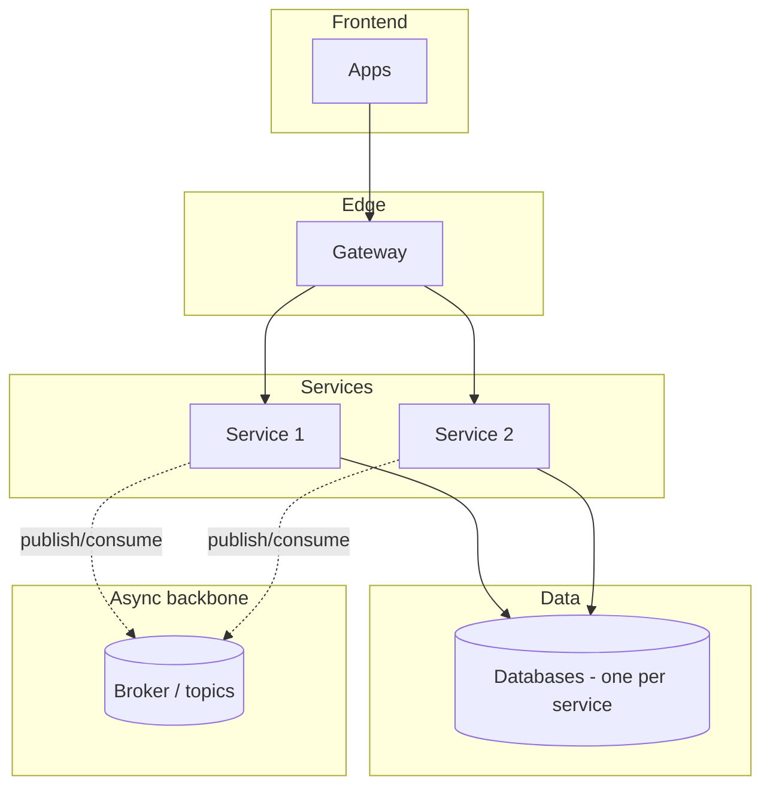
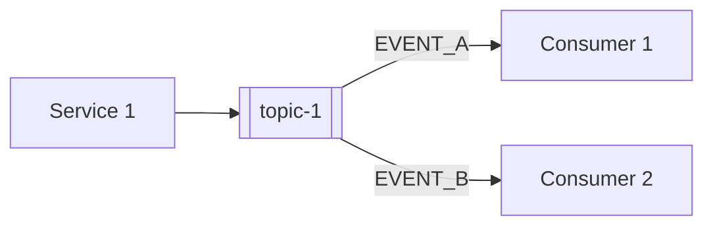
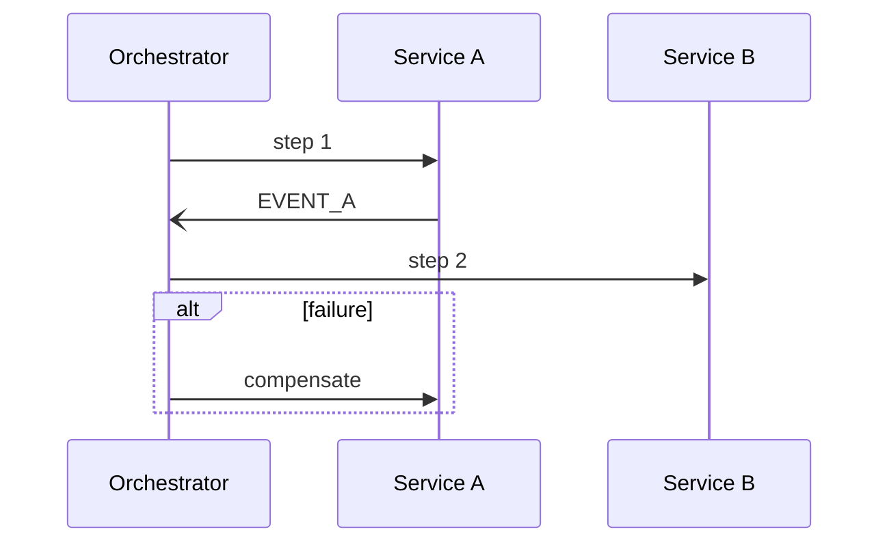

<!--
CHUNK: 19
TITLE: End-to-End System Design (Services · Topics · Producers · Consumers)
PROJECT: [Project Name]
VERSION: [X.X]
DEPENDS_ON: 02 to 08 (ecosystem, actors, architecture views, workflows and sequences, principles and ADRs, cross-cutting defaults, integrations), 09, 10 (event hub), 11 (API contracts), 12 (user roles), 13a+ (per-service chunks), 18 (open items: must be cleared first)
PART OF: SDD - [Project Name]
PURPOSE: The single end-to-end view of the whole system: every service, every topic, every producer->consumer edge, the synchronous edges (HTTP and in-process), and the key sagas. Authored LAST, only after chunk 18 is cleared, so it consolidates the final reconciled and reviewed state.
GATE: Conditions E1-E4 in SKILL.md step 8b: no open/deferred OI or divergence; no unresolved value any E2E claim depends on, including transitively referenced markers anywhere in the body; final relevant sources reconciled with ordered/current-revision evidence. Use the master/cover E3 inventory, preserving the named-black-box external placeholder exception. No override. While the gate is shut, nothing of this chunk is written, not even a draft or outline. A Stale mark changes only the master/cover gate line. An already-current output is verified and retained without rewriting.
FAITHFULNESS_RULE: This chunk is a faithful consolidation, not a new design. Every count, name, edge, and claim must trace to chunks 02 to 13x (SKILL.md step 8b checks it). A doctrine's home is §14.7 or an Accepted ADR only: a doctrine whose ADR is still Proposed is left out of §24.6 and named in the Faithfulness list. Any deliberate simplification (clustered edges, sampled sagas) is stated explicitly - no silent caps.
NO_DUPLICATION_RULE: One fact, one home. This chunk shows only what no other chunk shows (the whole-system fan-out maps and saga views). The system context and the layered architecture are §8.2 and §8.3 (chunk 04): §24.2 and §24.3 cite them and draw only what they add. Normative content owned elsewhere (the async mechanism §14.2.1, the topic registry §14.4, the guarantees §14.6, the doctrines §14.7) is REFERENCED, never restated.
-->

# 24. End-to-End System Design (Services · Topics · Producers · Consumers)

> **What this chunk is.** The bird's-eye, implementation-facing map of the entire platform: the service landscape, the system context, the layered architecture, the full producer → topic → consumer fan-out, the synchronous edges, and the key sagas. A new engineer (or AI implementer) reads this chunk to understand how the system fits together, following its references into chunks 10/11/13x for the normative contracts.

---

## How to Read This Document

<!-- One short paragraph: reading order of the sections, and what each diagram notation means. -->

[Reading guidance.]

### Counts at a Glance

| Dimension | Count | Source of truth |
|---|---|---|
| Services | [N] | §13 (chunk 09) |
| Topics | [N] | §14.4 (chunk 10) |
| Distinct published events | [N] | §14.9 coverage matrix (chunk 10) |
| In-process domain events | [N] | §14.10 (chunk 10) |
| Synchronous HTTP edges between services | [N] | §24.7 |
| In-process port calls | [N] | §24.7 |
| Sagas documented | [N] | §24.8 |

### Faithfulness & Deliberate Simplifications (no silent caps)

<!-- List every simplification made in this chunk's diagrams (e.g., "domain producers clustered into one node in §24.2", "only the 3 load-bearing sagas drawn"). Also name each doctrine left out of §24.6 because its ADR is still Proposed, and each qualifying saga not drawn in §24.8. If there is nothing to list, say so. -->

- [Simplification 1 + where the full detail lives.]

## 24.1 Service Landscape (archetype × phase)

<!-- One row per service: archetype, phase, sync surface, async surface. Names verbatim from §13. Archetype, chosen from the service's §13 Responsibility (chunk 09): domain (owns a business capability and its data), reusable-generic (a capability other services call, with no domain of its own), edge (the entry point for users or external systems), read-model (builds query views from other services' events), or orchestrator (drives a flow across services). Phase: the §14.4 Phase of the topics the service owns, else of the topics it consumes, else the single release phase. -->

| # | Service | Archetype | Phase | Publishes to | Consumes from | Sync surface |
|---|---|---|---|---|---|---|
| 1 | [service] | [archetype] | [P1] | `[topic]` | `[topics]` | [REST APIs exposed] |

<!-- No-topic phase example (replace the phase above, not another service row): Single release (no topics). -->

## 24.2 System Context

<!-- By reference: the system context is §8.2 (chunk 04). Cite it, and draw here only what it does not show (for example, the modules or services behind each actor and external system). When this view adds nothing, this sub-section is the pointer and its Summary, with no diagram. -->

**Base view:** [§8.2 Context Diagram](./04-architecture-style-and-diagrams.md#82-context-diagram).

**Summary:** [1-2 sentences: what this view adds to §8.2, or, with no diagram, who uses the platform, through which edge, and which external providers it depends on, as §8.2 shows.]

## 24.3 Layered High-Level Architecture

<!-- By reference: the layered view is §8.3 (chunk 04). Cite it, and draw here only what it does not show (for example, the module grouping inside a deployable, or the topics and DLQs on the async backbone). When this view adds nothing, this sub-section is the pointer and its Summary, with no diagram. -->

**Base view:** [§8.3 High-Level Architecture Diagram](./04-architecture-style-and-diagrams.md#83-high-level-architecture-diagram).

**Summary:** [1-2 sentences: what this view adds to §8.3, or, with no diagram, the layers and the load-bearing connections between them, as §8.3 shows.]

## 24.4 The Universal Per-Event Mechanism (async backbone)

<!-- Owned by §14.2.1 (chunk 10) - referenced, never restated here. One prose sentence + the pointer. A modular monolith with no integration events writes `Not applicable - no integration events (in-process domain events: §14.10).` instead. -->

Every event on every topic flows through the one universal mechanism - outbox → relay → topic → per-consumer queue or consumer group with inbox dedup and DLQ. In-process domain events (§14.10) do not use it. **Normative definition and diagram: §14.2.1 ([10-events-hub.md](./10-events-hub.md)).**

## 24.5 Producer → Topic → Consumer Fan-Out (the event map)

<!-- One sub-section per delivery phase. Each: a Mermaid flowchart of producer -> topic -> consumers for that phase's services. Edge labels name the load-bearing events. The exhaustive matrix stays in §14.5; this is the navigable visual. With one delivery phase, 24.5.2 reads `Not applicable for this release: one delivery phase.` and nothing more. A modular monolith or hybrid core shows its in-process domain events (§14.10) as separately labelled module-to-module edges (label `in-process: [EventName]`), never as topics. -->

### 24.5.1 Phase 1 Domains

**Summary:** [1-2 sentences: which phase 1 producers publish to which topics, and who consumes the load-bearing events.]

### 24.5.2 Phase 2+ Domains

**Summary:** [1-2 sentences: which phase 2+ producers publish to which topics, and who consumes them.]

### 24.5.3 Universal Subscribers (breadth rules)

<!-- Name the broad consumers only (they would clutter every fan-out diagram above); their binding rules are owned by §14.7 - reference, don't restate. -->

- [Universal subscriber - see §14.7 for its binding rule.]

## 24.6 Cross-Service Doctrines

<!-- Name each platform-wide interaction doctrine + a pointer to its normative home: §14.7 or an Accepted ADR. A doctrine whose ADR is still Proposed is left out here and named in the Faithfulness list. Names only - the rules are not restated here. -->

1. [Doctrine name - normative home §14.7 / ADR-NN.]

## 24.7 Synchronous Edges (one-hop rule)

<!-- The whole-system view of every service-to-service synchronous call: one row per §15.2 contract of Type Internal or Internal (in-process), and no other row. External contracts are not rows here. With no such contract, write `None: no synchronous call between services (external contracts: §15.2).` in place of the table. The contracts themselves (URI, headers, body, error codes, auth) live in §15 (chunk 11) and are referenced by API ID, never restated. Per CLAUDE.md: no chained REST more than one hop deep. A modular monolith or hybrid core lists its `Internal (in-process)` port calls as separately labelled edges (`in-process` after the callee), never as HTTP edges. -->

| # | Caller → Callee | API ID (§15) | Purpose | Why synchronous |
|---|---|---|---|---|
| 1 | [svc] → [svc] | [API-NN] | [Purpose] | [Justification] |

## 24.8 Key Sagas (dynamic view)

<!-- One sub-section per load-bearing cross-service flow: a flow that changes the business state of two or more §13 rows, services or modules (a message sent or an audit record written is not business state). A qualifying flow that is not drawn is named in the Faithfulness list. Each sub-section: orchestrator (or choreography), participants, happy path, compensation path. Mermaid sequence diagrams. Derive-from-BRD: a "Use cases:" line links the BRD use cases the saga realises, traced to §7.3 (chunk 03). -->

### 24.8.1 [Saga name] ([orchestrated by X / choreographed])

**Use cases:** [[KEY/UC-NN](BRD link), [KEY/UC-NN](BRD link)]

**Summary:** [1-2 sentences: the saga's happy path and how a failure is compensated.]

## 24.9 Normative References

<!-- Pure pointer section - no tables, no restated rules. One fact, one home. -->

- **Topic registry (one row per topic, owner, key family):** §14.4 ([10-events-hub.md](./10-events-hub.md)).
- **Per-event consumer reconciliation:** §14.5; payload contracts: §14.9.
- **Cross-cutting guarantees every broker event edge inherits:** §14.6 (in-process domain events: §14.10).
- **Universal subscribers & doctrines:** §14.7.
- **Roles & authorities behind every edge's authorization:** §16 ([12-centralized-user-roles.md](./12-centralized-user-roles.md)).
- **Synchronous API contracts (URI, headers, body, error codes, security):** §15 ([11-api-contracts.md](./11-api-contracts.md)).

## Sources

<!-- The chunks this consolidation was built from, with a one-line note per source. -->

- Chunks 02 to 08 (§6 to §12: ecosystem, actors, architecture views, workflows and sequences, principles and ADRs, cross-cutting defaults, integrations) · chunk 09 (§13 decomposition) · chunk 10 (§14 event hub) · chunks 13a+ (§17 service specs) · chunk 12 (§16 roles) · chunk 11 (§15 API contracts) · chunk 18 (§23 open items, cleared).

<!-- MASTER: [project-slug]-sdd-master.md | PREV: 18-open-items-and-clarifications.md | NEXT: none -->
